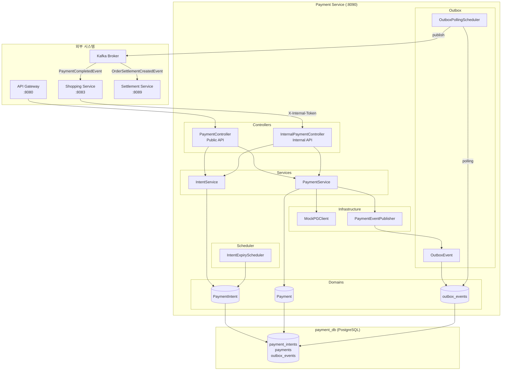

# Payment Service 아키텍처: System Overview

## 개요

Payment Service는 결제 의향(Payment Intent) 관리와 실제 결제 처리를 담당하는 독립 마이크로서비스입니다. 2026-02-28 Shopping Service에서 추출하여 플랫폼 공통 결제 인프라로 분리되었습니다. Payment Intent 패턴과 Transactional Outbox 패턴을 적용하여 금액 변조 방지와 이벤트 발행 원자성을 보장합니다.

| 항목 | 내용 |
|------|------|
| **범위** | Service |
| **주요 기술** | Java 17, Spring Boot 3.5.5, PostgreSQL, Kafka |
| **배포 환경** | Kubernetes, Docker Compose |
| **관련 서비스** | shopping-service (Feign + Kafka), shopping-settlement-service (Kafka 소비) |
| **포트** | 8090 |
| **DB** | payment_db (PostgreSQL) |

---

## 아키텍처 다이어그램



---

## 핵심 컴포넌트

### 1. PaymentIntent 도메인

**역할**: 서버가 확정한 결제 금액과 메타데이터를 저장하는 결제 의향

**상태 전이**:
```
REQUIRES_PAYMENT → PROCESSING → SUCCEEDED
                             → FAILED
        |
        → CANCELLED
        → EXPIRED (IntentExpiryScheduler)
```

**주요 제약**:
- `intentId`: UUID, 서버가 생성
- `expiresAt`: 생성 시점 + 설정 분 (기본 30분)
- 동일 `orderNumber`에 Intent 중복 생성 불가 (`PM015`)

### 2. Payment 도메인

**역할**: 실제 결제 처리 결과 기록

**상태 전이**:
```
PENDING → PROCESSING → COMPLETED → REFUNDED
                    → FAILED
PENDING → CANCELLED
```

**결제 번호 형식**: `PAY-{8자리 UUID 앞부분 대문자}`

### 3. MockPGClient

**역할**: PG(Payment Gateway) 연동 Mock 구현체

**특성**:
- `processPayment()`: 90% 성공, 10% 실패 (ThreadLocalRandom)
- `refundPayment()`: 100% 성공 (환불은 항상 성공)
- 트랜잭션 ID 형식: `PG-{12자리 UUID 대문자}` (결제), `RF-{12자리}` (환불)

> 향후 실제 PG(토스페이먼츠, 카카오페이) 연동 시 이 클래스를 교체합니다.

### 4. Transactional Outbox

**역할**: 결제 완료와 Kafka 이벤트 발행의 원자성 보장

**동작 방식**:
1. 결제 완료 시 `outbox_events` 테이블에 이벤트 저장 (동일 트랜잭션)
2. `OutboxPollingScheduler`가 주기적으로 `PENDING` 이벤트를 조회
3. Kafka 발행 성공 시 `PUBLISHED`, 실패 시 재시도

**발행 이벤트**:
| 이벤트 | Topic | 발행 시점 |
|--------|-------|----------|
| `PaymentCompletedEvent` | `shopping.payment.completed` | 결제 성공 |
| `PaymentCancelledEvent` | `shopping.payment.cancelled` | 결제 취소 |
| `PaymentFailedEvent` | `shopping.payment.failed` | 결제 실패 |

### 5. IntentExpiryScheduler

**역할**: 만료된 Intent 자동 처리

**동작**: 주기적으로 `status=REQUIRES_PAYMENT AND expires_at < NOW()` 조회 후 `EXPIRED` 상태로 변경

---

## 데이터 플로우

### 주문-결제 흐름

```
1. 사용자 → Shopping Service: 주문 생성 요청
2. Shopping Service → Payment Service: POST /internal/intents (Feign)
   - orderNumber, userId, amount, metadata 전달
3. Payment Service → payment_intents 저장, intentId 반환
4. Shopping Service → 사용자: 주문번호 + intentId 반환

5. 사용자 → Payment Service: GET /intents/{intentId}
   - 서버 확정 금액 확인 (변조 불가)

6. 사용자 → Payment Service: POST /intents/{intentId}/confirm
   - paymentMethod, 카드 정보 전달
7. Payment Service → Intent 상태 PROCESSING으로 변경
8. Payment Service → MockPGClient.processPayment() 호출
9. PG 성공 → Payment 생성, Intent SUCCEEDED
10. Payment Service → outbox_events에 PaymentCompletedEvent 저장 (동일 트랜잭션)

11. OutboxPollingScheduler → Kafka: PaymentCompletedEvent 발행
12. Shopping Service → Kafka 소비: 주문 상태 PAID로 변경
13. Shopping Service → Kafka: OrderSettlementCreatedEvent 발행
14. Settlement Service → Kafka 소비: 정산 원장 기록
```

### Saga 보상 흐름

```
1. Shopping Service Saga → 재고 차감 실패 감지
2. Shopping Service → POST /internal/refund/{orderNumber} (Feign)
3. Payment Service → 해당 주문의 COMPLETED 결제 조회
4. MockPGClient.refundPayment() 호출
5. Payment 상태 REFUNDED 변경
6. outbox_events에 PaymentCancelledEvent 저장
7. Kafka 발행
```

---

## 기술적 결정

### 선택한 패턴

- **Payment Intent 패턴**: 서버가 금액을 확정하여 클라이언트 변조를 방지 (Stripe, Toss 방식)
- **Transactional Outbox**: DB 트랜잭션과 Kafka 발행의 원자성 보장 (At-least-once delivery)
- **Internal API 토큰 검증**: `X-Internal-Token` 헤더로 서비스 간 통신 보안 (ADR-029)
- **단방향 이벤트 발행**: payment-service가 이벤트 발행 소유권을 가지며 shopping-service는 소비자

### 제약사항

- **MockPGClient 한계**: 실제 PG 연동 전까지 90% 성공률로 동작
- **Intent 만료**: 30분 기준, 만료 후 결제 불가 (`PM012`)
- **중복 Intent 방지**: 동일 orderNumber에 REQUIRES_PAYMENT/PROCESSING 상태 Intent 중복 생성 불가

---

## 배포 및 확장

### 배포 구성

**Kubernetes**:
```yaml
replicas: 2  # 결제 처리 고가용성
resources:
  requests:
    cpu: 500m
    memory: 512Mi
  limits:
    cpu: 1000m
    memory: 1Gi
```

**Profile**:
- `local`: Docker Compose 로컬 개발 (포트 8090)
- `docker`: Docker Compose 통합 테스트
- `kubernetes`: Kubernetes 프로덕션

### 확장 전략

- **OutboxPollingScheduler**: 분산 실행 시 중복 발행 방지 필요 (ShedLock 또는 DB 락 도입 고려)
- **PG 연동 확장**: MockPGClient → 실제 PG 클라이언트 교체 시 서비스 재배포만으로 전환 가능
- **결제 수단 확장**: PaymentMethod enum 확장으로 새 결제 수단 추가

---

## 관련 문서

- [ADR-055: Payment Service Extraction](../../adr/ADR-055-payment-service-extraction.md)
- [Payment Service API](../../api/payment-service/payment-api.md)
- [Payment Service DB Schema](../database/payment-service-schema.md)
- [Shopping Service Architecture](../shopping-service/system-overview.md)
- [Shopping Settlement Service Architecture](../shopping-settlement-service/system-overview.md)

---

**마지막 업데이트**: 2026-02-28
