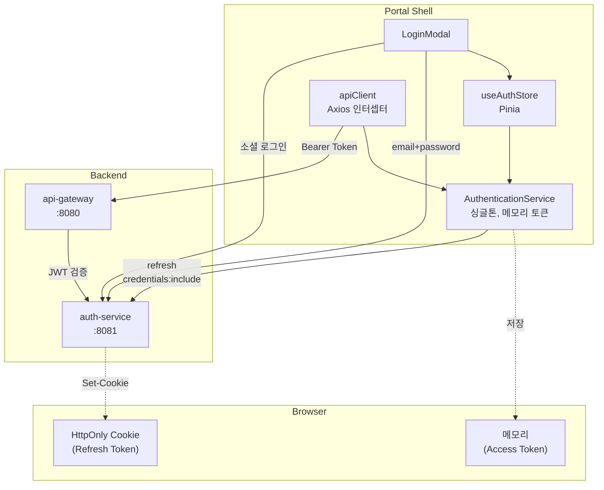
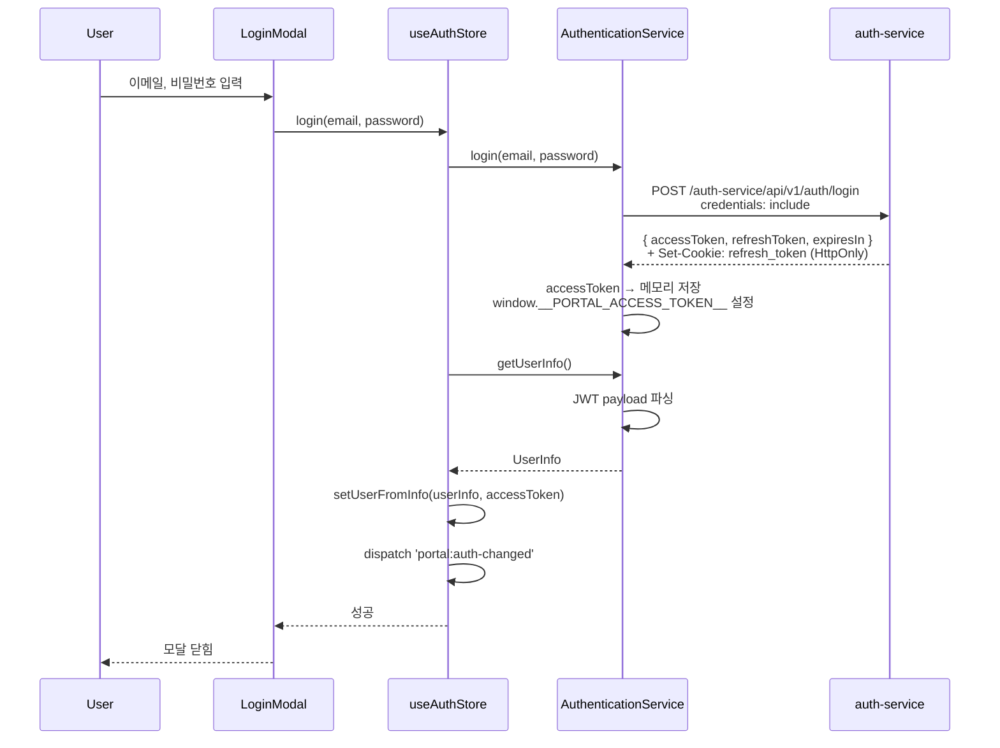
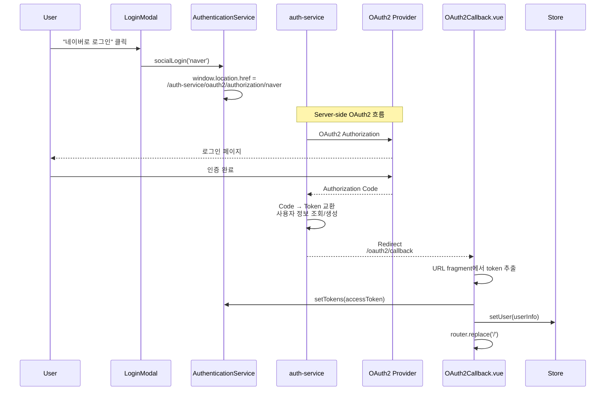

# Portal Shell 아키텍처: 인증

## 개요

Portal Shell은 JWT 기반 Direct Authentication을 사용합니다. Access Token은 메모리에 저장하고, Refresh Token은 HttpOnly Cookie로 관리하여 XSS/CSRF 공격을 방어합니다. 이메일/비밀번호 로그인과 소셜 로그인(Google, Naver, Kakao)을 지원하며, 소셜 로그인은 서버 리다이렉트 방식입니다.

| 항목 | 내용 |
|------|------|
| **범위** | Component |
| **주요 기술** | JWT, HttpOnly Cookie, OAuth2 Social Login (Server Redirect) |
| **배포 환경** | Docker Compose, Kubernetes |
| **관련 서비스** | auth-service (:8081), api-gateway (:8080) |

---

## 아키텍처 다이어그램



---

## 핵심 컴포넌트

### 1. AuthenticationService

**역할**: 인증 흐름의 중앙 관리자. 토큰 저장, 갱신, 소셜 로그인 리다이렉트를 담당

**소스**: `src/services/authService.ts`

**주요 책임**:
- Access Token 메모리 저장 및 조회 (`accessToken` private 필드)
- `login()`: 이메일/비밀번호 → `POST /auth-service/api/v1/auth/login` (credentials: include)
- `socialLogin()`: 브라우저를 `/auth-service/oauth2/authorization/{provider}`로 리다이렉트
- `refresh()`: `POST /auth-service/api/v1/auth/refresh` (HttpOnly Cookie 자동 전송)
- `refreshPromise` 중복 방지: 동시 refresh 요청을 하나의 Promise로 병합
- `autoRefreshIfNeeded()`: 토큰 만료 60초 전 자동 갱신
- `getUserInfo()`: JWT payload에서 UserInfo 추출
- Remote 앱용 전역 토큰 접근: `window.__PORTAL_GET_ACCESS_TOKEN__`

**기술 스택**:
- 순수 TypeScript (프레임워크 의존 없음)
- Fetch API (credentials: 'include')

### 2. useAuthStore (Pinia)

**역할**: 인증 상태의 반응형 관리 및 UI 연동

**소스**: `src/store/auth.ts`

**주요 책임**:
- `user: PortalUser | null` 상태 관리
- `login()` → `authService.login()` → JWT에서 UserInfo 추출 → `setUserFromInfo()`
- `checkAuth()` → `authService.autoRefreshIfNeeded()` → 페이지 새로고침 시 세션 복원
- RBAC: `hasRole()`, `hasAnyRole()`, `isServiceAdmin()`, `isAdmin`, `isSeller`
- `portal:auth-changed` CustomEvent 발행 (login/logout/checkAuth 시)
- `showLoginModal`, `redirectPath` 관리 (Navigation Guard 연동)
- `updateAccessToken()`: 프로필/멤버십 변경 후 백엔드가 반환한 새 토큰 적용

### 3. apiClient (Axios)

**역할**: 모든 API 호출에 인증 토큰 자동 첨부 및 에러 처리

**소스**: `src/api/apiClient.ts`

**주요 책임**:
- Request Interceptor: `autoRefreshIfNeeded()` 호출 후 Bearer 토큰 첨부
- Response Interceptor - 401: `authService.refresh()` → 새 토큰으로 원본 요청 재시도
- Response Interceptor - 429: `Retry-After` 헤더 기반 최대 3회 재시도
- 재시도 실패 시 `window.location.href = '/?login=required'`로 리다이렉트

### 4. LoginModal

**역할**: 사용자 인증 UI (이메일/비밀번호 + 소셜 로그인)

**소스**: `src/components/LoginModal.vue`

**주요 책임**:
- 이메일/비밀번호 폼 검증 (이메일 형식, 6자 이상 비밀번호)
- `authStore.login()` 호출
- 소셜 로그인 버튼: Google (로컬 환경만), Naver, Kakao
- `authService.socialLogin(provider)` 호출 → 서버 리다이렉트

### 5. OAuth2Callback

**역할**: 소셜 로그인 후 리다이렉트 처리

**소스**: `src/views/OAuth2Callback.vue`

**주요 책임**:
- URL fragment에서 `access_token` 추출 (`window.location.hash`)
- `authService.setTokens(accessToken)` → Refresh Token은 이미 HttpOnly Cookie에 존재
- `authStore.setUser(userInfo)` → 홈으로 리다이렉트

---

## 데이터 플로우

### 이메일/비밀번호 로그인



### 소셜 로그인 (Server Redirect)



### 토큰 자동 갱신 (401 재시도)

```
1. Component → apiClient.get('/api/v1/...')
2. Request Interceptor → autoRefreshIfNeeded() (만료 60초 전이면 갱신)
3. Request Interceptor → Bearer 토큰 첨부
4. api-gateway → 401 Unauthorized 응답
5. Response Interceptor → authService.refresh()
6. refresh() → POST /auth-service/api/v1/auth/refresh (HttpOnly Cookie)
7. auth-service → { accessToken } + 새 HttpOnly Cookie
8. 원본 요청 재시도 (새 토큰)
```

---

## 기술적 결정

### 선택한 패턴

- **Access Token 메모리 저장**: XSS 공격 시 localStorage/sessionStorage에서 토큰 탈취 불가. 페이지 새로고침 시 HttpOnly Cookie로 자동 복원
- **Refresh Token HttpOnly Cookie**: JavaScript에서 접근 불가 (XSS 방어). `credentials: 'include'`로 자동 전송
- **refreshPromise 중복 방지**: 동시에 여러 API가 401을 받아도 refresh 요청은 1회만 발생. `.finally()`에서 Promise null 처리
- **Server-redirect 소셜 로그인**: 클라이언트에 OAuth2 secret 노출 없음. auth-service가 전체 OAuth2 흐름을 서버 측에서 처리
- **portal:auth-changed CustomEvent**: Vue Pinia store 변경을 React Remote 앱에 전파하는 프레임워크 비의존 메커니즘
- **60초 만료 버퍼**: `isTokenExpired()`에서 `exp < now + 60`으로 판단. 네트워크 지연 시에도 유효한 토큰으로 요청 가능

### 제약사항

- 페이지 새로고침 시 Access Token이 사라지므로 반드시 `checkAuth()` → `autoRefreshIfNeeded()`로 복원해야 함
- HttpOnly Cookie이므로 JavaScript에서 Refresh Token 존재 여부를 직접 확인할 수 없음. refresh 요청 실패로 간접 판단
- 소셜 로그인은 전체 페이지 리다이렉트이므로 SPA 상태가 초기화됨

---

## JWT 구조

### Access Token Payload

auth-service가 발급하는 JWT의 실제 payload 필드:

```json
{
  "sub": "550e8400-e29b-41d4-a716-446655440000",
  "email": "user@example.com",
  "preferred_username": "johndoe",
  "name": "John Doe",
  "nickname": "JD",
  "picture": "https://...",
  "roles": ["ROLE_USER", "ROLE_SELLER"],
  "scope": "read write",
  "memberships": { "shopping": "PREMIUM", "blog": "FREE" },
  "exp": 1738800000,
  "iat": 1738796400
}
```

### UserInfo 추출 매핑 (authService.getUserInfo)

| JWT 필드 | UserInfo 필드 | 비고 |
|----------|--------------|------|
| `sub` | `uuid` | 사용자 고유 ID |
| `sub` / `email` | `email` | sub 우선 |
| `preferred_username` | `username` | |
| `name` | `name` | |
| `nickname` | `nickname` | |
| `picture` | `picture` | |
| `roles` | `roles` | 배열 |
| `scope` | `scopes` | 공백 구분 → 배열 |
| `memberships` | `memberships` | 서비스별 티어 |

### RBAC 역할 체계

| 역할 | 상수 | 설명 |
|------|------|------|
| `ROLE_SUPER_ADMIN` | `ROLES.SUPER_ADMIN` | 시스템 전체 관리자 |
| `ROLE_ADMIN` | `ROLES.ADMIN` | 관리자 (하위 호환) |
| `ROLE_USER` | `ROLES.USER` | 일반 사용자 |
| `ROLE_SELLER` | `ROLES.SELLER` | 판매자 |
| `ROLE_{SERVICE}_ADMIN` | `serviceAdminRole()` | 서비스별 관리자 |

역할 상수 정의: `src/constants/roles.ts`

---

## 보안

### 토큰 저장 전략

| 토큰 | 저장소 | 보안 |
|------|--------|------|
| Access Token | JavaScript 메모리 (`AuthenticationService.accessToken`) | XSS로 localStorage 탈취 불가 |
| Refresh Token | HttpOnly Cookie (auth-service가 Set-Cookie) | JavaScript 접근 불가 |

### Remote 앱 토큰 공유

Remote 앱(React)은 다음 방법으로 Access Token에 접근:
- `window.__PORTAL_GET_ACCESS_TOKEN__()` - 함수 호출로 최신 토큰 반환
- `window.__PORTAL_ACCESS_TOKEN__` - 레거시 직접 참조 (deprecated)
- `portal/api` Module Federation → apiClient 사용 (토큰 자동 첨부)

---

## 관련 문서

- [System Overview](./system-overview.md)
- [Cross-Framework Bridge](./cross-framework-bridge.md) - `portal:auth-changed` 이벤트 및 storeAdapter
- [Module Federation](./module-federation.md) - portal/api, portal/stores 노출
- [Auth Service API 명세](../../api/auth-service/README.md)
