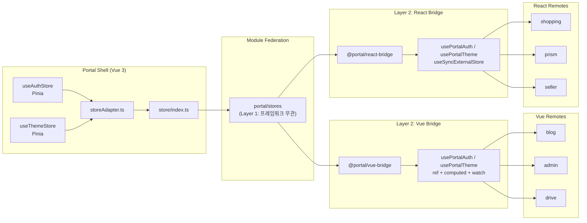
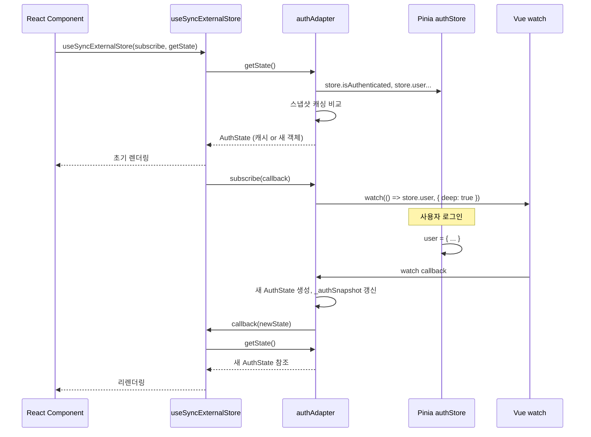

# Portal Shell 아키텍처: Cross-Framework Bridge

## 개요

Portal Shell(Vue 3)은 Vue/React Remote 앱과 상태를 공유해야 합니다. Pinia Store는 Vue의 반응형 시스템에 의존하므로, storeAdapter가 Pinia를 프레임워크 무관 `getState()`/`subscribe()` 패턴으로 래핑합니다. 이를 기반으로 프레임워크별 Bridge 패키지가 소비합니다.

### 2-Layer Bridge 아키텍처

| Layer | 역할 | 패키지 | 핵심 패턴 |
|-------|------|--------|-----------|
| **Layer 1** (공통) | Pinia → 프레임워크 무관 인터페이스 | `portal/stores` (MF expose) | `getState()` / `subscribe()` |
| **Layer 2** (Vue) | adapter → Vue reactive | `@portal/vue-bridge` | `ref()` + `computed()` + `watch()` |
| **Layer 2** (React) | adapter → React hook | `@portal/react-bridge` | `useSyncExternalStore()` |

| 항목 | 내용 |
|------|------|
| **범위** | Component |
| **주요 기술** | Vue watch, 스냅샷 캐싱, CustomEvent, vue-bridge, react-bridge |
| **배포 환경** | Docker Compose, Kubernetes |
| **관련 서비스** | Blog (Vue), Admin (Vue), Drive (Vue), Shopping (React), Prism (React), Seller (React) |

---

## 아키텍처 다이어그램



---

## 핵심 컴포넌트

### 1. themeAdapter

**역할**: `useThemeStore`를 React에서 사용 가능한 `getState()`/`subscribe()` 패턴으로 래핑

**소스**: `src/store/storeAdapter.ts`

**인터페이스**:
```typescript
interface ThemeState {
  isDark: boolean;
}

const themeAdapter = {
  getState: () => ThemeState,       // 현재 상태 (스냅샷 캐싱)
  subscribe: (cb) => UnsubscribeFn, // 변경 구독
  toggle: () => void,               // 테마 토글
  initialize: () => void,           // localStorage 복원
};
```

**스냅샷 캐싱**: `_themeSnapshot` 변수로 `isDark` 값이 동일하면 같은 객체 참조를 반환. React의 `Object.is` 비교에서 불필요한 리렌더링 방지

### 2. authAdapter

**역할**: `useAuthStore`를 React에서 사용 가능한 형태로 래핑

**소스**: `src/store/storeAdapter.ts`

**인터페이스**:
```typescript
interface AuthState {
  isAuthenticated: boolean;
  displayName: string;
  isAdmin: boolean;
  isSeller: boolean;
  roles: string[];
  memberships: Record<string, string>;
  user: {
    uuid?: string;
    email?: string;
    username?: string;
    name?: string;
    nickname?: string;
    picture?: string;
  } | null;
}

const authAdapter = {
  getState: () => AuthState,              // 현재 상태 (스냅샷 캐싱)
  subscribe: (cb) => UnsubscribeFn,       // 변경 구독
  hasRole: (role: string) => boolean,     // 역할 확인
  hasAnyRole: (roles: string[]) => boolean,
  isServiceAdmin: (service: string) => boolean,
  logout: () => void,
  getAccessToken: () => string | null,
  requestLogin: (path?: string) => void,  // 로그인 모달 요청
};
```

**스냅샷 캐싱**: `_authSnapshot`과 `_authUserRef`로 primitive 필드 비교 + `store.user` 참조 비교. 변경이 없으면 같은 객체 반환

**구독**: `watch(() => store.user, callback, { deep: true })`로 user 객체의 깊은 변경 감지

### 3. portalStoreAdapter (통합)

```typescript
export const portalStoreAdapter = {
  theme: themeAdapter,
  auth: authAdapter,
};
```

`portal/stores`에서 `portalStoreAdapter`로 import하여 React Remote에서 통합 사용.

---

## Cross-Framework 이벤트

### portal:auth-changed CustomEvent

**발행 위치**: `useAuthStore` - `login()`, `logout()`, `checkAuth()`

```typescript
window.dispatchEvent(new CustomEvent('portal:auth-changed'));
```

**수신 측 (React)**:
```typescript
useEffect(() => {
  const handler = () => { /* re-read auth state */ };
  window.addEventListener('portal:auth-changed', handler);
  return () => window.removeEventListener('portal:auth-changed', handler);
}, []);
```

### window 전역 함수 (레거시, Bridge 패키지로 대체)

| 전역 변수 | 타입 | 상태 | 대체 수단 |
|-----------|------|------|-----------|
| `__PORTAL_ACCESS_TOKEN__` | `string` | deprecated | `authAdapter.getAccessToken()` |
| `__PORTAL_GET_ACCESS_TOKEN__` | `() => string \| null` | deprecated | `authAdapter.getAccessToken()` |
| `__PORTAL_ON_AUTH_ERROR__` | `() => void` | deprecated | `authAdapter.logout()` |
| `__PORTAL_SHOW_LOGIN__` | `() => void` | deprecated | `authAdapter.requestLogin()` |
| `__PORTAL_POWERED_BY_PORTAL_SHELL__` | `boolean` | 유지 | `isEmbedded()` (bridge 유틸) |

> **참고**: portal-shell의 authService.ts에서 window 전역 변수는 하위 호환을 위해 여전히 설정됩니다. Remote 앱에서는 Bridge 패키지를 통해 접근해야 합니다.

타입 정의: `src/types/global.d.ts`

---

## 데이터 플로우

### React Remote에서 인증 상태 사용



---

## 기술적 결정

### 선택한 패턴

- **스냅샷 캐싱 (`_themeSnapshot`, `_authSnapshot`)**: `useSyncExternalStore`는 `getState()`의 반환값을 `Object.is`로 비교. 매번 새 객체를 반환하면 무한 리렌더링 발생. primitive 필드가 동일하면 이전 객체 참조를 그대로 반환
- **`immediate: false` (Vue watch)**: `useSyncExternalStore`의 `subscribe()` 실행 중 동기적으로 콜백이 호출되면 React Error #185 발생. `immediate: false`로 초기 콜백 방지. React는 `getState()`로 초기값을 읽음
- **`{ deep: true }` (auth watch)**: `store.user`는 중첩 객체. 내부 필드(roles, memberships 등) 변경도 감지해야 하므로 deep watch 필요
- **CustomEvent + storeAdapter 이중화**: `portal:auth-changed`는 가벼운 "무엇이 변경됨" 시그널. storeAdapter는 상세 상태 제공. React 앱은 둘 중 하나 또는 둘 다 사용 가능
- **window 전역 함수**: Module Federation 초기화 전에도 토큰 접근 가능. 레거시 호환 및 fallback

### 제약사항

- Pinia Store는 Vue app이 mount된 후에만 사용 가능. storeAdapter 호출도 마찬가지
- `deep: true` watch는 성능 비용이 있으므로 user 객체가 매우 크면 부분 watch 고려 필요
- window 전역 변수는 이름 충돌 위험. `__PORTAL_` 접두사로 네임스페이스 분리

---

## Bridge 패키지 사용 패턴

### Vue Remote (`@portal/vue-bridge`)

```typescript
// Vue Remote (blog, admin, drive)
import { usePortalAuth, usePortalTheme } from '@portal/vue-bridge'

// 컴포넌트에서
const { isAuthenticated, displayName, logout } = usePortalAuth()
const { isDark, toggle } = usePortalTheme()

// 라우터 가드에서 (sync)
import { getPortalAuthState } from '@portal/vue-bridge'
const authState = getPortalAuthState()
if (!authState.isAuthenticated) return '/login'

// MF unmount 시 cleanup
import { disposePortalAuth, disposePortalTheme } from '@portal/vue-bridge'
```

### React Remote (`@portal/react-bridge`)

```typescript
// React Remote (shopping, prism, seller)
import { usePortalAuth, usePortalTheme } from '@portal/react-bridge'

function MyComponent() {
  const auth = usePortalAuth()
  const theme = usePortalTheme()

  return (
    <div>
      {auth.isAuthenticated ? auth.displayName : 'Guest'}
      <button onClick={theme.toggle}>
        {theme.isDark ? 'Light' : 'Dark'}
      </button>
    </div>
  )
}
```

---

## 관련 문서

- [System Overview](./system-overview.md)
- [Module Federation](./module-federation.md) - portal/stores 노출
- [Authentication](./authentication.md) - authStore, portal:auth-changed
