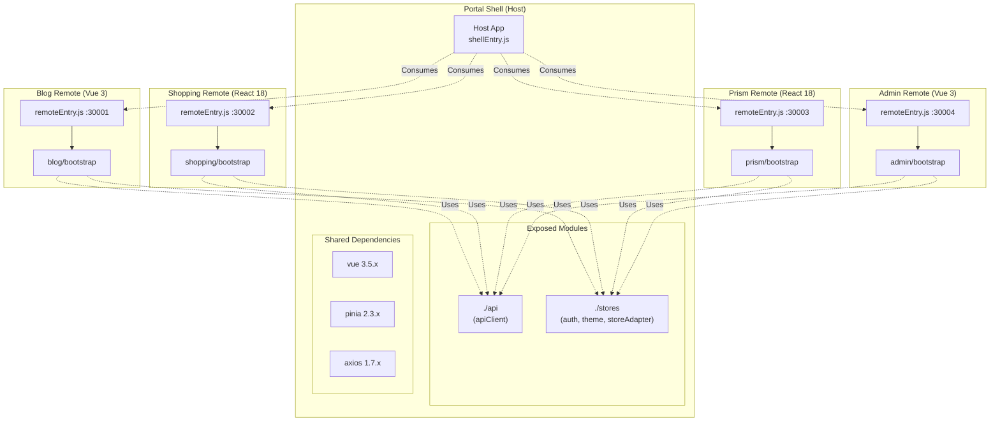

# Portal Shell 아키텍처: Module Federation

## 개요

Portal Shell은 Vite Plugin Federation(@originjs/vite-plugin-federation)을 사용하여 마이크로 프론트엔드 아키텍처를 구현합니다. Host 애플리케이션으로서 Vue 3, React 18 Remote 모듈을 런타임에 동적으로 로드하고, CSS 생명주기 관리/keep-alive/양방향 네비게이션 동기화를 통해 통합합니다.

| 항목 | 내용 |
|------|------|
| **범위** | Component |
| **주요 기술** | @originjs/vite-plugin-federation, Vite 7.x |
| **배포 환경** | Docker Compose, Kubernetes |
| **관련 서비스** | Blog (:30001), Shopping (:30002), Prism (:30003), Admin (:30004) |

---

## 아키텍처 다이어그램



---

## vite.config.ts 설정

```typescript
federation({
  name: 'portal',
  filename: 'shellEntry.js',

  // Remote 모듈 소비
  remotes: {
    blog: env.VITE_BLOG_REMOTE_URL,
    shopping: env.VITE_SHOPPING_REMOTE_URL,
    prism: env.VITE_PRISM_REMOTE_URL,
    admin: env.VITE_ADMIN_REMOTE_URL,
  },

  // 모듈 노출
  exposes: {
    './api': './src/api/index.ts',
    './stores': './src/store/index.ts',
  },

  // 공유 의존성
  shared: ['vue', 'pinia', 'axios'],
})
```

---

## 핵심 컴포넌트

### 1. Remote Registry

**소스**: `src/config/remoteRegistry.ts`

환경별(dev/docker/k8s) Remote 설정을 관리합니다.

```typescript
type RemoteConfig = {
  name: string;         // 표시 이름
  key: string;          // federation key
  url: string;          // remoteEntry.js URL
  module: string;       // 로드할 모듈 경로
  mountFn: string;      // mount 함수 이름
  basePath: string;     // 라우팅 base path
  icon?: string;        // 아이콘
  description?: string; // 설명
};
```

| Remote | key | basePath | mountFn | 포트 |
|--------|-----|----------|---------|------|
| Blog | blog | /blog | mountBlogApp | 30001 |
| Shopping | shopping | /shopping | mountShoppingApp | 30002 |
| Prism | prism | /prism | mountPrismApp | 30003 |
| Admin | admin | /admin | mountAdminApp | 30004 |

### 2. RemoteLoader

**소스**: `src/services/remoteLoader.ts`

Remote 모듈의 로딩과 캐싱을 담당하는 싱글톤 서비스입니다.

**로딩 단계**:
1. `remoteEntry.js` 동적 import (캐싱)
2. `remoteEntry.get('./bootstrap')` → module factory
3. `moduleFactory()` → 모듈 실행
4. `module[config.mountFn]` → mount 함수 추출
5. 캐시 저장

### 3. RemoteWrapper

**소스**: `src/components/RemoteWrapper.vue`

Remote 모듈의 전체 생명주기를 관리하는 Vue 컴포넌트입니다.

---

## Remote App 인터페이스 계약

Remote 앱의 mount 함수가 반환해야 하는 인터페이스:

```typescript
interface RemoteAppInstance {
  unmount?: () => void;                    // 언마운트
  onParentNavigate?: (path: string) => void; // Shell 라우트 변경 수신
  onActivated?: () => void;                // keep-alive 활성화
  onDeactivated?: () => void;              // keep-alive 비활성화
  onThemeChange?: (theme: string) => void; // 테마 변경 수신
}

// mount 함수 시그니처
type MountFn = (
  container: HTMLElement,
  options: {
    initialPath: string;
    onNavigate: (path: string) => void;  // Remote → Shell 네비게이션
    theme: 'dark' | 'light';
  }
) => RemoteAppInstance;
```

---

## CSS 생명주기 관리

Remote 앱이 `document.head`에 동적으로 `<link>` / `<style>`을 삽입하면, RemoteWrapper가 이를 추적하고 관리합니다.

**소스**: `src/components/RemoteWrapper.vue` (module-level `cssRegistry`)

### 동작 흐름

```
1. onMounted → startCssTracking()
   MutationObserver가 document.head의 childList 변경 감시
   <link rel="stylesheet"> 및 <style> 추가 시 cssRegistry에 기록

2. Remote 로드 완료 → stopCssTracking()
   Observer 해제

3. onUnmounted → disableTrackedCss()
   <link>: el.disabled = true
   <style>: el.setAttribute('media', 'not all')
   DOM에서 제거하지 않고 비활성화 (재마운트 시 재활용)

4. 재마운트 시 → enableTrackedCss()
   이미 tracked된 CSS가 있으면 observer 생략, CSS 재활성화
```

### 설계 결정

- **DOM 제거 대신 비활성화**: 재마운트 시 네트워크 재요청 없이 CSS 즉시 복원
- **Module-level 레지스트리**: `<script>` (non-setup) 블록에서 `cssRegistry` 선언. 컴포넌트 인스턴스 간 공유
- **key 기반 분리**: `cssRegistry.get(config.key)`로 Remote별 독립 관리

---

## Keep-alive 지원

App.vue에서 `<KeepAlive>` 래핑 시, RemoteWrapper가 `onActivated` / `onDeactivated` 훅을 Remote 앱에 전달합니다.

```vue
<!-- App.vue -->
<KeepAlive v-if="route.meta.keepAlive" :max="3">
  <component :is="Component" :key="route.meta.remoteName || route.name" />
</KeepAlive>
```

**RemoteWrapper 동작**:
- `onActivated`: `isComponentActive = true` → `remoteApp.onActivated?.()` → CSS 활성화
- `onDeactivated`: `isComponentActive = false` → `remoteApp.onDeactivated?.()` → route watch 스킵

---

## 양방향 네비게이션 동기화

Shell(Vue Router)과 Remote 앱(내부 라우터) 간 양방향 네비게이션을 동기화합니다.

### Shell → Remote (Parent Navigate)

```
Shell route 변경 → watch(shellRoute.path) → debouncedParentNavigate(50ms)
→ remoteApp.onParentNavigate(remotePath)
```

**보호 조건**:
- `isComponentActive` 확인 (비활성 시 스킵)
- `newPath.startsWith(config.basePath)` 확인 (다른 Remote 라우트 무시)
- `isNavigating` 플래그 (반대 방향 전파 중 순환 방지)
- `lastNavigatedPath` 중복 방지

### Remote → Shell

```
Remote 내부 네비게이션 → onNavigate(path) callback
→ onRemoteNavigate() → shellRouter.push(basePath + path)
→ isNavigating = true (100ms 후 해제)
```

### 순환 방지

```
isNavigating 플래그:
  Remote → Shell: isNavigating = true → 100ms timeout → false
  Shell → Remote: isNavigating 체크 → true이면 스킵
```

---

## 테마 변경 전파

RemoteWrapper가 `themeStore.isDark`를 watch하여 Remote 앱에 테마 변경을 전파합니다.

```typescript
watch(() => themeStore.isDark, (isDark) => {
  if (remoteApp?.onThemeChange && isComponentActive) {
    remoteApp.onThemeChange(isDark ? 'dark' : 'light');
  }
});
```

초기 마운트 시에도 현재 테마를 `options.theme`으로 전달합니다.

---

## Exposed Modules

Portal Shell이 Remote 모듈에 제공하는 모듈입니다.

### portal/api

```typescript
// src/api/index.ts
export { default as apiClient } from './apiClient';
```

- Axios 인스턴스 (JWT 자동 첨부, 401 재시도, 429 rate-limit)
- Remote에서 `import { apiClient } from 'portal/api'`로 사용

### portal/stores

```typescript
// src/store/index.ts
export { useAuthStore } from './auth';
export { useThemeStore } from './theme';
export { themeAdapter, authAdapter, portalStoreAdapter } from './storeAdapter';
```

- Vue Remote: `useAuthStore()`, `useThemeStore()` 직접 사용
- React Remote: `storeAdapter`의 `getState()`/`subscribe()` 사용 → [Cross-Framework Bridge](./cross-framework-bridge.md) 참조

---

## Shared Dependencies

| Package | 공유 여부 | 비고 |
|---------|-----------|------|
| vue | 공유 | 필수 (Vue Remote) |
| pinia | 공유 | Store 상태 공유 |
| axios | 공유 | apiClient 공유 시 필수 |
| react | 공유 | React Remote 간 공유 |
| react-dom | 공유 | React Remote 필수 |
| react-dom/client | 공유 | createRoot 사용 시 필수 (누락 시 Error #321) |
| vue-router | 독립 | 각 앱이 별도 관리 |

---

## 에러 폴백 및 재시도

RemoteWrapper는 로드 실패 시 사용자 친화적 에러 UI를 표시합니다.

**에러 UI 구성**:
- 서비스 아이콘 및 설명
- "다시 시도" 버튼 → `retry()` → 캐시 클리어 후 재로드
- "홈으로 돌아가기" 버튼
- 개발 환경: Remote key, module path, 에러 메시지 상세 표시

**retry() 동작**:
1. 기존 앱 unmount 및 정리
2. `remoteLoader.clearCache(config.key)`
3. loading → true, error → null
4. 재로드 시도

---

## 환경별 Remote URL

### Local Dev
```
Blog:     http://localhost:30001/assets/remoteEntry.js
Shopping: http://localhost:30002/assets/remoteEntry.js
Prism:    http://localhost:30003/assets/remoteEntry.js
Admin:    http://localhost:30004/assets/remoteEntry.js
```

### Docker / Kubernetes
환경변수로 관리:
- `VITE_BLOG_REMOTE_URL`
- `VITE_SHOPPING_REMOTE_URL`
- `VITE_PRISM_REMOTE_URL`
- `VITE_ADMIN_REMOTE_URL`

---

## 기술적 결정

### 선택한 패턴

- **CSS 비활성화 (제거 아님)**: `<link disabled>`, `<style media="not all">`로 비활성화하여 재마운트 시 네트워크 재요청 없이 복원
- **Module-level CSS Registry**: `<script>` (non-setup) 블록에서 Map 선언. 컴포넌트 인스턴스 재생성과 무관하게 CSS 추적 유지
- **debounce 50ms Parent Navigate**: 빠른 연속 라우트 변경 시 불필요한 Remote 라우터 호출 방지
- **isNavigating 100ms 플래그**: 양방향 네비게이션의 순환 전파 방지
- **dynamic import로 remoteEntry 로드**: `<script>` 태그 대신 `import()`으로 ESM 모듈 직접 로드

### 제약사항

- Shared 의존성 버전이 불일치하면 런타임 에러 발생 (특히 React 버전 통일 필수)
- `react-dom/client`를 shared에 누락하면 Error #321 발생
- Host → Remote 방향만 허용. Remote → Host 컴포넌트 import 금지

---

## 트러블슈팅

### Remote 모듈 로드 실패
**증상**: `Failed to fetch remoteEntry.js`
**해결**: Remote 앱 실행 확인, URL 확인, CORS 설정 확인

### Shared Dependencies 버전 불일치
**증상**: Error #525 (React), 런타임 TypeError
**해결**: `npm ls react`로 버전 확인, `overrides`로 통일

### React Error #321
**증상**: Invalid hook call
**해결**: shared에 `react-dom/client` 추가

---

## 관련 문서

- [System Overview](./system-overview.md)
- [Cross-Framework Bridge](./cross-framework-bridge.md) - storeAdapter 상세
- [Authentication](./authentication.md) - portal/api 인증 인터셉터
