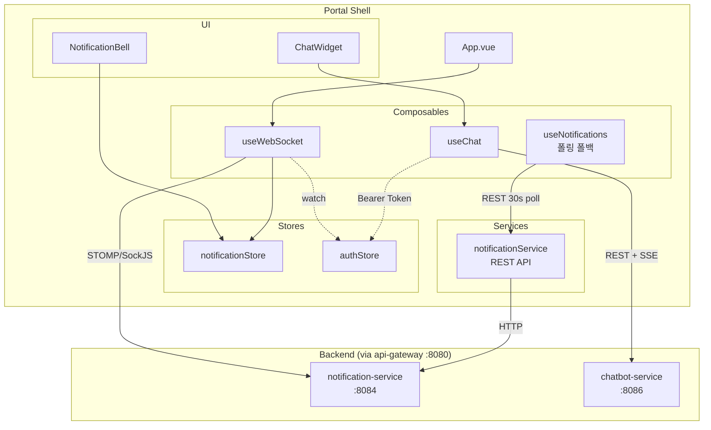
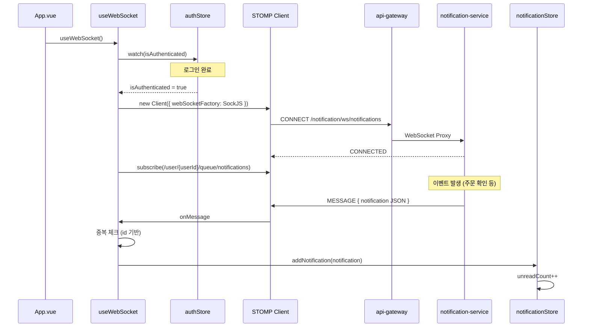
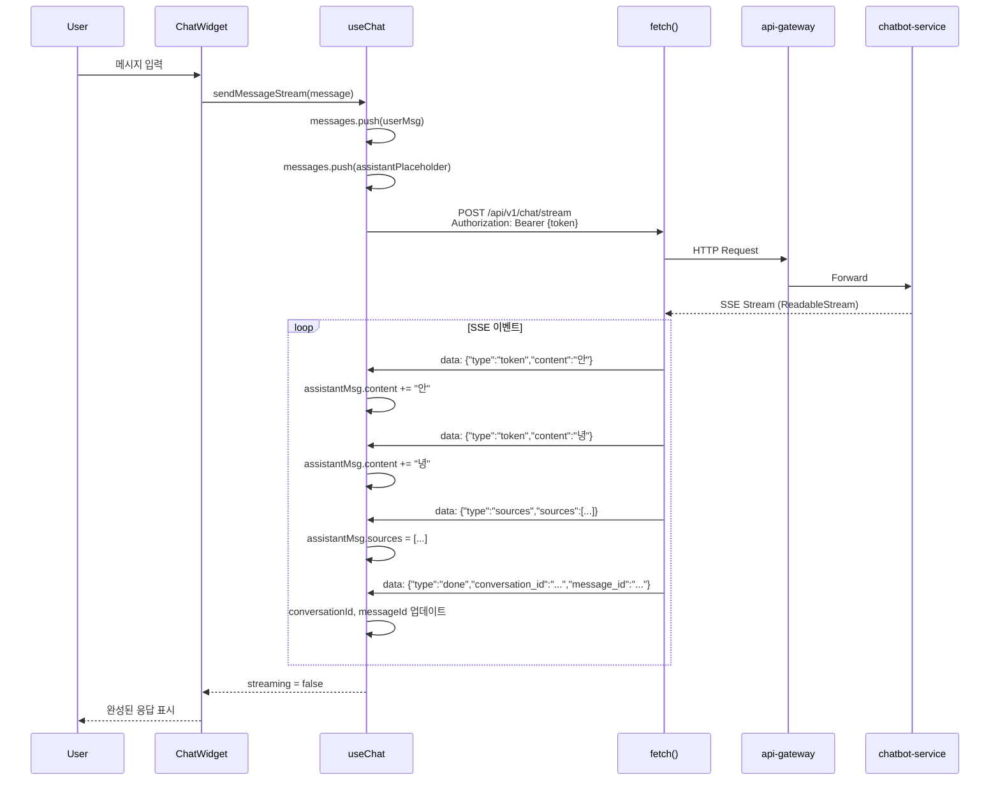

# Portal Shell 아키텍처: Realtime Communication

## 개요

Portal Shell은 두 개의 실시간 통신 채널을 사용합니다. WebSocket(STOMP/SockJS)으로 알림을 수신하고, SSE(Server-Sent Events)로 AI 챗봇 응답을 스트리밍합니다. 두 채널 모두 인증 상태와 연동되어 로그인/로그아웃 시 자동으로 연결/해제됩니다.

| 항목 | 내용 |
|------|------|
| **범위** | Component |
| **주요 기술** | @stomp/stompjs, sockjs-client, SSE (Fetch ReadableStream) |
| **배포 환경** | Docker Compose, Kubernetes |
| **관련 서비스** | notification-service (:8084), chatbot-service (:8086), api-gateway (:8080) |

---

## 아키텍처 다이어그램



---

## 핵심 컴포넌트

### 1. useWebSocket - 실시간 알림

**역할**: STOMP/SockJS 싱글톤 WebSocket 클라이언트. 알림 실시간 수신

**소스**: `src/composables/useWebSocket.ts`

**주요 책임**:
- STOMP Client 싱글톤 관리 (`clientInstance`)
- SockJS를 WebSocket factory로 사용
- 인증 상태 watch → 로그인 시 connect, 로그아웃 시 disconnect
- `/user/{userId}/queue/notifications` 구독
- 수신한 알림을 `notificationStore.addNotification()`으로 전달
- 중복 알림 방지 (id 기반 체크)
- 자동 재연결: 5초 간격, heartbeat 10초

**기술 스택**:
- `@stomp/stompjs` - STOMP 프로토콜 클라이언트
- `sockjs-client` - WebSocket 폴백 (HTTP long-polling 등)

**연결 URL**: `{VITE_API_BASE_URL}/notification/ws/notifications` (api-gateway 경유)

**설정**:

| 항목 | 값 |
|------|-----|
| reconnectDelay | 5000ms |
| heartbeatIncoming | 10000ms |
| heartbeatOutgoing | 10000ms |
| 구독 대상 | `/user/{userId}/queue/notifications` |

### 2. useNotifications - 폴링 폴백

**역할**: WebSocket 불가 시 REST 폴링으로 미읽음 카운트 갱신

**소스**: `src/composables/useNotifications.ts`

**주요 책임**:
- 30초 간격 폴링 (`setInterval`)
- `notificationStore.fetchUnreadCount()` 호출
- 인증 상태 확인 후 폴링 시작/중지
- `onMounted`/`onUnmounted` 생명주기 연동

### 3. notificationStore (Pinia)

**역할**: 알림 상태의 중앙 관리

**소스**: `src/store/notification.ts`

**주요 책임**:
- `notifications: Notification[]` - 알림 목록
- `unreadCount: number` - 미읽음 카운트
- `fetchNotifications(page, reset)` - 페이지네이션 조회
- `markAsRead(id)` / `markAllAsRead()` - 읽음 처리
- `addNotification(notification)` - WebSocket 수신 시 prepend + unreadCount++
- `toggleDropdown()` / `loadMore()` - UI 상호작용

### 4. notificationService - REST API

**역할**: notification-service와의 HTTP 통신

**소스**: `src/services/notificationService.ts`

**API 엔드포인트** (apiClient 경유):

| 메서드 | 경로 | 설명 |
|--------|------|------|
| GET | `/notification/api/v1/notifications` | 알림 목록 (페이지네이션) |
| GET | `/notification/api/v1/notifications/unread` | 미읽음 알림 |
| GET | `/notification/api/v1/notifications/unread/count` | 미읽음 카운트 |
| PUT | `/notification/api/v1/notifications/{id}/read` | 읽음 처리 |
| PUT | `/notification/api/v1/notifications/read-all` | 전체 읽음 |
| DELETE | `/notification/api/v1/notifications/{id}` | 삭제 |

### 5. useChat - AI 챗봇

**역할**: AI 챗봇과의 대화 관리 (REST + SSE 스트리밍)

**소스**: `src/composables/useChat.ts`

**주요 책임**:
- `sendMessage()` - REST 동기 응답 (`POST /api/v1/chat/message`)
- `sendMessageStream()` - SSE 스트리밍 응답 (`POST /api/v1/chat/stream`)
- 대화 관리: `loadConversations()`, `loadConversation(id)`, `startNewConversation()`, `deleteConversation(id)`
- 스트리밍 중 토큰 단위 UI 업데이트

---

## 데이터 플로우

### WebSocket 알림 수신



### AI 챗봇 SSE 스트리밍



### SSE 스트리밍 프로토콜

| 이벤트 타입 | 필드 | 설명 |
|------------|------|------|
| `token` | `content: string` | 응답 토큰 (글자 단위) |
| `sources` | `sources: SourceInfo[]` | RAG 참조 문서 |
| `done` | `conversation_id`, `message_id` | 스트리밍 완료 |

```typescript
// StreamEvent 타입
interface StreamEvent {
  type: 'token' | 'sources' | 'done';
  content?: string;
  sources?: SourceInfo[];
  message_id?: string;
  conversation_id?: string;
}
```

---

## 데이터 타입

### Notification

```typescript
interface Notification {
  id: number;
  userId: number;
  type: NotificationType;  // 'ORDER_CREATED' | 'BLOG_LIKE' | 'PRISM_TASK_COMPLETED' | ...
  title: string;
  message: string;
  link: string | null;
  status: 'UNREAD' | 'READ';
  referenceId: string | null;
  referenceType: string | null;
  createdAt: string;
  readAt: string | null;
}
```

알림 유형: Shopping (주문/배송/결제/쿠폰/타임딜), Blog (좋아요/댓글/팔로우), Prism (작업 완료/실패), System

### ChatMessage

```typescript
interface ChatMessage {
  message_id: string;
  role: 'user' | 'assistant';
  content: string;
  sources?: SourceInfo[] | null;
  created_at: string;
}
```

---

## 기술적 결정

### 선택한 패턴

- **STOMP/SockJS**: Spring Boot 백엔드와의 표준 WebSocket 통합. SockJS는 WebSocket 미지원 환경에서 HTTP long-polling 폴백 제공
- **싱글톤 WebSocket**: module-level `clientInstance`로 여러 컴포넌트가 같은 연결 공유. unmount 시에도 연결 유지
- **인증 상태 watch**: `authStore.isAuthenticated` 변경 감지로 자동 connect/disconnect. 수동 관리 불필요
- **SSE over Fetch**: 챗봇 스트리밍에 EventSource 대신 `fetch` + `ReadableStream` 사용. POST 요청 지원 및 Authorization 헤더 전송 가능
- **폴링 폴백**: `useNotifications`가 30초 주기 REST 폴링. WebSocket 연결 불가 시에도 미읽음 카운트 갱신

### 제약사항

- STOMP/SockJS는 api-gateway를 경유하므로 WebSocket 프록시 설정 필요
- SSE 스트리밍은 HTTP/1.1에서 브라우저당 동시 연결 수 제한 (6개)
- SockJS 폴백 모드에서는 실시간성이 저하됨

---

## 관련 문서

- [System Overview](./system-overview.md)
- [Authentication](./authentication.md) - 인증 상태 연동
- [Notification Service Architecture](../notification-service/system-overview.md)
