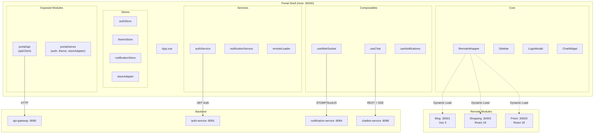
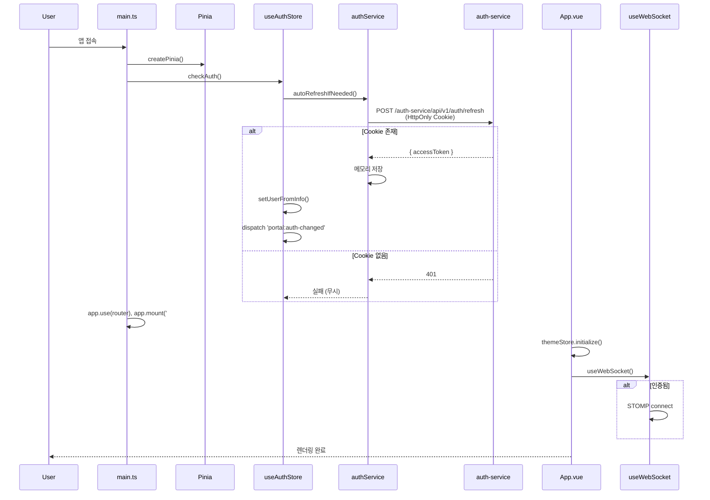

# Portal Shell 아키텍처: System Overview

## 개요

Portal Shell은 마이크로 프론트엔드 아키텍처의 Host 애플리케이션입니다. Vue 3와 Module Federation을 기반으로 Remote 모듈(Blog, Shopping, Prism)을 런타임에 동적으로 통합하고, 인증/라우팅/테마/실시간 통신 등 공통 기능을 제공합니다.

| 항목 | 내용 |
|------|------|
| **범위** | System |
| **주요 기술** | Vue 3, Vite 7.x, TypeScript 5.9, Pinia, Module Federation |
| **배포 환경** | Docker Compose, Kubernetes |
| **관련 서비스** | api-gateway, auth-service, notification-service, chatbot-service, blog-service, shopping-service, prism-service |

---

## 아키텍처 다이어그램



---

## 핵심 컴포넌트

### 1. Portal Shell (Host Application)

**역할**: MFA Host, 공통 기능 제공, Remote 모듈 통합

| 항목 | 내용 |
|------|------|
| **기술 스택** | Vue 3 (Composition API + `<script setup>`), Vite 7.x, TypeScript 5.9 |
| **포트** | 30000 |
| **상태 관리** | Pinia (auth, theme, notification, settings) |
| **MF 플러그인** | @originjs/vite-plugin-federation |
| **HTTP** | Axios (apiClient), Fetch (authService, useChat SSE) |
| **실시간** | @stomp/stompjs + sockjs-client (알림), SSE (챗봇) |
| **디자인** | @portal/design-system-vue, TailwindCSS |

### 2. Remote Modules

| Remote | 포트 | 프레임워크 | basePath | 설명 |
|--------|------|-----------|----------|------|
| Blog | 30001 | Vue 3 | `/blog` | 블로그 서비스 |
| Shopping | 30002 | React 18 | `/shopping` | 쇼핑 서비스 |
| Prism | 30003 | React 18 | `/prism` | AI 에이전트 오케스트레이션 |

### 3. Stores

| Store | 소스 | 역할 |
|-------|------|------|
| `useAuthStore` | `src/store/auth.ts` | 인증 상태, RBAC, `portal:auth-changed` 이벤트 |
| `useThemeStore` | `src/store/theme.ts` | Light/Dark/System 모드, localStorage 영속화 |
| `useNotificationStore` | `src/store/notification.ts` | 알림 목록, 미읽음 카운트, 페이지네이션 |
| `useSettingsStore` | `src/store/settings.ts` | 사용자 설정 |
| `storeAdapter` | `src/store/storeAdapter.ts` | Pinia → React 브릿지 (themeAdapter, authAdapter) |

---

## 데이터 플로우

### 애플리케이션 초기화



---

## 데이터 저장소

| 저장소 | 용도 | 기술 |
|--------|------|------|
| JavaScript 메모리 | Access Token | `AuthenticationService.accessToken` |
| HttpOnly Cookie | Refresh Token | auth-service Set-Cookie |
| localStorage | 테마 설정, 사이드바 상태 | Browser API |
| Pinia Store | 런타임 상태 (user, theme, notifications) | Vue Reactive State |

---

## 외부 연동

| 시스템 | 용도 | 프로토콜 | URL |
|--------|------|----------|-----|
| api-gateway | 백엔드 API 호출 | HTTP (Axios) | http://localhost:8080 |
| auth-service | JWT 인증, 소셜 로그인 | HTTP (Fetch) | http://localhost:8081 |
| notification-service | 실시간 알림 | STOMP/SockJS | http://localhost:8080/notification/ws/notifications |
| chatbot-service | AI 챗봇 | REST + SSE | http://localhost:8080/api/v1/chat/* |
| Blog Remote | Remote 모듈 로딩 | Module Federation | http://localhost:30001 |
| Shopping Remote | Remote 모듈 로딩 | Module Federation | http://localhost:30002 |
| Prism Remote | Remote 모듈 로딩 | Module Federation | http://localhost:30003 |

---

## 소스 구조

```
src/
├── api/                      # API 클라이언트
│   ├── apiClient.ts          # Axios (MF portal/api로 노출)
│   ├── index.ts              # Export barrel
│   └── types.ts              # API 에러 타입
├── components/               # 공통 컴포넌트
│   ├── RemoteWrapper.vue     # Remote 모듈 래퍼 (CSS 관리, keep-alive)
│   ├── LoginModal.vue        # 로그인 모달
│   ├── Sidebar.vue           # 사이드바 네비게이션
│   ├── QuickActions.vue      # Cmd+K 명령 팔레트
│   └── chat/                 # 챗봇 위젯
│       └── ChatWidget.vue
├── composables/              # Vue Composables
│   ├── useWebSocket.ts       # STOMP/SockJS 알림
│   ├── useChat.ts            # AI 챗봇 (REST + SSE)
│   └── useNotifications.ts   # 알림 폴링 폴백
├── config/
│   └── remoteRegistry.ts     # Remote 설정 (dev/docker/k8s)
├── constants/
│   └── roles.ts              # RBAC 역할 상수
├── router/
│   └── index.ts              # Vue Router 설정
├── services/
│   ├── authService.ts        # JWT 인증 (메모리 토큰, HttpOnly Cookie)
│   ├── notificationService.ts # 알림 REST API
│   └── remoteLoader.ts       # Remote 동적 로딩 (캐싱)
├── store/
│   ├── auth.ts               # MF portal/stores로 노출
│   ├── theme.ts              # MF portal/stores로 노출
│   ├── notification.ts       # 알림 상태
│   ├── settings.ts           # 사용자 설정
│   ├── storeAdapter.ts       # Pinia → React 브릿지
│   └── index.ts              # Store + Adapter 통합 export
├── types/
│   ├── user.ts               # PortalUser, UserProfile, UserAuthority
│   ├── notification.ts       # Notification, NotificationType
│   ├── chat.ts               # ChatMessage, StreamEvent
│   └── global.d.ts           # Window 전역 타입
├── utils/
│   ├── jwt.ts                # JWT 파싱
│   └── base64.ts             # Base64 URL 디코딩
├── views/
│   ├── HomePage.vue
│   ├── SignupPage.vue
│   ├── OAuth2Callback.vue    # 소셜 로그인 콜백
│   └── NotFound.vue
├── App.vue                   # 루트 (Sidebar, ChatWidget, KeepAlive)
└── main.ts                   # 진입점 (Pinia → checkAuth → Router → Mount)
```

---

## 기술적 결정

### 선택한 패턴

- **Module Federation Host**: 런타임 Remote 통합으로 독립 배포 가능. Vite Plugin Federation 사용
- **Cross-framework 지원**: Vue Host에서 React Remote를 storeAdapter로 연결. `useSyncExternalStore` 호환
- **JWT + HttpOnly Cookie**: Access Token 메모리 저장 (XSS 방어), Refresh Token HttpOnly Cookie (CSRF 방어)
- **STOMP/SockJS + 폴링 폴백**: 실시간 알림은 WebSocket 우선, 연결 불가 시 30초 폴링
- **SSE 스트리밍 챗봇**: `useChat`에서 `ReadableStream`으로 토큰 단위 스트리밍
- **Dark-first 테마**: Linear 스타일, dark/light/system 3모드, `data-service` 속성으로 서비스별 테마 전환

### 제약사항

- Module Federation은 ESM 기반으로 빌드 시 shared 의존성 버전 통일 필수
- React Remote는 Pinia를 직접 사용할 수 없으므로 storeAdapter 브릿지 필요
- SSE 스트리밍은 HTTP/1.1에서 동시 연결 수 제한 (브라우저당 6개)

---

## 환경별 설정

| 환경 | VITE_PROFILE | Remote URL | API Base |
|------|--------------|------------|----------|
| Local Dev | dev | http://localhost:3000X | http://localhost:8080 |
| Docker | docker | 환경변수 | 환경변수 |
| Kubernetes | k8s | 환경변수 | 환경변수 |

---

## 관련 문서

- [Module Federation 상세](./module-federation.md)
- [Authentication 흐름](./authentication.md)
- [Realtime Communication](./realtime-communication.md)
- [Cross-Framework Bridge](./cross-framework-bridge.md)
- [API Gateway Architecture](../api-gateway/system-overview.md)
- [Auth Service Architecture](../auth-service/system-overview.md)
