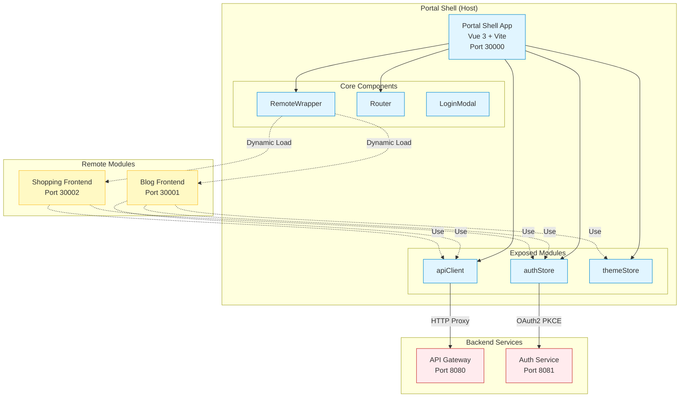
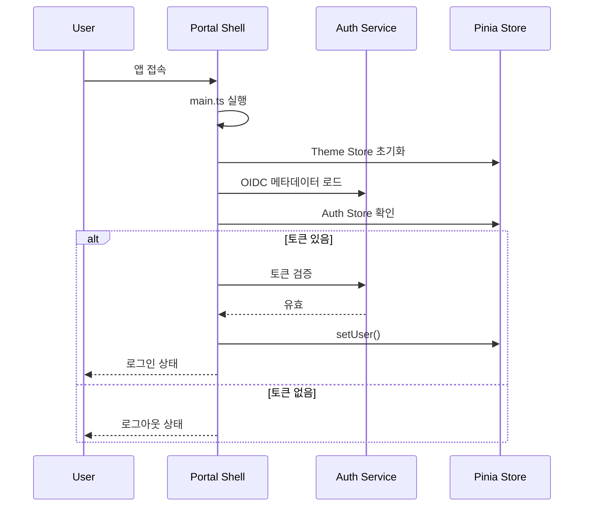
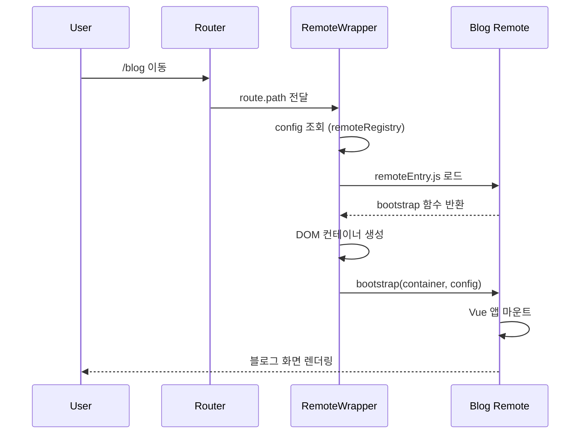

# Portal Shell System Overview

## 📋 개요

Portal Shell은 마이크로 프론트엔드 아키텍처의 Host 애플리케이션입니다. Vue 3와 Module Federation을 기반으로 여러 Remote 모듈(blog, shopping)을 런타임에 동적으로 통합하고, 인증, 라우팅, 테마 등 공통 기능을 제공합니다.

---

## 🎯 핵심 특징

- **Module Federation Host**: Remote 모듈 동적 로딩 및 통합
- **OAuth2 PKCE 인증**: Spring Authorization Server와 연동한 표준 인증
- **Shared Resources**: apiClient, authStore, themeStore를 Remote 모듈에 노출
- **Isolated Environment**: Remote 모듈은 독립적으로 개발/배포 가능
- **Service Theming**: data-service 속성으로 서비스별 테마 전환

---

## 🏗️ High-Level Architecture



---

## 📦 컴포넌트 상세

### Portal Shell (Host Application)

| 항목 | 내용 |
|------|------|
| **역할** | MFA Host, 공통 기능 제공 |
| **기술 스택** | Vue 3, Vite 7.x, TypeScript 5.9, Pinia, Vue Router 4 |
| **포트** | 30000 |
| **의존성** | @originjs/vite-plugin-federation, oidc-client-ts |

### RemoteWrapper

| 항목 | 내용 |
|------|------|
| **역할** | Remote 모듈 동적 로딩 및 마운트 |
| **타입** | Vue 3 Component |
| **주요 기능** | remoteEntry.js 로드, bootstrap 함수 호출, 서비스별 테마 적용 |

### Router

| 항목 | 내용 |
|------|------|
| **역할** | 라우팅 관리 (Shell + Remote) |
| **타입** | Vue Router 4 |
| **라우트** | /, /signup, /callback, /blog/*, /shopping/* |

### Auth Store (Pinia)

| 항목 | 내용 |
|------|------|
| **역할** | 사용자 인증 상태 관리 |
| **State** | user (PortalUser), isAuthenticated, displayName |
| **Actions** | setUser, logout, hasRole |

### Theme Store (Pinia)

| 항목 | 내용 |
|------|------|
| **역할** | Light/Dark 모드 관리 |
| **State** | isDark |
| **Actions** | toggle, initialize |

---

## 💾 데이터 저장소

| 저장소 | 용도 | 기술 |
|--------|------|------|
| localStorage | OIDC 토큰, 테마 설정 | Browser API |
| Pinia Store | 런타임 상태 (user, theme) | Vue Reactive State |

---

## 🔗 외부 연동

| 시스템 | 용도 | 프로토콜 | URL |
|--------|------|----------|-----|
| API Gateway | 백엔드 API 호출 | HTTP Proxy | http://localhost:8080 |
| Auth Service | OAuth2 인증 | OIDC PKCE | http://localhost:8081 |
| Blog Remote | Remote 모듈 로딩 | Module Federation | http://localhost:30001 |
| Shopping Remote | Remote 모듈 로딩 | Module Federation | http://localhost:30002 |

---

## 📂 소스 구조

```
src/
├── api/                   # API 클라이언트 (axios)
│   └── apiClient.ts       # Exposed to Remote
├── components/            # 공통 컴포넌트
│   ├── RemoteWrapper.vue  # Remote 모듈 래퍼
│   ├── LoginModal.vue     # 로그인 모달
│   └── ThemeToggle.vue    # 테마 전환
├── config/
│   └── remoteRegistry.ts  # Remote 설정 (dev/docker/k8s)
├── router/
│   └── index.ts           # Vue Router 설정
├── services/
│   ├── authService.ts     # OAuth2 인증 서비스
│   └── remoteLoader.ts    # Remote 동적 로딩
├── store/
│   ├── auth.ts            # Exposed to Remote
│   └── theme.ts           # Exposed to Remote
├── types/
│   └── user.ts            # TypeScript 타입 정의
├── utils/
│   └── jwt.ts             # JWT 파싱
├── views/                 # 페이지 컴포넌트
│   ├── HomePage.vue
│   ├── SignupPage.vue
│   ├── CallbackPage.vue   # OAuth Callback
│   └── NotFound.vue
├── App.vue
└── main.ts
```

---

## 📊 성능 목표

| 지표 | 목표 | 현재 |
|------|------|------|
| 초기 로드 시간 | < 1s | - |
| Remote 로드 시간 | < 500ms | - |
| 인증 처리 시간 | < 300ms | - |
| 라우팅 전환 시간 | < 100ms | - |

---

## 🔐 보안

### 인증 방식
- OAuth2 Authorization Code + PKCE Flow
- JWT Access Token (Bearer Token)
- Silent Renewal (자동 토큰 갱신)

### 토큰 저장
- localStorage (WebStorageStateStore)
- 만료 시 자동 로그아웃

### CORS 정책
- API Gateway에서 CORS 처리
- Vite Proxy: /auth-service, /api

---

## 🌐 환경별 설정

| 환경 | VITE_PROFILE | Remote URL |
|------|--------------|------------|
| Local Dev | dev | http://localhost:3000X |
| Docker | docker | 환경변수 VITE_BLOG_REMOTE_URL |
| Kubernetes | k8s | 환경변수 VITE_BLOG_REMOTE_URL |

---

## 🔄 주요 흐름

### 1. 애플리케이션 초기화



### 2. Remote 모듈 로딩



---

## 🔗 관련 문서

- [Module Federation 상세](./module-federation.md)
- [Authentication 흐름](./authentication.md)
- [API 명세](../api/)
- [가이드](../guides/)

---

**최종 업데이트**: 2026-01-18
