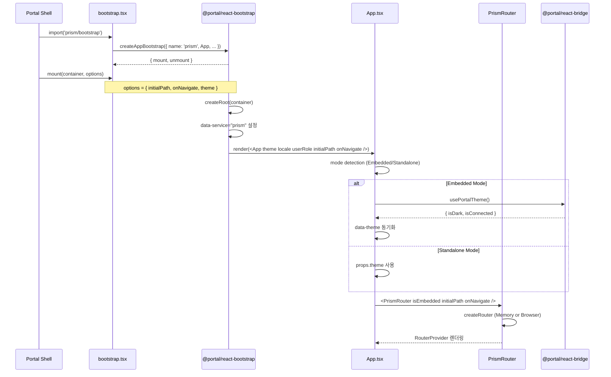
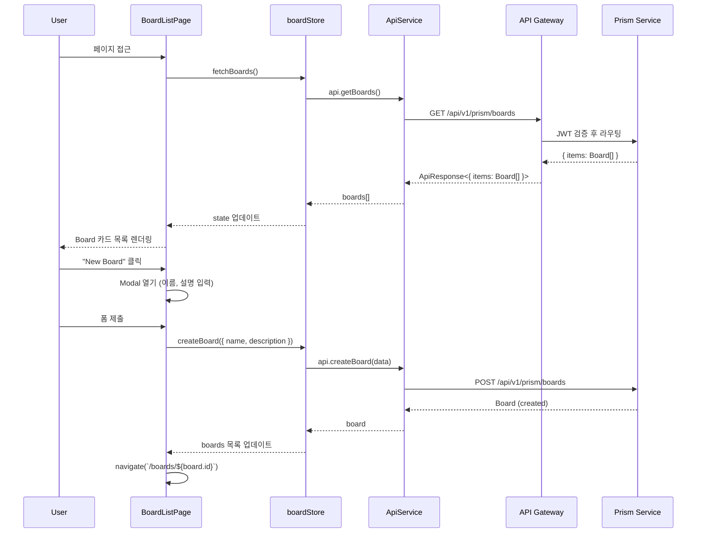
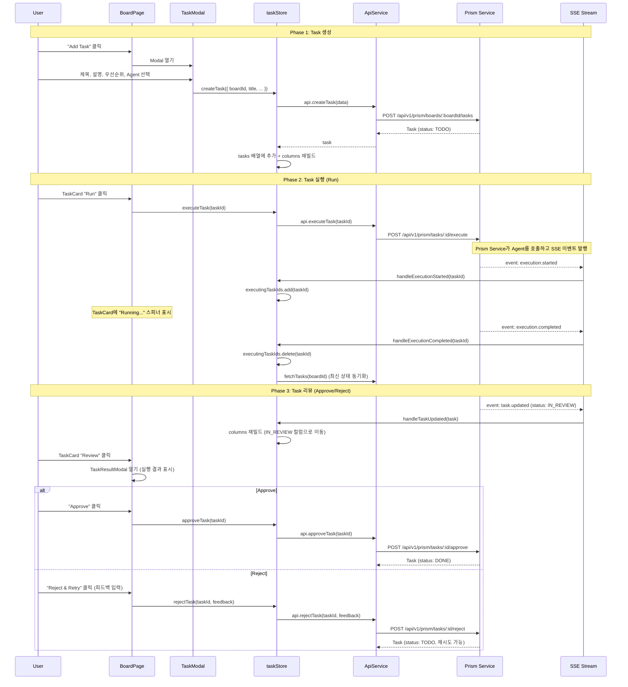
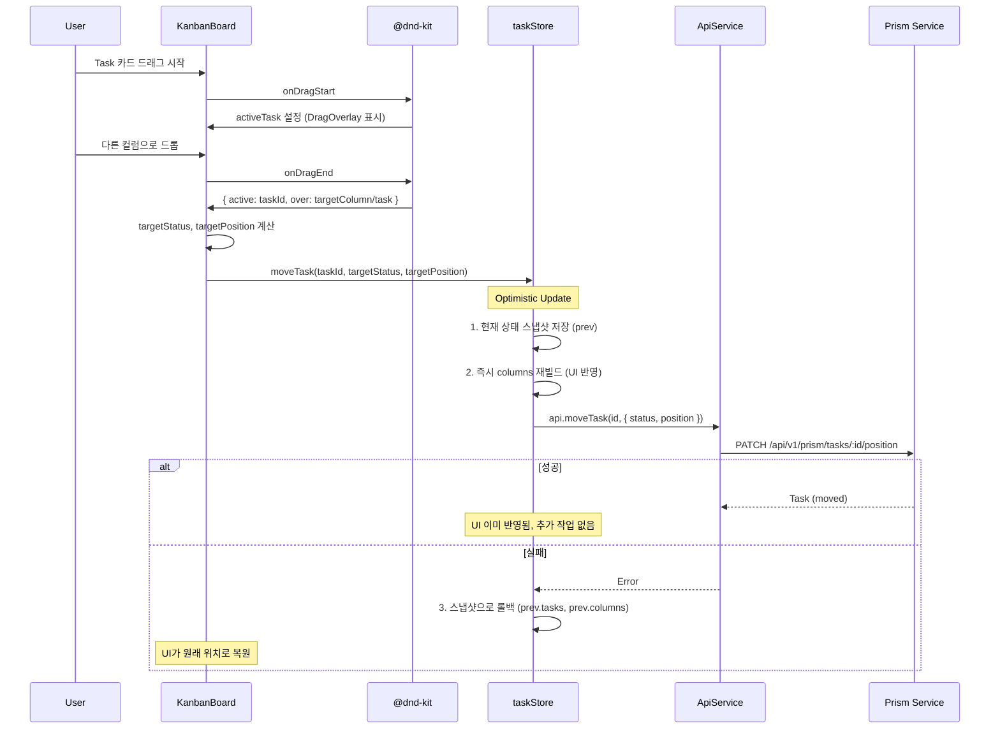
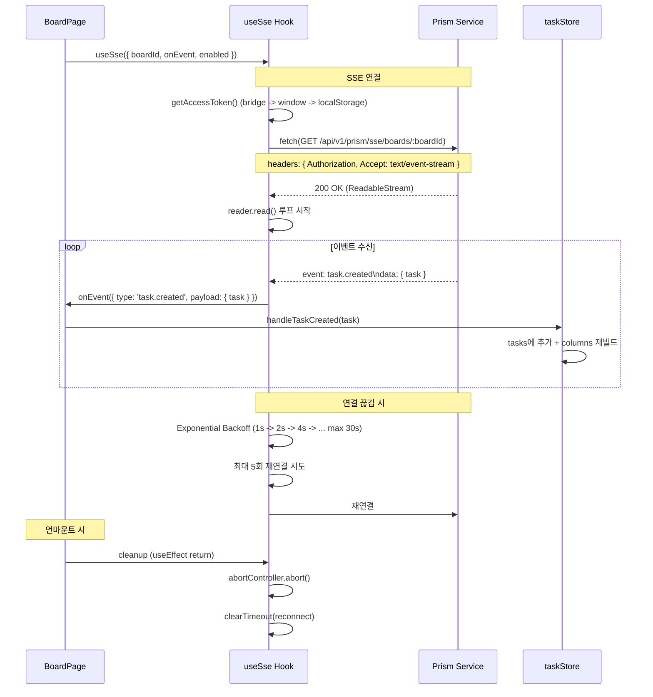
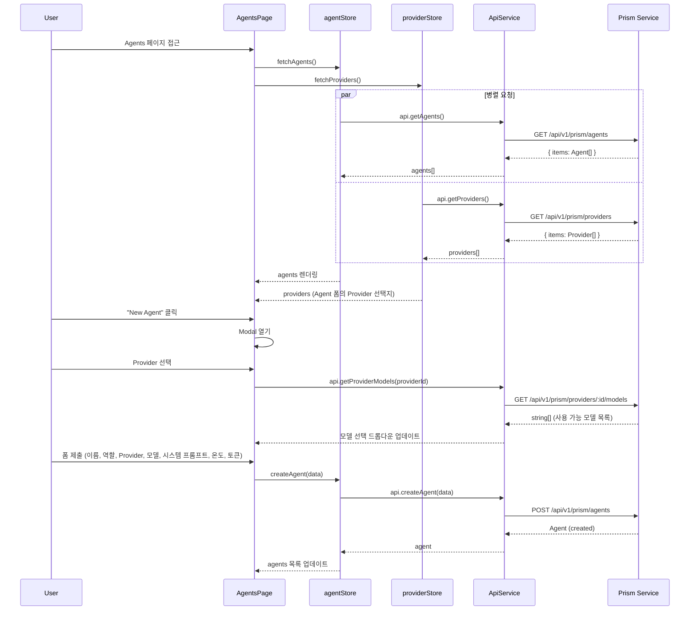
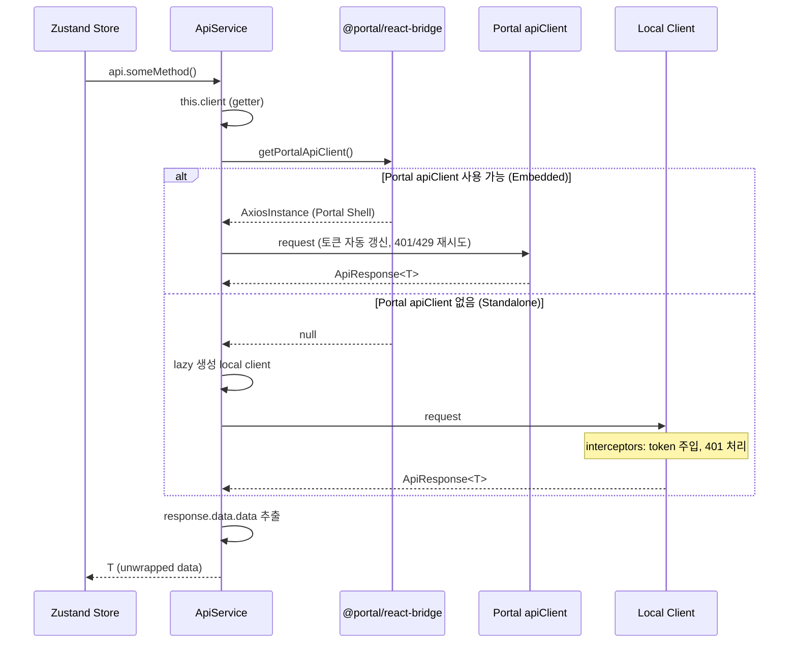
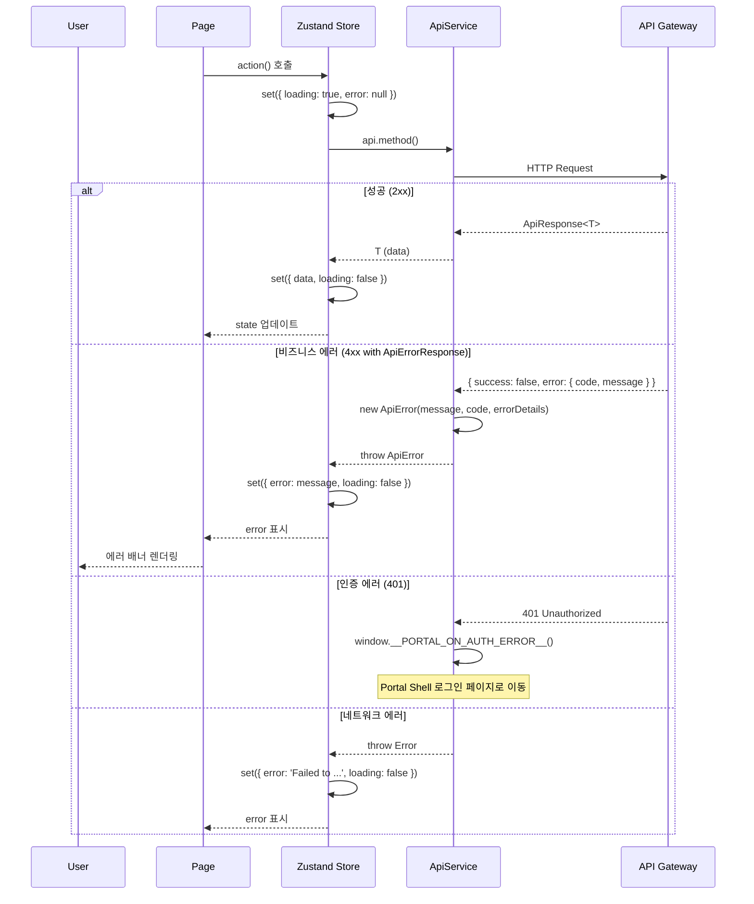
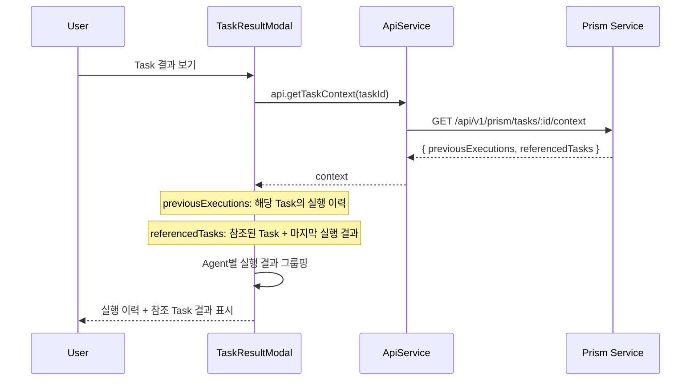

# Prism Frontend Data Flow

## 개요

Prism Frontend는 React 18 기반의 AI Agent Orchestration Kanban Board로, API Gateway를 통해 Prism Service(NestJS)와 통신합니다. Zustand를 사용하여 클라이언트 상태를 관리하며, SSE(Server-Sent Events)로 실시간 업데이트를 수신합니다.

**핵심 특징**:
- Portal Shell에서 주입된 `apiClient` (axios 인스턴스) 또는 local fallback 사용
- API Gateway를 통한 중앙집중식 라우팅 (`/api/v1/prism/**`)
- Zustand 4개 Store (board, task, agent, provider)
- SSE 기반 Board별 실시간 이벤트 스트림
- @dnd-kit Kanban DnD + Optimistic Update + Rollback
- Embedded/Standalone 듀얼 모드 지원

---

## 전체 데이터 흐름 아키텍처

```mermaid
graph TB
    subgraph "Portal Shell"
        PS[Portal Shell App]
        AC[apiClient - Axios]
        TST[themeStore - Pinia]
        AST[authStore - Pinia]
    end

    subgraph "Prism Frontend"
        APP[App.tsx]
        RT[PrismRouter]
        PG[Pages - BoardList, Board, Agents, Providers]
        API[ApiService]
        SSE[useSse Hook]

        subgraph "Zustand Stores"
            BDS[boardStore]
            TKS[taskStore + columns]
            AGS[agentStore]
            PVS[providerStore]
        end
    end

    subgraph "Backend"
        GW[API Gateway :8080]
        PRS[Prism Service :8085]
        DB[(MongoDB)]
    end

    PS -->|Module Federation| APP
    AC -->|getPortalApiClient| API
    TST -.->|usePortalTheme| APP
    AST -.->|RequireAuth| RT

    APP --> RT
    RT --> PG
    PG -->|read/write| Zustand Stores
    Zustand Stores -->|call| API
    SSE -->|이벤트 핸들러| TKS

    API -->|HTTP| GW
    GW -->|route /api/v1/prism/**| PRS
    PRS -->|query| DB
    PRS -.->|SSE Stream| SSE
```

---

## 주요 데이터 흐름

### 1. 애플리케이션 마운트 흐름



### 2. Board CRUD



### 3. Task 생명주기 (TODO -> DONE)



### 4. Kanban DnD + Optimistic Update



### 5. SSE 실시간 업데이트



**SSE 이벤트 유형**:

| 이벤트 | 페이로드 | taskStore 핸들러 | 동작 |
|--------|---------|-----------------|------|
| `task.created` | `{ task: Task }` | `handleTaskCreated` | tasks 배열에 추가 (중복 방지) |
| `task.updated` | `{ task: Task }` | `handleTaskUpdated` | 해당 Task 교체 |
| `task.moved` | `{ taskId, toStatus, position }` | `handleTaskMoved` | status/position 업데이트 |
| `task.deleted` | `{ taskId }` | `handleTaskDeleted` | tasks에서 제거 |
| `execution.started` | `{ taskId }` | `handleExecutionStarted` | executingTaskIds에 추가 |
| `execution.completed` | `{ taskId }` | `handleExecutionCompleted` | executingTaskIds에서 제거 + fetchTasks |
| `execution.failed` | `{ taskId }` | `handleExecutionFailed` | executingTaskIds에서 제거 |

### 6. Agent/Provider 관리



### 7. API 호출 패턴 (Portal apiClient vs Local Fallback)



**토큰 획득 우선순위** (Local Fallback):
1. `@portal/react-bridge` adapter의 `getAccessToken()`
2. `window.__PORTAL_GET_ACCESS_TOKEN__()`
3. `window.__PORTAL_ACCESS_TOKEN__`
4. `localStorage.getItem('access_token')`

### 8. 에러 처리 패턴



---

## Task 컨텍스트 (Referenced Tasks)

Task 생성 시 다른 완료된 Task를 참조(Reference)할 수 있습니다. Agent 실행 시 참조된 Task의 실행 결과가 컨텍스트로 전달됩니다.



**TaskContext 구조**:

```typescript
interface TaskContext {
  previousExecutions: Execution[];  // 해당 Task의 이전 실행 이력
  referencedTasks: Array<{
    taskId: number;
    taskTitle: string;
    lastExecution: Execution | null; // 참조 Task의 마지막 실행 결과
  }>;
}
```

---

## 관련 문서

- [System Overview](./system-overview.md) - 아키텍처 개요
- [Module Federation](./module-federation.md) - MF 설정 상세

---

**작성자**: Laze
**최종 업데이트**: 2026-02-06
