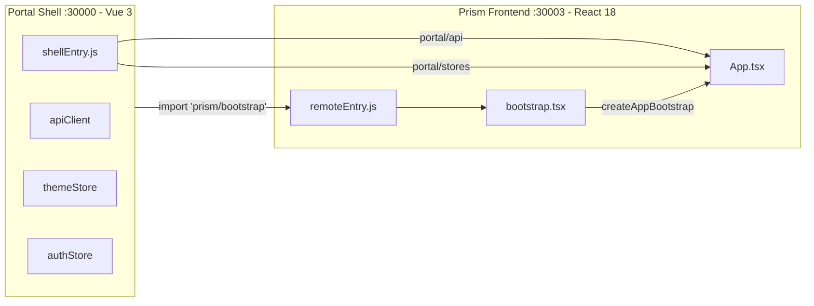
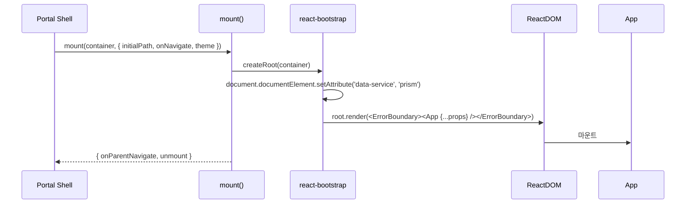
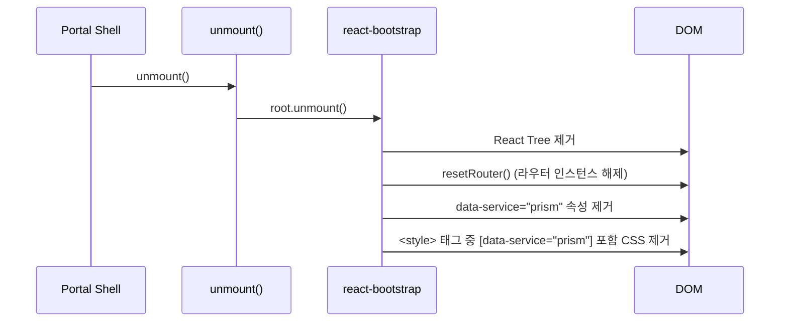

# Prism Frontend Module Federation

## 개요

Prism Frontend는 Module Federation Remote로 동작하며, Portal Shell(Vue 3 Host)에서 런타임에 동적 로드됩니다. `@portal/react-bootstrap`의 `createAppBootstrap()`을 통해 마운트/언마운트 라이프사이클을 관리합니다.

### MF 아키텍처



---

## Vite Federation 설정

### vite.config.ts

```typescript
import { defineConfig, loadEnv } from 'vite';
import react from '@vitejs/plugin-react';
import federation from '@originjs/vite-plugin-federation';

export default defineConfig(({ mode }) => {
  const env = loadEnv(mode, process.cwd(), '');

  return {
    plugins: [
      react(),
      federation({
        name: 'prism',
        filename: 'remoteEntry.js',
        remotes: {
          portal: env.VITE_PORTAL_SHELL_REMOTE_URL
            || 'http://localhost:30000/assets/shellEntry.js',
        },
        exposes: {
          './bootstrap': './src/bootstrap.tsx',
        },
        shared: [
          'react',
          'react-dom',
          'react-dom/client',
          'react-router-dom',
          'axios',
        ],
      }),
    ],

    server: {
      port: 30003,
      host: '0.0.0.0',
      cors: true,
    },

    build: {
      target: 'esnext',
      minify: 'esbuild',
      cssCodeSplit: true,
    },
  };
});
```

### 설정 요소 상세

| 항목 | 값 | 설명 |
|------|-----|------|
| `name` | `prism` | Federation 모듈 이름 |
| `filename` | `remoteEntry.js` | Remote Entry 파일명 |
| `remotes.portal` | `http://localhost:30000/assets/shellEntry.js` | Portal Shell의 MF Entry |
| `exposes['./bootstrap']` | `./src/bootstrap.tsx` | 외부에 노출하는 모듈 |

---

## Shared Dependencies (5개)

| 라이브러리 | 포함 이유 |
|-----------|----------|
| `react` | React 런타임. Host와 단일 인스턴스 공유 필수 |
| `react-dom` | DOM 렌더링. react와 동일 인스턴스 필수 |
| `react-dom/client` | `createRoot` API. 누락 시 별도 번들에 포함되어 **Error #321** 발생 |
| `react-router-dom` | 라우터. Host/Remote간 동일 인스턴스 공유로 Context 충돌 방지 |
| `axios` | HTTP 클라이언트. `portal/api`의 `apiClient`가 axios 인스턴스이므로 공유 필수 |

### 왜 5개 모두 필요한가?

```
shared 누락 시 발생하는 문제:

react/react-dom 누락
  → 별도 React 인스턴스 번들됨
  → Hook 규칙 위반 → Error #321 (Invalid hook call)

react-dom/client 누락
  → createRoot가 로컬 react-dom 사용
  → Host의 react와 다른 인스턴스 → Error #321

react-router-dom 누락
  → RouterProvider Context 불일치
  → useNavigate/useLocation 동작 실패

axios 누락
  → portal/api의 apiClient와 다른 axios 인스턴스
  → interceptor 공유 안됨 → 토큰 자동 갱신 미작동
```

---

## @portal/react-bootstrap

### createAppBootstrap() API

```typescript
import { createAppBootstrap } from '@portal/react-bootstrap';
import App from './App';
import { navigateTo, resetRouter, setAppActive } from './router';

const { mount } = createAppBootstrap({
  name: 'prism',           // 앱 이름 (로깅용)
  App,                     // 루트 React 컴포넌트
  dataService: 'prism',   // data-service 속성값
  router: {
    navigateTo,            // 외부에서 라우트 변경
    resetRouter,           // 라우터 인스턴스 초기화
    setAppActive,          // Keep-Alive activated/deactivated
  },
});

export { mount };
export const mountPrismApp = mount;
```

### mount() 호출 흐름



### unmount() 클린업



---

## Portal Bridge 연동

### 1. usePortalTheme (테마 동기화)

```typescript
// App.tsx
import { usePortalTheme } from '@portal/react-bridge';

const portalTheme = usePortalTheme();
const isDark = isEmbedded && portalTheme.isConnected
  ? portalTheme.isDark      // Portal Shell의 themeStore 구독
  : theme === 'dark';       // props fallback (Standalone)
```

**동작**:
- Embedded: `@portal/react-bridge`의 `usePortalTheme()`이 Portal Shell themeStore 구독
- Pinia store 변경 -> React state 업데이트 -> `data-theme` 속성 동기화

### 2. getPortalApiClient (API Client)

```typescript
// services/api.ts
import { getPortalApiClient } from '@portal/react-bridge';

private get client(): AxiosInstance {
  const portalClient = getPortalApiClient();
  if (portalClient) return portalClient;
  return this.createLocalClient();
}
```

**동작**:
- api-registry가 `import('portal/api')`로 Portal Shell의 `apiClient`를 resolve
- 캐싱되어 한 번만 resolve
- 실패 시 local fallback 사용

### 3. RequireAuth (인증 가드)

```typescript
// router/index.tsx
import { RequireAuth } from '@portal/react-bridge';

{
  path: 'boards/:boardId',
  element: (
    <RequireAuth>
      <Suspense fallback={<PageLoader />}>
        <BoardPage />
      </Suspense>
    </RequireAuth>
  )
}
```

**동작**:
- Embedded: Portal Shell의 authStore에서 인증 상태 확인
- 미인증 시: Portal Shell 로그인 페이지로 리다이렉트
- Standalone: local fallback (bridge adapter 또는 window 전역)

---

## Host <-> Remote 통신 채널

### 4가지 통신 채널

| 채널 | 방향 | 메커니즘 | 용도 |
|------|------|---------|------|
| **Props** | Host -> Remote | MountOptions | theme, locale, userRole, initialPath |
| **Module Federation** | Host <-> Remote | `import('portal/api')`, `import('portal/stores')` | apiClient, authStore, themeStore |
| **Callback** | Remote -> Host | `onNavigate(path)` | 라우트 변경 알림 |
| **API** | Host -> Remote | `onParentNavigate(path)` | 외부에서 라우트 변경 |

### Props (Host -> Remote)

```typescript
interface AppProps {
  theme?: 'light' | 'dark';
  locale?: string;
  userRole?: 'guest' | 'user' | 'admin';
  initialPath?: string;
  onNavigate?: (path: string) => void;
}
```

### Module Federation Imports (Remote -> Host)

```typescript
// Portal Shell의 모듈을 Runtime Import
declare module 'portal/api' {
  export const apiClient: AxiosInstance;
  export function getData<T>(response: AxiosResponse<ApiResponse<T>>): T;
  export function getErrorMessage(error: unknown): string;
}

declare module 'portal/stores' {
  export const themeAdapter: ThemeAdapter;
  export const authAdapter: AuthAdapter;
}
```

---

## CSS 격리

### data-service 속성

```css
/* Prism 전용 스타일 */
[data-service="prism"] .some-class {
  /* Portal Shell/다른 MF와 충돌하지 않음 */
}

/* 다크 테마 */
[data-service="prism"][data-theme="dark"] {
  /* Prism 다크 모드 스타일 */
}
```

### 라이프사이클

1. **mount**: `@portal/react-bootstrap`이 `<html data-service="prism">` 설정
2. **App.tsx**: `data-theme="dark"` 동기화 (Portal themeStore 또는 props)
3. **unmount**: `@portal/react-bootstrap`이 `data-service` 제거 + 관련 `<style>` 태그 정리

---

## KeepAlive Lifecycle

Portal Shell이 탭 전환 시 Prism 앱을 KeepAlive로 관리할 수 있습니다.

```typescript
// router/index.tsx
export const setAppActive = (active: boolean) => {
  isAppActive = active;
};
```

| 이벤트 | 호출 | 효과 |
|--------|------|------|
| `activated` | `setAppActive(true)` | Navigation sync 재개 |
| `deactivated` | `setAppActive(false)` | Navigation sync 중지 (불필요한 콜백 방지) |

---

## 트러블슈팅

### Error #321: Invalid hook call

**원인**: `react-dom/client`가 shared에 누락되어 별도 React 인스턴스가 번들됨

**증상**:
```
Error: Invalid hook call. Hooks can only be called inside of the body of a function component.
```

**해결**:
```typescript
// vite.config.ts
shared: ['react', 'react-dom', 'react-dom/client']  // react-dom/client 필수!
```

**검증**:
```bash
grep "importShared('react-dom/client')" dist/assets/__federation_expose_*.js
# 출력 있으면 OK, 없으면 shared 설정 확인
```

### Error #525: Objects are not valid as a React child

**원인**: React 18과 19의 JSX 심볼 불일치 (`react.element` vs `react.transitional.element`)

**증상**:
```
Error: Objects are not valid as a React child (found: object with keys {$$typeof, type, props}).
```

**해결**:
```json
// frontend/package.json (루트)
{
  "overrides": {
    "react": "18.3.1",
    "react-dom": "18.3.1"
  }
}
```

**검증**:
```bash
cd frontend && npm ls react
# 모든 패키지가 18.3.1을 가리키는지 확인
```

### SSE 연결 실패

**원인**: 토큰 미포함 또는 CORS 설정 누락

**증상**:
```
[SSE] Connection error: SSE connection failed: 401
```

**해결**:
1. 토큰 확인: `getAccessToken()`이 유효한 토큰 반환하는지 확인
2. CORS: API Gateway에서 `text/event-stream` Content-Type 허용 확인
3. credentials: `credentials: 'include'` 설정 확인

### Portal apiClient resolve 실패

**원인**: Portal Shell이 아직 로드되지 않았거나, `axios`가 shared에 누락됨

**증상**:
```
[Bridge] Failed to resolve portal/api, using local fallback
```

**해결**:
1. shared에 `'axios'` 포함 확인
2. Portal Shell의 `shellEntry.js`가 먼저 로드되었는지 확인
3. `VITE_PORTAL_SHELL_REMOTE_URL` 환경변수 확인

---

## 빌드 검증 체크리스트

- [x] 루트 `package.json`에 React 버전 `overrides` 설정 (18.3.1)
- [x] `npm ls react`로 버전 통일 확인
- [x] `vite.config.ts` federation 플러그인 설정
- [x] `shared`에 `'react'` 포함
- [x] `shared`에 `'react-dom'` 포함
- [x] `shared`에 `'react-dom/client'` 포함
- [x] `shared`에 `'react-router-dom'` 포함
- [x] `shared`에 `'axios'` 포함
- [x] `exposes`에 `'./bootstrap'` 설정
- [x] 빌드 후 `importShared()` 호출 검증
- [x] Host에서 로드 테스트
- [x] Standalone 모드 테스트

---

## 관련 문서

- [System Overview](./system-overview.md) - 아키텍처 개요
- [Data Flow](./data-flow.md) - 데이터 흐름
- [Shopping Frontend MF](../shopping-frontend/module-federation.md) - Shopping 참조
- [Blog Frontend MF](../blog-frontend/module-federation.md) - Blog 참조
- [React MF 규칙](../../../.claude/rules/react.md) - Module Federation 체크리스트

---

**작성자**: Laze
**최종 업데이트**: 2026-02-06
