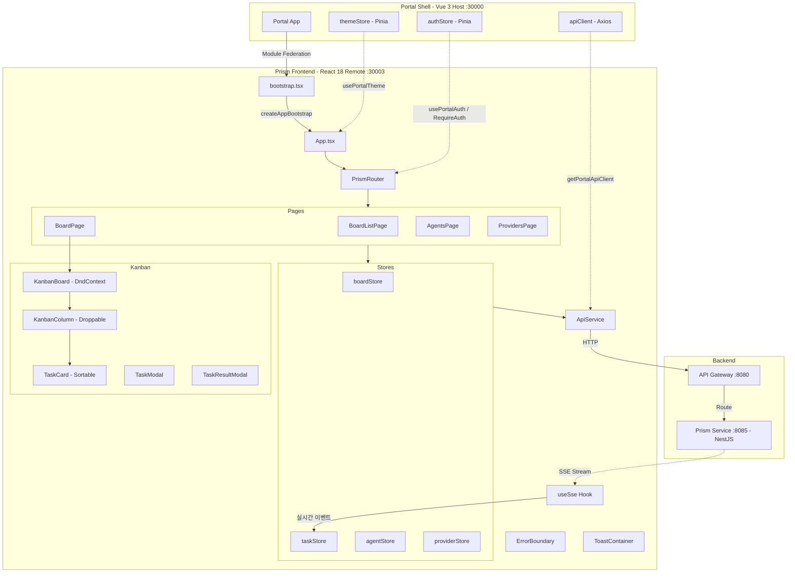

# Prism Frontend System Overview

## 개요

Prism Frontend는 Portal Universe의 AI Agent Orchestration Kanban Board 마이크로 프론트엔드입니다. React 18 기반으로 구축되었으며, Module Federation을 통해 Portal Shell(Vue 3 Host)에 동적으로 통합됩니다.

### 핵심 역할

- **Board 관리**: Kanban Board CRUD (이름, 설명)
- **Task 관리**: AI Agent에게 할당할 Task 생성/수정/삭제
- **Kanban DnD**: @dnd-kit 기반 드래그 앤 드롭으로 Task 상태 전환
- **AI Agent 관리**: LLM Provider별 Agent 등록/설정
- **Provider 관리**: OpenAI, Anthropic, Google, Ollama 등 LLM Provider 등록
- **Task Execution**: Agent에게 Task 실행 요청, 결과 확인, Approve/Reject
- **실시간 업데이트**: SSE(Server-Sent Events)로 Task/Execution 상태 실시간 동기화

---

## 핵심 특징

- **React 18 Functional Components + Hooks**: 최신 React 패턴
- **Module Federation Remote**: Portal Shell 런타임 통합
- **Dual Mode 지원**: Embedded(Portal) / Standalone(독립) 실행
- **Zustand 상태 관리**: boardStore, taskStore, agentStore, providerStore (4개)
- **@portal/react-bootstrap**: `createAppBootstrap`으로 부트스트랩 간소화
- **@portal/react-bridge**: api-registry가 `portal/api` -> local fallback 처리
- **@dnd-kit**: Kanban Board 드래그 앤 드롭 + Optimistic Update + Rollback
- **SSE 실시간**: `useSse` hook으로 Board별 이벤트 스트림 구독
- **Task Lifecycle**: TODO -> IN_PROGRESS -> IN_REVIEW -> DONE/CANCELLED
- **테마 동기화**: `data-service="prism"` + `data-theme` CSS 격리

---

## High-Level Architecture



---

## 기술 스택

### Core

| 항목 | 기술 | 버전 | 비고 |
|------|------|------|------|
| 프레임워크 | React | 18.3.1 | Functional Components + Hooks (root overrides 적용) |
| 빌드 도구 | Vite | 7.2.0 | ESM 기반 번들러 |
| Module Federation | @originjs/vite-plugin-federation | 1.4.1 | Runtime Remote Integration |
| 타입 | TypeScript | 5.9.3 | strict: true |

### State & Routing

| 항목 | 기술 | 버전 | 비고 |
|------|------|------|------|
| 상태 관리 | Zustand | 5.0.3 | 4 stores (board, task, agent, provider) |
| 라우팅 | React Router | 7.1.5 | MemoryRouter / BrowserRouter |
| DnD | @dnd-kit/core | 6.3.1 | Kanban 드래그 앤 드롭 |
| DnD Sortable | @dnd-kit/sortable | 10.0.0 | Column 내 정렬 |

### API & Styling

| 항목 | 기술 | 버전 | 비고 |
|------|------|------|------|
| API Client | Axios | 1.12.2 | Portal Shell 공유 |
| SSE | Fetch API (ReadableStream) | - | Board별 실시간 이벤트 |
| 스타일 | TailwindCSS | 3.4.15 | PostCSS + @portal/design-tokens |
| 디자인 시스템 | @portal/design-system-react | workspace:* | Modal, Button, Input, Select 등 |

### Portal Integration

| 항목 | 기술 | 용도 |
|------|------|------|
| @portal/react-bootstrap | workspace:* | createAppBootstrap (부트스트랩 간소화) |
| @portal/react-bridge | workspace:* | api-registry + bridge-registry |
| @portal/design-tokens | workspace:* | 3-tier 디자인 토큰 |
| @portal/design-types | workspace:* | ApiResponse, ErrorDetails 공유 타입 |

---

## Bootstrap 메커니즘

### bootstrap.tsx (MF Entry Point)

`@portal/react-bootstrap`의 `createAppBootstrap`을 사용하여 부트스트랩 로직을 간소화:

```typescript
import { createAppBootstrap } from '@portal/react-bootstrap';
import App from './App';
import { navigateTo, resetRouter, setAppActive } from './router';

const { mount } = createAppBootstrap({
  name: 'prism',
  App,
  dataService: 'prism',
  router: {
    navigateTo,
    resetRouter,
    setAppActive,
  },
});

export { mount };
export const mountPrismApp = mount;
```

**책임 위임**:
- React Root 생성/제거 -> `@portal/react-bootstrap`
- CSS 클린업 (`[data-service="prism"]`) -> `@portal/react-bootstrap`
- `data-service` 속성 설정 -> `@portal/react-bootstrap`
- ErrorBoundary 감싸기 -> `@portal/react-bootstrap`

### MountOptions 인터페이스

```typescript
interface MountOptions {
  initialPath?: string;                // 초기 라우트 경로
  onNavigate?: (path: string) => void; // Portal Shell에 경로 변경 알림
  theme?: 'light' | 'dark';           // 초기 테마 (Standalone 모드)
  locale?: string;                    // 초기 로케일
  userRole?: string;                  // 사용자 역할
}
```

---

## 라우팅 구조

### Routes (6개)

| 경로 | 페이지 | 가드 | 설명 |
|------|--------|------|------|
| `/` | BoardListPage | RequireAuth | Board 목록 (index) |
| `/boards` | BoardListPage | RequireAuth | Board 목록 |
| `/boards/:boardId` | BoardPage | RequireAuth | Kanban Board + SSE |
| `/agents` | AgentsPage | RequireAuth | Agent 관리 |
| `/providers` | ProvidersPage | RequireAuth | Provider 관리 |
| `*` | BoardListPage | RequireAuth | Fallback |

### 라우터 모드

| 모드 | 라우터 | 감지 조건 |
|------|--------|----------|
| **Embedded** | MemoryRouter | `window.__POWERED_BY_PORTAL_SHELL__` = true |
| **Standalone** | BrowserRouter (basename: `/prism`) | 미설정 |

**라우트 동기화**:
- Embedded: `NavigationSync` 컴포넌트가 경로 변경 시 `onNavigate` 콜백 호출
- Portal Shell: `navigateTo(path)` 함수로 React Router 업데이트
- Keep-Alive: `setAppActive(false)` 시 navigation sync 중지

### Code Splitting

모든 페이지는 `lazy()` + `Suspense`로 로드:

```typescript
const BoardListPage = lazy(() => import('@/pages/BoardListPage'));
const BoardPage = lazy(() => import('@/pages/BoardPage'));
const AgentsPage = lazy(() => import('@/pages/AgentsPage'));
const ProvidersPage = lazy(() => import('@/pages/ProvidersPage'));
```

---

## 상태 관리

### 1. boardStore (Zustand)

```typescript
interface BoardState {
  boards: Board[];
  currentBoard: Board | null;
  loading: boolean;
  error: string | null;

  fetchBoards: () => Promise<void>;
  fetchBoard: (id: number) => Promise<void>;
  createBoard: (data: CreateBoardRequest) => Promise<Board>;
  updateBoard: (id: number, data: Partial<CreateBoardRequest>) => Promise<void>;
  deleteBoard: (id: number) => Promise<void>;
}
```

### 2. taskStore (Zustand)

Task CRUD + Kanban Column 빌드 + SSE 이벤트 핸들러를 통합:

```typescript
interface TaskState {
  tasks: Task[];
  columns: KanbanColumn[];         // buildColumns(tasks)로 자동 빌드
  executingTaskIds: Set<number>;   // 실행 중인 Task 추적

  // CRUD
  fetchTasks: (boardId: number) => Promise<void>;
  createTask: (data: CreateTaskRequest) => Promise<Task>;
  updateTask: (id: number, data: UpdateTaskRequest) => Promise<void>;
  moveTask: (id: number, status: TaskStatus, position: number) => Promise<void>;
  deleteTask: (id: number) => Promise<void>;

  // Task Actions
  executeTask: (taskId: number) => Promise<void>;
  approveTask: (taskId: number) => Promise<void>;
  rejectTask: (taskId: number, feedback?: string) => Promise<void>;

  // SSE Event Handlers
  handleTaskCreated: (task: Task) => void;
  handleTaskUpdated: (task: Task) => void;
  handleTaskMoved: (taskId: number, toStatus: TaskStatus, position: number) => void;
  handleTaskDeleted: (taskId: number) => void;
  handleExecutionStarted: (taskId: number) => void;
  handleExecutionCompleted: (taskId: number) => void;
  handleExecutionFailed: (taskId: number) => void;
}
```

**Kanban Column 자동 빌드**:

```typescript
const COLUMN_CONFIG = [
  { id: 'TODO', title: 'To Do' },
  { id: 'IN_PROGRESS', title: 'In Progress' },
  { id: 'IN_REVIEW', title: 'In Review' },
  { id: 'DONE', title: 'Done' },
  { id: 'CANCELLED', title: 'Cancelled' },
];
```

**Optimistic Update + Rollback** (`moveTask`):
1. 현재 상태 스냅샷 저장
2. 즉시 UI 업데이트 (Optimistic)
3. API 호출 실패 시 스냅샷으로 복원

### 3. agentStore (Zustand)

```typescript
interface AgentState {
  agents: Agent[];
  loading: boolean;
  error: string | null;

  fetchAgents: () => Promise<void>;
  createAgent: (data: CreateAgentRequest) => Promise<Agent>;
  updateAgent: (id: number, data: Partial<CreateAgentRequest>) => Promise<void>;
  deleteAgent: (id: number) => Promise<void>;
}
```

### 4. providerStore (Zustand)

```typescript
interface ProviderState {
  providers: Provider[];
  loading: boolean;
  error: string | null;

  fetchProviders: () => Promise<void>;
  createProvider: (data: CreateProviderRequest) => Promise<Provider>;
  deleteProvider: (id: number) => Promise<void>;
}
```

### 5. Portal Bridge Hooks

```typescript
import { usePortalAuth, usePortalTheme } from '@portal/react-bridge';

// 인증 상태 (Portal Shell authStore 동기화)
const { user, isAuthenticated } = usePortalAuth();

// 테마 상태 (Portal Shell themeStore 동기화)
const { isDark, isConnected } = usePortalTheme();
```

Prism Frontend는 별도 authStore/themeStore를 갖지 않음. `@portal/react-bridge` hooks가 Portal Shell의 Pinia store와 직접 동기화.

---

## API Client 구조

### ApiService (services/api.ts)

```typescript
class ApiService {
  private get client(): AxiosInstance {
    // 1. portal/api apiClient 우선 사용 (Embedded)
    const portalClient = getPortalApiClient();
    if (portalClient) return portalClient;

    // 2. local fallback (Standalone)
    return this.createLocalClient();
  }
}
```

**동작 방식**:

1. **Embedded Mode**: `@portal/react-bridge`의 `getPortalApiClient()`
   - api-registry가 `import('portal/api')`로 Portal Shell의 apiClient를 resolve
   - 완전판 apiClient: 토큰 자동 갱신, 401/429 재시도
   - axios 인스턴스가 Module Federation으로 공유됨

2. **Standalone Mode**: local axios fallback
   - baseURL: `VITE_API_BASE_URL` 또는 `http://localhost:8080`
   - 토큰: bridge adapter -> window 전역변수 -> localStorage 순으로 탐색
   - 401 에러 시 `window.__PORTAL_ON_AUTH_ERROR__()` 콜백 호출

### API 엔드포인트

| 카테고리 | 엔드포인트 | 메서드 | 설명 |
|----------|-----------|--------|------|
| Provider | `/api/v1/prism/providers` | GET | Provider 목록 |
| Provider | `/api/v1/prism/providers` | POST | Provider 생성 |
| Provider | `/api/v1/prism/providers/:id` | DELETE | Provider 삭제 |
| Provider | `/api/v1/prism/providers/:id/models` | GET | 사용 가능 모델 목록 |
| Agent | `/api/v1/prism/agents` | GET | Agent 목록 |
| Agent | `/api/v1/prism/agents` | POST | Agent 생성 |
| Agent | `/api/v1/prism/agents/:id` | PUT | Agent 수정 |
| Agent | `/api/v1/prism/agents/:id` | DELETE | Agent 삭제 |
| Board | `/api/v1/prism/boards` | GET | Board 목록 |
| Board | `/api/v1/prism/boards` | POST | Board 생성 |
| Board | `/api/v1/prism/boards/:id` | PUT | Board 수정 |
| Board | `/api/v1/prism/boards/:id` | DELETE | Board 삭제 |
| Task | `/api/v1/prism/boards/:boardId/tasks` | GET | Board의 Task 목록 |
| Task | `/api/v1/prism/boards/:boardId/tasks` | POST | Task 생성 |
| Task | `/api/v1/prism/tasks/:id` | PUT | Task 수정 |
| Task | `/api/v1/prism/tasks/:id/position` | PATCH | Task 이동 (DnD) |
| Task | `/api/v1/prism/tasks/:id` | DELETE | Task 삭제 |
| Task Actions | `/api/v1/prism/tasks/:id/approve` | POST | Task 승인 |
| Task Actions | `/api/v1/prism/tasks/:id/reject` | POST | Task 거부 (피드백) |
| Task Actions | `/api/v1/prism/tasks/:id/cancel` | POST | Task 취소 |
| Task Actions | `/api/v1/prism/tasks/:id/reopen` | POST | Task 재시작 |
| Task Actions | `/api/v1/prism/tasks/:id/context` | GET | Task 컨텍스트 (실행 이력 + 참조 Task) |
| Execution | `/api/v1/prism/tasks/:id/execute` | POST | Task 실행 |
| Execution | `/api/v1/prism/tasks/:id/executions` | GET | 실행 이력 |
| SSE | `/api/v1/prism/sse/boards/:boardId` | GET | Board SSE 스트림 |

---

## Kanban 컴포넌트 구조

### 컴포넌트 계층

```
KanbanBoard (DndContext, sensors, collision detection)
├── KanbanColumn (useDroppable, SortableContext) x 5 columns
│   ├── TaskCard (useSortable) x N tasks
│   └── "+ Add Task" 버튼 (TODO 컬럼만)
└── DragOverlay (드래그 중 미리보기)
```

### Task 상태 전이

```
TODO ──[Run]──> IN_PROGRESS ──[완료]──> IN_REVIEW ──[Approve]──> DONE
  │                                        │
  │                                        └──[Reject]──> TODO (피드백 포함)
  │
  └──[Cancel]──> CANCELLED ──[Reopen]──> TODO
```

### TaskCard 상태별 액션

| 상태 | 가능한 액션 |
|------|------------|
| TODO | Edit, Run (Agent 할당 시) |
| IN_PROGRESS | View (실행 상태 확인) |
| IN_REVIEW | Review (Approve/Reject) |
| DONE | View (결과 확인) |
| CANCELLED | View |

---

## Embedded / Standalone 모드 차이

| 구분 | Embedded Mode | Standalone Mode |
|------|---------------|-----------------|
| **감지 방법** | `window.__POWERED_BY_PORTAL_SHELL__ === true` | 미설정 |
| **라우터** | MemoryRouter | BrowserRouter (`/prism`) |
| **인증** | `usePortalAuth()` (Portal Shell) | local fallback |
| **API Client** | `portal/api` apiClient (완전판) | local axios fallback |
| **테마** | `usePortalTheme()` (Portal Shell) | props.theme |
| **Header/Footer** | 숨김 (Portal Shell 제공) | 표시 (자체 Nav) |
| **CSS** | `[data-service="prism"]` | `[data-service="prism"]` |
| **토큰 관리** | Portal Shell (자동 갱신) | localStorage / window 전역 |

---

## Portal Shell 연동

### 1. 테마 동기화

```typescript
// App.tsx
const portalTheme = usePortalTheme();
const isDark = isEmbedded && portalTheme.isConnected
  ? portalTheme.isDark
  : theme === 'dark';

useEffect(() => {
  document.documentElement.setAttribute('data-theme', isDark ? 'dark' : 'light');
}, [isDark]);
```

### 2. 인증 가드

```typescript
// router/index.tsx
import { RequireAuth } from '@portal/react-bridge';

{
  path: 'boards/:boardId',
  element: (
    <RequireAuth>
      <BoardPage />
    </RequireAuth>
  )
}
```

### 3. 네비게이션 동기화

```typescript
// NavigationSync 컴포넌트
const location = useLocation();
useEffect(() => {
  if (isAppActive && prevPath !== location.pathname) {
    navigationCallback?.(location.pathname);
  }
}, [location.pathname]);
```

### 4. CSS 격리

```css
[data-service="prism"] {
  /* Prism 전용 스타일 */
}

[data-service="prism"][data-theme="dark"] {
  /* Prism 다크 테마 */
}
```

---

## 디렉토리 구조

```
prism-frontend/
├── src/
│   ├── App.tsx                              # 루트 컴포넌트, 테마/모드 관리
│   ├── bootstrap.tsx                        # MF 진입점 (createAppBootstrap)
│   ├── main.tsx                             # Standalone 모드 진입점
│   ├── index.css                            # TailwindCSS + data-service 스타일
│   ├── vite-env.d.ts                        # Vite 환경 타입
│   ├── router/
│   │   └── index.tsx                        # React Router 설정 (6 routes)
│   ├── stores/
│   │   ├── boardStore.ts                    # Board CRUD (Zustand)
│   │   ├── taskStore.ts                     # Task + Kanban + SSE (Zustand)
│   │   ├── agentStore.ts                    # Agent CRUD (Zustand)
│   │   └── providerStore.ts                # Provider CRUD (Zustand)
│   ├── services/
│   │   └── api.ts                           # ApiService (portal/api -> fallback)
│   ├── hooks/
│   │   ├── index.ts                         # Hook exports
│   │   └── useSse.ts                        # SSE 연결 (Fetch ReadableStream)
│   ├── pages/
│   │   ├── index.ts                         # Page exports
│   │   ├── BoardListPage.tsx                # Board 목록
│   │   ├── BoardPage.tsx                    # Kanban Board + SSE
│   │   ├── AgentsPage.tsx                   # Agent 관리
│   │   └── ProvidersPage.tsx                # Provider 관리
│   ├── components/
│   │   ├── ErrorBoundary.tsx                # 에러 경계
│   │   ├── Layout.tsx                       # Standalone 레이아웃 (미사용)
│   │   └── kanban/
│   │       ├── index.ts                     # Kanban exports
│   │       ├── KanbanBoard.tsx              # DndContext + DragOverlay
│   │       ├── KanbanColumn.tsx             # Droppable + SortableContext
│   │       ├── TaskCard.tsx                 # Sortable + 상태별 액션
│   │       ├── TaskModal.tsx                # Task 생성/수정 폼
│   │       └── TaskResultModal.tsx          # 실행 결과 + Approve/Reject
│   └── types/
│       ├── index.ts                         # 도메인 타입 (Provider, Agent, Board, Task, Execution)
│       └── portal-modules.d.ts              # MF 모듈 타입 선언 (portal/api, portal/stores)
├── vite.config.ts                           # Module Federation 설정
├── tailwind.config.js                       # TailwindCSS 설정
├── tsconfig.json                            # TypeScript 설정
└── package.json                             # 의존성
```

---

## 빌드 및 실행

### 개발 모드 (Standalone)

```bash
cd frontend/prism-frontend
npm run dev
# http://localhost:30003/prism
```

### 프로덕션 빌드

```bash
npm run build
# dist/assets/remoteEntry.js 생성 (Module Federation entry)
```

### Embedded 모드 테스트

```bash
# 1. Prism Frontend 빌드
cd frontend/prism-frontend
npm run dev

# 2. Portal Shell에서 호출
cd ../portal-shell
npm run dev
# http://localhost:30000/prism
```

---

## 보안 고려사항

### 1. 인증

- 모든 라우트에 `RequireAuth` 가드 적용
- Embedded: Portal Shell의 authStore에서 인증 상태 확인
- Standalone: bridge adapter 또는 window 전역변수에서 토큰 획득

### 2. JWT 토큰 관리

| 모드 | 토큰 소스 | 만료 처리 |
|------|----------|----------|
| Embedded | Portal Shell apiClient | 자동 갱신 (Refresh Token) |
| Standalone | localStorage / window 전역 | 401 시 `__PORTAL_ON_AUTH_ERROR__()` 콜백 |

### 3. API 인터셉터

```typescript
// Local fallback client
this._client.interceptors.response.use(
  (response) => response,
  (error: AxiosError<ApiErrorResponse>) => {
    if (error.response?.status === 401) {
      window.__PORTAL_ON_AUTH_ERROR__?.();
    }
    // ApiError 클래스로 에러 코드 보존
    const errorData = error.response?.data?.error;
    if (errorData) {
      return Promise.reject(new ApiError(errorData.message, errorData.code, errorData));
    }
    return Promise.reject(error);
  }
);
```

### 4. XSS 방지

- React의 기본 이스케이핑
- TailwindCSS 사용 (inline style 최소화)
- `dangerouslySetInnerHTML` 사용하지 않음

---

## 성능 최적화

### 1. Code Splitting

```typescript
// 4개 페이지 모두 lazy loading
const BoardListPage = lazy(() => import('@/pages/BoardListPage'));
```

### 2. Module Federation Shared Dependencies

```typescript
shared: ['react', 'react-dom', 'react-dom/client', 'react-router-dom', 'axios']
```

- react, react-dom: Portal Shell과 공유 (중복 방지)
- react-router-dom: 라우터 공유 (Error #321 방지)
- axios: portal/api apiClient와 인스턴스 공유

### 3. Optimistic Update

- `moveTask`: DnD 시 즉시 UI 반영, API 실패 시 rollback
- `createTask`: SSE 이벤트가 먼저 도착해도 중복 방지 (ID 기반 merge)

### 4. SSE 재연결

- Exponential backoff: 1초 -> 2초 -> 4초 -> ... (최대 30초)
- 최대 5회 재연결 시도
- 연결 성공 시 재연결 카운터 초기화

### 5. CSS 범위 격리

```css
[data-service="prism"] { /* ... */ }
```

- Portal Shell/다른 MF와 스타일 충돌 방지

---

## 도메인 타입

### Provider

| 필드 | 타입 | 설명 |
|------|------|------|
| id | number | Provider ID |
| name | string | 이름 |
| type | `OPENAI` \| `ANTHROPIC` \| `GOOGLE` \| `OLLAMA` \| `LOCAL` | Provider 유형 |
| baseUrl | string? | 커스텀 Base URL |
| isActive | boolean | 활성화 상태 |

### Agent

| 필드 | 타입 | 설명 |
|------|------|------|
| id | number | Agent ID |
| name | string | 이름 |
| role | `PM` \| `BACKEND` \| `FRONTEND` \| `DEVOPS` \| `TESTER` \| `CUSTOM` | 역할 |
| providerId | number | 연결된 Provider |
| model | string | LLM 모델명 (e.g., `gpt-4o`) |
| systemPrompt | string | 시스템 프롬프트 |
| temperature | number | 온도 (0-2) |
| maxTokens | number | 최대 토큰 |

### Task

| 필드 | 타입 | 설명 |
|------|------|------|
| id | number | Task ID |
| boardId | number | 소속 Board |
| title | string | 제목 |
| status | `TODO` \| `IN_PROGRESS` \| `IN_REVIEW` \| `DONE` \| `CANCELLED` | 상태 |
| priority | `LOW` \| `MEDIUM` \| `HIGH` \| `URGENT` | 우선순위 |
| agentId | number? | 할당된 Agent |
| position | number | 컬럼 내 위치 |
| referencedTaskIds | number[]? | 참조 Task (완료된 Task의 결과를 참고) |
| availableActions | string[]? | 가능한 액션 |

### Execution

| 필드 | 타입 | 설명 |
|------|------|------|
| id | number | Execution ID |
| taskId | number | 실행 대상 Task |
| agentId | number | 실행한 Agent |
| status | `PENDING` \| `RUNNING` \| `COMPLETED` \| `FAILED` | 실행 상태 |
| inputPrompt | string | 입력 프롬프트 |
| outputResult | string? | AI 응답 |
| inputTokens / outputTokens | number? | 토큰 사용량 |
| durationMs | number? | 실행 시간 |

---

## 관련 문서

- [Data Flow](./data-flow.md) - 상세 데이터 흐름 및 시퀀스 다이어그램
- [Module Federation](./module-federation.md) - Module Federation 상세 설정
- [Portal Shell Architecture](../portal-shell/) - Host 아키텍처

---

## 변경 이력

| 날짜 | 버전 | 변경 내용 |
|------|------|----------|
| 2026-02-06 | 2.0 | 코드베이스 기반 전면 재작성. @portal/react-bootstrap, SSE, DnD, 도메인 타입 추가 |
| 2026-01-30 | 1.0 | 초기 문서 작성 |

---

**작성자**: Laze
**최종 업데이트**: 2026-02-06
