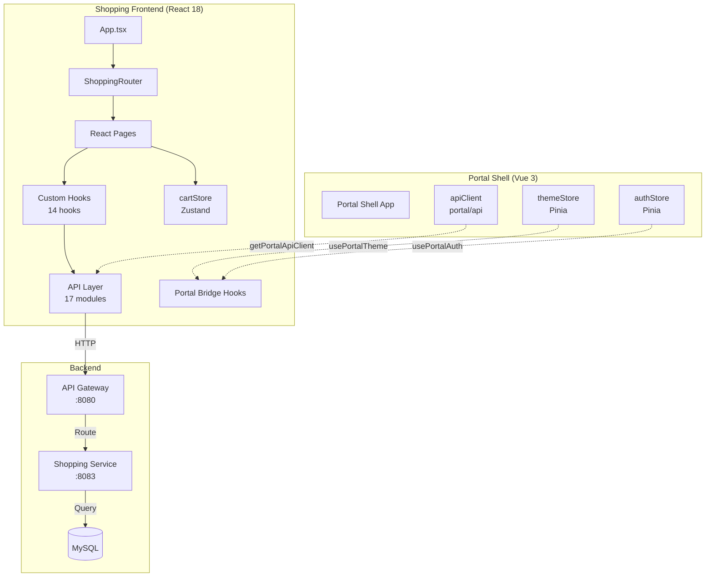
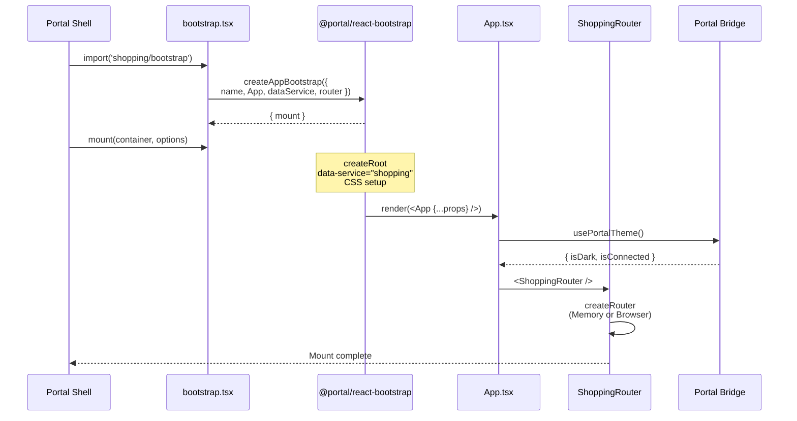
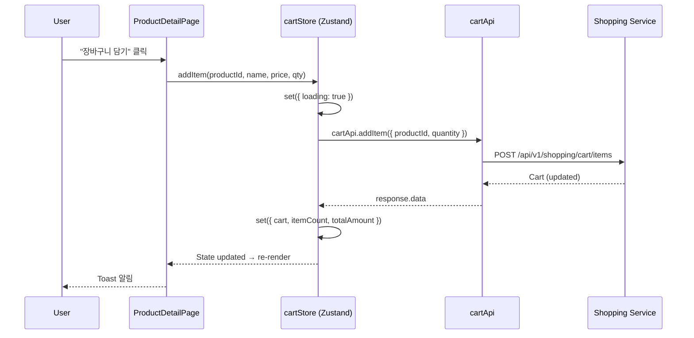
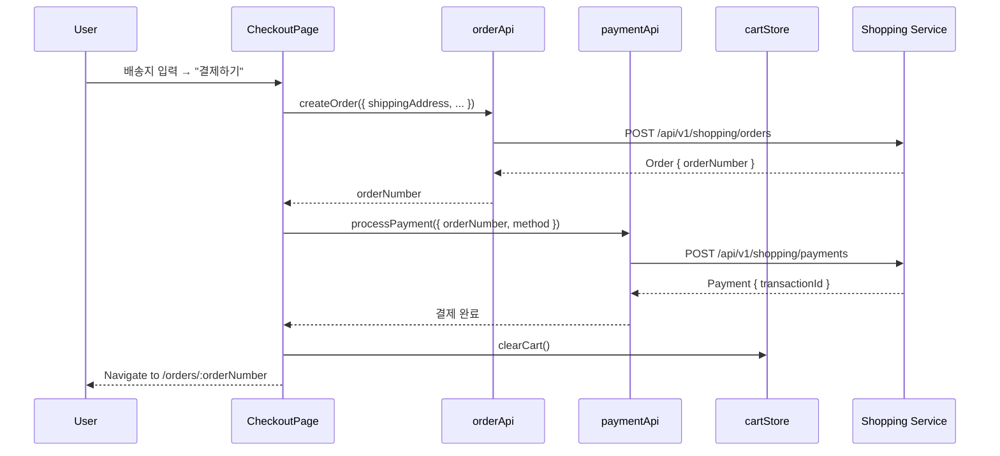
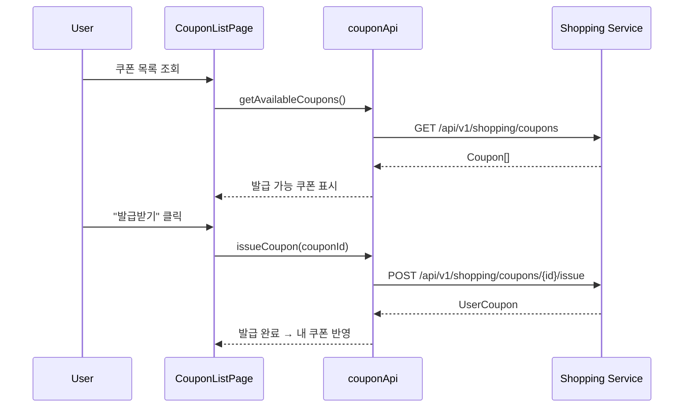
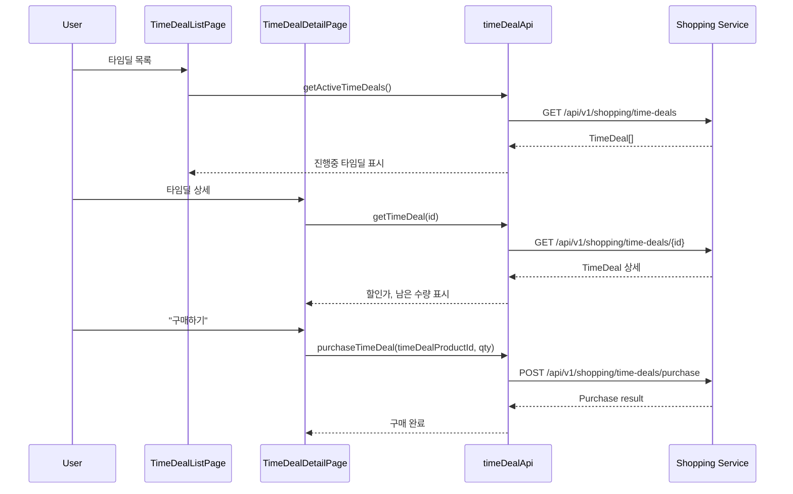
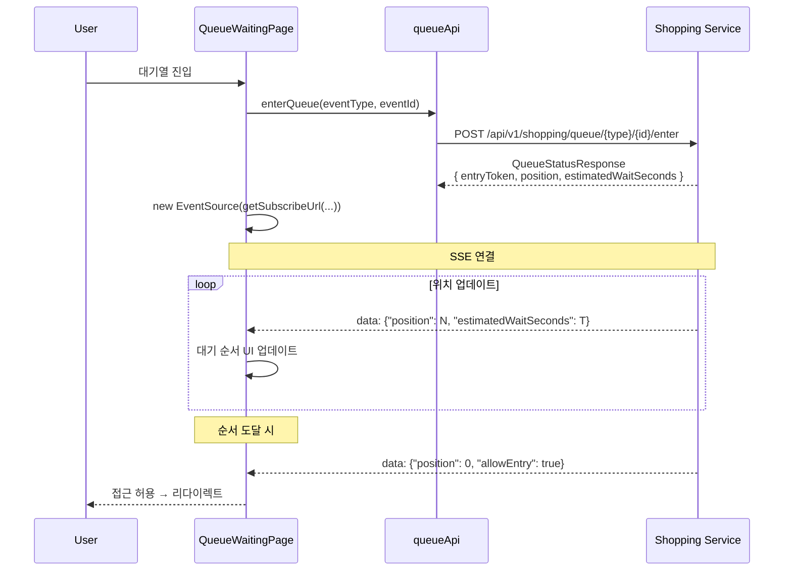

# Shopping Frontend 데이터 흐름 아키텍처

## 📋 개요

Shopping Frontend는 React 18 기반 마이크로서비스로, Module Federation을 통해 Portal Shell에 통합되며 독립 실행(Standalone) 모드도 지원합니다.

### 핵심 특징

- **API Client 통합**: `@portal/react-bridge`의 `getPortalApiClient()`를 통해 Portal Shell의 `portal/api` apiClient 사용
  - Embedded 모드: 토큰 자동 갱신, 401/429 재시도 기능이 포함된 완전한 apiClient
  - Standalone 모드: local axios fallback으로 graceful degradation
- **중앙집중식 API 라우팅**: API Gateway를 통한 `/api/v1/shopping/**` 경로
- **클라이언트 상태 관리**: Zustand cartStore (devtools middleware)
- **Portal 통합**: Portal Bridge hooks (usePortalTheme, usePortalAuth)
- **실시간 통신**: SSE 스트림 (대기열 순서, 재고 변동)

### 기술 스택

| 영역 | 기술 |
|------|------|
| Framework | React 18.3.1 |
| State | Zustand 5.0 |
| Routing | React Router 7.1 |
| HTTP Client | Axios (via portal/api or local) |
| Bridge | @portal/react-bridge, @portal/react-bootstrap |
| Real-time | SSE (EventSource) |
| Styling | Tailwind CSS 4.0 |

---

## 🏗️ 전체 데이터 흐름 아키텍처



### 주요 레이어

1. **Portal Shell Integration Layer**: Module Federation을 통해 apiClient, themeStore, authStore 공유
2. **Application Layer**: App.tsx → Router → Pages
3. **State Management Layer**: Zustand cartStore
4. **API Layer**: 17개 API 모듈 (product, cart, order, payment, coupon, time-deal, queue 등)
5. **Bridge Layer**: Portal Bridge hooks로 Shell과 통신
6. **Backend Layer**: API Gateway → Shopping Service → MySQL

---

## 🚀 앱 마운트 흐름



### 마운트 단계

1. **Bootstrap 로드**: Portal Shell이 `shopping/bootstrap` 모듈 import
2. **Bootstrap 생성**: `createAppBootstrap()`으로 mount 함수 생성
3. **마운트 실행**:
   - React root 생성 (React 18 createRoot API)
   - `data-service="shopping"` 속성 설정 (테마 변수 활성화)
   - CSS 로드 (embedded 모드에서는 조건부)
4. **앱 렌더링**: App.tsx 렌더링
5. **Bridge 연결**: Portal Bridge hooks로 테마/인증 동기화
6. **라우터 초기화**:
   - Embedded: Memory Router (Shell의 라우팅에 통합)
   - Standalone: Browser Router (독립 히스토리)

---

## 🔌 API Client 초기화 흐름

```typescript
// services/api/index.ts - getApiClient()

1. getPortalApiClient() 시도 (@portal/react-bridge)
   ├─ Bridge 준비 완료?
   │  └─ Yes → portal/api의 apiClient 반환
   │           (토큰 갱신, 401/429 재시도 포함)
   └─ Bridge 미준비?
      └─ No → null 반환

2. null이면 getLocalClient() fallback
   └─ local axios 인스턴스 생성 (lazy)
      ├─ Request interceptor:
      │  └─ bridge adapter 또는 window 전역변수에서 토큰 획득
      └─ Response interceptor:
         └─ 401 → window.__PORTAL_ON_AUTH_ERROR__() 호출
```

### API Client 비교

| 항목 | portal/api (Embedded) | local client (Standalone) |
|------|----------------------|--------------------------|
| 토큰 관리 | Portal Shell authStore 연동 | window.__PORTAL_GET_TOKEN__ 또는 localStorage |
| 토큰 갱신 | 자동 갱신 (401 → 재시도) | 수동 갱신 (Shell 콜백 호출) |
| 429 재시도 | 자동 재시도 | 없음 |
| Base URL | Portal Shell 환경 변수 | local .env 설정 |
| 에러 처리 | 통합 에러 핸들링 | 기본 에러 핸들링 |

---

## 📦 상품 조회 흐름

### Custom Hook 패턴

대부분의 API 호출은 custom hook을 통해 이루어집니다.

```typescript
// hooks/useAdminProducts.ts 예시

const [products, setProducts] = useState([])
const [loading, setLoading] = useState(false)
const [error, setError] = useState<string | null>(null)

useEffect(() => {
  fetchProducts()
}, [page, category])

// State + Fetch + Loading + Error 관리
```

### API 호출 플로우

```
Page Component
  └─ Custom Hook (useProducts, useProductDetail 등)
     └─ API Module (productApi.ts)
        └─ getApiClient()
           └─ HTTP Request
              └─ API Gateway (:8080)
                 └─ Shopping Service (:8083)
                    └─ MySQL
```

### 주요 상품 API Hooks

| Hook | 역할 | API Endpoint |
|------|------|--------------|
| `useProducts` | 상품 목록 조회 | GET /products |
| `useProductDetail` | 상품 상세 조회 | GET /products/{id} |
| `useProductSearch` | 상품 검색 | GET /search/products |
| `useInventory` | 재고 조회 | GET /inventory/{productId} |
| `useAdminProducts` | 관리자 상품 관리 | POST/PUT /admin/products |

---

## 🛒 장바구니 흐름 (Zustand cartStore)

### Store 구조

```typescript
interface CartStore {
  // State
  cart: Cart | null
  loading: boolean
  error: string | null
  itemCount: number
  totalAmount: number

  // Actions
  fetchCart: () => Promise<void>
  addItem: (productId, name, price, quantity) => Promise<void>
  updateItemQuantity: (itemId, quantity) => Promise<void>
  removeItem: (itemId) => Promise<void>
  clearCart: () => Promise<void>
  reset: () => void
}
```

### 장바구니 담기 플로우



### 특별 케이스 처리

1. **신규 사용자 (404 응답)**:
   ```typescript
   // fetchCart() 에서
   if (error.response?.status === 404) {
     set({ cart: null, itemCount: 0, totalAmount: 0 })
     return // 에러가 아닌 정상 상태
   }
   ```

2. **수량 업데이트**:
   - 낙관적 업데이트 없음 (서버 응답 후 반영)
   - 재고 부족 시 서버에서 에러 반환

3. **에러 처리**:
   ```typescript
   set({ error: errorMessage, loading: false })
   ```

---

## 💳 주문/결제 흐름



### 주문 생성 단계

1. **장바구니 검증**: 비어있지 않은지, 재고 확인
2. **배송지 입력**: 수령인, 주소, 연락처
3. **주문 생성**: POST /orders → orderNumber 획득
4. **결제 처리**: POST /payments → transactionId 획득
5. **장바구니 초기화**: clearCart()
6. **주문 완료 페이지**: 이동 및 주문 상세 표시

### 주문 취소

```typescript
// orderApi.cancelOrder(orderNumber)
POST /api/v1/shopping/orders/{orderNumber}/cancel

// 조건: 결제 완료 후 24시간 이내, 배송 시작 전
```

---

## 🎟️ 쿠폰 발급/사용 흐름



### 쿠폰 API 엔드포인트

| API | Endpoint | 역할 |
|-----|----------|------|
| getAvailableCoupons | GET /coupons | 발급 가능한 쿠폰 목록 |
| issueCoupon | POST /coupons/{id}/issue | 쿠폰 발급 |
| getMyCoupons | GET /coupons/my | 내 쿠폰 목록 |
| getMyAvailableCoupons | GET /coupons/my/available | 사용 가능한 내 쿠폰 |

### 쿠폰 사용

결제 페이지에서 사용 가능한 쿠폰 조회 → 선택 → 주문 생성 시 couponId 포함

---

## ⏰ 타임딜 구매 흐름



### 타임딜 특징

- **시간 제한**: startTime ~ endTime 범위에서만 활성
- **수량 제한**: 선착순 재고 소진 시 종료
- **할인율**: 정가 대비 할인 가격 적용
- **1인당 제한**: 최대 구매 수량 제한 가능

---

## 🎫 대기열(Queue) SSE 흐름



### SSE 엔드포인트

```
GET /api/v1/shopping/queue/{eventType}/{eventId}/subscribe/{entryToken}
```

### 이벤트 타입

- `TIME_DEAL`: 타임딜 대기열
- `PRE_ORDER`: 선주문 대기열
- Custom event types

### 대기열 상태 체크

```typescript
// queueApi.getQueueStatus(eventType, eventId, entryToken)
GET /api/v1/shopping/queue/{type}/{id}/status?entryToken={token}
```

---

## 📊 재고 스트림(SSE) 흐름

### Hook: useInventoryStream

```typescript
// hooks/useInventoryStream.ts

const useInventoryStream = (productIds: number[]) => {
  const [inventories, setInventories] = useState<Map<number, number>>()

  useEffect(() => {
    const url = inventoryStreamApi.getStreamUrl(productIds)
    const eventSource = new EventSource(url)

    eventSource.onmessage = (event) => {
      const data = JSON.parse(event.data)
      setInventories(prev => new Map(prev).set(data.productId, data.quantity))
    }

    return () => eventSource.close()
  }, [productIds])

  return inventories
}
```

### SSE 엔드포인트

```
GET /api/v1/shopping/inventory/stream?productIds=1&productIds=2&productIds=3
```

### 사용 사례

1. **상품 목록**: 여러 상품의 실시간 재고 표시
2. **상품 상세**: 단일 상품의 재고 변동 감지
3. **관리자 대시보드**: 전체 재고 모니터링

---

## 🎨 테마/인증 동기화 (Portal Bridge)

### 테마 동기화

```typescript
// App.tsx
import { usePortalTheme } from '@portal/react-bridge'

const App = ({ isEmbedded, initialTheme }) => {
  const [theme, setTheme] = useState(initialTheme || 'light')
  const portalTheme = usePortalTheme()

  // Embedded 모드에서는 Portal Shell의 테마 우선
  const isDark = isEmbedded && portalTheme.isConnected
    ? portalTheme.isDark
    : theme === 'dark'

  useEffect(() => {
    document.documentElement.classList.toggle('dark', isDark)
    document.documentElement.setAttribute('data-theme', isDark ? 'dark' : 'light')
  }, [isDark])

  return (
    <ThemeContext.Provider value={{ theme, setTheme, isDark }}>
      {/* ... */}
    </ThemeContext.Provider>
  )
}
```

### 인증 동기화

```typescript
// components/RequireRole.tsx
import { usePortalAuth } from '@portal/react-bridge'

const RequireRole = ({ roles, children }) => {
  const { roles: userRolesRaw } = usePortalAuth()

  // 역할 정규화 (ROLE_ 접두사 제거)
  const userRoles = userRolesRaw.map(r =>
    r.replace(/^ROLE_/, '').toLowerCase()
  )

  const hasRequiredRole = roles.some(r => userRoles.includes(r))

  if (!hasRequiredRole) {
    return <Navigate to="/access-denied" replace />
  }

  return <>{children}</>
}
```

### Bridge 연결 상태

```typescript
// Portal Bridge가 준비되지 않은 경우
portalTheme.isConnected === false
// → Standalone 모드 또는 Shell 마운트 전

// Bridge 연결 완료
portalTheme.isConnected === true
// → Portal Shell과 정상 통신
```

---

## ⚠️ 에러 처리 패턴

### API Client 레벨

#### portal/api (Embedded)

```typescript
// 401 Unauthorized → 토큰 갱신 후 재시도
// 429 Too Many Requests → 지연 후 재시도
// 자동 처리, 애플리케이션 코드에서 신경 쓸 필요 없음
```

#### local client (Standalone)

```typescript
// Response interceptor
response => response,
error => {
  if (error.response?.status === 401) {
    window.__PORTAL_ON_AUTH_ERROR__?.()
  }

  // API 응답에서 error.message 추출
  const apiError = error.response?.data?.error?.message
  if (apiError) {
    error.message = apiError
  }

  throw error
}
```

### Zustand Store 레벨

```typescript
// cartStore.addItem 예시
addItem: async (productId, name, price, quantity) => {
  set({ loading: true, error: null })
  try {
    const response = await cartApi.addItem({ productId, quantity })
    set({
      cart: response,
      itemCount: response.items.length,
      totalAmount: response.totalAmount,
      loading: false
    })
  } catch (error) {
    set({
      error: error instanceof Error ? error.message : 'Failed to add item',
      loading: false
    })
  }
}
```

### 특별 케이스: 404 처리

```typescript
// cartStore.fetchCart
try {
  const cart = await cartApi.getCart()
  set({ cart, itemCount: cart.items.length, totalAmount: cart.totalAmount })
} catch (error) {
  // 신규 사용자: 장바구니 없음 → 정상 상태
  if (axios.isAxiosError(error) && error.response?.status === 404) {
    set({ cart: null, itemCount: 0, totalAmount: 0, error: null })
    return
  }

  // 그 외 에러는 에러 상태로 설정
  set({ error: error.message })
}
```

### UI 레벨

```typescript
// Page Component
const { error } = useCartStore()

if (error) {
  return <ErrorMessage message={error} />
}
```

---

## 🔗 API 엔드포인트 요약

모든 엔드포인트는 `/api/v1/shopping` 접두사를 가집니다.

### 상품 관련

| API Module | 주요 Endpoints | 역할 |
|-----------|---------------|------|
| productApi | GET /products<br/>GET /products/{id}<br/>GET /search/products | 상품 목록/상세/검색 |
| inventoryApi | GET /inventory/{productId}<br/>POST /inventory/batch | 재고 조회 (단일/배치) |
| inventoryStreamApi | SSE /inventory/stream | 실시간 재고 변동 |
| productReviewApi | GET /products/{id}/with-reviews | 상품 + 리뷰 통합 조회 |
| stockMovementApi | GET /inventory/{productId}/movements | 재고 입출고 내역 |

### 장바구니/주문

| API Module | 주요 Endpoints | 역할 |
|-----------|---------------|------|
| cartApi | GET /cart<br/>POST /cart/items<br/>PUT /cart/items/{id}<br/>DELETE /cart/items/{id} | 장바구니 CRUD |
| orderApi | GET /orders<br/>GET /orders/{orderNumber}<br/>POST /orders<br/>POST /orders/{orderNumber}/cancel | 주문 조회/생성/취소 |
| paymentApi | GET /payments/{orderNumber}<br/>POST /payments<br/>POST /payments/{orderNumber}/cancel | 결제 조회/처리/취소 |
| deliveryApi | GET /deliveries/order/{orderNumber}<br/>GET /deliveries/{trackingNumber} | 배송 조회 |

### 프로모션

| API Module | 주요 Endpoints | 역할 |
|-----------|---------------|------|
| couponApi | GET /coupons<br/>POST /coupons/{id}/issue<br/>GET /coupons/my<br/>GET /coupons/my/available | 쿠폰 조회/발급 |
| timeDealApi | GET /time-deals<br/>GET /time-deals/{id}<br/>POST /time-deals/purchase | 타임딜 조회/구매 |
| queueApi | POST /queue/{type}/{id}/enter<br/>GET /queue/{type}/{id}/status<br/>SSE /queue/{type}/{id}/subscribe/{token} | 대기열 진입/조회/구독 |

### 검색

| API Module | 주요 Endpoints | 역할 |
|-----------|---------------|------|
| searchApi | GET /search/suggest<br/>GET /search/popular<br/>GET /search/recent | 검색어 제안/인기/최근 |

### 관리자

| API Module | 주요 Endpoints | 역할 |
|-----------|---------------|------|
| adminProductApi | POST /admin/products<br/>PUT /admin/products/{id}<br/>PATCH /admin/products/{id}/stock | 상품 생성/수정/재고 조정 |
| adminCouponApi | GET /admin/coupons<br/>POST /admin/coupons<br/>DELETE /admin/coupons/{id} | 쿠폰 관리 |
| adminTimeDealApi | GET /admin/time-deals<br/>POST /admin/time-deals<br/>DELETE /admin/time-deals/{id} | 타임딜 관리 |
| adminOrderApi | GET /admin/orders<br/>PUT /admin/orders/{orderNumber}/status | 주문 관리 |
| adminQueueApi | POST /admin/queue/{type}/{id}/activate<br/>POST /admin/queue/{type}/{id}/deactivate<br/>POST /admin/queue/{type}/{id}/process | 대기열 관리 |
| adminPaymentApi | POST /payments/{paymentNumber}/refund | 결제 환불 |

---

## 📚 관련 문서

- [System Overview](./system-overview.md) - Shopping Frontend 시스템 개요
- [Module Federation](./module-federation.md) - Module Federation 통합 구조
- [API 명세](../../api/shopping-service/shopping-api.md) - Shopping Service REST API
- [Portal Bridge 가이드](../../guides/portal-bridge.md) - Portal Bridge 사용 가이드
