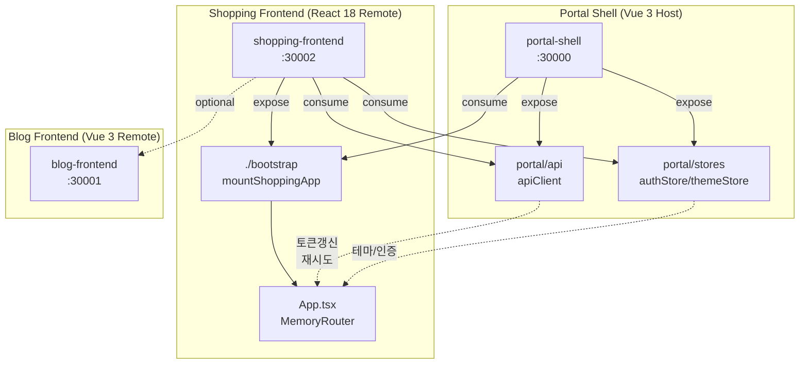
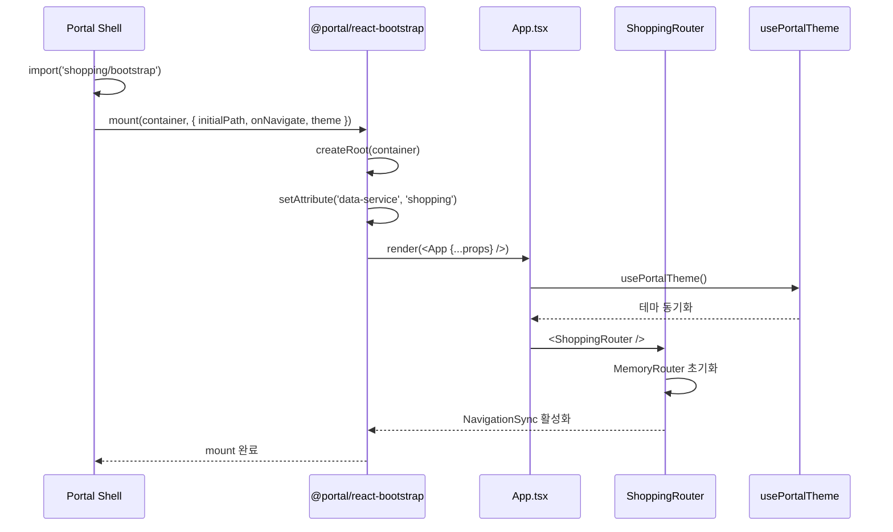
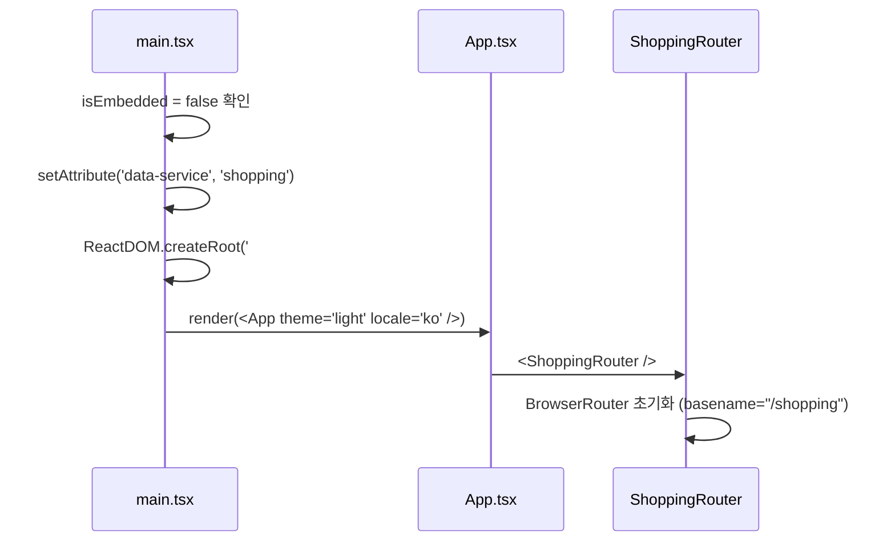
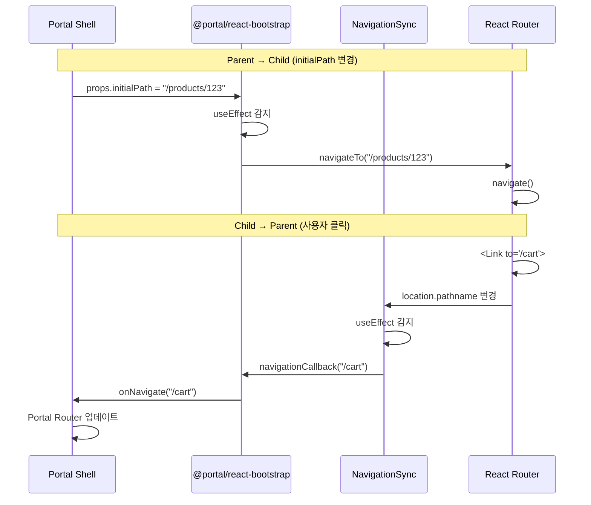

# Shopping Frontend Module Federation 설정

## 📋 개요

Shopping Frontend는 **Module Federation**([@originjs/vite-plugin-federation](https://github.com/originjs/vite-plugin-federation))을 통해 Portal Shell(Host)에 동적으로 로드되는 **React 18 Remote 모듈**입니다.

### 아키텍처 개요



## ⚙️ Vite Federation 설정

### `vite.config.ts`

```typescript
import { defineConfig, loadEnv } from 'vite'
import react from '@vitejs/plugin-react'
import federation from '@originjs/vite-plugin-federation'

export default defineConfig(({ mode }) => {
  const env = loadEnv(mode, process.cwd(), '')

  return {
    base: env.VITE_BASE_URL || '/',
    plugins: [
      react(),
      federation({
        name: 'shopping-frontend',
        filename: 'remoteEntry.js',
        remotes: {
          portal: env.VITE_PORTAL_SHELL_REMOTE_URL ||
                  'http://localhost:30000/assets/shellEntry.js',
          blog: env.VITE_BLOG_REMOTE_URL ||
                'http://localhost:30001/assets/remoteEntry.js',
          shopping: env.VITE_SHOPPING_REMOTE_URL ||
                    'http://localhost:30002/assets/remoteEntry.js',
        },
        exposes: {
          './bootstrap': './src/bootstrap.tsx'
        },
        shared: [
          'react',
          'react-dom',
          'react-dom/client',  // ⚠️ 필수! 누락 시 Error #321
          'axios',
        ],
      }),
    ],
  }
})
```

### 주요 속성

| 속성 | 값 | 설명 |
|------|-----|------|
| `name` | `shopping-frontend` | Remote 모듈 이름 |
| `filename` | `remoteEntry.js` | Federation 진입점 파일명 |
| `base` | `VITE_BASE_URL` | Chunk 로드 기준 URL (code-splitting 필수) |
| `exposes` | `./bootstrap` | 내보내는 모듈 (mount 함수) |
| `remotes` | `portal`, `blog`, `shopping` | 외부 Remote 참조 |
| `shared` | 4개 라이브러리 | Host와 공유하는 의존성 |

## 🌐 환경 변수

### `.env.dev` (Local)

```env
VITE_PORTAL_SHELL_REMOTE_URL=http://localhost:30000/assets/shellEntry.js
VITE_BLOG_REMOTE_URL=http://localhost:30001/assets/remoteEntry.js
VITE_SHOPPING_REMOTE_URL=http://localhost:30002/assets/remoteEntry.js
VITE_BASE_URL=http://localhost:30002/
```

### `.env.docker`

```env
VITE_PORTAL_SHELL_REMOTE_URL=http://portal-shell:8080/assets/shellEntry.js
VITE_BLOG_REMOTE_URL=http://blog-frontend:8080/assets/remoteEntry.js
VITE_SHOPPING_REMOTE_URL=http://shopping-frontend:8080/assets/remoteEntry.js
VITE_BASE_URL=http://shopping-frontend:8080/
```

### `.env.k8s` (Kubernetes)

```env
VITE_PORTAL_SHELL_REMOTE_URL=https://portal-universe/assets/shellEntry.js
VITE_BLOG_REMOTE_URL=https://blog.portal-universe/assets/remoteEntry.js
VITE_SHOPPING_REMOTE_URL=https://shopping.portal-universe/assets/remoteEntry.js
VITE_BASE_URL=https://shopping.portal-universe/
```

### 주의사항

- **`VITE_BASE_URL`은 필수**: Shopping Frontend는 React lazy() + code-splitting을 사용하므로 chunk 로드 시 올바른 base URL 필요
- Blog Frontend는 단일 번들이라 불필요하지만, Shopping은 다중 chunk 생성으로 필수

## 📦 Build Output

```
dist/
├── remoteEntry.js                    # Federation 진입점
├── assets/
│   ├── __federation_expose_*         # 내보낸 모듈 (./bootstrap)
│   ├── __federation_shared_*         # 공유 모듈 (react, react-dom, axios)
│   ├── __federation_fn_import.js     # Federation 런타임
│   ├── bootstrap-*.js                # 앱 번들 (code-split chunks)
│   ├── index-*.js
│   └── *.css                         # 스타일시트
└── index.html                        # Standalone 진입점
```

### 빌드 명령어

| 명령어 | 환경 | 설명 |
|--------|------|------|
| `npm run dev` | Local | Vite watch + preview (:30002) |
| `npm run build:docker` | Docker | `.env.docker` 기반 빌드 |
| `npm run build:k8s` | K8s | `.env.k8s` 기반 빌드 |

## 🔗 Shared Dependencies

```typescript
shared: [
  'react',
  'react-dom',
  'react-dom/client',
  'axios',
]
```

| 라이브러리 | 이유 | 누락 시 문제 |
|-----------|------|------------|
| `react` | 단일 React 인스턴스 보장 | **Error #525**: 심볼 불일치 |
| `react-dom` | ReactDOM 공유 | 컴포넌트 렌더링 실패 |
| `react-dom/client` | `createRoot` API 공유 | **Error #321**: 로컬 React 인스턴스 생성 |
| `axios` | Portal Shell의 apiClient 인터셉터 공유 | 토큰 갱신/재시도 미작동 |

### ⚠️ 중요: React 버전 통일

**문제**: 모노레포에서 여러 React 버전이 설치되면 JSX 심볼 불일치로 Error #525 발생
**해결**: `frontend/package.json`에 `overrides` 설정

```json
{
  "overrides": {
    "react": "18.3.1",
    "react-dom": "18.3.1"
  }
}
```

**검증**:
```bash
npm ls react
# 단일 버전(18.3.1)만 표시되어야 함
```

### ⚠️ 중요: `react-dom/client` 누락 방지

**문제**: `react-dom/client`는 `react-dom`과 **별도 import specifier**
**결과**: shared에 누락 시 로컬 번들에 별도 React 인스턴스 포함 → Error #321

```typescript
// ❌ 잘못된 설정
shared: ['react', 'react-dom']  // react-dom/client 누락!

// ✅ 올바른 설정
shared: ['react', 'react-dom', 'react-dom/client']
```

## 📤 Exposed Modules

### `./bootstrap` → `mountShoppingApp`

```typescript
// src/bootstrap.tsx
import { createAppBootstrap } from '@portal/react-bootstrap'
import App from './App'
import { navigateTo, resetRouter, setAppActive } from './router'

const { mount } = createAppBootstrap({
  name: 'shopping',
  App,
  dataService: 'shopping',
  router: { navigateTo, resetRouter, setAppActive },
})

export { mount }
export const mountShoppingApp = mount  // 별칭
```

### `@portal/react-bootstrap`이 처리하는 것

| 기능 | 설명 |
|------|------|
| React Root 생성 | `createRoot(container).render(<App />)` |
| data-service 속성 | `document.documentElement.setAttribute('data-service', 'shopping')` |
| CSS 클린업 | unmount 시 `[data-service="shopping"]` 포함 style 제거 |
| 테마/인증 props | `theme`, `locale`, `userRole` 전달 |
| Keep-Alive 콜백 | `onActivated`, `onDeactivated` 호출 |
| Navigation Sync | `initialPath` → `router.navigate()` |

## 📥 Consumed Remotes

### Portal Shell (Host)

| 모듈 | 타입 | 용도 |
|------|------|------|
| `portal/api` | `apiClient` | 토큰 갱신, 401/429 재시도, HTTP 요청 |
| `portal/stores` | `authStore`, `themeStore` | Pinia 스토어 (Vue → React 브릿지) |

### 접근 방식

`@portal/react-bridge`가 `import('portal/api')`, `import('portal/stores')`를 **간접 호출**하고 캐싱:

```typescript
// @portal/react-bridge/api-registry.ts
export async function initPortalApi() {
  try {
    const portalApi = await import('portal/api')
    cachedApiClient = portalApi.apiClient
  } catch (e) {
    console.warn('[react-bridge] portal/api 로드 실패 (Standalone 모드)', e)
    // ⚠️ throw 금지! Standalone 모드에서는 정상 동작
  }
}

export function getPortalApiClient() {
  return cachedApiClient || null  // null → local fallback 사용
}
```

### Blog Frontend (Optional)

```typescript
remotes: {
  blog: 'http://localhost:30001/assets/remoteEntry.js'
}

// 사용 예: 블로그 연동 시
const blogBootstrap = await import('blog/bootstrap')
```

## 🔀 Embedded vs Standalone 모드

### 모드 감지

```typescript
// src/utils/portal-env.ts
export const isEmbedded = !!window.__POWERED_BY_PORTAL_SHELL__
```

### 차이점

| 구분 | Embedded | Standalone |
|------|----------|------------|
| 감지 플래그 | `window.__POWERED_BY_PORTAL_SHELL__ === true` | `undefined` |
| 진입점 | `bootstrap.tsx` → `mount()` | `main.tsx` → `ReactDOM.createRoot()` |
| 라우터 | `MemoryRouter` | `BrowserRouter` (basename="/shopping") |
| API Client | `portal/api` (완전판) | local axios fallback |
| 테마 | `usePortalTheme()` (Portal 동기화) | `props.theme` |
| 인증 | `usePortalAuth()` (Portal 동기화) | `props.userRole` |
| Header/Footer | 숨김 (Portal Shell 제공) | 자체 표시 |
| data-service | `@portal/react-bootstrap`이 설정 | `main.tsx`가 설정 |

### Embedded 마운트

```typescript
// Portal Shell → Shopping Frontend
const shopBootstrap = await import('shopping/bootstrap')
shopBootstrap.mount(container, {
  initialPath: '/products',
  onNavigate: (path) => { /* Portal Shell 라우터 업데이트 */ },
  theme: 'dark',
  locale: 'ko',
  userRole: 'user'
})
```

### Standalone 마운트

```typescript
// src/main.tsx
if (!isEmbedded) {
  document.documentElement.setAttribute('data-service', 'shopping')
  ReactDOM.createRoot(document.getElementById('root')!).render(
    <App theme="light" locale="ko" userRole="guest" />
  )
}
```

## 🚀 Bootstrap 메커니즘 상세

### Embedded 마운트 시퀀스



### Standalone 마운트 시퀀스



## 🧭 Navigation Sync 패턴

### 양방향 통신



### Parent → Child (Portal Shell → Shopping)

```typescript
// @portal/react-bootstrap/index.tsx
useEffect(() => {
  if (props.initialPath && props.initialPath !== prevPath) {
    router.navigateTo(props.initialPath)
    prevPath = props.initialPath
  }
}, [props.initialPath])
```

```typescript
// src/router/index.tsx
export const navigateTo = (path: string) => {
  routerInstance?.navigate(path)
}
```

### Child → Parent (Shopping → Portal Shell)

```typescript
// src/components/NavigationSync.tsx
const NavigationSync: React.FC = () => {
  const location = useLocation()

  useEffect(() => {
    if (isAppActive && prevPath !== location.pathname) {
      navigationCallback?.(location.pathname)
      prevPath = location.pathname
    }
  }, [location.pathname])

  return null
}
```

### Keep-Alive 지원

```typescript
// src/router/index.tsx
let isAppActive = true

export const setAppActive = (active: boolean) => {
  isAppActive = active
  if (active) {
    // 재활성화 시 data-service 복원
    document.documentElement.setAttribute('data-service', 'shopping')
  }
}
```

**동작**:
- `setAppActive(false)`: NavigationSync가 콜백 호출 스킵
- `setAppActive(true)`: data-service 복원, 콜백 재활성화

## 🎨 CSS 격리

### Shopping 전용 스타일 범위

```css
/* 기본 스타일 */
[data-service="shopping"] {
  --shopping-primary: #10b981;
  --shopping-secondary: #3b82f6;
}

/* 다크 테마 */
[data-service="shopping"][data-theme="dark"] {
  --shopping-primary: #34d399;
  --shopping-secondary: #60a5fa;
}

/* 컴포넌트 스타일 */
[data-service="shopping"] .product-card {
  border: 1px solid var(--shopping-primary);
}
```

### 클린업 (unmount 시)

`@portal/react-bootstrap`이 자동 처리:

```typescript
// @portal/react-bootstrap/index.tsx
return () => {
  reactRoot?.unmount()

  // data-service="shopping" 포함 style 태그 제거
  document.querySelectorAll('style[data-service="shopping"]').forEach(el => el.remove())

  // data-service 속성 제거
  if (document.documentElement.getAttribute('data-service') === 'shopping') {
    document.documentElement.removeAttribute('data-service')
  }
}
```

## 🏗️ 환경별 빌드

### Dev 모드 (Local)

```bash
npm run dev
# concurrently "vite build --watch --mode dev" "vite preview --port 30002"
```

```env
# .env.dev
VITE_PORTAL_SHELL_REMOTE_URL=http://localhost:30000/assets/shellEntry.js
VITE_BASE_URL=http://localhost:30002/
```

**특징**:
- Hot Module Replacement (HMR)
- Watch 모드 + Preview 서버
- Standalone 테스트 가능

### Docker 모드

```bash
npm run build:docker
# vite build --mode docker
```

```env
# .env.docker
VITE_PORTAL_SHELL_REMOTE_URL=http://portal-shell:8080/assets/shellEntry.js
VITE_BASE_URL=http://shopping-frontend:8080/
```

**특징**:
- 컨테이너 간 네트워크 (서비스명)
- Nginx 서빙 (port 8080)

### Kubernetes 모드

```bash
npm run build:k8s
# vite build --mode k8s
```

```env
# .env.k8s
VITE_PORTAL_SHELL_REMOTE_URL=https://portal-universe/assets/shellEntry.js
VITE_BASE_URL=https://shopping.portal-universe/
```

**특징**:
- Ingress 기반 라우팅
- HTTPS 필수
- 서브도메인 분리

## 🔧 트러블슈팅

### Error #321: Invalid hook call

**증상**:
```
Error: Invalid hook call. Hooks can only be called inside the body of a function component.
```

**원인**: `react-dom/client`가 shared에 누락되어 로컬 번들에 별도 React 인스턴스 포함

**해결**:
```typescript
// vite.config.ts
shared: [
  'react',
  'react-dom',
  'react-dom/client',  // ✅ 추가!
  'axios',
]
```

**검증**:
```bash
grep "importShared('react-dom/client')" dist/assets/__federation_expose_*.js
# 출력이 있으면 OK
```

**관련 문서**: [TS-20260129-005: React Error #321](../../../troubleshooting/2026/01/TS-20260129-005-react-error-321-module-federation.md)

---

### Error #525: Objects are not valid as a React child

**증상**:
```
Error: Objects are not valid as a React child (found: object with keys {$$typeof, ...})
```

**원인**: React 18과 19의 JSX 심볼 불일치 (`react.element` vs `react.transitional.element`)

**진단**:
```bash
npm ls react
# 여러 버전이 표시되면 문제!
```

**해결**:
```json
// frontend/package.json
{
  "overrides": {
    "react": "18.3.1",
    "react-dom": "18.3.1"
  }
}
```

```bash
rm -rf node_modules package-lock.json
npm install
npm ls react  # 단일 버전 확인
```

---

### "Cannot find module 'portal/api'"

**증상**:
```
Error: Cannot find module 'portal/api'
```

**원인**: Portal Shell이 아직 로드되지 않음 (Standalone 모드)

**해결**: 에러 아님! `@portal/react-bridge`의 정상 동작

```typescript
// @portal/react-bridge/api-registry.ts
export function getPortalApiClient() {
  return cachedApiClient || null  // null → local fallback 사용
}
```

**Standalone 모드에서는**:
1. `initPortalApi()` → `portal/api` 로드 실패 (warn만 출력)
2. `getPortalApiClient()` → `null` 반환
3. 앱에서 local axios fallback 사용

---

### remoteEntry.js 404

**증상**:
```
GET http://localhost:30002/assets/remoteEntry.js 404 (Not Found)
```

**원인**:
1. Shopping Frontend 서버가 실행되지 않음
2. `.env` 파일의 URL 불일치

**해결**:
```bash
# 1. Shopping Frontend 실행 확인
cd frontend/shopping-frontend
npm run dev

# 2. URL 확인
cat .env.dev | grep VITE_SHOPPING_REMOTE_URL
# http://localhost:30002/assets/remoteEntry.js

# 3. 빌드 파일 존재 확인
ls dist/assets/remoteEntry.js
```

---

### base URL 미설정으로 chunk 로드 실패

**증상**:
```
GET http://localhost:30000/assets/bootstrap-abc123.js 404 (Not Found)
```

**원인**: code-splitting된 chunk가 Host URL(30000)에서 로드 시도

**진단**:
- Shopping Frontend는 React `lazy()` + code-splitting 사용
- Blog Frontend는 단일 번들이라 문제 없음

**해결**:
```env
# .env.dev
VITE_BASE_URL=http://localhost:30002/  # ✅ Remote 서버 URL
```

```typescript
// vite.config.ts
export default defineConfig(({ mode }) => {
  const env = loadEnv(mode, process.cwd(), '')
  return {
    base: env.VITE_BASE_URL || '/',  // ✅ 명시적 설정
    // ...
  }
})
```

---

### Portal Shell과 통신 안 됨

**증상**: 테마 변경, 인증 상태 동기화 안 됨

**원인**:
1. `window.__POWERED_BY_PORTAL_SHELL__` 미설정
2. `@portal/react-bridge` 초기화 실패

**해결**:
```typescript
// App.tsx
useEffect(() => {
  console.log('Embedded:', isEmbedded)
  console.log('Portal Shell:', window.__POWERED_BY_PORTAL_SHELL__)

  if (isEmbedded) {
    const apiClient = getPortalApiClient()
    console.log('API Client:', apiClient ? 'OK' : 'NULL')
  }
}, [])
```

**체크리스트**:
- [ ] Portal Shell이 먼저 로드되었는가?
- [ ] `portal/api`, `portal/stores`가 expose되었는가?
- [ ] `@portal/react-bridge`가 설치되었는가?
- [ ] `initPortalApi()`가 호출되었는가?

## ✅ 빌드 검증

### 1. Federation Expose 확인

```bash
# react-dom/client가 importShared로 처리되는지 확인
grep "importShared('react-dom/client')" dist/assets/__federation_expose_*.js

# 예상 출력:
# const __vite__mapDep=(i,m=__vite__mapDep.m)=>m[i]; const react_dom_client=await importShared('react-dom/client');
```

출력이 **있으면** ✅, **없으면** ❌ (shared 누락)

### 2. React 버전 통일 확인

```bash
npm ls react
```

**✅ 올바른 출력**:
```
portal-universe@1.0.0 /Users/laze/Laze/Project/portal-universe/frontend
└── react@18.3.1
```

**❌ 잘못된 출력** (여러 버전):
```
portal-universe@1.0.0 /Users/laze/Laze/Project/portal-universe/frontend
├── react@19.0.0
└─┬ design-system-react@1.0.0
  └── react@18.3.1
```

### 3. remoteEntry.js 생성 확인

```bash
ls -lh dist/assets/remoteEntry.js
# -rw-r--r--  1 user  staff    15K Feb  6 10:00 dist/assets/remoteEntry.js
```

### 4. Shared Dependencies 확인

```bash
ls dist/assets/__federation_shared_*.js
```

예상 파일:
- `__federation_shared_react-*.js`
- `__federation_shared_react-dom-*.js`
- `__federation_shared_axios-*.js`

### 5. 런타임 테스트

```bash
# Dev 모드 실행
npm run dev

# 브라우저 콘솔 확인
# http://localhost:30002

# 1. Standalone 모드
console.log(window.__POWERED_BY_PORTAL_SHELL__)  // undefined

# 2. Embedded 모드 (Portal Shell에서 로드 시)
console.log(window.__POWERED_BY_PORTAL_SHELL__)  // true
```

## 📚 관련 문서

### 아키텍처

- [README](./README.md) - Shopping Frontend 개요
- [System Overview](./system-overview.md) - 시스템 구조
- [Data Flow](./data-flow.md) - 데이터 흐름

### 트러블슈팅

- [TS-20260129-005: React Error #321 Module Federation](../../../troubleshooting/2026/01/TS-20260129-005-react-error-321-module-federation.md)
- [TS-20260117-001: React Error #31 Module Federation](../../../troubleshooting/2026/01/TS-20260117-001-react-module-federation.md)

### 패키지

- [@portal/react-bootstrap](../../../packages/react-bootstrap/README.md) - Bootstrap 로직
- [@portal/react-bridge](../../../packages/react-bridge/README.md) - Portal API/Stores 브릿지

### 설정 파일

- [vite.config.ts](../../../frontend/shopping-frontend/vite.config.ts) - Vite Federation 설정
- [.env.dev](../../../frontend/shopping-frontend/.env.dev) - Dev 환경 변수
- [tsconfig.json](../../../frontend/shopping-frontend/tsconfig.json) - TypeScript 설정
