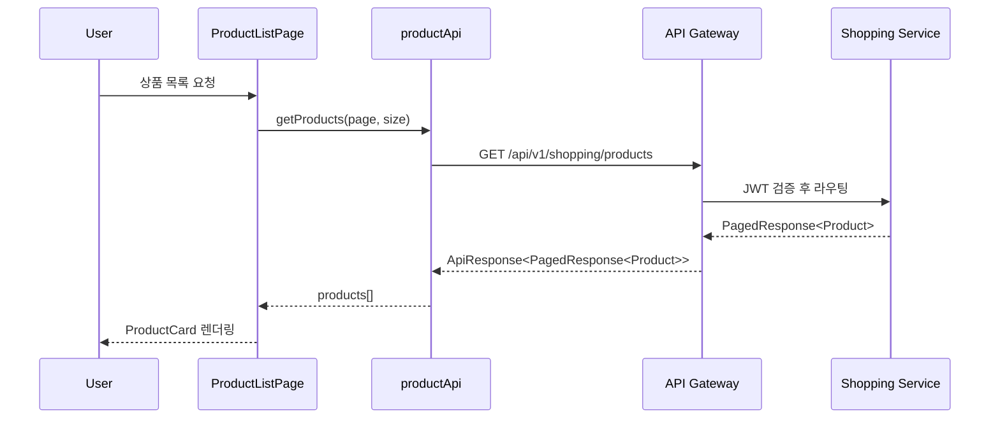
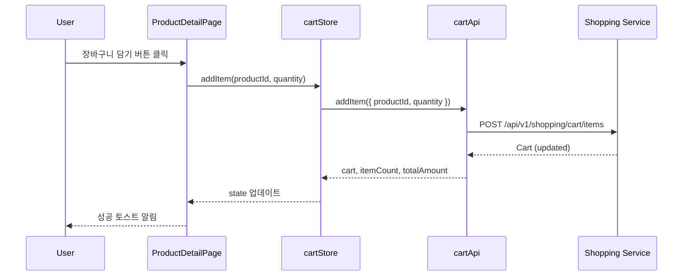
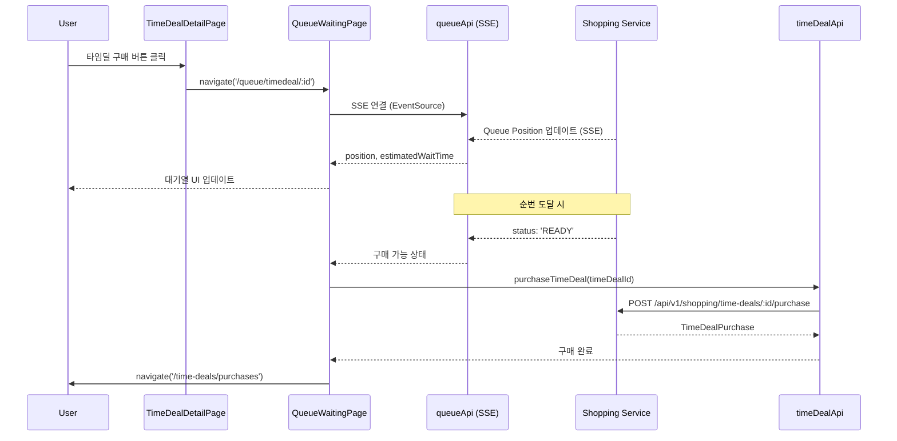
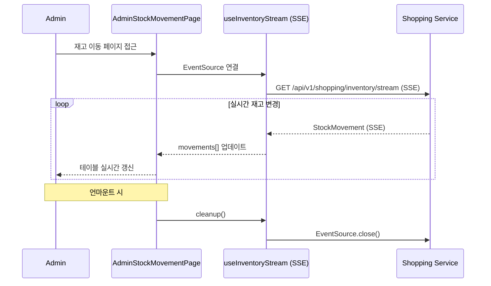

# Shopping Frontend System Overview

## 📋 개요

Shopping Frontend는 Portal Universe의 이커머스 마이크로 프론트엔드입니다. React 18 기반으로 구축되었으며, Module Federation을 통해 Portal Shell(Vue 3 Host)에 동적으로 통합됩니다.

### 핵심 역할

- **상품 관리**: 조회, 검색, 상세 정보
- **장바구니**: 실시간 장바구니 관리
- **주문/결제**: 체크아웃, 주문 내역, 결제 처리
- **쿠폰 시스템**: 쿠폰 발급, 조회, 사용
- **타임딜**: 한정 수량 특가 상품 판매
- **대기열(Queue)**: 트래픽 폭주 시 대기열 관리
- **배송 추적**: 실시간 배송 상태 조회
- **재고 모니터링**: SSE 기반 실시간 재고 스트림
- **관리자 대시보드**: RBAC 기반 상품/주문/쿠폰/타임딜/배송/재고/대기열 관리

---

## 🎯 핵심 특징

- **React 18 Functional Components + Hooks**: 최신 React 패턴
- **Module Federation Remote**: Portal Shell 런타임 통합
- **Dual Mode 지원**: Embedded(Portal) / Standalone(독립) 실행
- **Zustand 상태 관리**: cartStore + Portal Bridge hooks (auth, theme)
- **@portal/react-bootstrap**: createAppBootstrap으로 부트스트랩 간소화 (287줄 → 25줄, 91% 감소)
- **@portal/react-bridge**: api-registry가 `portal/api` → local fallback 처리
- **React Router v7**: Code Splitting으로 23개 페이지 Lazy Loading
- **RBAC 가드**: RequireAuth + RequireRole로 Admin 페이지 보호
- **SSE 스트리밍**: 대기열 구독, 재고 실시간 업데이트
- **테마 동기화**: `data-service="shopping"` + `data-theme="dark"` CSS 격리
- **타입 안정성**: TypeScript 5.9 + Zod 스키마 검증

---

## 🏗️ High-Level Architecture

```mermaid
graph TB
    subgraph Portal Shell [Portal Shell - Vue 3 Host :30000]
        PS[Portal App]
        TS[themeStore - Pinia]
        AS[authStore - Pinia]
        AC[apiClient - Axios]
    end

    subgraph Shopping Frontend [Shopping Frontend - React 18 Remote :30002]
        BS[bootstrap.tsx]
        APP[App.tsx]
        RT[ShoppingRouter]
        CS[cartStore - Zustand]
        PBH[Portal Bridge Hooks]
        API[API Layer]
        EB[ErrorBoundary]
        TC[ToastContainer]

        subgraph Public Pages
            PL[ProductListPage]
            PD[ProductDetailPage]
            CP[CartPage]
            CK[CheckoutPage]
            OL[OrderListPage]
            OD[OrderDetailPage]
            CL[CouponListPage]
            TDL[TimeDealListPage]
            TDD[TimeDealDetailPage]
            TDP[TimeDealPurchasesPage]
            QW[QueueWaitingPage]
        end

        subgraph Admin Pages
            AL[AdminLayout]
            APL[AdminProductListPage]
            APF[AdminProductFormPage]
            ACL[AdminCouponListPage]
            ACF[AdminCouponFormPage]
            ATL[AdminTimeDealListPage]
            ATF[AdminTimeDealFormPage]
            AOL[AdminOrderListPage]
            AOD[AdminOrderDetailPage]
            ADP[AdminDeliveryPage]
            ASM[AdminStockMovementPage]
            AQP[AdminQueuePage]
        end
    end

    subgraph Backend
        GW[API Gateway :8080]
        SS[Shopping Service :8083]
    end

    PS -->|Module Federation| BS
    BS -->|createAppBootstrap| APP
    APP --> RT
    RT --> Public Pages
    RT --> Admin Pages

    TS -.->|usePortalTheme| PBH
    AS -.->|usePortalAuth| PBH
    AC -.->|getPortalApiClient| API

    Pages --> CS
    Pages --> API

    API -->|HTTP| GW
    GW -->|Route| SS
```

---

## 🎨 기술 스택

### Core

| 항목 | 기술 | 버전 | 비고 |
|------|------|------|------|
| 프레임워크 | React | 18.2 | Functional Components + Hooks |
| 빌드 도구 | Vite | 7.2.0 | ESM 기반 번들러 |
| Module Federation | @originjs/vite-plugin-federation | 1.4.1 | Runtime Remote Integration |
| 타입 | TypeScript | 5.9.3 | strict: true |

### State & Routing

| 항목 | 기술 | 버전 | 비고 |
|------|------|------|------|
| 상태 관리 | Zustand | 5.0.3 | devtools middleware |
| 라우팅 | React Router | 7.1.5 | MemoryRouter/BrowserRouter |
| 폼 관리 | React Hook Form | 7.71.1 | @hookform/resolvers |
| 검증 | Zod | 4.3.5 | Schema validation |

### API & Styling

| 항목 | 기술 | 버전 | 비고 |
|------|------|------|------|
| API 클라이언트 | Axios | 1.12.2 | Portal Shell 공유 |
| 스타일 | TailwindCSS | 3.4.15 | PostCSS + @portal/design-tokens |
| 디자인 시스템 | @portal/design-system-react | workspace:* | 공통 컴포넌트 |

### Portal Integration

| 항목 | 기술 | 용도 |
|------|------|------|
| @portal/react-bootstrap | workspace:* | createAppBootstrap (287→25줄) |
| @portal/react-bridge | workspace:* | api-registry + bridge-registry |
| @portal/design-tokens | workspace:* | 3-tier 디자인 토큰 |

---

## 🎬 Bootstrap 메커니즘

### bootstrap.tsx (MF Entry Point)

`@portal/react-bootstrap`의 `createAppBootstrap`을 사용하여 부트스트랩 로직을 대폭 간소화:

```typescript
import { createAppBootstrap } from '@portal/react-bootstrap';
import App from './App';
import { navigateTo, resetRouter, setAppActive } from './router';

const { mount } = createAppBootstrap({
  name: 'shopping',
  App,
  dataService: 'shopping',
  router: {
    navigateTo,
    resetRouter,
    setAppActive,
  },
});

export { mount };
export const mountShoppingApp = mount;
```

**책임 위임**:
- ✅ React Root 생성/제거 → `@portal/react-bootstrap`
- ✅ CSS 클린업 (`[data-service="shopping"]`) → `@portal/react-bootstrap`
- ✅ `data-service` 속성 설정 → `@portal/react-bootstrap`
- ✅ ErrorBoundary 감싸기 → `@portal/react-bootstrap`

**결과**: 287줄 → 25줄 (91% 감소)

### MountOptions 인터페이스

```typescript
interface MountOptions {
  initialPath?: string;              // 초기 라우트 경로 (예: '/cart')
  onNavigate?: (path: string) => void; // Portal Shell에 경로 변경 알림
  theme?: 'light' | 'dark';           // 초기 테마 (Standalone 모드)
  locale?: string;                    // 초기 로케일 (예: 'ko')
  userRole?: string;                  // 사용자 역할 (RBAC)
}
```

### 반환값: ShoppingAppInstance

```typescript
interface ShoppingAppInstance {
  onParentNavigate: (path: string) => void; // 외부에서 라우트 변경
  unmount: () => void;                      // 앱 언마운트 + 클린업
}
```

---

## 🧭 라우팅 구조

### Public Routes (13개)

| 경로 | 페이지 | 설명 |
|------|--------|------|
| `/` | ProductListPage | 상품 목록 (index) |
| `/products` | ProductListPage | 상품 목록 |
| `/products/:productId` | ProductDetailPage | 상품 상세 |
| `/cart` | CartPage | 장바구니 |
| `/checkout` | CheckoutPage | 결제 |
| `/orders` | OrderListPage | 주문 목록 |
| `/orders/:orderNumber` | OrderDetailPage | 주문 상세 |
| `/coupons` | CouponListPage | 쿠폰 목록 |
| `/time-deals` | TimeDealListPage | 타임딜 목록 |
| `/time-deals/:id` | TimeDealDetailPage | 타임딜 상세 |
| `/time-deals/purchases` | TimeDealPurchasesPage | 타임딜 구매내역 |
| `/queue/:eventType/:eventId` | QueueWaitingPage | 대기열 (SSE) |
| `/403` | ForbiddenPage | 접근 거부 |

### Admin Routes (11개, RequireAuth + RequireRole)

| 경로 | 페이지 | 설명 |
|------|--------|------|
| `/admin/products` | AdminProductListPage | 상품 관리 |
| `/admin/products/new` | AdminProductFormPage | 상품 등록 |
| `/admin/products/:id` | AdminProductFormPage | 상품 수정 |
| `/admin/coupons` | AdminCouponListPage | 쿠폰 관리 |
| `/admin/coupons/new` | AdminCouponFormPage | 쿠폰 등록 |
| `/admin/time-deals` | AdminTimeDealListPage | 타임딜 관리 |
| `/admin/time-deals/new` | AdminTimeDealFormPage | 타임딜 등록 |
| `/admin/orders` | AdminOrderListPage | 주문 관리 |
| `/admin/orders/:orderNumber` | AdminOrderDetailPage | 주문 상세 |
| `/admin/deliveries` | AdminDeliveryPage | 배송 관리 |
| `/admin/stock-movements` | AdminStockMovementPage | 재고 이동 |
| `/admin/queue` | AdminQueuePage | 대기열 관리 |

### 라우터 모드

| 모드 | 라우터 | 감지 조건 |
|------|--------|----------|
| **Embedded** | MemoryRouter | `window.__POWERED_BY_PORTAL_SHELL__` = true |
| **Standalone** | BrowserRouter | 미설정 |

**라우트 동기화**:
- Embedded: `onNavigate('/products')` → Portal Shell에 알림
- Portal Shell: `shoppingApp.onParentNavigate('/cart')` → React Router 업데이트

---

## 🗃️ 상태 관리

### 1. cartStore (Zustand)

```typescript
interface CartStore {
  // State
  cart: Cart | null;
  loading: boolean;
  error: string | null;

  // Computed
  itemCount: number;
  totalAmount: number;

  // Actions
  fetchCart: () => Promise<void>;
  addItem: (productId: string, quantity: number) => Promise<void>;
  updateItemQuantity: (itemId: string, quantity: number) => Promise<void>;
  removeItem: (itemId: string) => Promise<void>;
  clearCart: () => Promise<void>;
  reset: () => void;
}
```

**Middleware**:
- `devtools`: Redux DevTools 통합
- `persist`: localStorage 동기화 (선택적)

### 2. Portal Bridge Hooks

```typescript
import { usePortalAuth, usePortalTheme } from '@portal/react-bridge';

// 인증 상태 (Portal Shell authStore 동기화)
const { user, isAuthenticated, roles, login, logout } = usePortalAuth();

// 테마 상태 (Portal Shell themeStore 동기화)
const { theme, isDark, toggleTheme } = usePortalTheme();
```

**특징**:
- Shopping Frontend는 별도 authStore/themeStore를 갖지 않음
- `@portal/react-bridge` hooks가 Portal Shell의 Pinia store와 직접 동기화
- Standalone 모드: local fallback (window 전역변수 또는 adapter)

### 3. Custom Hooks (14개)

| Hook | 용도 |
|------|------|
| `useAdminProducts` | 관리자 상품 관리 |
| `useAdminCoupons` | 관리자 쿠폰 관리 |
| `useAdminTimeDeals` | 관리자 타임딜 관리 |
| `useAdminDelivery` | 관리자 배송 관리 |
| `useAdminOrders` | 관리자 주문 관리 |
| `useAdminPayments` | 관리자 결제 관리 |
| `useAdminQueue` | 관리자 대기열 관리 |
| `useAdminStockMovements` | 관리자 재고 이동 |
| `useProductReviews` | 상품 리뷰 조회 |
| `useSearch` | 상품 검색 (자동완성, 인기 키워드) |
| `useTimeDeals` | 타임딜 조회 |
| `useCoupons` | 쿠폰 조회 |
| `useInventoryStream` | SSE 재고 스트림 |
| `useQueue` | SSE 대기열 구독 |

---

## 🌐 API Client 구조

### getApiClient() (api/client.ts)

```typescript
import { getPortalApiClient } from '@portal/react-bridge';

export const getApiClient = (): AxiosInstance => {
  return getPortalApiClient() ?? getLocalClient();
}
```

**동작 방식**:

1. **Embedded Mode**: `@portal/react-bridge`의 `getPortalApiClient()`
   - api-registry가 `import('portal/api')`로 Portal Shell의 apiClient를 resolve
   - 완전판 apiClient: 토큰 자동 갱신, 401/429 재시도, CSRF 헤더 등
   - axios 인스턴스가 Module Federation으로 공유됨

2. **Standalone Mode**: `getLocalClient()`
   - local axios fallback 생성
   - baseURL 자동 감지 (환경변수 또는 `http://localhost:8080`)
   - 토큰은 bridge adapter 또는 window 전역변수에서 획득

### API 엔드포인트 (17개)

| 모듈 | 엔드포인트 | 메서드 | 설명 |
|------|-----------|--------|------|
| productApi | `/api/v1/shopping/products` | GET | 상품 목록 |
| productApi | `/api/v1/shopping/products/:id` | GET | 상품 상세 |
| cartApi | `/api/v1/shopping/cart` | GET | 장바구니 조회 |
| cartApi | `/api/v1/shopping/cart/items` | POST | 장바구니 추가 |
| cartApi | `/api/v1/shopping/cart/items/:id` | PATCH | 수량 변경 |
| cartApi | `/api/v1/shopping/cart/items/:id` | DELETE | 항목 제거 |
| orderApi | `/api/v1/shopping/orders` | GET | 주문 목록 |
| orderApi | `/api/v1/shopping/orders/:orderNumber` | GET | 주문 상세 |
| paymentApi | `/api/v1/shopping/payments` | POST | 결제 요청 |
| deliveryApi | `/api/v1/shopping/deliveries/:id` | GET | 배송 조회 |
| couponApi | `/api/v1/shopping/coupons` | GET | 쿠폰 목록 |
| couponApi | `/api/v1/shopping/coupons/:id` | POST | 쿠폰 발급 |
| timeDealApi | `/api/v1/shopping/time-deals` | GET | 타임딜 목록 |
| timeDealApi | `/api/v1/shopping/time-deals/:id` | GET | 타임딜 상세 |
| timeDealApi | `/api/v1/shopping/time-deals/:id/purchase` | POST | 타임딜 구매 |
| queueApi | `/api/v1/shopping/queue/:type/:id` | GET | 대기열 상태 (SSE) |
| inventoryApi | `/api/v1/shopping/inventory/stream` | GET | 재고 스트림 (SSE) |

---

## 🛡️ 보안 및 RBAC

### 1. 인증 가드 (RequireAuth)

```tsx
import { RequireAuth } from '@portal/react-bridge';

<RequireAuth>
  <OrderListPage />
</RequireAuth>
```

**동작**:
- 미인증 사용자: `/403` 리다이렉트 또는 Portal Shell 로그인 페이지
- `usePortalAuth()`로 인증 상태 확인

### 2. 역할 가드 (RequireRole)

```tsx
import { RequireRole } from './components/guards/RequireRole';

<RequireAuth>
  <RequireRole roles={['ROLE_SHOPPING_ADMIN', 'ROLE_SUPER_ADMIN']}>
    <AdminLayout />
  </RequireRole>
</RequireAuth>
```

**역할 계층 구조**:
```
ROLE_SUPER_ADMIN (전체 관리자)
  └─ ROLE_SHOPPING_ADMIN (쇼핑 관리자)
       ├─ ROLE_BLOG_ADMIN (블로그 관리자)
       ├─ ROLE_SELLER (판매자)
       └─ ROLE_USER (일반 사용자)
```

**normalizeRole()**:
- `SHOPPING_ADMIN` → `ROLE_SHOPPING_ADMIN`
- `admin` → `ROLE_ADMIN`
- prefix 정규화 처리

### 3. JWT 토큰 관리

| 모드 | 토큰 소스 |
|------|----------|
| **Embedded** | Portal Shell authStore → `window.__PORTAL_ACCESS_TOKEN__` |
| **Standalone** | local storage 또는 bridge adapter |

**토큰 갱신**:
- Embedded: Portal Shell의 apiClient가 자동 갱신 (Refresh Token)
- Standalone: local fallback (미구현 또는 수동 재로그인)

### 4. API 인터셉터

```typescript
// Portal Shell apiClient (portal/api)
axios.interceptors.response.use(
  (response) => response,
  async (error) => {
    if (error.response?.status === 401) {
      // 토큰 갱신 시도
      await refreshToken();
      // 원래 요청 재시도
      return axios(error.config);
    }
    return Promise.reject(error);
  }
);
```

**401 에러 처리**:
- Portal Shell: `window.__PORTAL_ON_AUTH_ERROR__()` 콜백 호출
- Standalone: `/403` 리다이렉트

---

## 🎨 테마 및 스타일

### 1. CSS 격리 (data-service 속성)

```css
/* styles/index.css */
[data-service="shopping"] {
  /* Shopping 전용 스타일 */
}

[data-service="shopping"][data-theme="dark"] {
  /* Shopping 다크 테마 */
}
```

**설정**:
- `@portal/react-bootstrap`가 `<html data-service="shopping">` 자동 설정
- `App.tsx`가 `data-theme="dark"` 동기화

### 2. 테마 동기화 메커니즘

#### Embedded Mode

```typescript
// App.tsx
import { usePortalTheme } from '@portal/react-bridge';

const { theme, isDark } = usePortalTheme();

useEffect(() => {
  document.documentElement.setAttribute('data-theme', isDark ? 'dark' : 'light');
}, [isDark]);
```

**동작**:
- `@portal/react-bridge`의 `usePortalTheme()`이 Portal Shell themeStore 구독
- Pinia store 변경 → React state 업데이트 → data-theme 속성 동기화

#### Standalone Mode

```typescript
// App.tsx
useEffect(() => {
  const observer = new MutationObserver(() => {
    const isDark = document.documentElement.classList.contains('dark');
    setTheme(isDark ? 'dark' : 'light');
  });

  observer.observe(document.documentElement, {
    attributes: true,
    attributeFilter: ['class'],
  });

  return () => observer.disconnect();
}, []);
```

**동작**:
- MutationObserver로 `<html class="dark">` 감지
- data-theme 속성 동기화

### 3. TailwindCSS + Design Tokens

```javascript
// tailwind.config.js
module.exports = {
  content: ['./src/**/*.{js,jsx,ts,tsx}'],
  theme: {
    extend: {
      colors: {
        // @portal/design-tokens의 3-tier 토큰 사용
        'brand-primary': 'var(--color-brand-primary)',
        'text-body': 'var(--color-text-body)',
      },
    },
  },
  plugins: [],
};
```

**3-tier 디자인 토큰**:
1. **Base**: `green-600`, `spacing-4` (primitive)
2. **Semantic**: `brand-primary`, `text-body` (role-based)
3. **Component**: Applied in component classes

### 4. CSS 클린업 (unmount 시)

```typescript
// @portal/react-bootstrap의 createAppBootstrap가 처리
unmount: () => {
  // 1. React Root Unmount
  root.unmount();

  // 2. <head>의 Shopping CSS 제거
  const styleTags = document.querySelectorAll('style');
  styleTags.forEach((styleTag) => {
    if (styleTag.textContent?.includes('[data-service="shopping"]')) {
      styleTag.remove();
    }
  });

  // 3. data-service 속성 제거
  document.documentElement.removeAttribute('data-service');
}
```

---

## 🔌 Module Federation 구조

### vite.config.ts

```typescript
import { defineConfig } from 'vite';
import react from '@vitejs/plugin-react';
import federation from '@originjs/vite-plugin-federation';

export default defineConfig({
  plugins: [
    react(),
    federation({
      name: 'shopping-frontend',
      filename: 'remoteEntry.js',
      remotes: {
        portal: env.VITE_PORTAL_SHELL_REMOTE_URL || 'http://localhost:30000/assets/shellEntry.js',
        blog: env.VITE_BLOG_REMOTE_URL || 'http://localhost:30001/assets/remoteEntry.js',
        shopping: env.VITE_SHOPPING_REMOTE_URL || 'http://localhost:30002/assets/remoteEntry.js',
      },
      exposes: {
        './bootstrap': './src/bootstrap.tsx',
      },
      shared: [
        'react',
        'react-dom',
        'react-dom/client',  // ✅ 필수! Error #321 방지
        'axios',             // ✅ portal/api 공유 시 필수
      ],
    }),
  ],
});
```

### Portal Shell 통합 (Host)

```typescript
// Portal Shell (Vue 3 Host) - ShoppingMicroApp.vue
const shoppingModule = await import('shopping_frontend/bootstrap');
const shoppingApp = shoppingModule.mountShoppingApp(container, {
  initialPath: '/cart',
  onNavigate: (path) => {
    router.push(`/shopping${path}`);
  },
});

// 외부에서 라우트 변경
watch(() => route.path, (newPath) => {
  if (newPath.startsWith('/shopping')) {
    const subPath = newPath.replace('/shopping', '') || '/';
    shoppingApp.onParentNavigate(subPath);
  }
});

// 언마운트 (컴포넌트 unmount 시)
onBeforeUnmount(() => {
  shoppingApp.unmount();
});
```

### ⚠️ 필수 설정: React 버전 통일

```json
// frontend/package.json (루트)
{
  "overrides": {
    "react": "18.3.1",
    "react-dom": "18.3.1"
  }
}
```

**이유**:
- React 18과 19는 JSX 심볼이 다름 (`react.element` vs `react.transitional.element`)
- 버전 불일치 시 **Error #525**: "Objects are not valid as a React child"
- `npm ls react`로 버전 통일 확인

### 체크리스트 (Module Federation)

- [x] 루트 `package.json`에 React 버전 `overrides` 설정
- [x] `npm ls react`로 버전 통일 확인
- [x] `vite.config.ts`에서 federation 플러그인 설정
- [x] `shared`에 `'react'`, `'react-dom'`, `'react-dom/client'` 포함
- [x] `shared`에 `'axios'` 포함 (portal/api 공유 시)
- [x] `exposes`에 `'./bootstrap'` 설정
- [x] Host에서 로드 테스트 완료
- [x] Standalone 모드 테스트 완료

---

## 🔀 Embedded / Standalone 모드 차이

| 구분 | Embedded Mode | Standalone Mode |
|------|---------------|-----------------|
| **감지 방법** | `window.__POWERED_BY_PORTAL_SHELL__ === true` | 미설정 |
| **라우터** | MemoryRouter | BrowserRouter |
| **인증** | `usePortalAuth()` (Portal Shell) | local fallback (미인증) |
| **API Client** | `portal/api` apiClient (완전판) | local axios fallback |
| **테마** | `usePortalTheme()` (Portal Shell) | MutationObserver |
| **Header/Footer** | 숨김 (Portal Shell 제공) | 표시 |
| **CSS** | `[data-service="shopping"]` | 전역 |
| **토큰 관리** | Portal Shell (자동 갱신) | local storage (수동) |

---

## 📊 주요 데이터 흐름

### 1. 상품 조회



### 2. 장바구니 추가



### 3. 타임딜 구매 (대기열)



### 4. 관리자 재고 모니터링 (SSE)



---

## 📁 디렉토리 구조

```
shopping-frontend/
├── src/
│   ├── App.tsx                          # 루트 컴포넌트, 테마/모드 관리
│   ├── bootstrap.tsx                    # MF 진입점 (createAppBootstrap)
│   ├── main.tsx                         # Standalone 모드 진입점
│   ├── router/
│   │   └── index.tsx                    # React Router 설정 (24 routes)
│   ├── stores/
│   │   └── cartStore.ts                 # 장바구니 (Zustand + devtools)
│   ├── api/
│   │   ├── client.ts                    # API Client (portal/api → fallback)
│   │   └── endpoints.ts                 # 17개 API 모듈
│   ├── hooks/                           # Custom Hooks (14개)
│   │   ├── useAdminProducts.ts
│   │   ├── useAdminCoupons.ts
│   │   ├── useAdminTimeDeals.ts
│   │   ├── useAdminDelivery.ts
│   │   ├── useAdminOrders.ts
│   │   ├── useAdminPayments.ts
│   │   ├── useAdminQueue.ts
│   │   ├── useAdminStockMovements.ts
│   │   ├── useProductReviews.ts
│   │   ├── useSearch.ts
│   │   ├── useTimeDeals.ts
│   │   ├── useCoupons.ts
│   │   ├── useInventoryStream.ts        # SSE 재고 스트림
│   │   └── useQueue.ts                  # SSE 대기열 구독
│   ├── pages/                           # 페이지 컴포넌트 (23개)
│   │   ├── ProductListPage.tsx
│   │   ├── ProductDetailPage.tsx
│   │   ├── CartPage.tsx
│   │   ├── CheckoutPage.tsx
│   │   ├── OrderListPage.tsx
│   │   ├── OrderDetailPage.tsx
│   │   ├── coupon/
│   │   │   └── CouponListPage.tsx
│   │   ├── timedeal/
│   │   │   ├── TimeDealListPage.tsx
│   │   │   ├── TimeDealDetailPage.tsx
│   │   │   └── TimeDealPurchasesPage.tsx
│   │   ├── queue/
│   │   │   └── QueueWaitingPage.tsx     # 대기열 (SSE)
│   │   ├── admin/
│   │   │   ├── AdminProductListPage.tsx
│   │   │   ├── AdminProductFormPage.tsx
│   │   │   ├── AdminCouponListPage.tsx
│   │   │   ├── AdminCouponFormPage.tsx
│   │   │   ├── AdminTimeDealListPage.tsx
│   │   │   ├── AdminTimeDealFormPage.tsx
│   │   │   ├── AdminOrderListPage.tsx
│   │   │   ├── AdminOrderDetailPage.tsx
│   │   │   ├── AdminDeliveryPage.tsx
│   │   │   ├── AdminStockMovementPage.tsx
│   │   │   └── AdminQueuePage.tsx
│   │   └── error/
│   │       └── ForbiddenPage.tsx
│   ├── components/                      # 재사용 컴포넌트 (15개)
│   │   ├── ErrorBoundary.tsx
│   │   ├── ProductCard.tsx
│   │   ├── CartItem.tsx
│   │   ├── common/
│   │   │   └── ConfirmModal.tsx
│   │   ├── coupon/
│   │   │   ├── CouponCard.tsx
│   │   │   └── CouponSelector.tsx
│   │   ├── timedeal/
│   │   │   ├── TimeDealCard.tsx
│   │   │   └── CountdownTimer.tsx       # 실시간 카운트다운
│   │   ├── search/
│   │   │   ├── SearchAutocomplete.tsx
│   │   │   ├── PopularKeywords.tsx
│   │   │   └── RecentKeywords.tsx
│   │   ├── product/
│   │   │   └── ProductReviews.tsx
│   │   ├── queue/
│   │   │   └── QueueStatus.tsx          # 대기열 상태 표시
│   │   ├── guards/
│   │   │   └── RequireRole.tsx          # RBAC 가드
│   │   └── layout/
│   │       └── AdminLayout.tsx          # 관리자 레이아웃
│   ├── types/
│   │   ├── index.ts                     # 공통 타입
│   │   ├── admin.ts                     # 관리자 타입
│   │   └── portal-modules.d.ts          # MF 타입 선언
│   └── styles/
│       └── index.css                    # TailwindCSS + data-service 스타일
├── vite.config.ts                       # Module Federation 설정
├── tailwind.config.js                   # TailwindCSS 설정
├── tsconfig.json                        # TypeScript 설정
└── package.json                         # 의존성
```

---

## 🚀 빌드 및 실행

### 개발 모드 (Standalone)

```bash
cd frontend/shopping-frontend
npm run dev
# http://localhost:30002
```

### 프로덕션 빌드

```bash
npm run build
# dist/assets/remoteEntry.js 생성 (Module Federation entry)
```

### Docker 빌드

```bash
npm run build:docker
# Dockerfile.dev로 빌드
```

### Kubernetes 빌드

```bash
npm run build:k8s
# Dockerfile.k8s로 빌드
```

### Embedded 모드 테스트

```bash
# 1. Shopping Frontend 빌드 + watch
cd frontend/shopping-frontend
npm run dev

# 2. Portal Shell에서 호출
cd ../portal-shell
npm run dev
# http://localhost:30000/shopping
```

---

## 📈 성능 최적화

### 1. Code Splitting (React Router Lazy Loading)

```typescript
// router/index.tsx
const ProductListPage = lazy(() => import('../pages/ProductListPage'));
const ProductDetailPage = lazy(() => import('../pages/ProductDetailPage'));
// ...23개 페이지 모두 lazy loading
```

**결과**:
- 초기 번들 크기 감소
- 필요한 페이지만 로드

### 2. Module Federation Shared Dependencies

```typescript
shared: ['react', 'react-dom', 'react-dom/client', 'axios']
```

**결과**:
- react, react-dom: Portal Shell과 공유 (중복 방지)
- axios: portal/api apiClient와 인스턴스 공유

### 3. Zustand Persist (선택적)

```typescript
// cartStore.ts
persist(
  (set, get) => ({ /* ... */ }),
  {
    name: 'shopping-cart',
    partialize: (state) => ({
      itemCount: state.itemCount,
      totalAmount: state.totalAmount,
    }),
  }
)
```

**결과**:
- localStorage에 일부 상태만 저장
- 전체 cart 객체는 저장하지 않음 (보안)

### 4. CSS 범위 격리

```css
[data-service="shopping"] { /* ... */ }
```

**결과**:
- Portal Shell/다른 MF와 스타일 충돌 방지
- CSS specificity 낮춤 (성능 향상)

---

## 🔐 보안 고려사항

### 1. JWT 토큰 관리

| 토큰 | 저장 위치 | 만료 시 처리 |
|------|----------|-------------|
| Access Token | `window.__PORTAL_ACCESS_TOKEN__` (Embedded) | Portal Shell이 Refresh Token으로 자동 갱신 |
| Access Token | localStorage (Standalone) | 수동 재로그인 |
| Refresh Token | HttpOnly Cookie (Backend) | Portal Shell이 관리 |

### 2. CORS 정책

```yaml
# API Gateway application.yml
spring:
  cloud:
    gateway:
      globalcors:
        allowed-origins:
          - https://portal-universe
          - http://localhost:30000
          - http://localhost:30002
        allowed-methods: [GET, POST, PUT, PATCH, DELETE]
        allowed-headers: [Authorization, Content-Type]
        allow-credentials: true
```

### 3. RBAC (Role-Based Access Control)

```tsx
// 관리자 페이지 보호
<RequireAuth>
  <RequireRole roles={['ROLE_SHOPPING_ADMIN', 'ROLE_SUPER_ADMIN']}>
    <AdminProductListPage />
  </RequireRole>
</RequireAuth>
```

**역할 검증**:
- Frontend: RequireRole guard (UI 보호)
- Backend: Spring Security `@PreAuthorize` (API 보호)

### 4. XSS 방지

- React의 기본 이스케이핑
- TailwindCSS 사용 (inline style 최소화)
- `dangerouslySetInnerHTML` 사용 금지

### 5. CSRF 방지

```typescript
// Portal Shell apiClient (portal/api)
axios.interceptors.request.use((config) => {
  const csrfToken = getCookie('XSRF-TOKEN');
  if (csrfToken) {
    config.headers['X-XSRF-TOKEN'] = csrfToken;
  }
  return config;
});
```

**동작**:
- Backend: Spring Security CSRF 토큰 Cookie 발급
- Frontend: axios interceptor가 요청 헤더에 추가

---

## 🧪 테스트 전략

### 1. 단위 테스트 (Vitest)

```typescript
// stores/cartStore.test.ts
describe('cartStore', () => {
  it('should add item to cart', async () => {
    const { addItem, cart } = useCartStore.getState();
    await addItem('product-1', 2);
    expect(cart?.items.length).toBe(1);
  });
});
```

### 2. 통합 테스트 (React Testing Library)

```typescript
// pages/ProductListPage.test.tsx
describe('ProductListPage', () => {
  it('should render products', async () => {
    render(<ProductListPage />);
    await waitFor(() => {
      expect(screen.getByText('상품 1')).toBeInTheDocument();
    });
  });
});
```

### 3. E2E 테스트 (Playwright)

```typescript
// e2e-tests/tests/shopping/cart.spec.ts
test('should add product to cart', async ({ page }) => {
  await page.goto('/shopping/products/1');
  await page.click('button:has-text("장바구니 담기")');
  await page.waitForSelector('.toast:has-text("장바구니에 추가되었습니다")');
  await page.goto('/shopping/cart');
  expect(await page.locator('.cart-item').count()).toBe(1);
});
```

---

## 🔗 관련 문서

- [Data Flow](./data-flow.md) - 상세 데이터 흐름 및 시퀀스 다이어그램
- [Module Federation](./module-federation.md) - Module Federation 상세 설정
- [Shopping API 명세](../../api/shopping-service/) - Backend API 문서
- [Portal Shell 아키텍처](../portal-shell/system-overview.md) - Host 아키텍처
- [리팩토링 로드맵](./../../../.claude/plans/enumerated-purring-volcano.md) - 12주 리팩토링 계획

---

## 📝 변경 이력

| 날짜 | 버전 | 변경 내용 |
|------|------|----------|
| 2026-02-06 | 2.0 | @portal/react-bootstrap 적용, API Client 구조 변경, SSE/대기열 추가 |
| 2026-01-30 | 1.1 | RBAC 가드 추가, Admin 페이지 확장 |
| 2026-01-18 | 1.0 | 초기 문서 작성 |

---

**작성자**: Laze
**최종 업데이트**: 2026-02-06
