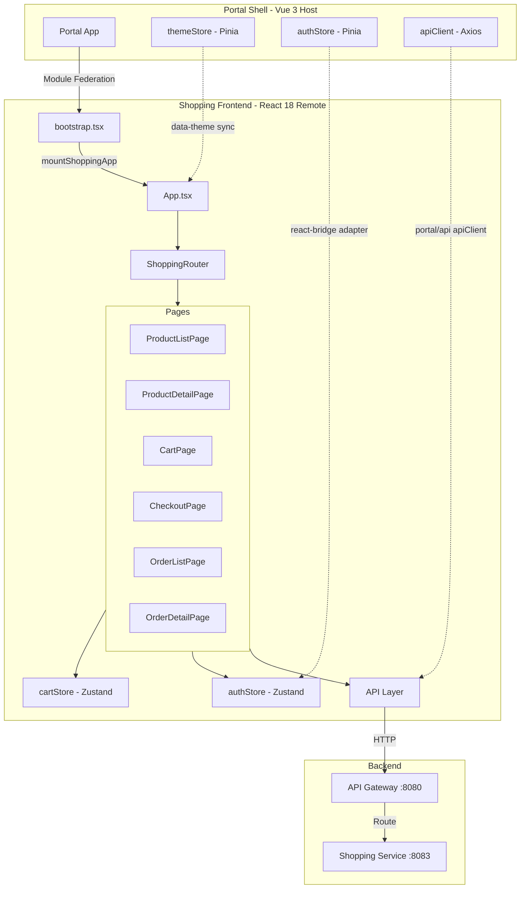
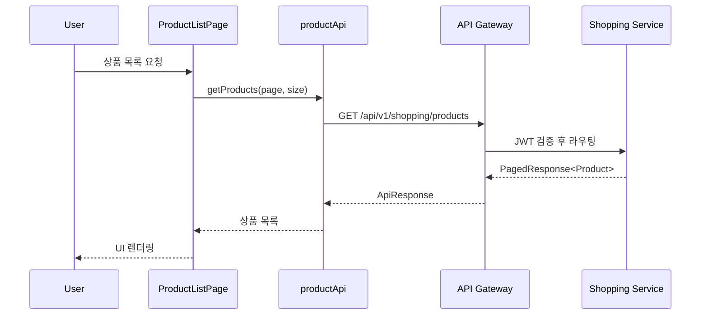
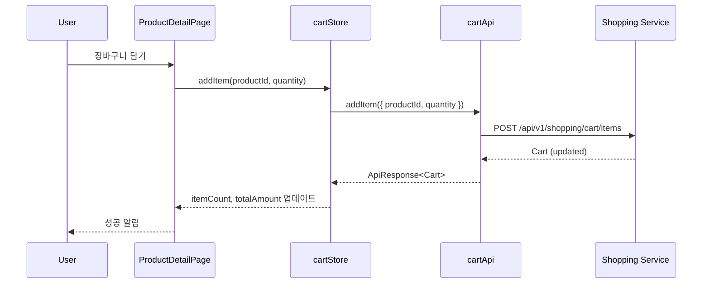

# Shopping Frontend System Overview

## 📋 개요

Shopping Frontend는 Portal Universe의 이커머스 마이크로 프론트엔드 모듈입니다. React 18 기반으로 구축되었으며, Module Federation을 통해 Portal Shell(Vue 3 Host)에 동적으로 통합됩니다.

**핵심 역할**:
- 상품 조회 및 검색
- 장바구니 관리
- 주문/결제 처리
- 배송 추적

---

## 🎯 핵심 특징

- **React 18**: Functional Components + Hooks 패턴
- **Module Federation Remote**: Portal Shell에 런타임 통합
- **Dual Mode**: Embedded(Portal 통합) / Standalone(독립 실행) 지원
- **Zustand 상태 관리**: cartStore, authStore
- **Vue ↔ React 상태 동기화**: Pinia(Vue) ↔ Zustand(React) 브릿지
- **테마 동기화**: `data-service="shopping"` + `data-theme="dark"` CSS 선택자
- **Lazy Loading**: React Router Code Splitting

---

## 🏗️ High-Level Architecture



---

## 📦 컴포넌트 상세

### 1. bootstrap.tsx (Module Federation Entry)

| 항목 | 내용 |
|------|------|
| **역할** | Module Federation 진입점, mountShoppingApp 함수 노출 |
| **Expose** | `./bootstrap` |
| **반환값** | `ShoppingAppInstance { onParentNavigate, unmount }` |
| **책임** | React Root 생성/제거, CSS 클린업, data-service 속성 설정 |

**주요 함수**:
```typescript
export function mountShoppingApp(
  el: HTMLElement,
  options: MountOptions
): ShoppingAppInstance
```

**MountOptions**:
- `initialPath?: string` - 초기 라우트 경로
- `onNavigate?: (path: string) => void` - Portal Shell에 경로 변경 알림

### 2. App.tsx (루트 컴포넌트)

| 항목 | 내용 |
|------|------|
| **역할** | 앱 루트 컴포넌트, 테마 동기화, 모드 감지 |
| **Props** | `theme, locale, userRole, initialPath, onNavigate` |
| **책임** | Portal Shell과의 통신, data-service 속성 설정, themeStore 연동 |

**테마 동기화 방식**:
1. **Embedded 모드**: `import('portal/stores')`로 Pinia store 연동
2. **Standalone 모드**: MutationObserver로 `<html class="dark">` 감지
3. `data-theme` 속성 업데이트: `[data-service="shopping"][data-theme="dark"]` CSS 활성화

### 3. ShoppingRouter (라우팅)

| 항목 | 내용 |
|------|------|
| **역할** | React Router 설정 및 Portal Shell과의 라우트 동기화 |
| **모드** | MemoryRouter(Embedded) / BrowserRouter(Standalone) |
| **책임** | 라우트 변경 감지 및 onNavigate 콜백 호출 |

**라우트 목록**:
```
/ → ProductListPage
/products → ProductListPage
/products/:productId → ProductDetailPage
/cart → CartPage
/checkout → CheckoutPage
/orders → OrderListPage
/orders/:orderNumber → OrderDetailPage
/admin/products → AdminProductListPage (ROLE_ADMIN)
/403 → ForbiddenPage
```

### 4. cartStore (Zustand)

| 항목 | 내용 |
|------|------|
| **역할** | 장바구니 상태 관리 |
| **Middleware** | devtools, persist (localStorage) |
| **상태** | cart, loading, error, itemCount, totalAmount |
| **액션** | fetchCart, addItem, updateItemQuantity, removeItem, clearCart |

### 5. authStore (Zustand)

| 항목 | 내용 |
|------|------|
| **역할** | 인증 상태 관리, Portal Shell과 동기화 |
| **상태** | user, isAuthenticated, accessToken, loading, error |
| **동기화** | `syncFromPortal()` - Portal Shell의 Pinia authStore에서 상태 복사 |

**Vue(Pinia) ↔ React(Zustand) 브릿지**:
```typescript
// 1. window 전역 변수 우선 사용
const globalToken = window.__PORTAL_ACCESS_TOKEN__

// 2. Pinia store 직접 호출 (함수로 호출!)
const portalAuthModule = await import('portal/stores')
const usePortalAuthStore = portalAuthModule.useAuthStore
const portalStore = usePortalAuthStore() // ✅ 함수 호출

// 3. Zustand로 매핑
set({ user: mappedUser, accessToken: globalToken })
```

### 6. API Layer

| 항목 | 내용 |
|------|------|
| **역할** | Backend API 호출 래퍼 |
| **엔드포인트** | productApi, cartApi, orderApi, paymentApi, deliveryApi, adminProductApi |
| **클라이언트** | `getApiClient()` - Portal Shell의 axios 또는 로컬 axios |

---

## 🔌 Module Federation 구조

### Remote 설정 (vite.config.ts)

```typescript
federation({
  name: 'shopping-frontend',
  filename: 'remoteEntry.js',
  remotes: {
    portal: env.VITE_PORTAL_SHELL_REMOTE_URL || 'http://localhost:30000/assets/shellEntry.js',
    blog: env.VITE_BLOG_REMOTE_URL || 'http://localhost:30001/assets/remoteEntry.js',
    shopping: env.VITE_SHOPPING_REMOTE_URL || 'http://localhost:30002/assets/remoteEntry.js',
  },
  exposes: {
    './bootstrap': './src/bootstrap.tsx'
  },
  shared: ['react', 'react-dom', 'react-dom/client', 'axios']
})
```

### Portal Shell 통합 방식

```typescript
// Portal Shell (Host) - Vue
const shoppingModule = await import('shopping_frontend/bootstrap')
const shoppingApp = shoppingModule.mountShoppingApp(container, {
  initialPath: '/cart',
  onNavigate: (path) => router.push(`/shopping${path}`)
})

// 경로 변경 수신
shoppingApp.onParentNavigate('/products')

// 언마운트
shoppingApp.unmount()
```

---

## 🔀 Embedded / Standalone 모드 차이점

| 구분 | Embedded Mode | Standalone Mode |
|------|---------------|-----------------|
| **감지 방법** | `window.__POWERED_BY_PORTAL_SHELL__ === true` | 미설정 |
| **라우터** | MemoryRouter | BrowserRouter |
| **authStore** | Portal Shell Pinia에서 동기화 | 로컬 상태 (미구현) |
| **apiClient** | `portal/api` apiClient (토큰 갱신, 401/429 재시도) | 로컬 axios 생성 |
| **테마 동기화** | `import('portal/stores')` | MutationObserver |
| **Header/Footer** | 숨김 | 표시 |
| **CSS 범위** | `[data-service="shopping"]` | 전역 |

---

## 🔗 Portal Shell 연동 방식

### 1. 테마 동기화

**Embedded 모드**:
```typescript
// App.tsx
import('portal/stores').then(({ useThemeStore }) => {
  const store = useThemeStore()
  // Pinia store의 isDark 값 감지
  updateDataTheme(store.isDark)
})
```

**Standalone 모드**:
```typescript
// MutationObserver로 <html class="dark"> 감지
const observer = new MutationObserver((mutations) => {
  const isDark = document.documentElement.classList.contains('dark')
  updateDataTheme(isDark)
})
```

### 2. 인증 상태 동기화

```typescript
// authStore.ts
syncFromPortal: async () => {
  // Step 1: window.__PORTAL_ACCESS_TOKEN__ 확인
  const globalToken = window.__PORTAL_ACCESS_TOKEN__

  // Step 2: Pinia store에서 사용자 정보 가져오기
  const portalAuthModule = await import('portal/stores')
  const usePortalAuthStore = portalAuthModule.useAuthStore
  const portalStore = usePortalAuthStore()

  // Step 3: Zustand로 매핑
  const mappedUser: User = {
    id: portalUser.profile?.sub || '',
    email: portalUser.profile?.email || '',
    name: portalUser.profile?.name || '',
    role: portalUser.authority?.roles?.includes('ROLE_ADMIN') ? 'admin' : 'user'
  }

  set({ user: mappedUser, accessToken: globalToken })
}
```

### 3. API 클라이언트 공유

```typescript
// api/client.ts
// Embedded: portal/api의 apiClient 사용 (토큰 자동 갱신, 401/429 재시도 포함)
// Standalone: local fallback client 사용
export const getApiClient = (): AxiosInstance => {
  return getPortalApiClient() ?? getLocalClient()
}
```

`getPortalApiClient()`는 `@portal/react-bridge`의 api-registry가 `import('portal/api')`로 resolve한 Portal Shell의 완전판 apiClient를 반환합니다. Standalone 모드에서는 `null`을 반환하여 local fallback으로 동작합니다.

### 4. CSS 격리

```scss
// styles/index.scss
[data-service="shopping"] {
  // Shopping 전용 스타일

  &[data-theme="dark"] {
    // Shopping 다크 테마
  }
}
```

**클린업 (unmount 시)**:
```typescript
// bootstrap.tsx
unmount: () => {
  // 1. React Root Unmount
  root.unmount()

  // 2. <head>의 Shopping CSS 제거
  const styleTags = document.querySelectorAll('style')
  styleTags.forEach((styleTag) => {
    if (styleTag.textContent?.includes('[data-service="shopping"]')) {
      styleTag.remove()
    }
  })

  // 3. data-service 속성 제거
  document.documentElement.removeAttribute('data-service')
}
```

---

## 📊 주요 데이터 흐름

### 상품 조회



### 장바구니 추가



---

## 🔧 기술 스택

| 항목 | 기술 |
|------|------|
| **프레임워크** | React 18 |
| **빌드 도구** | Vite 7.x |
| **Module Federation** | @originjs/vite-plugin-federation |
| **상태 관리** | Zustand (devtools, persist) |
| **라우팅** | React Router v7 (MemoryRouter/BrowserRouter) |
| **스타일** | SCSS + TailwindCSS (Semantic Token) |
| **타입** | TypeScript 5.9 |
| **API 클라이언트** | Axios (Portal Shell 공유) |

---

## 📁 디렉토리 구조

```
shopping-frontend/
├── src/
│   ├── App.tsx                 # 루트 컴포넌트, 테마 동기화
│   ├── bootstrap.tsx           # Module Federation 진입점
│   ├── main.tsx                # Standalone 모드 진입점
│   ├── router/
│   │   └── index.tsx           # React Router 설정
│   ├── stores/
│   │   ├── authStore.ts        # 인증 상태 (Zustand)
│   │   └── cartStore.ts        # 장바구니 상태 (Zustand)
│   ├── api/
│   │   ├── client.ts           # API 클라이언트 (Portal Shell 공유)
│   │   └── endpoints.ts        # API 엔드포인트
│   ├── pages/                  # 페이지 컴포넌트
│   ├── components/             # 재사용 컴포넌트
│   ├── hooks/                  # Custom Hooks
│   ├── types/                  # TypeScript 타입
│   └── styles/
│       └── index.scss          # [data-service="shopping"] 스타일
├── vite.config.ts              # Module Federation 설정
├── tsconfig.json               # TypeScript 설정
└── package.json                # 의존성 (react, zustand, react-router-dom)
```

---

## 🚀 빌드 및 실행

### 개발 모드 (Standalone)

```bash
cd frontend/shopping-frontend
npm run dev
# http://localhost:30002
```

### 프로덕션 빌드

```bash
npm run build
# dist/remoteEntry.js 생성 (Module Federation entry)
```

### Embedded 모드 테스트

```bash
# 1. Shopping Frontend 빌드
npm run build

# 2. Portal Shell에서 호출
cd ../portal-shell
npm run dev
# http://localhost:30000/shopping
```

---

## 🔐 보안 고려사항

1. **JWT 토큰 관리**: Portal Shell에서 관리, `window.__PORTAL_ACCESS_TOKEN__` 전역 변수로 공유
2. **CORS**: API Gateway에서 허용된 Origin만 접근 가능
3. **Role 기반 접근 제어**: `RequireRole` Guard로 Admin 페이지 보호
4. **XSS 방지**: React의 기본 이스케이핑 + TailwindCSS 사용
5. **CSRF**: Spring Security CSRF 토큰 (Cookie)

---

## 📈 성능 최적화

1. **Code Splitting**: React Router Lazy Loading
2. **Module Federation Shared**: react, react-dom 중복 방지
3. **Zustand Persist**: localStorage에 일부 상태만 저장 (itemCount, totalAmount)
4. **CSS 범위 격리**: `[data-service="shopping"]` 선택자로 스타일 충돌 방지

---

## 🔗 관련 문서

- [Data Flow](./data-flow.md)
- [API 명세](../api/)
- [Portal Shell 아키텍처](../../portal-shell/docs/architecture/system-overview.md)
- [Module Federation 가이드](../guides/module-federation.md)

---

**최종 업데이트**: 2026-01-30
