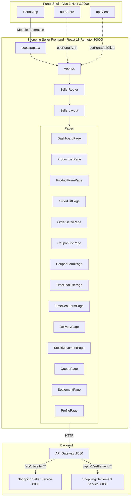

# Shopping Seller Frontend System Overview

## 개요

Shopping Seller Frontend는 **판매자(Seller) 전용** 관리 마이크로 프론트엔드입니다. React 18 기반 Module Federation Remote로 Portal Shell(Vue 3 Host)에 통합됩니다.

> shopping-frontend에서 Admin 페이지/hooks를 분리하여 생성되었습니다 (2026-02-14, ADR-041).

| 항목 | 내용 |
|------|------|
| **범위** | Frontend Application |
| **주요 기술** | React 18, TypeScript, Vite, Module Federation |
| **포트** | 30006 |
| **Backend** | shopping-seller-service (:8088), shopping-settlement-service (:8089) |

---

## 핵심 특징

- **React 18 Module Federation Remote**: Portal Shell (:30000) 런타임 통합
- **Dual Mode**: Embedded(Portal) / Standalone(독립) 실행
- **RBAC**: `ROLE_SELLER`, `ROLE_SHOPPING_ADMIN`, `ROLE_SUPER_ADMIN`
- **@portal/react-bootstrap**: createAppBootstrap으로 부트스트랩 간소화
- **@portal/react-bridge**: api-registry + bridge-registry
- **10개 판매자 관리 페이지**: 상품, 주문, 쿠폰, 타임딜, 배송, 재고, 대기열, 정산, 프로필

---

## High-Level Architecture



---

## 라우팅 구조

모든 라우트는 `RequireRole` 가드로 보호됩니다.

| 경로 | 페이지 | 설명 |
|------|--------|------|
| `/` | DashboardPage | 판매자 대시보드 |
| `/products` | ProductListPage | 상품 관리 |
| `/products/new` | ProductFormPage | 상품 등록 |
| `/products/:id` | ProductFormPage | 상품 수정 |
| `/orders` | OrderListPage | 주문 관리 |
| `/orders/:orderNumber` | OrderDetailPage | 주문 상세 |
| `/coupons` | CouponListPage | 쿠폰 관리 |
| `/coupons/new` | CouponFormPage | 쿠폰 등록 |
| `/time-deals` | TimeDealListPage | 타임딜 관리 |
| `/time-deals/new` | TimeDealFormPage | 타임딜 등록 |
| `/deliveries` | DeliveryPage | 배송 관리 |
| `/stock-movements` | StockMovementPage | 재고 이동 이력 |
| `/queue` | QueuePage | 대기열 관리 |
| `/settlement` | SettlementPage | 정산 내역 조회 |
| `/profile` | ProfilePage | 판매자 프로필 |

---

## Module Federation 설정

```typescript
federation({
  name: 'shopping-seller-frontend',
  filename: 'remoteEntry.js',
  remotes: {
    portal: 'http://localhost:30000/assets/shellEntry.js',
  },
  exposes: {
    './bootstrap': './src/bootstrap.tsx'
  },
  shared: ['react', 'react-dom', 'react-dom/client', 'axios'],
})
```

### Portal Shell 등록

```typescript
// portal-shell/src/config/remoteRegistry.ts
{
  name: 'Seller',
  key: 'seller',
  url: import.meta.env.VITE_SELLER_REMOTE_URL,
  module: 'seller/bootstrap',
  mountFn: 'mountSellerApp',
  basePath: '/seller',
}
```

---

## API 엔드포인트

### Seller Service (`/api/v1/seller`)

| 모듈 | 메서드 | 엔드포인트 | 설명 |
|------|--------|-----------|------|
| sellerApi | POST | /sellers/register | 판매자 등록 |
| sellerApi | GET | /sellers/me | 내 정보 조회 |
| sellerApi | PUT | /sellers/me | 정보 수정 |
| sellerProductApi | GET | /products | 상품 목록 |
| sellerProductApi | POST | /products | 상품 등록 |
| sellerProductApi | PUT | /products/{id} | 상품 수정 |
| sellerProductApi | DELETE | /products/{id} | 상품 삭제 |
| sellerInventoryApi | GET | /inventory/{productId} | 재고 조회 |
| sellerInventoryApi | PUT | /inventory/{productId}/add | 재고 추가 |
| sellerOrderApi | GET | /orders | 주문 목록 |
| sellerOrderApi | GET | /orders/{orderNumber} | 주문 상세 |

### Settlement Service (`/api/v1/settlement`)

| 모듈 | 메서드 | 엔드포인트 | 설명 |
|------|--------|-----------|------|
| settlementApi | GET | /periods | 정산 주기 목록 |
| settlementApi | GET | /sellers/{sellerId} | 판매자 정산 내역 |

---

## 기술 스택

| 항목 | 기술 | 버전 |
|------|------|------|
| 프레임워크 | React | 18.3.1 |
| 빌드 도구 | Vite | 7.2.0 |
| Module Federation | @originjs/vite-plugin-federation | 1.4.1 |
| 타입 | TypeScript | 5.9.3 |
| 라우팅 | React Router | 7.x |
| 스타일 | TailwindCSS | 3.x |
| 디자인 시스템 | @portal/design-system-react | workspace:* |

---

## 보안 (RBAC)

```tsx
<RequireRole roles={['ROLE_SELLER', 'ROLE_SHOPPING_ADMIN', 'ROLE_SUPER_ADMIN']}>
  <SellerLayout />
</RequireRole>
```

- 판매자 등록 후 `ROLE_SELLER` 부여
- 관리자는 `ROLE_SHOPPING_ADMIN` 또는 `ROLE_SUPER_ADMIN`으로 접근
- Frontend RequireRole + Backend Spring Security 이중 검증

---

## 관련 문서

- [Shopping Frontend (Buyer)](../shopping-frontend/system-overview.md)
- [Shopping Seller Service API](../../api/shopping-seller-service/README.md)
- [Shopping Settlement Service API](../../api/shopping-settlement-service/README.md)
- [ADR-041: Shopping Service 분해](../../adr/ADR-041-shopping-service-decomposition.md)

---

**작성자**: Laze
**최종 업데이트**: 2026-02-14
