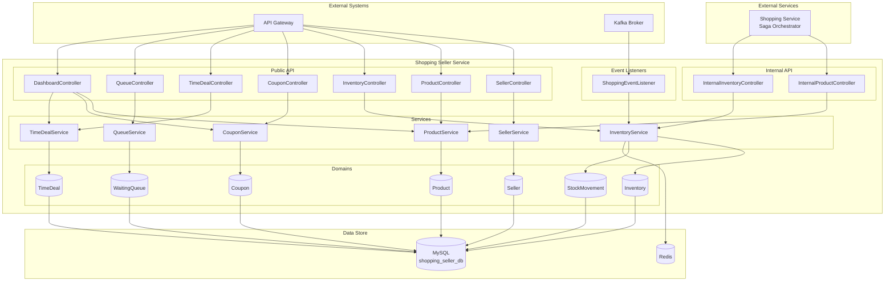
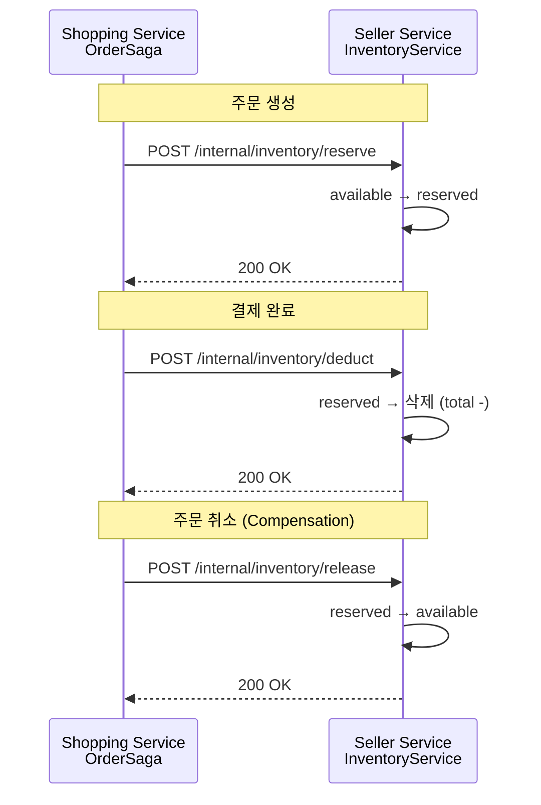
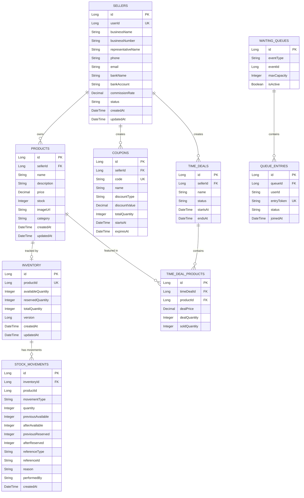

# Shopping Seller Service System Overview

## 개요

Shopping Seller Service는 판매자, 상품, 마케팅 도구 관리를 담당하는 마이크로서비스입니다. Shopping Service 분해 프로젝트의 일환으로 Seller, Product, Inventory, Coupon, TimeDeal, Queue 6개 도메인을 포함하여 판매자 중심 기능을 제공합니다.

**분리 배경**: 기존 Shopping Service는 10개 도메인을 포함하여 단일 서비스 복잡도가 높았습니다. Seller 도메인을 분리하여 판매자 기능의 독립적 확장과 관리를 가능하게 합니다.

---

## 핵심 특징

- **6개 도메인**: Seller (판매자), Product (상품), Inventory (재고), Coupon (쿠폰), TimeDeal (타임딜), Queue (대기열)
- **Internal API**: shopping-service Saga 패턴을 위한 재고 예약/차감/해제 API 제공
- **Redis 동시성 제어**: Coupon/TimeDeal Lua Script, Redisson 분산 락
- **Kafka 이벤트**: 배송 발송, 주문 생성 이벤트 구독하여 재고 업데이트
- **Pessimistic Lock**: 재고 차감 시 동시성 제어
- **판매자 권한**: userId → sellerId 매핑으로 본인 상품만 관리 가능

---

## High-Level Architecture

---

## 도메인 구조

### 1. Seller (판매자)

| 항목 | 내용 |
|------|------|
| **역할** | 판매자 등록, 정보 관리, 승인 프로세스 |
| **엔티티** | `Seller` |
| **주요 필드** | id, userId, businessName, businessNumber, representativeName, phone, email, bankName, bankAccount, commissionRate, status |
| **상태** | PENDING (승인 대기), ACTIVE (활성), SUSPENDED (정지), WITHDRAWN (탈퇴) |
| **API** | POST `/sellers/register`, GET/PUT `/sellers/me` |
| **에러코드** | SL0XX (SL001~SL003) |

**판매자 등록 플로우**:
1. 일반 사용자가 판매자 등록 (ROLE_USER)
2. 판매자 상태: PENDING (관리자 승인 대기)
3. 관리자 승인 후: ACTIVE (판매 활동 가능)

**Commission Rate**: 기본 10% (상품 판매 시 플랫폼 수수료)

### 2. Product (상품)

| 항목 | 내용 |
|------|------|
| **역할** | 판매자별 상품 CRUD |
| **엔티티** | `Product` |
| **주요 필드** | id, sellerId, name, description, price (DECIMAL), stock, imageUrl, category |
| **API** | GET/POST/PUT/DELETE `/products`, GET `/internal/products` |
| **에러코드** | SL1XX (SL101~SL102) |

**권한 제어**:
- ProductController는 JWT userId에서 sellerId를 조회
- 본인 상품만 수정/삭제 가능 (sellerId 일치 여부 확인)

**Internal API**:
- shopping-service, chatbot-service 등에서 Feign Client로 상품 정보 조회

### 3. Inventory (재고)

| 항목 | 내용 |
|------|------|
| **역할** | 재고 관리 및 동시성 제어 |
| **엔티티** | `Inventory`, `StockMovement` |
| **재고 유형** | availableQuantity (가용), reservedQuantity (예약), totalQuantity (전체) |
| **동시성 제어** | Pessimistic Write Lock + @Version 낙관적 락 |
| **API** | GET/PUT/POST `/inventory`, POST `/internal/inventory/*` |
| **에러코드** | SL2XX (SL201~SL205) |

**재고 타입**:

| 타입 | 설명 | 재고 변동 |
|------|------|----------|
| Available | 가용 재고 | 판매 가능 수량 |
| Reserved | 예약 재고 | 주문 진행 중 (결제 대기) |
| Total | 총 재고 | available + reserved |

**Saga 패턴 재고 제어**:

**StockMovement 이력**:
- 모든 재고 변동은 `stock_movements` 테이블에 이력 저장
- movementType: ADD, RESERVE, DEDUCT, RELEASE, ADJUST, RETURN
- referenceType/referenceId로 주문 추적 가능

### 4. Coupon (쿠폰)

| 항목 | 내용 |
|------|------|
| **역할** | 판매자 쿠폰 생성 및 관리 |
| **엔티티** | `Coupon` |
| **주요 필드** | id, sellerId, code (UK), name, discountType, discountValue, minimumOrderAmount, maximumDiscountAmount, totalQuantity, issuedQuantity, status, startsAt, expiresAt |
| **상태** | ACTIVE, INACTIVE, EXHAUSTED, EXPIRED |
| **할인 유형** | FIXED (정액), PERCENTAGE (정률) |
| **API** | GET/POST/DELETE `/coupons` |
| **에러코드** | SL3XX (SL301~SL308) |

**비즈니스 규칙**:
- 쿠폰 코드는 서비스 전체에서 유일해야 함
- DELETE 시 물리 삭제가 아닌 status=INACTIVE (soft delete)
- 본인 쿠폰만 조회/관리 가능 (sellerId 검증)

### 5. TimeDeal (타임딜)

| 항목 | 내용 |
|------|------|
| **역할** | 시간 한정 할인 이벤트 관리 |
| **엔티티** | `TimeDeal`, `TimeDealProduct` |
| **주요 필드** | TimeDeal: id, sellerId, name, status, startsAt, endsAt / TimeDealProduct: productId, dealPrice, dealQuantity, soldQuantity, maxPerUser |
| **상태** | SCHEDULED, ACTIVE, ENDED, CANCELLED |
| **API** | GET/POST/DELETE `/time-deals` |
| **에러코드** | SL4XX (SL401~SL406) |

**비즈니스 규칙**:
- startsAt < endsAt 검증
- 포함 상품은 본인 소유여야 함 (sellerId 매칭)
- 취소는 SCHEDULED 또는 ACTIVE 상태에서만 가능
- 상품별 dealQuantity, maxPerUser 제한

### 6. Queue (대기열)

| 항목 | 내용 |
|------|------|
| **역할** | 이벤트성 판매를 위한 대기열 관리 |
| **엔티티** | `WaitingQueue`, `QueueEntry` |
| **주요 필드** | WaitingQueue: eventType, eventId, maxCapacity, entryBatchSize, entryIntervalSeconds, isActive / QueueEntry: userId, entryToken, status |
| **Entry 상태** | WAITING, ENTERED, EXPIRED, LEFT |
| **API** | POST `/queue/{eventType}/{eventId}/activate\|deactivate`, GET `status` |
| **에러코드** | SL5XX (SL501~SL503) |

**비즈니스 규칙**:
- 이미 활성화된 대기열은 재활성화 불가
- eventType + eventId 조합으로 대기열 조회

---

## 데이터베이스 스키마

### ERD

### 테이블 요약

| # | 테이블 | 설명 | Migration |
|---|--------|------|-----------|
| 1 | sellers | 판매자 정보 | V1 |
| 2 | products | 상품 정보 (sellerId 추가) | V1 |
| 3 | inventory | 재고 관리 | V1 |
| 4 | stock_movements | 재고 이동 이력 | V1 |
| 5 | coupons | 쿠폰 (sellerId 추가) | V1 |
| 6 | time_deals | 타임딜 (sellerId 추가) | V1 |
| 7 | time_deal_products | 타임딜 상품 | V1 |
| 8 | waiting_queues | 대기열 | V1 |
| 9 | queue_entries | 대기열 항목 | V1 |

**주요 변경**:
- `products.seller_id`: NOT NULL (기존 shopping-service에서는 선택)
- `coupons.seller_id`, `time_deals.seller_id`: 판매자별 마케팅 도구 관리
- `sellers` 테이블 신규 추가

### 인덱스 전략

| 테이블 | 인덱스 | 컬럼 | 목적 |
|--------|--------|------|------|
| sellers | uk_sellers_user_id | user_id (UK) | 사용자당 1개 판매자 계정 |
| sellers | idx_sellers_status | status | 상태별 조회 |
| sellers | idx_sellers_business_name | business_name | 상호명 검색 |
| products | idx_products_seller_id | seller_id | 판매자별 상품 조회 |
| products | idx_products_name | name | 상품명 검색 |
| products | idx_products_category | category | 카테고리별 조회 |
| inventory | idx_inventory_product_id | product_id (UK) | 상품당 1개 재고 |
| stock_movements | idx_stock_movement_inventory_id | inventory_id | 재고별 이력 조회 |
| stock_movements | idx_stock_movement_reference | (reference_type, reference_id) | 주문 추적 |

---

## 외부 연동

### Kafka 이벤트 구독

| 이벤트 | Topic | 구독자 | 처리 로직 |
|--------|-------|--------|----------|
| DeliveryShippedEvent | `shopping.delivery.shipped` | ShoppingEventListener | 배송 발송 시 재고 이력 기록 |
| OrderCreatedEvent | `shopping.order.created` | ShoppingEventListener | 주문 생성 시 재고 모니터링 |

**Kafka Consumer 설정**: auto-offset-reset=earliest, enable-auto-commit=false (수동 커밋)

### Feign Client 제공

| 대상 서비스 | API | 메서드 | 설명 |
|------------|-----|--------|------|
| shopping-service | InternalProductController | GET /internal/products/{id} | 주문 생성 시 상품 정보 조회 |
| chatbot-service | InternalProductController | GET /internal/products | 챗봇 상품 추천 |
| shopping-service | InternalInventoryController | POST /internal/inventory/reserve | Saga 재고 예약 |
| shopping-service | InternalInventoryController | POST /internal/inventory/deduct | Saga 재고 차감 |
| shopping-service | InternalInventoryController | POST /internal/inventory/release | Saga Compensation |

**인증**: Internal API는 Service Mesh 또는 API Gateway에서 처리

---

## 기술 스택

### Backend

| 항목 | 기술 |
|------|------|
| Language | Java 17 |
| Framework | Spring Boot 3.5.5 |
| Security | Spring Security + JWT |
| ORM | Spring Data JPA (Hibernate) |
| Database | MySQL 8.0 (shopping_seller_db) |
| Cache/Lock | Redis + Redisson (분산 락, Lua Script) |
| Messaging | Spring Kafka |
| Validation | Jakarta Bean Validation |
| Logging | SLF4J + Logback |

### Infrastructure

| 항목 | 기술 |
|------|------|
| Port | 8088 |
| Container | Docker |
| Orchestration | Kubernetes |
| Message Broker | Kafka 4.1.0 (KRaft) |
| Monitoring | Prometheus, Grafana |
| Tracing | Zipkin |

### Redis 활용

| 용도 | 데이터 구조 | Key 패턴 |
|------|------------|----------|
| 쿠폰 재고 | String | `coupon:stock:{couponId}` |
| 쿠폰 발급 목록 | Set | `coupon:issued:{couponId}` |
| 타임딜 재고 | String | `timedeal:stock:{dealId}:{productId}` |
| 타임딜 구매 수량 | String | `timedeal:purchased:{dealId}:{productId}:{userId}` |
| 대기열 | Sorted Set | `queue:waiting:{eventType}:{eventId}` |
| 분산 락 | String | `lock:{key}` |

---

## 에러 코드 체계

| 범위 | 도메인 | 예시 |
|------|--------|------|
| SL0XX | Seller | SL001 SELLER_NOT_FOUND |
| SL1XX | Product | SL101 PRODUCT_NOT_FOUND |
| SL2XX | Inventory | SL202 INSUFFICIENT_STOCK |
| SL3XX | Coupon | SL301 COUPON_NOT_FOUND |
| SL4XX | TimeDeal | SL401 TIMEDEAL_NOT_FOUND |
| SL5XX | Queue | SL501 QUEUE_NOT_FOUND |

**접두사**: `SL` (Shopping Seller)

---

## 보안

### 인증 및 인가

- API Gateway에서 JWT 검증 수행
- userId는 JWT 토큰에서 추출 (SecurityContext)
- 판매자 리소스 접근 제어 (sellerId 일치 여부)

### 데이터 보호

- 민감 정보는 환경 변수로 관리
- 사업자 등록번호, 계좌 정보는 암호화 고려
- 개인정보는 마스킹 처리 (로그)

---

## 성능 목표

| 지표 | 목표 | 비고 |
|------|------|------|
| 응답 시간 (p95) | < 100ms | 상품 조회 |
| 재고 예약/차감 | < 50ms | Saga 호출 |
| 동시 재고 차감 | 50 TPS | Pessimistic Lock |
| 쿠폰 발급 | < 50ms | Redis Lua Script |
| 가용성 | 99.9% | 연간 8.76시간 다운타임 |

---

## 확장 계획

### 단기 (1-3개월)

- [ ] 판매자 정산 연동: shopping-settlement-service와 API 통합
- [ ] 상품 카테고리 계층화: Tree 구조 지원
- [ ] 쿠폰/타임딜 통계: 판매자별 대시보드 API

### 중기 (3-6개월)

- [ ] 상품 Elasticsearch 동기화: 검색 서비스 분리
- [ ] 판매자 등급제: 수수료율 차등 적용
- [ ] 재고 알림: 재고 부족 시 판매자 알림

### 장기 (6-12개월)

- [ ] 멀티 판매자 마켓플레이스: 판매자 간 경쟁 입찰
- [ ] 상품 리뷰 연동: blog-service와 통합
- [ ] 상품 추천 AI: chatbot-service 활용

---

## 관련 문서

### Architecture
- [Shopping Service Architecture](../shopping-service/system-overview.md) - Buyer 도메인
- [Shopping Settlement Service Architecture](../shopping-settlement-service/system-overview.md) - 정산 도메인
- [Saga Pattern](../shopping-service/saga-pattern.md) - 분산 트랜잭션

### API
- [Shopping Seller Service API](../../api/shopping-seller-service/README.md)
- [Shopping Service API](../../api/shopping-service/README.md)

### Database
- [Shopping Seller Service ERD](../database/shopping-seller-erd.md) (예정)

---

**최종 업데이트**: 2026-02-14
