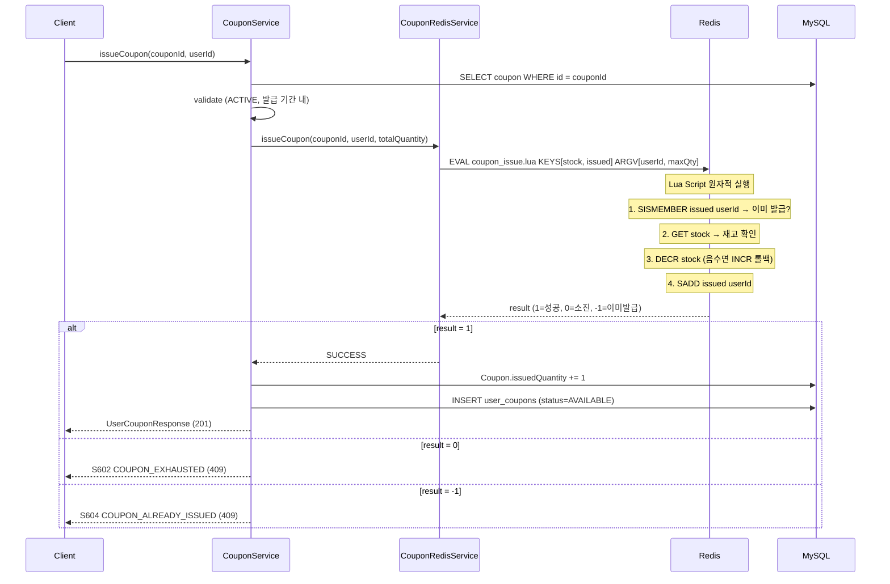

# Coupon System Architecture

## 개요

| 항목 | 내용 |
|------|------|
| **범위** | 쿠폰 생성, 선착순 발급, 사용, 만료 관리 |
| **주요 기술** | Redis Lua Script, MySQL, Kafka |
| **배포 환경** | Shopping Service 내 Coupon 도메인 |
| **관련 서비스** | auth-service (userId), notification-service (발급 알림) |

선착순 쿠폰 발급은 Redis Lua Script로 원자적 동시성 제어를 수행하며, MySQL과 이중으로 관리하여 데이터 정합성을 보장합니다.

---

## 아키텍처 다이어그램

```mermaid
graph TB
    subgraph "Client"
        C[Client]
    end

    subgraph "Coupon Domain"
        CC[CouponController]
        CS[CouponServiceImpl]
        CRS[CouponRedisService]
        CRB[CouponRedisBootstrap]
    end

    subgraph "Redis"
        RS[coupon:stock:{id}<br/>String]
        RI[coupon:issued:{id}<br/>Set]
        LUA[coupon_issue.lua]
    end

    subgraph "MySQL"
        CT[(coupons)]
        UCT[(user_coupons)]
    end

    subgraph "Kafka"
        K[shopping.coupon.issued]
    end

    C --> CC --> CS
    CS --> CRS --> LUA
    LUA --> RS & RI
    CS --> CT & UCT
    CS --> K
    CRB -->|App Start| RS & RI
```

---

## 핵심 컴포넌트

### Coupon 엔티티

| 필드 | 타입 | 설명 |
|------|------|------|
| id | Long | PK |
| code | String (UK) | 쿠폰 코드 |
| name | String | 쿠폰명 |
| discountType | DiscountType | FIXED (정액), PERCENTAGE (정률) |
| discountValue | BigDecimal | 할인 값 |
| minimumOrderAmount | BigDecimal | 최소 주문 금액 |
| maximumDiscountAmount | BigDecimal | 최대 할인 금액 (정률 시) |
| totalQuantity | Integer | 총 발급 수량 |
| issuedQuantity | Integer | 발급된 수량 |
| status | CouponStatus | ACTIVE, EXHAUSTED, EXPIRED, INACTIVE |
| startsAt | DateTime | 발급 시작 일시 |
| expiresAt | DateTime | 만료 일시 |

### UserCoupon 엔티티

| 필드 | 타입 | 설명 |
|------|------|------|
| id | Long | PK |
| userId | String | 사용자 ID |
| coupon | Coupon (FK) | 쿠폰 참조 |
| status | UserCouponStatus | AVAILABLE, USED, EXPIRED |
| usedOrderId | Long | 사용된 주문 ID |
| issuedAt | DateTime | 발급 일시 |
| usedAt | DateTime | 사용 일시 |
| expiresAt | DateTime | 만료 일시 |

**Unique constraint**: (user_id, coupon_id) - 1인 1매 제한

### CouponRedisService

Redis를 통한 선착순 발급 동시성 제어:

| 메서드 | 설명 |
|--------|------|
| `initializeCouponStock(couponId, qty)` | 재고 초기화 |
| `issueCoupon(couponId, userId, maxQty)` | Lua Script 원자적 발급 |
| `isAlreadyIssued(couponId, userId)` | 발급 여부 확인 |
| `getStock(couponId)` | 잔여 재고 조회 |
| `incrementStock(couponId)` | 발급 취소 시 재고 복원 |
| `removeIssuedUser(couponId, userId)` | 발급 취소 시 사용자 제거 |

### CouponRedisBootstrap

`ApplicationRunner` 구현체. 서비스 시작 시:
1. ACTIVE 상태 쿠폰 전체 조회
2. 각 쿠폰의 남은 재고(totalQuantity - issuedQuantity)를 Redis에 복원
3. 이미 발급된 사용자 목록을 Redis Set에 복원

---

## 데이터 플로우

### 선착순 발급 흐름



### Lua Script 상세 (`coupon_issue.lua`)

```
KEYS[1] = coupon:stock:{couponId}
KEYS[2] = coupon:issued:{couponId}
ARGV[1] = userId
ARGV[2] = maxQuantity

1. SISMEMBER KEYS[2] ARGV[1]  → 이미 발급이면 return -1
2. GET KEYS[1]                 → 재고 확인, 0 이하면 return 0
3. DECR KEYS[1]                → 재고 감소
4. 감소 후 < 0이면 INCR 롤백   → return 0
5. SADD KEYS[2] ARGV[1]        → 사용자 기록
6. return 1                     → 발급 성공
```

### Redis-MySQL 이중 관리

```
[Redis] coupon:stock:{id} = remainingQuantity  ← 동시성 제어 (빠름)
[MySQL] coupons.issued_quantity                ← 영속성 보장 (정확)
[Redis] coupon:issued:{id} = {userId Set}      ← 중복 발급 방지
[MySQL] user_coupons (UNIQUE user_id, coupon_id) ← 영속성 보장
```

서비스 재시작 시 `CouponRedisBootstrap`이 MySQL -> Redis 동기화 수행.

---

## 기술적 결정

### Redis Lua Script를 선택한 이유

| 대안 | 장점 | 단점 | 선택 여부 |
|------|------|------|:---------:|
| **Redis Lua Script** | 원자적, ~1ms, 단순 | 디버깅 어려움 | **선택** |
| Redisson Lock | 범용적 | 오버헤드 (~10ms) | - |
| DB Pessimistic Lock | 정합성 보장 | 성능 병목 (~50ms) | - |
| Optimistic Lock + Retry | 낮은 충돌 시 효율적 | 높은 충돌 시 비효율 | - |

### 할인 계산 로직

```
FIXED:       discount = discountValue
PERCENTAGE:  discount = min(orderAmount * discountValue / 100, maximumDiscountAmount)
```

### 제약사항

- 1인 1매 제한 (DB unique constraint + Redis Set)
- 발급 기간 내에만 발급 가능 (startsAt ~ expiresAt)
- 최소 주문 금액 이상에서만 사용 가능

---

## 에러 코드

| 코드 | 이름 | 설명 |
|------|------|------|
| S601 | COUPON_NOT_FOUND | 쿠폰 없음 |
| S602 | COUPON_EXHAUSTED | 재고 소진 |
| S603 | COUPON_EXPIRED | 만료됨 |
| S604 | COUPON_ALREADY_ISSUED | 이미 발급됨 |
| S605 | COUPON_NOT_STARTED | 발급 시작 전 |
| S606 | COUPON_INACTIVE | 비활성화됨 |
| S607 | COUPON_CODE_ALREADY_EXISTS | 코드 중복 |
| S608 | USER_COUPON_NOT_FOUND | 사용자 쿠폰 없음 |
| S609 | USER_COUPON_ALREADY_USED | 이미 사용됨 |
| S610 | USER_COUPON_EXPIRED | 사용자 쿠폰 만료 |
| S611 | COUPON_MINIMUM_ORDER_NOT_MET | 최소 주문 금액 미달 |

---

## API 엔드포인트

| Method | Path | 설명 |
|--------|------|------|
| GET | `/coupons` | 발급 가능한 쿠폰 목록 |
| GET | `/coupons/{couponId}` | 특정 쿠폰 조회 |
| POST | `/coupons/{couponId}/issue` | 선착순 쿠폰 발급 |
| GET | `/coupons/my` | 내 쿠폰 목록 |
| GET | `/coupons/my/available` | 사용 가능한 내 쿠폰 |

---

## 관련 문서

- [System Overview](./system-overview.md)
- [Data Flow](./data-flow.md) - 전체 데이터 흐름
- [TimeDeal System](./timedeal-system.md) - 유사한 Redis Lua 패턴

---

**최종 업데이트**: 2026-02-06
