# Shopping Service Data Flow

## 개요

Shopping Service의 주요 데이터 흐름과 이벤트 처리 과정을 설명합니다. 10개 도메인의 핵심 플로우를 다루며, Saga 패턴 분산 트랜잭션, Redis Lua Script 동시성 제어, SSE 실시간 스트리밍을 포함합니다.

Saga 패턴 상세는 [saga-pattern.md](./saga-pattern.md)를 참조하세요.

---

## 주요 데이터 흐름

### 1. 상품 조회

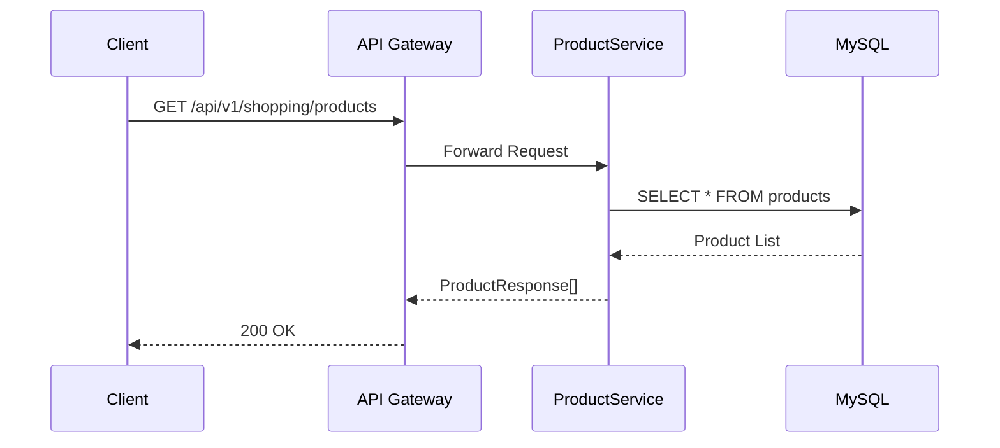

**설명**:
1. 클라이언트가 상품 목록 조회 요청
2. API Gateway가 JWT 검증 후 ProductService로 라우팅
3. ProductService가 DB에서 활성 상품 조회
4. 상품 정보를 DTO로 변환하여 반환

---

### 2. 장바구니 추가

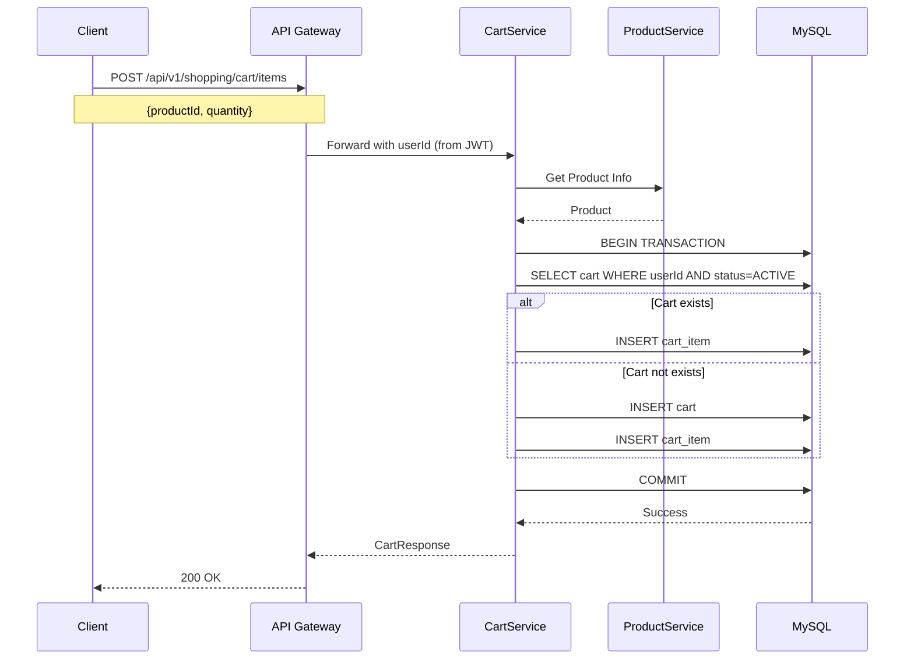

**설명**:
1. 클라이언트가 장바구니에 상품 추가 요청
2. JWT에서 userId 추출
3. 사용자의 활성 장바구니 조회 (없으면 생성)
4. 상품 정보 조회 (가격 스냅샷 저장)
5. CartItem 추가 및 저장
6. 이미 같은 상품이 있으면 S106 에러 발생

---

### 3. 주문 생성 (Saga Pattern)

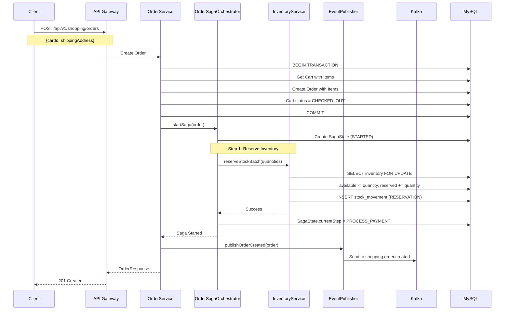

**설명**: [Saga Pattern 상세](./saga-pattern.md) 참조
1. 장바구니 항목으로 주문 생성 (PENDING)
2. OrderSagaOrchestrator가 Saga 시작
3. **Step 1**: Pessimistic Lock으로 재고 예약 (available -> reserved)
4. OrderCreatedEvent 발행

---

### 4. 결제 처리 및 Saga 완료

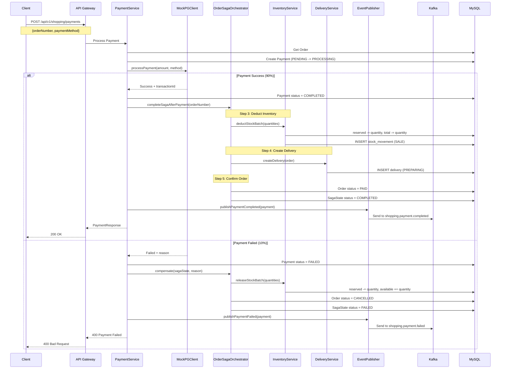

---

### 5. 주문 취소

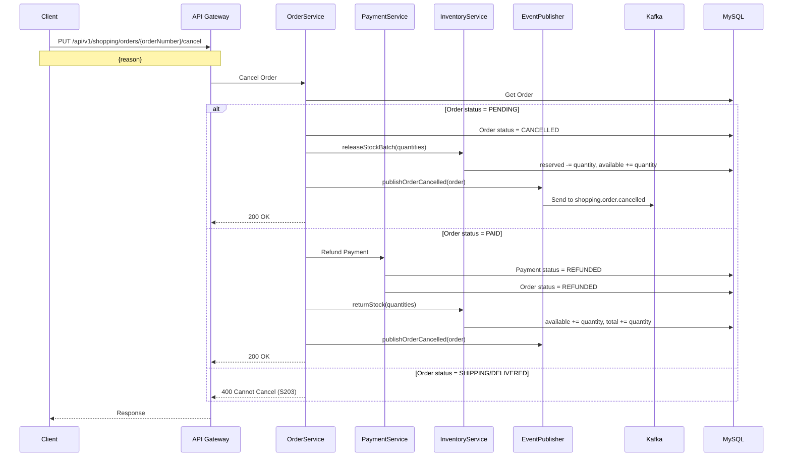

---

### 6. 배송 추적

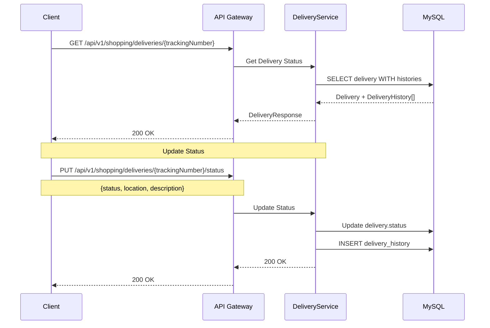

---

### 7. 쿠폰 선착순 발급

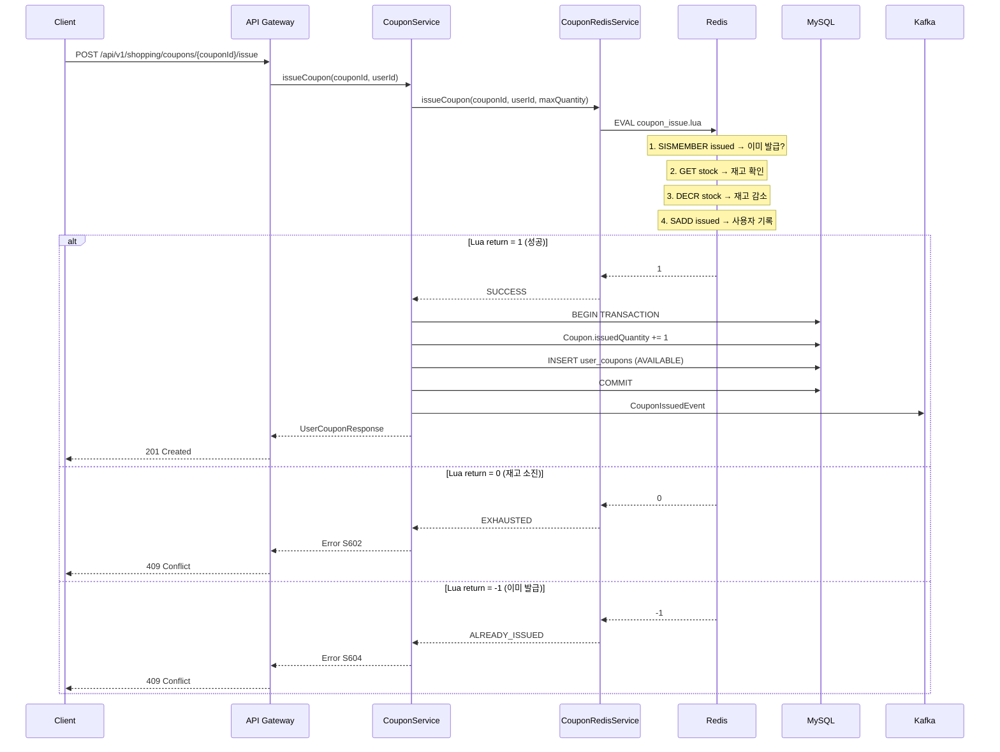

**핵심**: Lua Script로 "중복 확인 + 재고 감소 + 사용자 기록"을 원자적으로 수행. 상세는 [coupon-system.md](./coupon-system.md) 참조.

---

### 8. 타임딜 구매

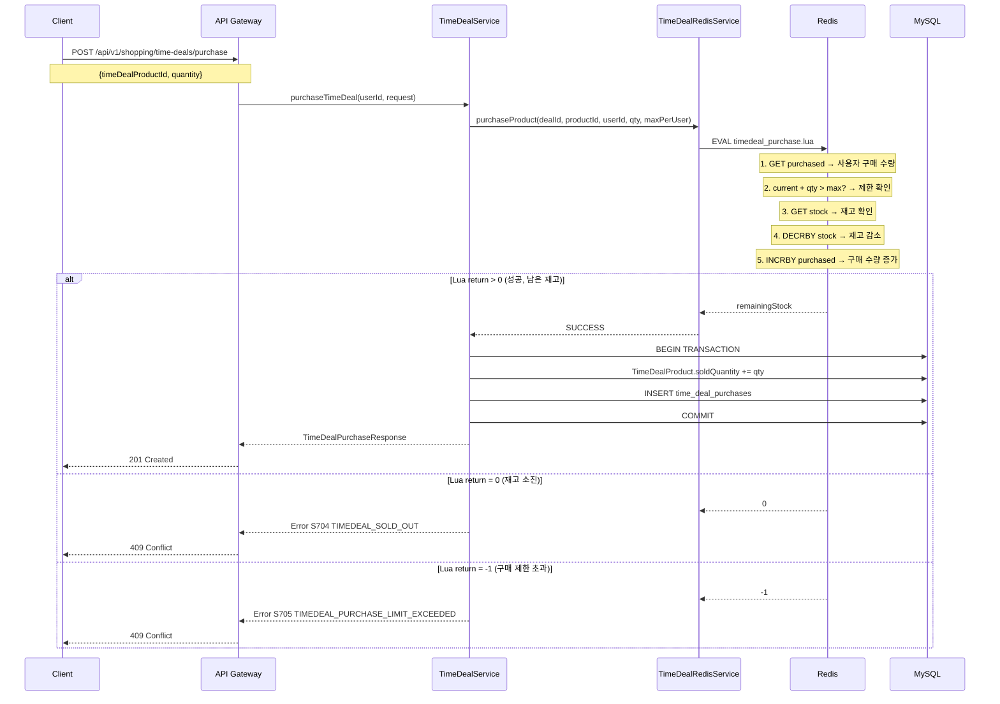

**핵심**: Lua Script로 "구매 한도 확인 + 재고 감소 + 구매 수량 기록"을 원자적으로 수행. 상세는 [timedeal-system.md](./timedeal-system.md) 참조.

---

### 9. 대기열 입장 및 실시간 알림

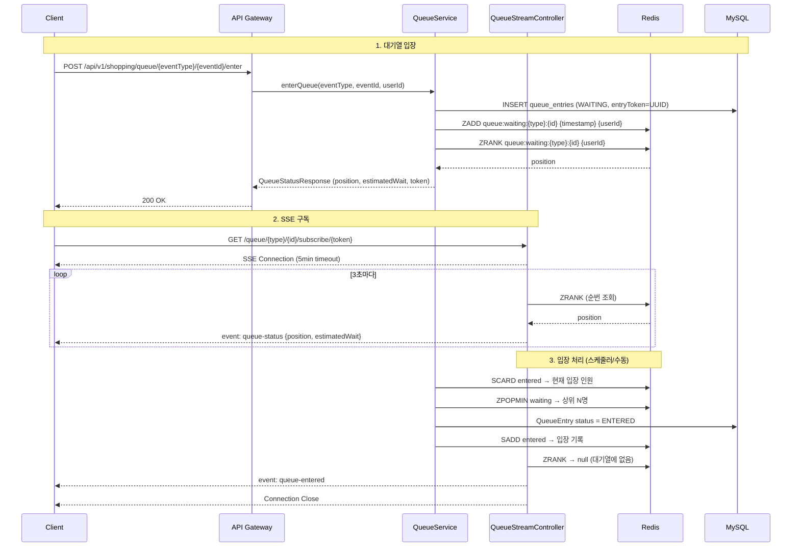

**핵심**: Redis Sorted Set으로 순번 관리, SSE로 실시간 상태 전달. 상세는 [queue-system.md](./queue-system.md) 참조.

---

### 10. 상품 검색

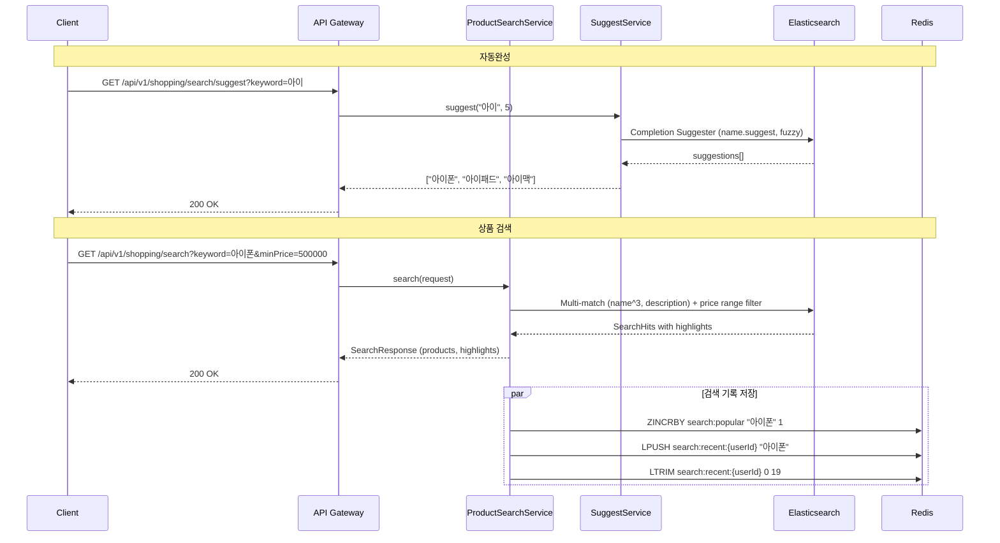

**핵심**: Elasticsearch full-text 검색 + Completion Suggester 자동완성 + Redis 인기/최근 검색어. 상세는 [search-system.md](./search-system.md) 참조.

---

## 이벤트/메시지 흐름

### Kafka Topics

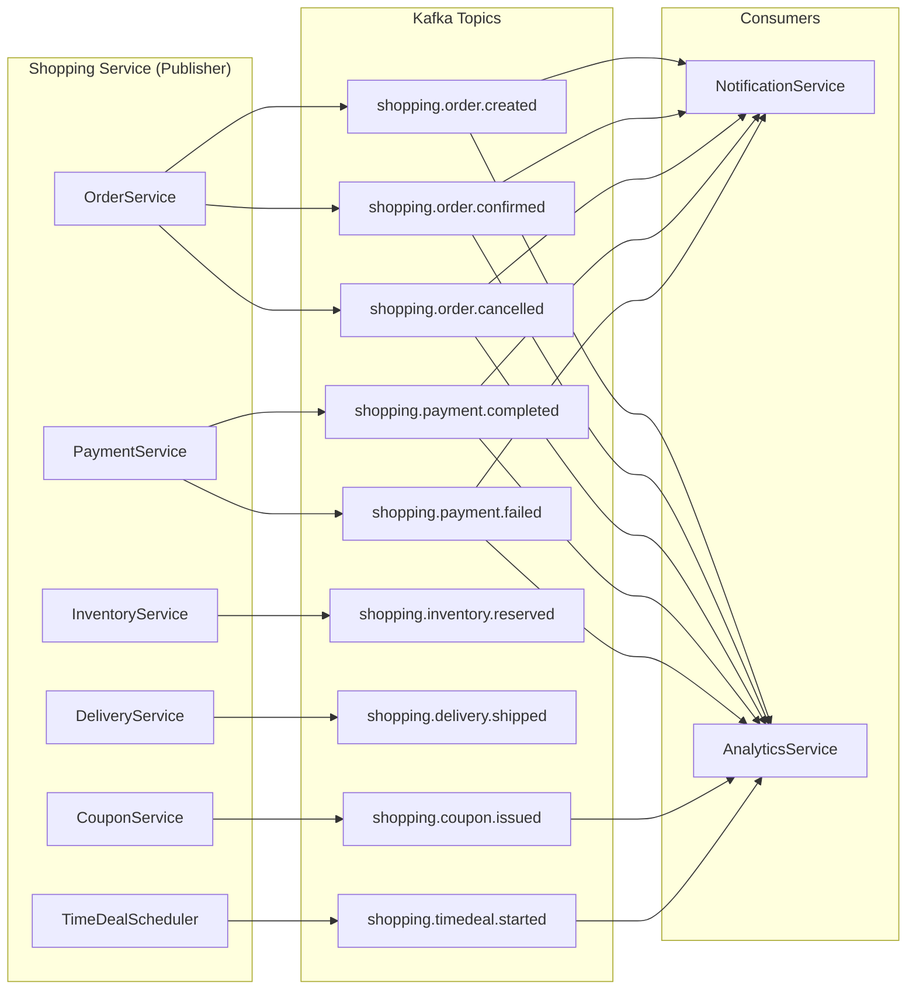

### 이벤트 목록

| 이벤트 | Topic | 발행자 | Payload |
|--------|-------|--------|---------|
| OrderCreatedEvent | `shopping.order.created` | OrderService | orderNumber, userId, totalAmount, items |
| OrderConfirmedEvent | `shopping.order.confirmed` | OrderService | orderNumber, userId |
| OrderCancelledEvent | `shopping.order.cancelled` | OrderService | orderNumber, userId, reason |
| PaymentCompletedEvent | `shopping.payment.completed` | PaymentService | paymentNumber, orderNumber, amount |
| PaymentFailedEvent | `shopping.payment.failed` | PaymentService | paymentNumber, orderNumber, reason |
| InventoryReservedEvent | `shopping.inventory.reserved` | InventoryService | orderNumber, productId, quantity |
| DeliveryShippedEvent | `shopping.delivery.shipped` | DeliveryService | trackingNumber, orderNumber |
| CouponIssuedEvent | `shopping.coupon.issued` | CouponService | couponId, userId, couponCode |
| TimeDealStartedEvent | `shopping.timedeal.started` | TimeDealScheduler | timeDealId, name, startsAt |

---

## 동시성 제어

### 1. Pessimistic Lock (재고 관리)

```java
// InventoryRepository.java
@Lock(LockModeType.PESSIMISTIC_WRITE)
@Query("SELECT i FROM Inventory i WHERE i.productId = :productId")
Optional<Inventory> findByProductIdWithLock(@Param("productId") Long productId);
```

**시나리오**: 두 사용자가 동시에 같은 상품 주문

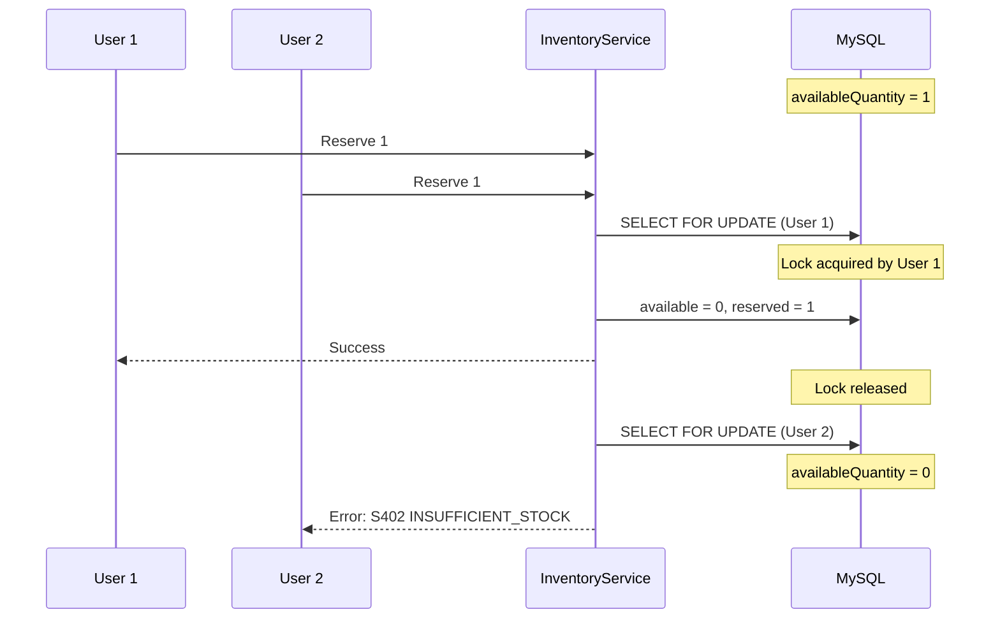

### 2. Redis Lua Script (쿠폰, 타임딜)

Redis Lua Script는 단일 스레드에서 원자적으로 실행되어 Race Condition을 방지합니다.

**coupon_issue.lua 흐름**:
```
SISMEMBER (이미 발급?) → GET stock (재고 확인) → DECR stock → SADD user
```
- Return: 1 (성공), 0 (재고 소진), -1 (이미 발급)

**timedeal_purchase.lua 흐름**:
```
GET purchased (구매 수량) → 한도 확인 → GET stock → DECRBY stock → INCRBY purchased
```
- Return: >0 (성공, 남은 재고), 0 (재고 소진), -1 (한도 초과)

### 3. Redisson 분산 락 (@DistributedLock AOP)

```java
@DistributedLock(key = "'scheduler:timedeal:status'", waitTime = 0, leaseTime = 55)
public void updateTimeDealStatus() { ... }
```

| 파라미터 | 기본값 | 설명 |
|----------|--------|------|
| key | - | SpEL 표현식 (메서드 파라미터 바인딩 가능) |
| waitTime | 3s | 락 획득 대기 시간 |
| leaseTime | 5s | 락 유지 시간 |
| timeUnit | SECONDS | 시간 단위 |

**Key prefix**: `lock:{parsedKey}`
**획득 실패**: `CustomBusinessException(S408 CONCURRENT_STOCK_MODIFICATION)`

---

## 초기화 흐름

서비스 시작 시 실행되는 초기화 로직:

```mermaid
graph TD
    START[Application Start] --> A[CouponRedisBootstrap<br/>ApplicationRunner]
    START --> B[TimeDealRedisInitializer<br/>ApplicationReadyEvent]
    START --> C[IndexInitializationService<br/>@PostConstruct]

    A --> A1[ACTIVE 쿠폰 조회]
    A1 --> A2[Redis에 재고 복원<br/>coupon:stock:{id}]
    A2 --> A3[발급 사용자 목록 복원<br/>coupon:issued:{id}]

    B --> B1[ACTIVE 타임딜 조회]
    B1 --> B2[각 product 남은 재고 계산<br/>dealQuantity - soldQuantity]
    B2 --> B3[Redis에 재고 복원<br/>timedeal:stock:{dealId}:{productId}]

    C --> C1[products 인덱스 존재 확인]
    C1 --> C2{인덱스 있음?}
    C2 -->|No| C3[products-mapping.json으로<br/>인덱스 생성]
    C2 -->|Yes| C4[Skip]
```

---

## 성능 고려사항

### 주문 생성 병목

| 구간 | 예상 시간 | 병목 요인 |
|------|-----------|----------|
| 주문 생성 | ~100ms | DB Insert |
| 재고 예약 | ~50ms | Pessimistic Lock |
| 결제 처리 | ~1000ms | 외부 PG 호출 |
| 재고 차감 | ~50ms | DB Update |
| **전체** | **~1.2초** | PG 응답 시간 |

### 쿠폰/타임딜 성능

| 구간 | 예상 시간 | 기술 |
|------|-----------|------|
| Lua Script 실행 | ~1ms | Redis single-thread atomic |
| MySQL 동기화 | ~30ms | DB Insert |
| **전체** | **~35ms** | Redis 우선, DB 후속 |

### 최적화 전략

1. **Redis Lua Script**: 고동시성 구간(쿠폰, 타임딜)을 Redis에서 원자적 처리
2. **Pessimistic Lock**: 일반 재고 관리는 DB 레벨 Lock 유지
3. **SSE**: 대기열 상태를 폴링 대신 서버 푸시로 전달
4. **비동기 처리**: Kafka 이벤트로 후속 처리 분리
5. **배치 재고 예약**: 여러 상품을 한 번에 Lock (`reserveStockBatch`)
6. **Elasticsearch**: 상품 검색을 DB에서 분리

---

## 관련 문서

- [System Overview](./system-overview.md)
- [Saga Pattern](./saga-pattern.md) - 5단계 분산 트랜잭션 상세
- [Coupon System](./coupon-system.md) - Redis Lua 선착순 발급
- [TimeDeal System](./timedeal-system.md) - Scheduler 라이프사이클
- [Queue System](./queue-system.md) - Redis Sorted Set + SSE
- [Search System](./search-system.md) - Elasticsearch 검색

---

**최종 업데이트**: 2026-02-06
