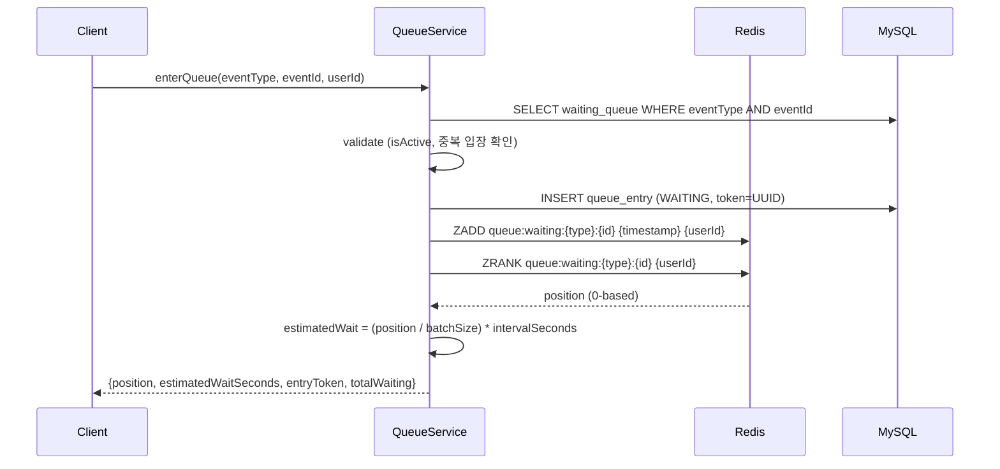
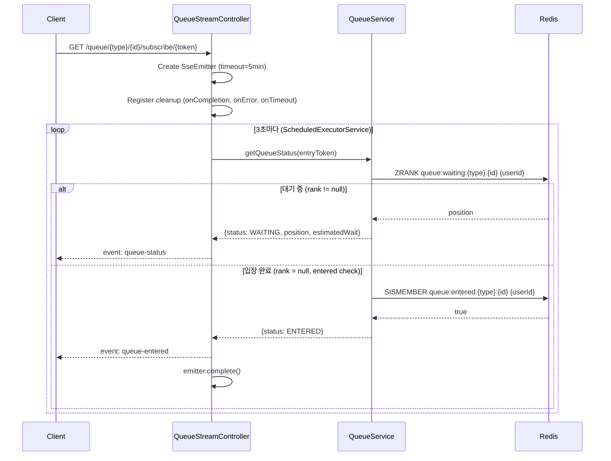
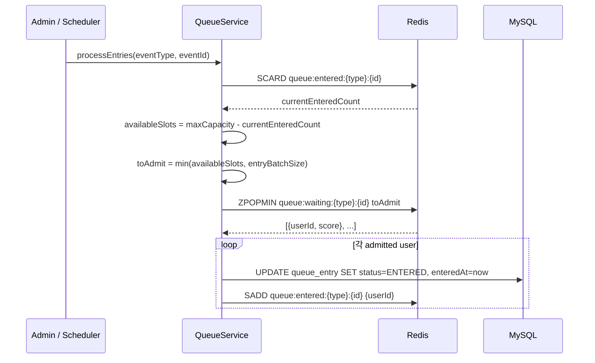

# Queue System Architecture

## 개요

| 항목 | 내용 |
|------|------|
| **범위** | 이벤트 대기열 관리, 순번 추적, 실시간 상태 알림 |
| **주요 기술** | Redis Sorted Set, SSE (SseEmitter), MySQL |
| **배포 환경** | Shopping Service 내 Queue 도메인 |
| **관련 서비스** | TimeDeal (대기열 연동 예정), auth-service (userId) |

이벤트(타임딜, 플래시세일 등)에 대한 대기열을 Redis Sorted Set으로 관리하며, SSE(Server-Sent Events)를 통해 클라이언트에 실시간 순번 업데이트를 전달합니다.

---

## 아키텍처 다이어그램

```mermaid
graph TB
    subgraph "Client"
        C[Client]
    end

    subgraph "Queue Domain"
        QC[QueueController]
        AQC[AdminQueueController]
        QSC[QueueStreamController<br/>SSE]
        QS[QueueServiceImpl]
    end

    subgraph "Redis"
        ZS[queue:waiting:{type}:{id}<br/>Sorted Set]
        RS[queue:entered:{type}:{id}<br/>Set]
    end

    subgraph "MySQL"
        WQT[(waiting_queues)]
        QET[(queue_entries)]
    end

    C --> QC --> QS
    C -.->|SSE| QSC
    AQC --> QS
    QS --> ZS & RS
    QS --> WQT & QET
    QSC --> QS
```

---

## 핵심 컴포넌트

### WaitingQueue 엔티티

| 필드 | 타입 | 설명 |
|------|------|------|
| id | Long | PK |
| eventType | String | 이벤트 유형 (TIMEDEAL, FLASH_SALE 등) |
| eventId | Long | 이벤트 ID |
| maxCapacity | Integer | 동시 입장 가능 인원 |
| entryBatchSize | Integer | 한 번에 입장시킬 인원 수 |
| entryIntervalSeconds | Integer | 입장 처리 간격 (초) |
| isActive | Boolean | 활성화 여부 (default false) |
| createdAt | DateTime | 생성 일시 |
| activatedAt | DateTime | 활성화 일시 |
| deactivatedAt | DateTime | 비활성화 일시 |

### QueueEntry 엔티티

| 필드 | 타입 | 설명 |
|------|------|------|
| id | Long | PK |
| queue | WaitingQueue (FK) | 대기열 참조 |
| userId | String | 사용자 ID |
| entryToken | String (UK) | UUID 토큰 (SSE 구독 시 사용) |
| status | QueueStatus | WAITING, ENTERED, EXPIRED, LEFT |
| joinedAt | DateTime | 입장 일시 |
| enteredAt | DateTime | 입장 완료 일시 |
| expiredAt | DateTime | 만료 일시 |
| leftAt | DateTime | 이탈 일시 |

**Index**: (queue_id, user_id), (entry_token)

### Redis 데이터 구조

| Key | Type | 설명 |
|-----|------|------|
| `queue:waiting:{eventType}:{eventId}` | Sorted Set | 대기 사용자 (score = timestamp) |
| `queue:entered:{eventType}:{eventId}` | Set | 입장 완료 사용자 |

**Redis 명령어 활용**:

| 명령어 | 용도 |
|--------|------|
| `ZADD` | 대기열에 사용자 추가 (score = currentTimeMillis) |
| `ZRANK` | 사용자 순번 조회 (0-based) |
| `ZCARD` | 전체 대기 인원 수 |
| `ZPOPMIN` | 최전방 N명 추출 (입장 처리) |
| `ZREM` | 대기열에서 사용자 제거 (이탈) |
| `SCARD` | 현재 입장 인원 수 |
| `SADD` | 입장 완료 기록 |

---

## 데이터 플로우

### 대기열 입장



### SSE 실시간 상태 전달



**SSE 연결 관리**:
- `ConcurrentHashMap<String, SseEmitter>` - 토큰별 emitter
- `ConcurrentHashMap<String, ScheduledFuture<?>>` - 토큰별 스케줄 태스크
- `@PreDestroy` - 서버 종료 시 모든 연결 정리
- Timeout: 5분 (클라이언트 재연결 필요)

### 입장 처리 (Batch Admission)



**입장 공식**:
```
availableSlots = maxCapacity - SCARD(entered)
toAdmit = min(availableSlots, entryBatchSize)
```

---

## 기술적 결정

### Redis Sorted Set을 선택한 이유

| 대안 | 장점 | 단점 | 선택 여부 |
|------|------|------|:---------:|
| **Redis Sorted Set** | O(log N) 삽입/조회, 순번 즉시 계산 | 메모리 사용 | **선택** |
| Redis List | O(1) push/pop | 순번 조회 O(N) | - |
| MySQL + polling | 영속성 | 성능 병목, 폴링 오버헤드 | - |
| RabbitMQ | 메시지 큐 전문 | 순번 조회 어려움 | - |

### SSE vs WebSocket

| 항목 | SSE | WebSocket |
|------|-----|-----------|
| 방향 | 서버 -> 클라이언트 (단방향) | 양방향 |
| 프로토콜 | HTTP | WS |
| 복잡도 | 낮음 | 높음 |
| **선택 이유** | 대기열 상태는 서버 -> 클라이언트 단방향이면 충분 | - |

### 예상 대기 시간 계산

```
estimatedWaitSeconds = (position / entryBatchSize) * entryIntervalSeconds
```

예: position=15, batchSize=5, interval=30초 -> 예상 대기 90초

---

## 에러 코드

| 코드 | 이름 | 설명 |
|------|------|------|
| S801 | QUEUE_NOT_FOUND | 대기열 없음 |
| S802 | QUEUE_ALREADY_ENTERED | 이미 대기열에 있음 |
| S803 | QUEUE_ENTRY_NOT_FOUND | 대기열 항목 없음 |
| S804 | QUEUE_TOKEN_EXPIRED | 토큰 만료 |
| S805 | QUEUE_NOT_ALLOWED | 입장 불허 |
| S806 | QUEUE_ENTRY_REQUIRED | 대기열 입장 필요 |

---

## API 엔드포인트

### 사용자 API

| Method | Path | 설명 |
|--------|------|------|
| POST | `/queue/{eventType}/{eventId}/enter` | 대기열 입장 |
| GET | `/queue/{eventType}/{eventId}/status` | 대기열 상태 조회 |
| POST | `/queue/{eventType}/{eventId}/leave` | 대기열 이탈 |
| GET | `/queue/token/{entryToken}/status` | 토큰으로 상태 조회 |
| GET | `/queue/{eventType}/{eventId}/subscribe/{entryToken}` | SSE 구독 |

### 관리자 API

| Method | Path | 설명 |
|--------|------|------|
| POST | `/admin/queue/activate` | 대기열 활성화 |
| POST | `/admin/queue/deactivate` | 대기열 비활성화 |
| POST | `/admin/queue/process` | 수동 입장 처리 |

---

## 관련 문서

- [System Overview](./system-overview.md)
- [Data Flow](./data-flow.md) - 전체 데이터 흐름
- [TimeDeal System](./timedeal-system.md) - 대기열 연동 대상

---

**최종 업데이트**: 2026-02-06
