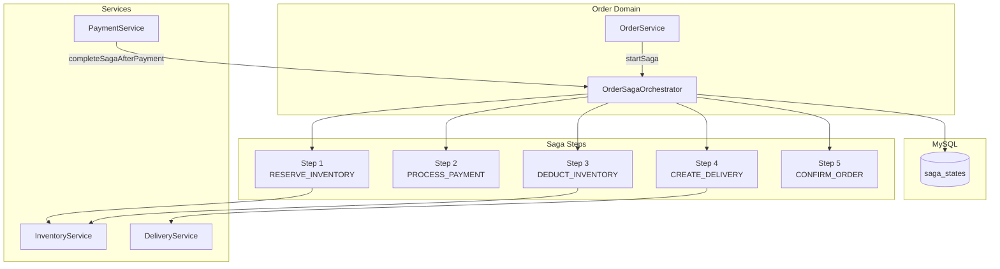
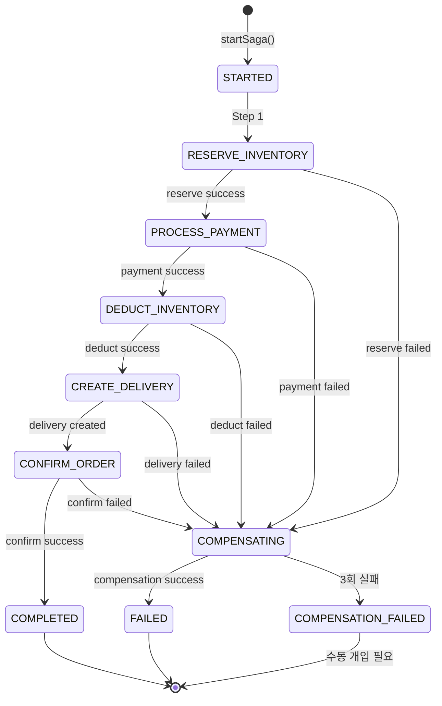
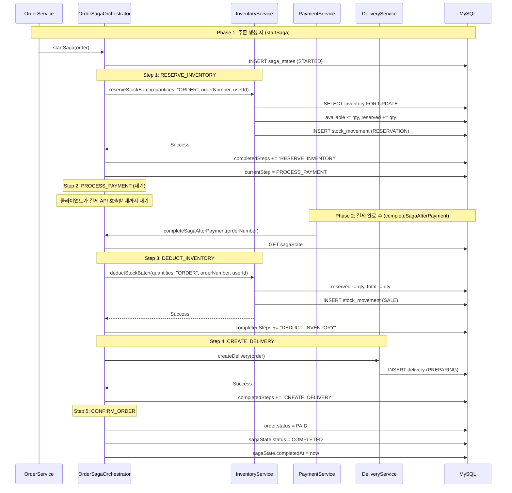
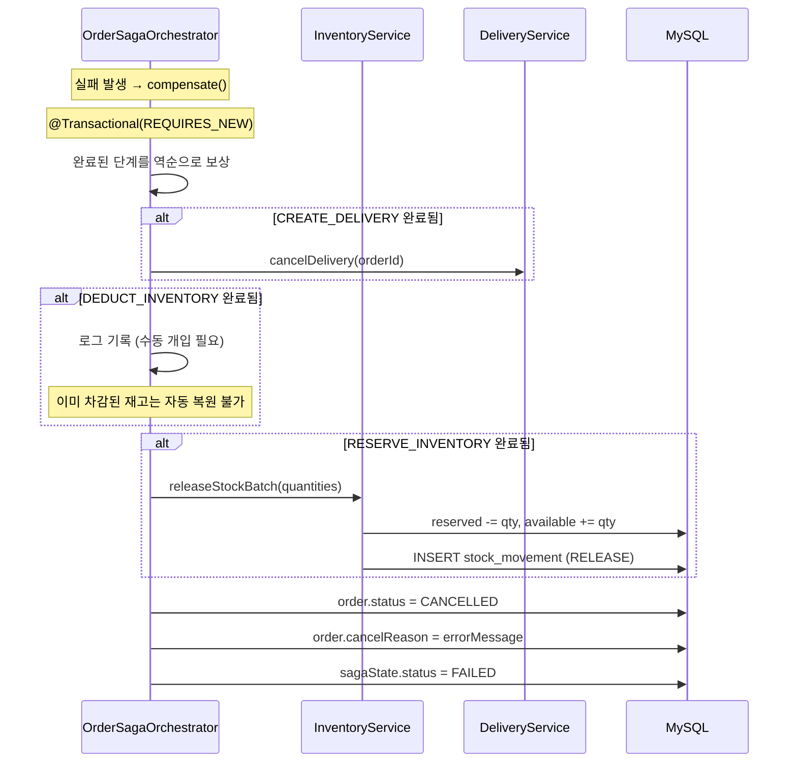
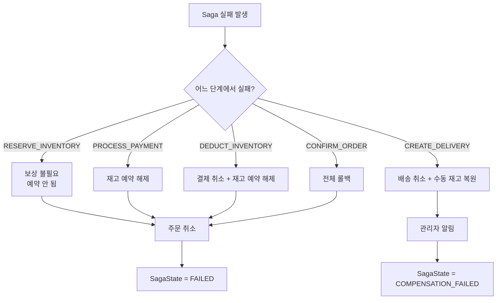

# Order Saga Pattern Architecture

## 개요

| 항목 | 내용 |
|------|------|
| **범위** | 주문 생성부터 확정까지의 5단계 분산 트랜잭션 관리 |
| **주요 기술** | Orchestrator Saga, Compensation Transaction |
| **배포 환경** | Shopping Service 내 Order/Saga 도메인 |
| **관련 서비스** | Inventory, Payment, Delivery (내부 도메인) |

Shopping Service의 주문 처리는 `OrderSagaOrchestrator`가 5단계 Forward/Compensation을 조율합니다. 각 단계의 성공/실패에 따라 자동 보상이 실행되며, 최대 3회 보상 재시도 후 수동 개입으로 전환됩니다.

---

## 아키텍처 다이어그램



---

## Saga State Machine



---

## 핵심 컴포넌트

### SagaState 엔티티

| 필드 | 타입 | 설명 |
|------|------|------|
| id | Long | PK |
| sagaId | String (UK) | `SAGA-{UUID 8자리}` |
| orderId | Long | 주문 ID |
| orderNumber | String | 주문 번호 |
| currentStep | SagaStep | 현재 단계 |
| status | SagaStatus | 현재 상태 |
| completedSteps | String | 완료된 단계 (CSV) |
| lastErrorMessage | String | 마지막 에러 메시지 |
| compensationAttempts | Integer | 보상 시도 횟수 (default 0) |
| startedAt | DateTime | 시작 일시 |
| completedAt | DateTime | 완료 일시 |

### SagaStep Enum

| Step | 이름 | 보상 가능 | 설명 |
|------|------|:---------:|------|
| 1 | RESERVE_INVENTORY | Yes | 재고 예약 (available -> reserved) |
| 2 | PROCESS_PAYMENT | Yes | 결제 처리 (외부 PG 호출) |
| 3 | DEDUCT_INVENTORY | Yes | 재고 차감 (reserved 감소, total 감소) |
| 4 | CREATE_DELIVERY | Yes | 배송 생성 |
| 5 | CONFIRM_ORDER | No | 주문 확정 (status = PAID) |

### SagaStatus Enum

| 상태 | 설명 |
|------|------|
| STARTED | 실행 중 |
| COMPLETED | 정상 완료 |
| COMPENSATING | 보상 처리 중 |
| FAILED | 실패 (보상 완료) |
| COMPENSATION_FAILED | 보상 실패 (수동 개입 필요) |

---

## 데이터 플로우

### Forward Flow (정상 진행)



### Compensation Flow (보상 처리)



### Compensation 전략



**보상 실패 처리**:
1. compensationAttempts 증가
2. 최대 3회 재시도 (`MAX_COMPENSATION_ATTEMPTS = 3`)
3. 3회 실패 시 `SagaState.status = COMPENSATION_FAILED`
4. 수동 개입 필요 (관리자 알림)

---

## 기술적 결정

### Orchestrator 패턴을 선택한 이유

| 패턴 | 장점 | 단점 | 선택 여부 |
|------|------|------|:---------:|
| **Orchestrator Saga** | 중앙 제어, 흐름 파악 용이, 보상 관리 단순 | 단일 장애점 | **선택** |
| Choreography Saga | 분산, 결합도 낮음 | 흐름 추적 어려움, 보상 복잡 | - |
| 2PC (Two-Phase Commit) | 강한 일관성 | 성능 저하, 가용성 문제 | - |

### PROCESS_PAYMENT 분리

Step 2 (PROCESS_PAYMENT)는 다른 단계와 달리 비동기적으로 처리됩니다:
- `startSaga()`에서 Step 1까지 완료 후 클라이언트에 응답
- 클라이언트가 별도 API (`POST /payments`)로 결제 요청
- 결제 완료/실패 시 `completeSagaAfterPayment()` 또는 `compensate()` 호출

이유: 결제는 사용자 상호작용이 필요한 단계 (결제 수단 선택, PG 리다이렉트 등)

### 보상 트랜잭션 격리

```java
@Transactional(propagation = Propagation.REQUIRES_NEW)
public void compensate(SagaState sagaState, String errorMessage) { ... }
```

- `REQUIRES_NEW`: 원래 트랜잭션과 별도 트랜잭션에서 실행
- 원래 트랜잭션이 롤백되더라도 보상 트랜잭션은 커밋됨
- SagaState 업데이트가 유실되지 않도록 보장

---

## 에러 코드

| 코드 | 이름 | 설명 |
|------|------|------|
| S901 | SAGA_EXECUTION_FAILED | Saga 실행 실패 |
| S902 | SAGA_COMPENSATION_FAILED | Saga 보상 실패 |
| S903 | SAGA_NOT_FOUND | Saga 없음 |
| S904 | SAGA_ALREADY_COMPLETED | 이미 완료됨 |
| S905 | SAGA_TIMEOUT | Saga 타임아웃 |

---

## 모니터링 포인트

| 지표 | 의미 | 임계값 |
|------|------|--------|
| `sagaState.status = COMPENSATION_FAILED` | 수동 개입 필요 | > 0 즉시 알림 |
| `compensationAttempts >= 2` | 보상 재시도 중 | 모니터링 |
| Saga 완료 시간 | 주문 처리 성능 | p95 < 2초 |
| `status = STARTED` 이면서 30분 이상 경과 | 멈춘 Saga | 즉시 확인 |

---

## 관련 문서

- [System Overview](./system-overview.md)
- [Data Flow](./data-flow.md) - 결제 처리 및 Saga 완료 흐름
- [Coupon System](./coupon-system.md) - 쿠폰 적용 시 Saga 확장 예정

---

**최종 업데이트**: 2026-02-06
