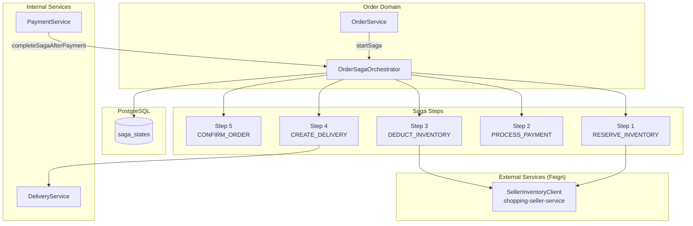
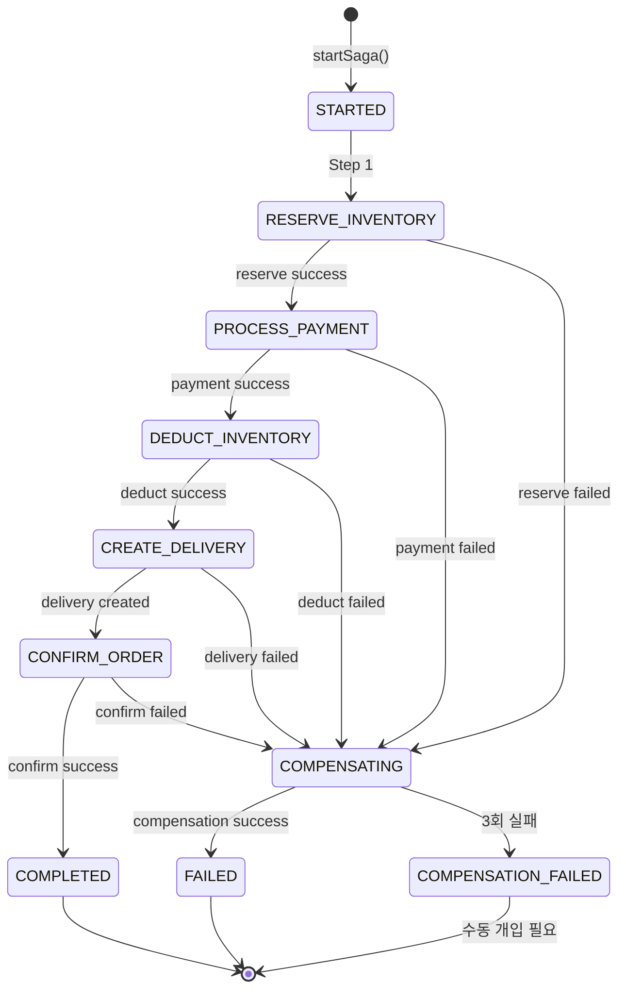
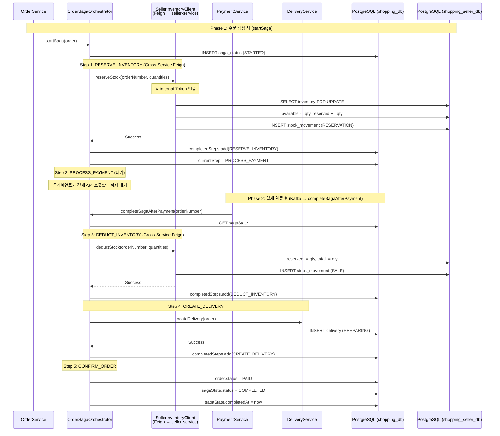
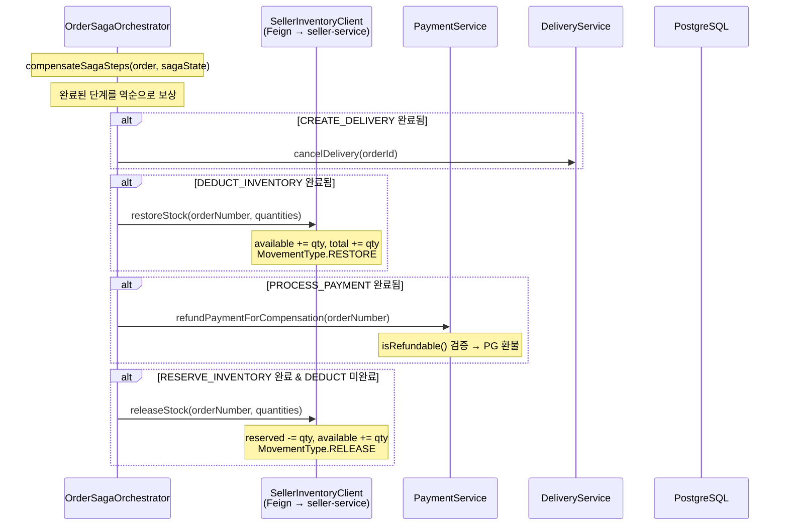
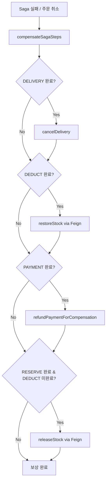
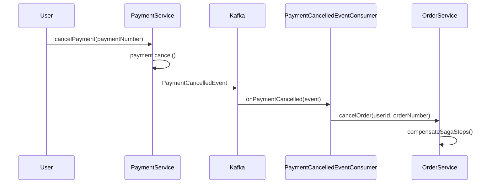

# Order Saga Pattern Architecture

## 개요

| 항목 | 내용 |
|------|------|
| **범위** | 주문 생성부터 확정까지의 5단계 분산 트랜잭션 관리 |
| **주요 기술** | Orchestrator Saga, Compensation Transaction |
| **배포 환경** | Shopping Service 내 Order/Saga 도메인 |
| **관련 서비스** | shopping-seller-service (재고 Feign), Payment, Delivery (내부 도메인) |

Shopping Service의 주문 처리는 `OrderSagaOrchestrator`가 5단계 Forward/Compensation을 조율합니다. 각 단계의 성공/실패에 따라 자동 보상이 실행되며, 최대 3회 보상 재시도 후 수동 개입으로 전환됩니다.

---

## 아키텍처 다이어그램


```mermaid
graph TB
    subgraph "Order Domain"
        OS[OrderService]
        SAGA[OrderSagaOrchestrator]
    end

    subgraph "Saga Steps"
        S1[Step 1<br/>RESERVE_INVENTORY]
        S2[Step 2<br/>PROCESS_PAYMENT]
        S3[Step 3<br/>DEDUCT_INVENTORY]
        S4[Step 4<br/>CREATE_DELIVERY]
        S5[Step 5<br/>CONFIRM_ORDER]
    end

    subgraph "Internal Services"
        PS[PaymentService]
        DS[DeliveryService]
    end

    subgraph "External Services (Feign)"
        SIS[SellerInventoryClient<br/>shopping-seller-service]
    end

    subgraph "PostgreSQL"
        SST[(saga_states)]
    end

    OS -->|startSaga| SAGA
    PS -->|completeSagaAfterPayment| SAGA

    SAGA --> S1 --> SIS
    SAGA --> S2
    SAGA --> S3 --> SIS
    SAGA --> S4 --> DS
    SAGA --> S5

    SAGA --> SST
```

---

## Saga State Machine


```mermaid
stateDiagram-v2
    [*] --> STARTED: startSaga()

    STARTED --> RESERVE_INVENTORY: Step 1
    RESERVE_INVENTORY --> PROCESS_PAYMENT: reserve success
    RESERVE_INVENTORY --> COMPENSATING: reserve failed

    PROCESS_PAYMENT --> DEDUCT_INVENTORY: payment success
    PROCESS_PAYMENT --> COMPENSATING: payment failed

    DEDUCT_INVENTORY --> CREATE_DELIVERY: deduct success
    DEDUCT_INVENTORY --> COMPENSATING: deduct failed

    CREATE_DELIVERY --> CONFIRM_ORDER: delivery created
    CREATE_DELIVERY --> COMPENSATING: delivery failed

    CONFIRM_ORDER --> COMPLETED: confirm success
    CONFIRM_ORDER --> COMPENSATING: confirm failed

    COMPENSATING --> FAILED: compensation success
    COMPENSATING --> COMPENSATION_FAILED: 3회 실패

    COMPLETED --> [*]
    FAILED --> [*]
    COMPENSATION_FAILED --> [*]: 수동 개입 필요
```

---

## 핵심 컴포넌트

### SagaState 엔티티

| 필드 | 타입 | 설명 |
|------|------|------|
| id | Long | PK |
| sagaId | String (UK) | `SAGA-{UUID 8자리}` |
| orderId | Long | 주문 ID |
| orderNumber | String | 주문 번호 |
| currentStep | SagaStep | 현재 단계 |
| status | SagaStatus | 현재 상태 |
| completedSteps | Set\<SagaStep\> | 완료된 단계 (DB: CSV, 메모리: EnumSet via SagaStepSetConverter) |
| lastErrorMessage | String | 마지막 에러 메시지 |
| compensationAttempts | Integer | 보상 시도 횟수 (default 0) |
| startedAt | DateTime | 시작 일시 |
| completedAt | DateTime | 완료 일시 |

### SagaStep Enum

| Step | 이름 | 보상 가능 | 설명 |
|------|------|:---------:|------|
| 1 | RESERVE_INVENTORY | Yes | 재고 예약 (available -> reserved) |
| 2 | PROCESS_PAYMENT | Yes | 결제 처리 (외부 PG 호출) |
| 3 | DEDUCT_INVENTORY | Yes | 재고 차감 (reserved 감소, total 감소) |
| 4 | CREATE_DELIVERY | Yes | 배송 생성 |
| 5 | CONFIRM_ORDER | No | 주문 확정 (status = PAID) |

### SagaStatus Enum

| 상태 | 설명 |
|------|------|
| STARTED | 실행 중 |
| COMPLETED | 정상 완료 |
| COMPENSATING | 보상 처리 중 |
| FAILED | 실패 (보상 완료) |
| COMPENSATION_FAILED | 보상 실패 (수동 개입 필요) |

---

## 데이터 플로우

### Forward Flow (정상 진행)


```mermaid
sequenceDiagram
    participant OS as OrderService
    participant SAGA as OrderSagaOrchestrator
    participant SIC as SellerInventoryClient<br/>(Feign → seller-service)
    participant PS as PaymentService
    participant DS as DeliveryService
    participant DB as PostgreSQL (shopping_db)
    participant SDB as PostgreSQL (shopping_seller_db)

    Note over OS,SDB: Phase 1: 주문 생성 시 (startSaga)
    OS->>SAGA: startSaga(order)
    SAGA->>DB: INSERT saga_states (STARTED)

    Note over SAGA,SIC: Step 1: RESERVE_INVENTORY (Cross-Service Feign)
    SAGA->>SIC: reserveStock(orderNumber, quantities)
    Note over SIC: X-Internal-Token 인증
    SIC->>SDB: SELECT inventory FOR UPDATE
    SIC->>SDB: available -= qty, reserved += qty
    SIC->>SDB: INSERT stock_movement (RESERVATION)
    SIC-->>SAGA: Success
    SAGA->>DB: completedSteps.add(RESERVE_INVENTORY)
    SAGA->>DB: currentStep = PROCESS_PAYMENT

    Note over SAGA: Step 2: PROCESS_PAYMENT (대기)
    Note over SAGA: 클라이언트가 결제 API 호출할 때까지 대기

    Note over PS,DB: Phase 2: 결제 완료 후 (Kafka → completeSagaAfterPayment)
    PS->>SAGA: completeSagaAfterPayment(orderNumber)
    SAGA->>DB: GET sagaState

    Note over SAGA,SIC: Step 3: DEDUCT_INVENTORY (Cross-Service Feign)
    SAGA->>SIC: deductStock(orderNumber, quantities)
    SIC->>SDB: reserved -= qty, total -= qty
    SIC->>SDB: INSERT stock_movement (SALE)
    SIC-->>SAGA: Success
    SAGA->>DB: completedSteps.add(DEDUCT_INVENTORY)

    Note over SAGA,DS: Step 4: CREATE_DELIVERY
    SAGA->>DS: createDelivery(order)
    DS->>DB: INSERT delivery (PREPARING)
    DS-->>SAGA: Success
    SAGA->>DB: completedSteps.add(CREATE_DELIVERY)

    Note over SAGA: Step 5: CONFIRM_ORDER
    SAGA->>DB: order.status = PAID
    SAGA->>DB: sagaState.status = COMPLETED
    SAGA->>DB: sagaState.completedAt = now
```

### Compensation Flow (보상 처리) — Phase 2 Cross-Service


```mermaid
sequenceDiagram
    participant SAGA as OrderSagaOrchestrator
    participant SIC as SellerInventoryClient<br/>(Feign → seller-service)
    participant PS as PaymentService
    participant DS as DeliveryService
    participant DB as PostgreSQL

    Note over SAGA: compensateSagaSteps(order, sagaState)
    Note over SAGA: 완료된 단계를 역순으로 보상

    alt CREATE_DELIVERY 완료됨
        SAGA->>DS: cancelDelivery(orderId)
    end

    alt DEDUCT_INVENTORY 완료됨
        SAGA->>SIC: restoreStock(orderNumber, quantities)
        Note over SIC: available += qty, total += qty<br/>MovementType.RESTORE
    end

    alt PROCESS_PAYMENT 완료됨
        SAGA->>PS: refundPaymentForCompensation(orderNumber)
        Note over PS: isRefundable() 검증 → PG 환불
    end

    alt RESERVE_INVENTORY 완료 & DEDUCT 미완료
        SAGA->>SIC: releaseStock(orderNumber, quantities)
        Note over SIC: reserved -= qty, available += qty<br/>MovementType.RELEASE
    end
```

**restoreStock vs releaseStock 구분**:
- `restoreStock`: DEDUCT 완료 후 취소 — 차감된 재고를 원래 상태로 복원 (available += qty, total += qty)
- `releaseStock`: RESERVE 완료 후 취소 — 예약된 재고만 해제 (reserved -= qty, available += qty)
- DEDUCT가 완료되면 reserved는 이미 0이므로 releaseStock 호출 불필요

### Compensation 전략


```mermaid
flowchart TD
    A[Saga 실패 / 주문 취소] --> B[compensateSagaSteps]

    B --> C{DELIVERY 완료?}
    C -->|Yes| D[cancelDelivery]
    C -->|No| E{DEDUCT 완료?}

    D --> E
    E -->|Yes| F[restoreStock via Feign]
    E -->|No| G{PAYMENT 완료?}

    F --> G
    G -->|Yes| H[refundPaymentForCompensation]
    G -->|No| I{RESERVE 완료 & DEDUCT 미완료?}

    H --> I
    I -->|Yes| J[releaseStock via Feign]
    I -->|No| K[보상 완료]

    J --> K
```

**보상 실패 처리**:
1. compensationAttempts 증가
2. 최대 3회 재시도 (`MAX_COMPENSATION_ATTEMPTS = 3`)
3. 3회 실패 시 `SagaState.status = COMPENSATION_FAILED`
4. 수동 개입 필요 (CloudWatch 메트릭 + 알림)

### Dead Saga 자동 복구

`DeadSagaRecoveryScheduler`가 멈춘 Saga를 자동 탐지하여 보상 처리한다.

| 설정 | 값 |
|------|-----|
| 실행 주기 | 5분 (`fixedDelay = 300_000`) |
| 초기 대기 | 60초 (`initialDelay = 60_000`) |
| 타임아웃 기준 | 30분 이상 STARTED/COMPENSATING 상태 |
| 동시성 제어 | `PESSIMISTIC_WRITE + SKIP_LOCKED` |
| 실패 시 | `COMPENSATION_FAILED` 상태 → 수동 개입 + CloudWatch |

### 결제 취소 → 주문 취소 이벤트 연결


```mermaid
sequenceDiagram
    participant User
    participant PS as PaymentService
    participant Kafka
    participant Consumer as PaymentCancelledEventConsumer
    participant OS as OrderService

    User->>PS: cancelPayment(paymentNumber)
    PS->>PS: payment.cancel()
    PS->>Kafka: PaymentCancelledEvent
    Kafka->>Consumer: onPaymentCancelled(event)
    Consumer->>OS: cancelOrder(userId, orderNumber)
    OS->>OS: compensateSagaSteps()
```

---

## 기술적 결정

### Orchestrator 패턴을 선택한 이유

| 패턴 | 장점 | 단점 | 선택 여부 |
|------|------|------|:---------:|
| **Orchestrator Saga** | 중앙 제어, 흐름 파악 용이, 보상 관리 단순 | 단일 장애점 | **선택** |
| Choreography Saga | 분산, 결합도 낮음 | 흐름 추적 어려움, 보상 복잡 | - |
| 2PC (Two-Phase Commit) | 강한 일관성 | 성능 저하, 가용성 문제 | - |

### PROCESS_PAYMENT 분리

Step 2 (PROCESS_PAYMENT)는 다른 단계와 달리 비동기적으로 처리됩니다:
- `startSaga()`에서 Step 1까지 완료 후 클라이언트에 응답
- 클라이언트가 별도 API (`POST /payments`)로 결제 요청
- 결제 완료/실패 시 `completeSagaAfterPayment()` 또는 `compensate()` 호출

이유: 결제는 사용자 상호작용이 필요한 단계 (결제 수단 선택, PG 리다이렉트 등)

### 보상 트랜잭션 격리

```java
@Transactional(propagation = Propagation.REQUIRES_NEW)
public void compensate(SagaState sagaState, String errorMessage) { ... }
```

- `REQUIRES_NEW`: 원래 트랜잭션과 별도 트랜잭션에서 실행
- 원래 트랜잭션이 롤백되더라도 보상 트랜잭션은 커밋됨
- SagaState 업데이트가 유실되지 않도록 보장

---

## 에러 코드

| 코드 | 이름 | 설명 |
|------|------|------|
| S901 | SAGA_EXECUTION_FAILED | Saga 실행 실패 |
| S902 | SAGA_COMPENSATION_FAILED | Saga 보상 실패 |
| S903 | SAGA_NOT_FOUND | Saga 없음 |
| S904 | SAGA_ALREADY_COMPLETED | 이미 완료됨 |
| S905 | SAGA_TIMEOUT | Saga 타임아웃 |

---

## 이벤트 발행 (Dual Publish)

Saga 완료/실패 시 **Kafka**와 **EventBridge** 두 채널에 동시 발행합니다.

### Kafka (Primary)

Saga 완료 후 도메인 이벤트를 Kafka에 발행합니다. notification-service 등 기존 Consumer가 구독합니다.

```java
// Saga 완료 시
kafkaTemplate.send(ShoppingTopics.ORDER_CREATED, orderNumber, event);
```

### EventBridge (Secondary, @Async)

Kafka 발행과 독립적으로 EventBridge에 비동기 발행합니다. 규칙 기반 조건부 라우팅이 필요한 시나리오에 활용됩니다.

```java
@Async
public void publishSagaEvent(String detailType, SagaState saga) {
    eventBridgeClient.putEvents(PutEventsRequest.builder()
        .entries(PutEventsRequestEntry.builder()
            .eventBusName("portal-universe")
            .source("com.portal.universe.shopping")
            .detailType(detailType)  // ORDER_SAGA_COMPLETED or ORDER_SAGA_FAILED
            .detail(toJson(saga))
            .build())
        .build());
}
```

**EventBridge 규칙**:
- `high-value-order-rule`: 총 금액 10만원 초과 → SQS 큐로 라우팅
- `saga-failure-rule`: Saga 실패 → SQS 큐로 라우팅

> EventBridge 실패가 Saga 트랜잭션에 영향을 주지 않습니다 (`@Async` + fire-and-forget).

---

## 모니터링 포인트

### CloudWatch Custom Metrics

`OrderSagaOrchestrator`가 Saga 결과를 CloudWatch에 실시간 발행합니다.

| Namespace | Metric | 단위 | 발행 시점 |
|-----------|--------|------|-----------|
| `PortalUniverse/Shopping` | `SagaCompleted` | Count | Saga COMPLETED |
| `PortalUniverse/Shopping` | `SagaFailed` | Count | Saga FAILED |
| `PortalUniverse/Shopping` | `SagaCompensationFailed` | Count | 보상 3회 실패 |
| `PortalUniverse/Shopping` | `SagaDuration` | Milliseconds | Saga 종료 시 (completedAt - startedAt) |

### CloudWatch Alarms

| Alarm | 조건 | 기간 | Action |
|-------|------|------|--------|
| `saga-failure-alarm` | SagaFailed ≥ 5 | 5분 | SNS → SQS 알림 |
| `saga-compensation-alarm` | SagaCompensationFailed ≥ 1 | 1분 | SNS → SQS 알림 (즉시) |

### DB 기반 모니터링 (기존)

| 지표 | 의미 | 임계값 |
|------|------|--------|
| `sagaState.status = COMPENSATION_FAILED` | 수동 개입 필요 | > 0 즉시 알림 |
| `compensationAttempts >= 2` | 보상 재시도 중 | 모니터링 |
| Saga 완료 시간 | 주문 처리 성능 | p95 < 2초 |
| `status = STARTED` 이면서 30분 이상 경과 | 멈춘 Saga | 즉시 확인 |

---

## 관련 문서

- [ADR-053: Saga Cross-Service Compensation](../../adr/ADR-053-saga-cross-service-compensation.md) - Phase 2 결정사항
- [ADR-026: Saga Compensation Failure Policy](../../adr/ADR-026-saga-compensation-failure-policy.md) - 보상 실패 정책
- [ADR-041: Shopping Service 분해](../../adr/ADR-041-shopping-service-decomposition.md) - 서비스 분해 결정
- [System Overview](./system-overview.md)
- [Data Flow](./data-flow.md) - EventBridge Dual Publish + CloudWatch 상세
- [Event-Driven Architecture](../system/event-driven-architecture.md) - 멀티 메시징 시스템 전체 구조
- [Shopping Seller Service API](../../api/shopping-seller-service/README.md) - Internal Inventory API

---

**최종 업데이트**: 2026-02-27
