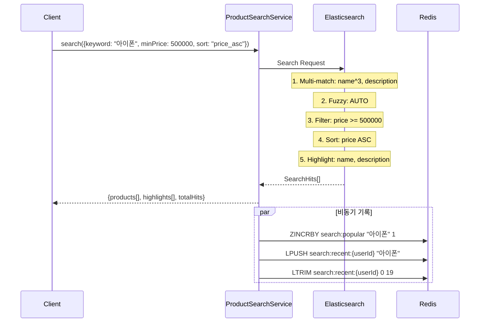
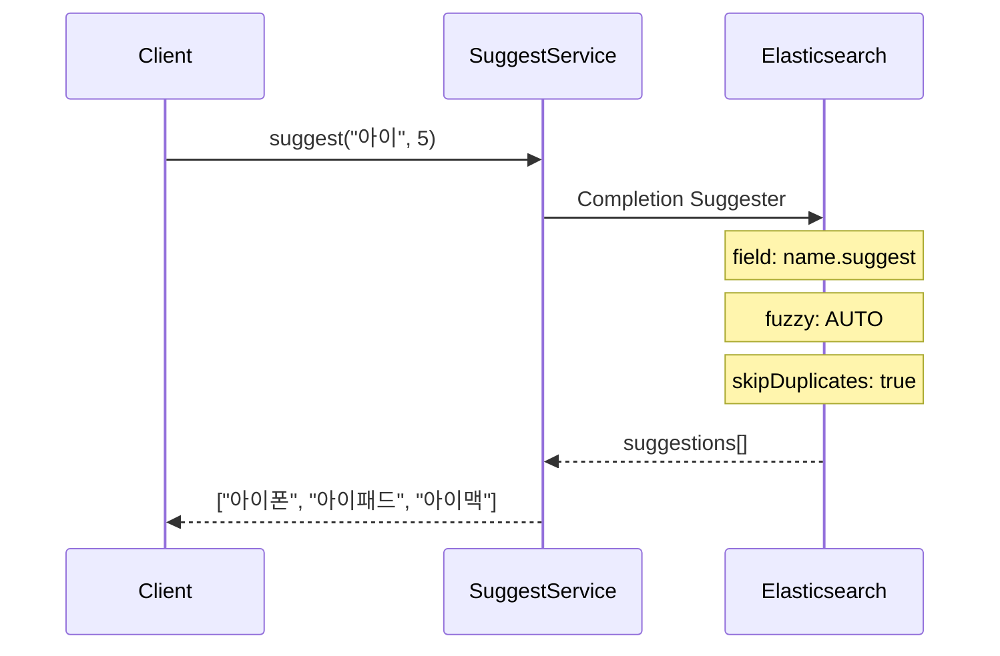
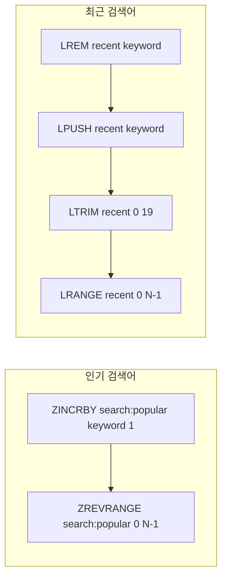

# Search System Architecture

## 개요

| 항목 | 내용 |
|------|------|
| **범위** | 상품 검색, 자동완성, 인기/최근 검색어 |
| **주요 기술** | Elasticsearch, Redis, Spring Boot |
| **배포 환경** | Shopping Service 내 Search 도메인 |
| **관련 서비스** | Product (인덱싱 대상) |

Elasticsearch를 활용한 full-text 검색과 Completion Suggester 자동완성을 제공하며, Redis로 인기/최근 검색어를 관리합니다.

---

## 아키텍처 다이어그램

```mermaid
graph TB
    subgraph "Client"
        C[Client]
    end

    subgraph "Search Domain"
        SC[SearchController]
        PSS[ProductSearchService]
        SS[SuggestService]
        IIS[IndexInitializationService<br/>@PostConstruct]
    end

    subgraph "Elasticsearch"
        IDX[products Index]
        MAP[products-mapping.json]
    end

    subgraph "Redis"
        POP[search:popular<br/>Sorted Set]
        REC[search:recent:{userId}<br/>List]
    end

    subgraph "MySQL"
        PT[(products)]
    end

    C --> SC --> PSS & SS
    PSS --> IDX
    SS --> IDX
    PSS --> POP & REC
    SS --> POP & REC
    IIS -->|App Start| MAP --> IDX
    PT -.->|Sync| IDX
```

---

## 핵심 컴포넌트

### ProductDocument

Elasticsearch에 저장되는 상품 문서:

| 필드 | 타입 | 설명 |
|------|------|------|
| id | Long | 상품 ID |
| name | String | 상품명 (full-text + completion suggester) |
| description | String | 상품 설명 (full-text) |
| price | BigDecimal | 가격 |
| stock | Integer | 재고 |

`Product` 엔티티에서 `ProductDocument.from(product)`으로 변환.

### ProductSearchService

| 메서드 | 설명 |
|--------|------|
| `indexProduct(Product)` | 상품 인덱싱 |
| `updateProduct(Product)` | 상품 업데이트 (Upsert) |
| `deleteProduct(Long)` | 인덱스에서 삭제 |
| `updateStock(Long, Integer)` | 재고만 업데이트 |
| `search(ProductSearchRequest)` | 상품 검색 |

**검색 기능**:
- Multi-match query: `name^3` (부스팅), `description`
- Fuzzy matching: `AUTO`
- Highlight: `name`, `description` 필드 (`<em>` 태그)
- Price range filter: `minPrice`, `maxPrice`
- Sorting: `price_asc`, `price_desc`, `newest`

### SuggestService

| 메서드 | 설명 |
|--------|------|
| `suggest(keyword, size)` | 자동완성 제안 (Completion Suggester) |
| `getPopularKeywords(size)` | 인기 검색어 조회 |
| `incrementSearchCount(keyword)` | 검색 횟수 증가 |
| `getRecentKeywords(userId, size)` | 최근 검색어 조회 |
| `addRecentKeyword(userId, keyword)` | 최근 검색어 추가 |
| `deleteRecentKeyword(userId, keyword)` | 최근 검색어 삭제 |
| `clearRecentKeywords(userId)` | 최근 검색어 전체 삭제 |

### IndexInitializationService

`@PostConstruct` - 서비스 시작 시:
1. `products` 인덱스 존재 확인
2. 없으면 `elasticsearch/products-mapping.json`으로 인덱스 생성
3. 이미 있으면 skip

### ElasticsearchConfig

```java
@Bean RestClient restClient()
@Bean ElasticsearchTransport transport()  // RestClientTransport + JacksonJsonpMapper
@Bean ElasticsearchClient client()
```

URI: `${spring.elasticsearch.uris:http://localhost:9200}`

---

## 데이터 플로우

### 상품 검색



### 자동완성



### 인기/최근 검색어



**인기 검색어**: Redis Sorted Set, score = 검색 횟수 누적
**최근 검색어**: Redis List, 최대 20개 유지, 중복 제거 후 맨 앞에 추가

---

## 기술적 결정

### Elasticsearch를 선택한 이유

| 대안 | 장점 | 단점 | 선택 여부 |
|------|------|------|:---------:|
| **Elasticsearch** | Full-text, 자동완성, 형태소 분석 | 추가 인프라 | **선택** |
| MySQL LIKE/FULLTEXT | 추가 인프라 불필요 | 느림, 한국어 불편 | - |
| Redis Search | 빠름 | 기능 제한적 | - |

### 인덱스 매핑 전략

`products-mapping.json`:
- `name`: text (full-text) + `name.suggest` (completion)
- `description`: text
- `price`: double
- `stock`: integer

### 데이터 동기화

현재: 상품 CRUD 시 `ProductSearchService`를 직접 호출하여 동기 인덱싱
향후: Kafka 이벤트 기반 비동기 인덱싱 고려

---

## 에러 코드

| 코드 | 이름 | 설명 |
|------|------|------|
| S1001 | SEARCH_FAILED | 검색 실패 |
| S1002 | INVALID_SEARCH_QUERY | 잘못된 검색 쿼리 |
| S1003 | INDEX_NOT_FOUND | 인덱스 없음 |
| S1004 | SUGGEST_FAILED | 자동완성 실패 |

---

## API 엔드포인트

| Method | Path | 설명 |
|--------|------|------|
| GET | `/search` | 상품 검색 |
| GET | `/search/suggest` | 자동완성 |
| GET | `/search/popular` | 인기 검색어 |
| GET | `/search/recent` | 최근 검색어 |
| DELETE | `/search/recent` | 최근 검색어 삭제 |

---

## 관련 문서

- [System Overview](./system-overview.md)
- [Data Flow](./data-flow.md) - 전체 데이터 흐름

---

**최종 업데이트**: 2026-02-06
