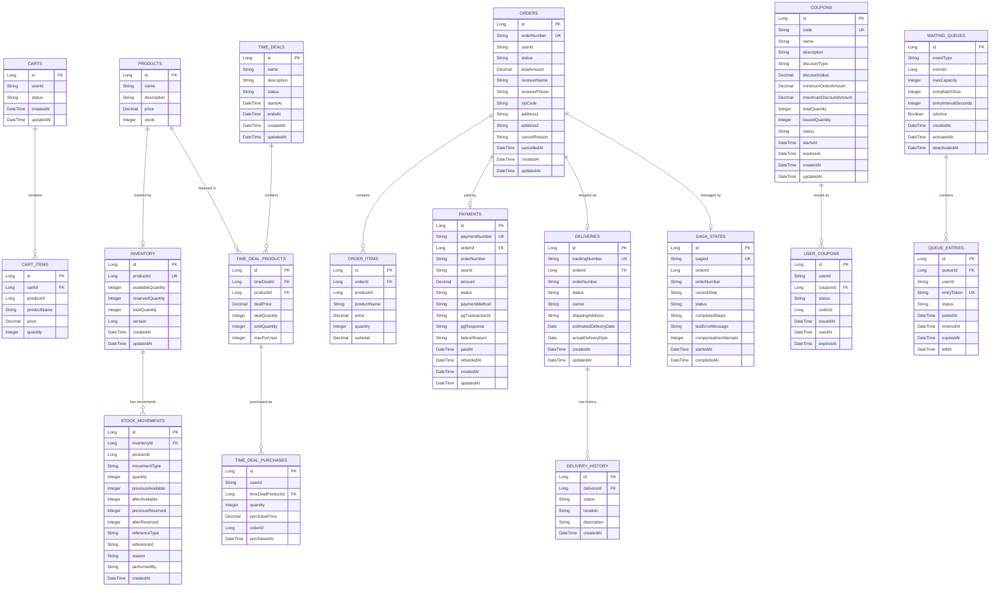

# Shopping Service System Overview

## 개요

Shopping Service는 전자상거래 기능을 제공하는 마이크로서비스입니다. 10개 도메인(Product, Cart, Order, Payment, Delivery, Inventory, Coupon, TimeDeal, Queue, Search)을 포함하며, Saga 패턴 분산 트랜잭션, Redis Lua Script 기반 동시성 제어, Elasticsearch 검색, SSE 실시간 대기열을 구현합니다.

---

## 핵심 특징

- **10개 도메인**: 상품, 장바구니, 주문, 결제, 배송, 재고, 쿠폰, 타임딜, 대기열, 검색
- **Saga 패턴**: 5단계 Forward/Compensation 분산 트랜잭션 관리
- **Redis Lua Script**: 쿠폰 선착순 발급, 타임딜 구매의 원자적 처리
- **Redisson 분산 락**: AOP 기반 `@DistributedLock` (스케줄러, 재고 등)
- **Elasticsearch**: Full-text 검색, 자동완성, 인기/최근 검색어
- **SSE 대기열**: Redis Sorted Set + SSE 실시간 스트리밍
- **Kafka 이벤트 기반**: 9개 topic을 통한 비동기 서비스 간 통신

---

## High-Level Architecture

```mermaid
graph TB
    subgraph "External Systems"
        A[API Gateway]
        K[Kafka Broker]
        ES[(Elasticsearch)]
    end

    subgraph "Shopping Service"
        direction TB

        subgraph "Controllers"
            C1[ProductController]
            C2[CartController]
            C3[OrderController]
            C4[PaymentController]
            C5[DeliveryController]
            C6[InventoryController]
            C7[CouponController]
            C8[TimeDealController]
            C9[QueueController]
            C10[SearchController]
            C11[QueueStreamController<br/>SSE]
        end

        subgraph "Services"
            S1[ProductService]
            S2[CartService]
            S3[OrderService]
            S4[PaymentService]
            S5[DeliveryService]
            S6[InventoryService]
            S7[CouponService]
            S8[TimeDealService]
            S9[QueueService]
            S10[ProductSearchService]
            S11[SuggestService]
        end

        subgraph "Orchestration"
            SAGA[OrderSagaOrchestrator]
            SCHED[TimeDealScheduler]
        end

        subgraph "Redis Integration"
            R1[CouponRedisService<br/>Lua Script]
            R2[TimeDealRedisService<br/>Lua Script]
            R3[QueueService<br/>Sorted Set]
        end

        subgraph "Domains"
            D1[(Product)]
            D2[(Cart/CartItem)]
            D3[(Order/OrderItem)]
            D4[(Payment)]
            D5[(Delivery/DeliveryHistory)]
            D6[(Inventory/StockMovement)]
            D7[(SagaState)]
            D8[(Coupon/UserCoupon)]
            D9[(TimeDeal/TimeDealProduct<br/>TimeDealPurchase)]
            D10[(WaitingQueue/QueueEntry)]
            D11[(ProductDocument)]
        end
    end

    subgraph "Data Store"
        DB[(MySQL)]
        RD[(Redis)]
    end

    A --> C1 & C2 & C3 & C4 & C5 & C6 & C7 & C8 & C9 & C10 & C11

    S3 --> SAGA
    SCHED --> S8

    S7 --> R1
    S8 --> R2
    S9 --> R3

    S10 --> ES
    S11 --> ES

    D1 & D2 & D3 & D4 & D5 & D6 & D7 & D8 & D9 & D10 --> DB
    R1 & R2 & R3 --> RD
    D11 --> ES
```



---

## 도메인 구조

### 1. Product (상품)

| 항목 | 내용 |
|------|------|
| **역할** | 상품 정보 관리 (CRUD) |
| **엔티티** | `Product` |
| **주요 필드** | id, name, description, price (DECIMAL), stock |
| **API** | GET/POST/PUT/DELETE `/api/v1/shopping/products` |
| **에러코드** | S0XX (S001~S010) |

### 2. Cart (장바구니)

| 항목 | 내용 |
|------|------|
| **역할** | 사용자별 장바구니 관리 |
| **엔티티** | `Cart`, `CartItem` |
| **상태** | ACTIVE, CHECKED_OUT |
| **관계** | Cart 1:N CartItem |
| **API** | GET/POST/PUT/DELETE `/api/v1/shopping/cart` |
| **에러코드** | S1XX (S101~S107) |

**CartItem 구조**:
- productId, productName (스냅샷), price (추가 시점), quantity, subtotal

### 3. Order (주문)

| 항목 | 내용 |
|------|------|
| **역할** | 주문 생성 및 상태 관리 |
| **엔티티** | `Order`, `OrderItem` |
| **주문 번호** | `ORD-YYYYMMDD-XXXXXXXX` |
| **상태** | PENDING -> CONFIRMED -> PAID -> SHIPPING -> DELIVERED |
| **API** | GET/POST/PUT `/api/v1/shopping/orders` |
| **에러코드** | S2XX (S201~S212) |

**주문 상태 전이**:
```
PENDING -> CONFIRMED -> PAID -> SHIPPING -> DELIVERED
   |           |
CANCELLED   REFUNDED
```

### 4. Payment (결제)

| 항목 | 내용 |
|------|------|
| **역할** | 결제 처리 및 PG 연동 (Mock) |
| **엔티티** | `Payment` |
| **결제 번호** | `PAY-XXXXXXXX` |
| **상태** | PENDING -> PROCESSING -> COMPLETED/FAILED |
| **결제 수단** | CREDIT_CARD, BANK_TRANSFER, VIRTUAL_ACCOUNT, KAKAO_PAY, NAVER_PAY |
| **API** | POST/GET `/api/v1/shopping/payments` |
| **에러코드** | S3XX (S301~S313) |

**Mock PG Client**: 테스트 환경 90% 성공, 10% 실패

### 5. Delivery (배송)

| 항목 | 내용 |
|------|------|
| **역할** | 배송 추적 및 상태 관리 |
| **엔티티** | `Delivery`, `DeliveryHistory` |
| **운송장 번호** | `TRK-XXXXXXXXXXXX` |
| **상태** | PREPARING -> SHIPPED -> IN_TRANSIT -> DELIVERED |
| **API** | GET/PUT `/api/v1/shopping/deliveries` |
| **에러코드** | S5XX (S501~S507) |

### 6. Inventory (재고)

| 항목 | 내용 |
|------|------|
| **역할** | 재고 관리 및 동시성 제어 |
| **엔티티** | `Inventory`, `StockMovement` |
| **재고 유형** | availableQuantity (가용), reservedQuantity (예약), totalQuantity (전체) |
| **동시성 제어** | Pessimistic Write Lock + Redisson 분산 락 |
| **API** | GET/POST/PUT `/api/v1/shopping/inventory` |
| **에러코드** | S4XX (S401~S408) |

**재고 이동 타입**:

| 타입 | 설명 | 재고 변동 |
|------|------|----------|
| PURCHASE | 입고 | available +, total + |
| SALE | 판매 | available - |
| RESERVATION | 주문 예약 | available -> reserved |
| RELEASE | 예약 해제 | reserved -> available |
| ADJUSTMENT | 수동 조정 | 직접 설정 |

### 7. Coupon (쿠폰) - [상세 문서](./coupon-system.md)

| 항목 | 내용 |
|------|------|
| **역할** | 선착순 쿠폰 발급 및 관리 |
| **엔티티** | `Coupon`, `UserCoupon` |
| **동시성 제어** | Redis Lua Script (`coupon_issue.lua`) |
| **할인 유형** | FIXED (정액), PERCENTAGE (정률) |
| **API** | GET/POST `/api/v1/shopping/coupons` |
| **에러코드** | S6XX (S601~S611) |

### 8. TimeDeal (타임딜) - [상세 문서](./timedeal-system.md)

| 항목 | 내용 |
|------|------|
| **역할** | 시간 한정 할인 상품 판매 |
| **엔티티** | `TimeDeal`, `TimeDealProduct`, `TimeDealPurchase` |
| **상태** | SCHEDULED -> ACTIVE -> ENDED |
| **동시성 제어** | Redis Lua Script (`timedeal_purchase.lua`) |
| **스케줄러** | 1분 간격, 분산 락 적용 |
| **API** | GET/POST `/api/v1/shopping/time-deals` |
| **에러코드** | S7XX (S701~S708) |

### 9. Queue (대기열) - [상세 문서](./queue-system.md)

| 항목 | 내용 |
|------|------|
| **역할** | 이벤트 대기열 관리 및 실시간 상태 알림 |
| **엔티티** | `WaitingQueue`, `QueueEntry` |
| **기술** | Redis Sorted Set (ZADD/ZRANK/ZPOPMIN) + SSE |
| **이벤트 유형** | TIMEDEAL, FLASH_SALE 등 |
| **API** | POST/GET `/api/v1/shopping/queue`, SSE `/subscribe` |
| **에러코드** | S8XX (S801~S806) |

### 10. Search (검색) - [상세 문서](./search-system.md)

| 항목 | 내용 |
|------|------|
| **역할** | 상품 검색, 자동완성, 인기/최근 검색어 |
| **도큐먼트** | `ProductDocument` (Elasticsearch) |
| **기술** | Elasticsearch (full-text, completion suggester) + Redis |
| **기능** | Multi-match, fuzzy, highlight, price range filter |
| **API** | GET `/api/v1/shopping/search` |
| **에러코드** | S10XX (S1001~S1004) |

---

## 데이터베이스 스키마

### ERD



### 테이블 요약

| # | 테이블 | 설명 | Migration |
|---|--------|------|-----------|
| 1 | products | 상품 정보 | V1 |
| 2 | inventory | 재고 관리 | V2 |
| 3 | stock_movements | 재고 이동 이력 | V2 |
| 4 | carts | 장바구니 | V3 |
| 5 | cart_items | 장바구니 항목 | V3 |
| 6 | orders | 주문 | V4 |
| 7 | order_items | 주문 항목 | V4 |
| 8 | payments | 결제 | V5 |
| 9 | deliveries | 배송 | V6 |
| 10 | delivery_history | 배송 이력 | V6 |
| 11 | saga_states | Saga 상태 | V7 |
| 12 | coupons | 쿠폰 정의 | V9 |
| 13 | user_coupons | 사용자 쿠폰 | V9 |
| 14 | time_deals | 타임딜 | V10 |
| 15 | time_deal_products | 타임딜 상품 | V10 |
| 16 | time_deal_purchases | 타임딜 구매 | V10 |
| 17 | waiting_queues | 대기열 | V12 |
| 18 | queue_entries | 대기열 항목 | V12 |

### 인덱스 전략

| 테이블 | 인덱스 | 컬럼 | 목적 |
|--------|--------|------|------|
| products | idx_products_name | name | 상품명 조회 |
| orders | idx_order_number | order_number (UK) | 주문번호 조회 |
| orders | idx_order_user_id | user_id | 사용자별 주문 조회 |
| orders | idx_order_status | status | 상태별 주문 조회 |
| orders | idx_order_created_at | created_at | 날짜별 조회 |
| payments | idx_payment_number | payment_number (UK) | 결제번호 조회 |
| payments | idx_payment_order_id | order_id | 주문별 결제 조회 |
| deliveries | idx_delivery_tracking | tracking_number (UK) | 운송장 조회 |
| inventory | idx_inventory_product | product_id (UK) | 상품별 재고 조회 |
| saga_states | idx_saga_order | order_number | 주문별 Saga 조회 |
| coupons | idx_coupon_code | code (UK) | 쿠폰 코드 조회 |
| user_coupons | uk_user_coupon | (user_id, coupon_id) UK | 중복 발급 방지 |
| queue_entries | idx_queue_user | (queue_id, user_id) | 대기열 사용자 조회 |
| queue_entries | idx_entry_token | entry_token (UK) | 토큰 조회 |
| time_deal_purchases | idx_tdp_user | (user_id, time_deal_product_id) | 구매 제한 확인 |

---

## 외부 연동

### Kafka 이벤트 발행

| 이벤트 | Topic | 발행자 | 발행 시점 |
|--------|-------|--------|----------|
| OrderCreatedEvent | `shopping.order.created` | OrderService | 주문 생성 |
| OrderConfirmedEvent | `shopping.order.confirmed` | OrderService | 주문 확정 |
| OrderCancelledEvent | `shopping.order.cancelled` | OrderService | 주문 취소 |
| PaymentCompletedEvent | `shopping.payment.completed` | PaymentService | 결제 완료 |
| PaymentFailedEvent | `shopping.payment.failed` | PaymentService | 결제 실패 |
| InventoryReservedEvent | `shopping.inventory.reserved` | InventoryService | 재고 예약 |
| DeliveryShippedEvent | `shopping.delivery.shipped` | DeliveryService | 배송 발송 |
| CouponIssuedEvent | `shopping.coupon.issued` | CouponService | 쿠폰 발급 |
| TimeDealStartedEvent | `shopping.timedeal.started` | TimeDealScheduler | 타임딜 시작 |

**Kafka Producer 설정**: acks=all, retries=3, idempotence=true, partitions=3

### Feign Client

| 대상 서비스 | 용도 | 메서드 | 상태 |
|------------|------|--------|------|
| auth-service | 사용자 정보 조회 | `GET /api/v1/auth/users/{userId}` | 구현됨 |
| blog-service | 상품 리뷰 조회 | `GET /api/blog/reviews?productId={id}` | 구현됨 |

---

## 기술 스택

### Backend

| 항목 | 기술 |
|------|------|
| Language | Java 17 |
| Framework | Spring Boot 3.5.5 |
| Security | Spring Security + JWT |
| ORM | Spring Data JPA (Hibernate) |
| Database | MySQL 8.0 |
| Cache/Lock | Redis + Redisson (분산 락, Lua Script) |
| Search | Elasticsearch (full-text, completion suggester) |
| Messaging | Spring Kafka |
| API Client | Spring Cloud OpenFeign |
| Validation | Jakarta Bean Validation |
| Logging | SLF4J + Logback |
| Real-time | SSE (SseEmitter) |

### Infrastructure

| 항목 | 기술 |
|------|------|
| Container | Docker |
| Orchestration | Kubernetes |
| Message Broker | Kafka 4.1.0 (KRaft) |
| Monitoring | Prometheus, Grafana |
| Tracing | Zipkin |

### Redis 활용

| 용도 | 데이터 구조 | Key 패턴 |
|------|------------|----------|
| 쿠폰 재고 | String | `coupon:stock:{couponId}` |
| 쿠폰 발급 목록 | Set | `coupon:issued:{couponId}` |
| 타임딜 재고 | String | `timedeal:stock:{dealId}:{productId}` |
| 타임딜 구매 수량 | String | `timedeal:purchased:{dealId}:{productId}:{userId}` |
| 대기열 | Sorted Set | `queue:waiting:{eventType}:{eventId}` |
| 입장 목록 | Set | `queue:entered:{eventType}:{eventId}` |
| 인기 검색어 | Sorted Set | `search:popular` |
| 최근 검색어 | List | `search:recent:{userId}` |
| 분산 락 | String | `lock:{key}` |

---

## 에러 코드 체계

| 범위 | 도메인 | 예시 |
|------|--------|------|
| S0XX | Product | S001 PRODUCT_NOT_FOUND |
| S1XX | Cart | S101 CART_NOT_FOUND |
| S2XX | Order | S201 ORDER_NOT_FOUND |
| S3XX | Payment | S301 PAYMENT_NOT_FOUND |
| S4XX | Inventory | S402 INSUFFICIENT_STOCK |
| S5XX | Delivery | S501 DELIVERY_NOT_FOUND |
| S6XX | Coupon | S601 COUPON_NOT_FOUND |
| S7XX | TimeDeal | S701 TIMEDEAL_NOT_FOUND |
| S8XX | Queue | S801 QUEUE_NOT_FOUND |
| S9XX | Saga/System | S901 SAGA_EXECUTION_FAILED |
| S10XX | Search | S1001 SEARCH_FAILED |

---

## 보안

### 인증 및 인가

- API Gateway에서 JWT 검증 수행
- userId는 JWT 토큰에서 추출 (SecurityContext)
- 사용자별 리소스 접근 제어 (Cart, Order, Payment, Coupon)

### 데이터 보호

- 민감 정보는 환경 변수로 관리
- PG 응답은 암호화 저장 고려
- 개인정보는 마스킹 처리 (로그)

---

## 성능 목표

| 지표 | 목표 | 비고 |
|------|------|------|
| 응답 시간 (p95) | < 200ms | 주문 생성 제외 |
| 주문 처리 시간 | < 2초 | Saga 완료까지 |
| 동시 주문 처리 | 100 TPS | 재고 Lock 고려 |
| 쿠폰 발급 | < 50ms | Redis Lua Script |
| 상품 검색 | < 100ms | Elasticsearch |
| 대기열 순번 조회 | < 30ms | Redis ZRANK |
| 가용성 | 99.9% | 연간 8.76시간 다운타임 |

---

## 확장 계획

### 단기 (1-3개월)

- [ ] 실제 PG 연동: 토스페이먼츠, 카카오페이
- [ ] 주문 알림: Kafka -> notification-service 연동 완성
- [ ] Redis 캐싱: 상품 정보 캐시 (현재 재고/쿠폰/타임딜/검색에만 적용)
- [ ] 쿠폰-주문 연동: Order 생성 시 UserCoupon 적용 및 할인 계산

### 중기 (3-6개월)

- [ ] 배송 추적 API: 실제 택배사 연동
- [ ] 반품/교환: Return 도메인 추가
- [ ] 대량 주문 처리: Batch Job
- [ ] 타임딜-대기열 연동: 대기열 통과 후 타임딜 구매 허용

### 장기 (6-12개월)

- [ ] 서비스 분리: Order, Payment, Inventory 각각 독립 서비스화
- [ ] Event Sourcing: 주문 이벤트 완전 추적
- [ ] CQRS 패턴: Command/Query 분리
- [ ] GraphQL API: 프론트엔드 유연성 향상

---

## 관련 문서

### Architecture
- [Data Flow](./data-flow.md) - 전체 데이터 흐름
- [Saga Pattern](./saga-pattern.md) - 5단계 분산 트랜잭션
- [Coupon System](./coupon-system.md) - Redis Lua 선착순 발급
- [TimeDeal System](./timedeal-system.md) - Scheduler 라이프사이클
- [Queue System](./queue-system.md) - Redis Sorted Set + SSE
- [Search System](./search-system.md) - Elasticsearch 검색

### API
- [Product API](../../api/shopping-service/api-product.md)
- [Order API](../../api/shopping-service/api-order.md)
- [Payment API](../../api/shopping-service/api-payment.md)
- [Inventory API](../../api/shopping-service/api-inventory.md)

### Database
- [Shopping Service ERD](../database/shopping-service-erd.md)

---

**최종 업데이트**: 2026-02-06
