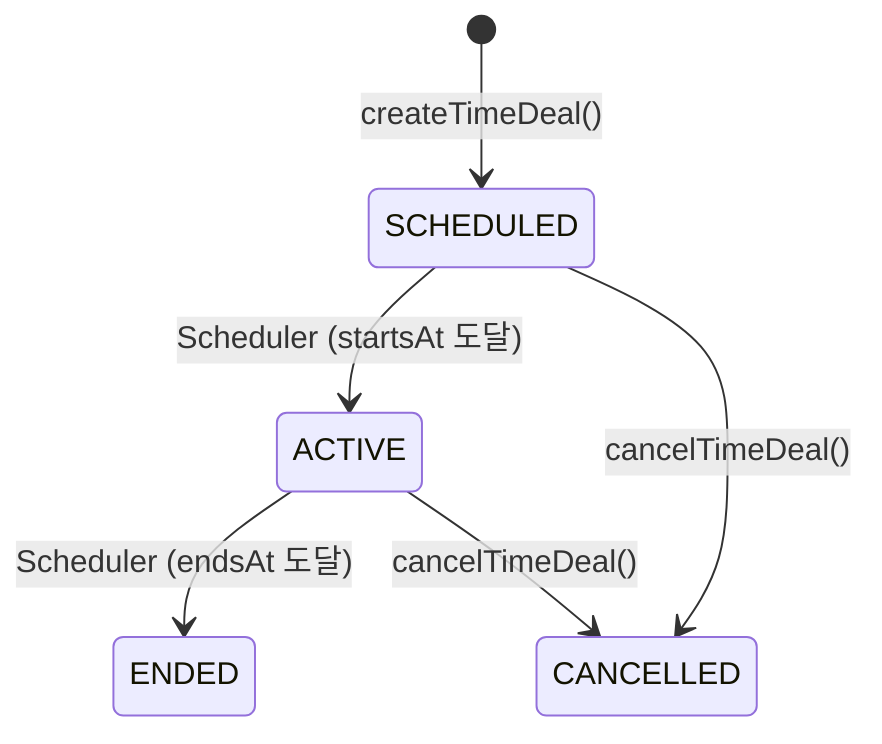
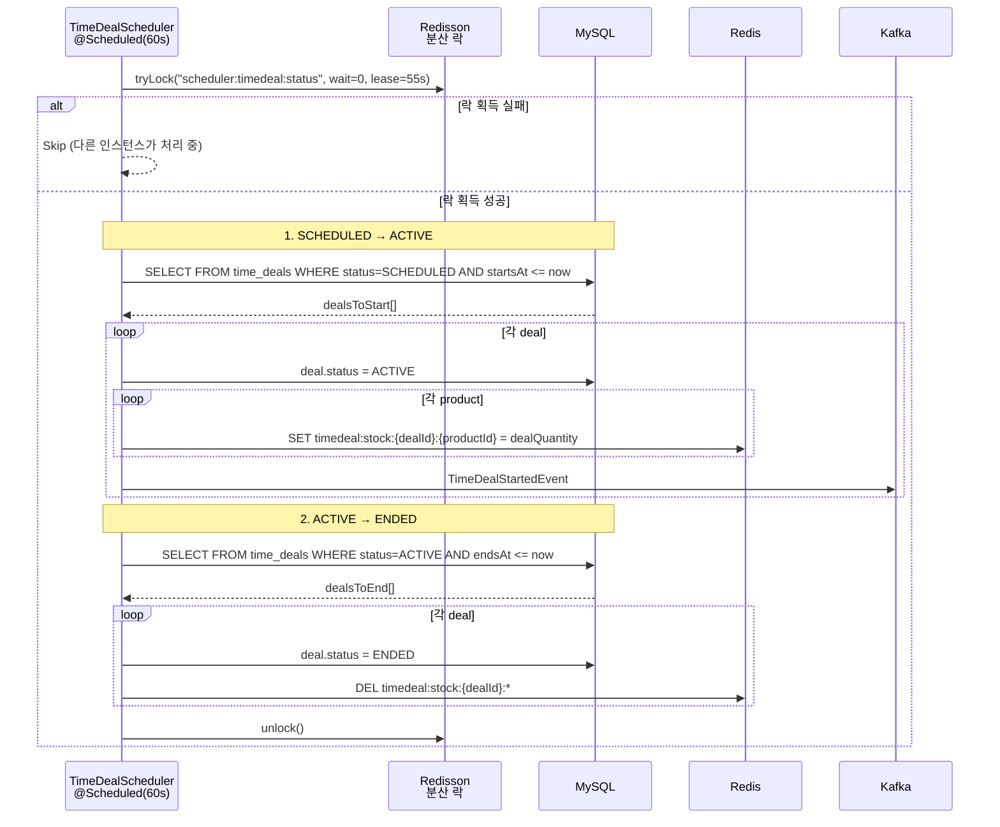
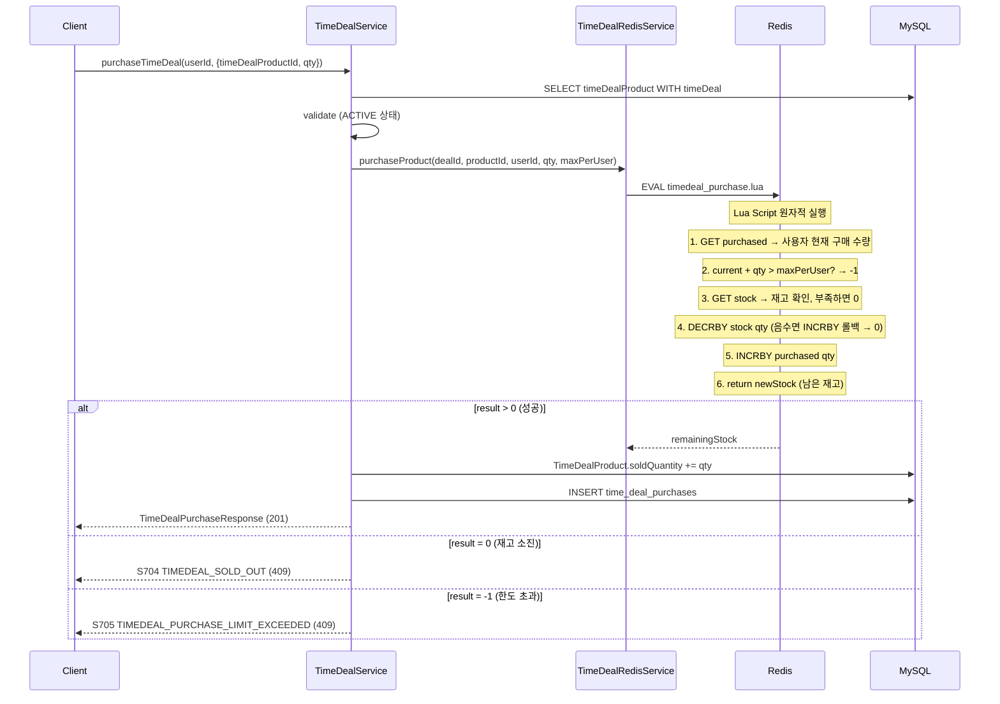

# TimeDeal System Architecture

## 개요

| 항목 | 내용 |
|------|------|
| **범위** | 시간 한정 할인 상품 생성, 라이프사이클 관리, 구매 |
| **주요 기술** | Redis Lua Script, Spring Scheduler, Redisson 분산 락, Kafka |
| **배포 환경** | Shopping Service 내 TimeDeal 도메인 |
| **관련 서비스** | Product (원본 상품), Queue (대기열 연동 예정) |

타임딜은 `SCHEDULED -> ACTIVE -> ENDED` 상태 머신으로 관리되며, 1분 간격 스케줄러가 상태 전환을 수행합니다. 구매는 Redis Lua Script로 원자적 동시성 제어를 수행하고, 1인당 구매 한도를 강제합니다.

---

## 아키텍처 다이어그램

```mermaid
graph TB
    subgraph "Client"
        C[Client]
    end

    subgraph "TimeDeal Domain"
        TC[TimeDealController]
        TS[TimeDealServiceImpl]
        TRS[TimeDealRedisService]
        SCHED[TimeDealScheduler<br/>@Scheduled 1분]
        INIT[TimeDealRedisInitializer<br/>@ApplicationReady]
    end

    subgraph "Redis"
        RS[timedeal:stock:{d}:{p}<br/>String]
        RP[timedeal:purchased:{d}:{p}:{u}<br/>String]
        LUA[timedeal_purchase.lua]
        LOCK[lock:scheduler:timedeal:status]
    end

    subgraph "MySQL"
        TDT[(time_deals)]
        TDPT[(time_deal_products)]
        TDPU[(time_deal_purchases)]
    end

    subgraph "Kafka"
        K[shopping.timedeal.started]
    end

    C --> TC --> TS
    TS --> TRS --> LUA
    LUA --> RS & RP
    TS --> TDT & TDPT & TDPU
    SCHED -->|분산 락| LOCK
    SCHED --> TS
    SCHED --> K
    INIT -->|App Start| RS
```

---

## 핵심 컴포넌트

### TimeDeal 엔티티

| 필드 | 타입 | 설명 |
|------|------|------|
| id | Long | PK |
| name | String | 타임딜명 |
| description | String | 설명 |
| status | TimeDealStatus | SCHEDULED, ACTIVE, ENDED, CANCELLED |
| startsAt | DateTime | 시작 일시 |
| endsAt | DateTime | 종료 일시 |
| products | List\<TimeDealProduct\> | 타임딜 상품 목록 |

### TimeDealProduct 엔티티

| 필드 | 타입 | 설명 |
|------|------|------|
| id | Long | PK |
| timeDeal | TimeDeal (FK) | 타임딜 참조 |
| product | Product (FK) | 원본 상품 참조 |
| dealPrice | BigDecimal | 할인 가격 |
| dealQuantity | Integer | 타임딜 수량 |
| soldQuantity | Integer | 판매된 수량 (default 0) |
| maxPerUser | Integer | 1인당 최대 구매 수량 |

### TimeDealPurchase 엔티티

| 필드 | 타입 | 설명 |
|------|------|------|
| id | Long | PK |
| userId | String | 사용자 ID |
| timeDealProduct | TimeDealProduct (FK) | 타임딜 상품 참조 |
| quantity | Integer | 구매 수량 |
| purchasePrice | BigDecimal | 구매 가격 |
| orderId | Long | 주문 ID |
| purchasedAt | DateTime | 구매 일시 |

**Index**: (user_id, time_deal_product_id) - 구매 제한 확인

---

## 데이터 플로우

### 상태 머신



### TimeDealScheduler 동작



**분산 락 설정**:
- Key: `lock:scheduler:timedeal:status`
- waitTime: 0 (즉시 포기)
- leaseTime: 55초 (스케줄 간격 60초보다 짧게)

### 타임딜 구매 흐름



### Lua Script 상세 (`timedeal_purchase.lua`)

```
KEYS[1] = timedeal:stock:{dealId}:{productId}
KEYS[2] = timedeal:purchased:{dealId}:{productId}:{userId}
ARGV[1] = requestedQuantity
ARGV[2] = maxPerUser

1. GET KEYS[2]                     → 사용자 현재 구매 수량
2. currentPurchased + qty > max?   → return -1 (한도 초과)
3. GET KEYS[1]                     → 현재 재고
4. stock < qty?                    → return 0 (재고 부족)
5. DECRBY KEYS[1] qty              → 재고 감소
6. newStock < 0? INCRBY 롤백       → return 0
7. INCRBY KEYS[2] qty              → 구매 수량 증가
8. return newStock                  → 성공 (남은 재고)
```

---

## 초기화

### TimeDealRedisInitializer

`@EventListener(ApplicationReadyEvent.class)` - 서비스 시작 시:
1. ACTIVE 상태 타임딜 조회 (with products)
2. 각 product의 남은 재고 계산: `dealQuantity - soldQuantity`
3. Redis에 재고 복원: `timedeal:stock:{dealId}:{productId}`

서비스 재시작 시 MySQL -> Redis 동기화 보장.

---

## 기술적 결정

### Scheduler + 분산 락

| 대안 | 장점 | 단점 | 선택 여부 |
|------|------|------|:---------:|
| **@Scheduled + Redisson Lock** | 단순, 즉시 적용 | 1분 지연 가능 | **선택** |
| Quartz Scheduler | 정밀 스케줄링 | 복잡, DB 의존 | - |
| Redis Pub/Sub | 실시간 | 메시지 유실 가능 | - |
| Spring Batch | 대량 처리 | 오버스펙 | - |

### 1인당 구매 제한

- Redis Key: `timedeal:purchased:{dealId}:{productId}:{userId}`
- Lua Script 내에서 원자적으로 확인 + 증가
- DB에도 `(user_id, time_deal_product_id)` 인덱스로 쿼리 가능

---

## 에러 코드

| 코드 | 이름 | 설명 |
|------|------|------|
| S701 | TIMEDEAL_NOT_FOUND | 타임딜 없음 |
| S702 | TIMEDEAL_NOT_ACTIVE | 비활성 상태 |
| S703 | TIMEDEAL_EXPIRED | 만료됨 |
| S704 | TIMEDEAL_SOLD_OUT | 재고 소진 |
| S705 | TIMEDEAL_PURCHASE_LIMIT_EXCEEDED | 구매 한도 초과 |
| S706 | TIMEDEAL_PRODUCT_NOT_FOUND | 타임딜 상품 없음 |
| S707 | TIMEDEAL_ALREADY_EXISTS | 이미 존재 |
| S708 | TIMEDEAL_INVALID_PERIOD | 잘못된 기간 설정 |

---

## API 엔드포인트

| Method | Path | 설명 |
|--------|------|------|
| GET | `/time-deals` | 진행중 타임딜 목록 |
| GET | `/time-deals/{timeDealId}` | 특정 타임딜 조회 |
| POST | `/time-deals/purchase` | 타임딜 상품 구매 |
| GET | `/time-deals/my/purchases` | 내 구매 내역 |

---

## 관련 문서

- [System Overview](./system-overview.md)
- [Data Flow](./data-flow.md) - 전체 데이터 흐름
- [Coupon System](./coupon-system.md) - 유사한 Redis Lua 패턴
- [Queue System](./queue-system.md) - 대기열 연동 예정

---

**최종 업데이트**: 2026-02-06
