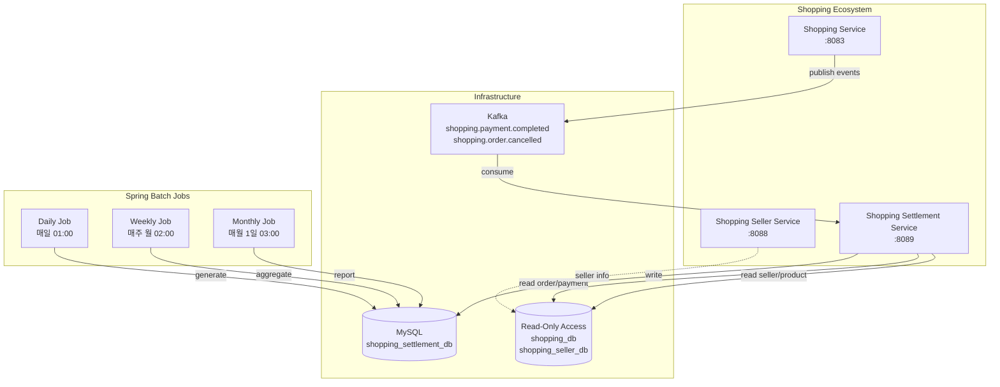

# Shopping Settlement Service 아키텍처: System Overview

## 개요

Shopping Settlement Service는 판매자 정산을 담당하는 Spring Batch 기반 배치 처리 시스템입니다. 2026-02-14 Shopping Service 분해를 통해 독립된 서비스로, 주문/결제 이벤트를 실시간으로 수집하고 일/주/월 단위로 집계하여 정산 내역을 생성합니다.

| 항목 | 내용 |
|------|------|
| **범위** | Service |
| **주요 기술** | Spring Boot 3.5.5, Spring Batch, MySQL, Kafka |
| **배포 환경** | Kubernetes, Docker Compose |
| **관련 서비스** | shopping-service (주문/결제), shopping-seller-service (판매자 정보) |
| **포트** | 8089 |
| **DB** | shopping_settlement_db (MySQL) |

---

## 아키텍처 다이어그램

### High-Level Architecture



### Component Architecture

```
┌──────────────────────────────────────────────────┐
│           Settlement Service (:8089)             │
├──────────────────────────────────────────────────┤
│  Controller Layer                                │
│    └─ SettlementController                       │
│         - GET /periods                           │
│         - POST /periods/{id}/confirm             │
│         - GET /sellers/{id}                      │
├──────────────────────────────────────────────────┤
│  Service Layer                                   │
│    └─ SettlementServiceImpl                      │
│         - getPeriods()                           │
│         - confirmPeriod()                        │
│         - markPeriodPaid()                       │
├──────────────────────────────────────────────────┤
│  Batch Job Layer                                 │
│    ├─ DailySettlementJob                         │
│    ├─ WeeklySettlementJob                        │
│    └─ MonthlySettlementJob                       │
├──────────────────────────────────────────────────┤
│  Event Consumer Layer                            │
│    └─ SettlementEventConsumer                    │
│         - onPaymentCompleted()                   │
│         - onOrderCancelled()                     │
├──────────────────────────────────────────────────┤
│  Domain Layer                                    │
│    ├─ SettlementPeriod                           │
│    ├─ Settlement                                 │
│    ├─ SettlementDetail                           │
│    └─ SettlementLedger                           │
└──────────────────────────────────────────────────┘
```

---

## 핵심 컴포넌트

### 1. SettlementController
**역할**: 정산 조회 및 확정/지급 API 제공

**주요 책임**:
- 정산 주기(Period) 목록/상세 조회
- 판매자별 정산 내역 조회
- 정산 확정 (ADMIN Only)
- 정산 지급 처리 (ADMIN Only)

**기술 스택**:
- Spring MVC
- Spring Security (JWT + OAuth2 Resource Server)
- Jakarta Validation

### 2. Spring Batch Jobs
**역할**: 정산 데이터 집계 및 생성

**주요 책임**:
- **Daily Job** (매일 01:00): 전일 완료 주문 기준 판매자별 매출 집계
- **Weekly Job** (매주 월 02:00): 주간 정산 확정 + 수수료 재계산
- **Monthly Job** (매월 1일 03:00): 월간 정산 리포트 생성

**기술 스택**:
- Spring Batch
- ItemReader (JdbcPagingItemReader)
- ItemProcessor (commission 계산)
- ItemWriter (JpaItemWriter)

### 3. SettlementEventConsumer
**역할**: Kafka 이벤트 구독 및 정산 원장 기록

**주요 책임**:
- `shopping.payment.completed` 이벤트 수신 → 매출 기록
- `shopping.order.cancelled` 이벤트 수신 → 환불 기록

**기술 스택**:
- Spring Kafka
- @KafkaListener

### 4. Domain Model
**역할**: 정산 도메인 엔티티

**핵심 엔티티**:
| 엔티티 | 설명 |
|--------|------|
| `SettlementPeriod` | 정산 주기 (DAILY/WEEKLY/MONTHLY, PENDING/PROCESSING/COMPLETED/FAILED) |
| `Settlement` | 판매자별 정산 (totalSales, commission, netAmount, CALCULATED/CONFIRMED/PAID/DISPUTED) |
| `SettlementDetail` | 주문 단위 정산 상세 (orderNumber, orderAmount, commissionRate) |
| `SettlementLedger` | 정산 원장 (실시간 이벤트 기록, eventType: PAYMENT_COMPLETED/ORDER_CANCELLED) |

---

## 데이터 플로우

### 실시간 이벤트 수집

```
1. Shopping Service → Kafka (PaymentCompletedEvent)
2. SettlementEventConsumer → Kafka 구독
3. SettlementEventConsumer → settlement_ledger 테이블에 기록
   - orderNumber, sellerId, amount, eventType, eventAt
```

### Daily Batch 집계 (매일 01:00)

```
1. DailySettlementJob 시작
2. settlement_periods 생성 (periodType=DAILY, status=PENDING)
3. settlement_ledger 읽기 (전일 00:00:00 ~ 23:59:59)
4. 판매자별 집계:
   - totalSales = SUM(amount WHERE eventType='PAYMENT_COMPLETED')
   - totalRefunds = SUM(amount WHERE eventType='ORDER_CANCELLED')
   - commissionAmount = totalSales * commissionRate (기본 10%)
   - netAmount = totalSales - totalRefunds - commissionAmount
5. settlements 생성 (status=CALCULATED)
6. settlement_details 생성 (주문 단위 상세)
7. settlement_periods 상태 → COMPLETED
```

### 정산 확정 워크플로우

```
1. Admin → POST /api/settlement/periods/{periodId}/confirm
2. SettlementService → 검증 (status=PENDING 확인)
3. Settlement.confirm() → status=CONFIRMED
4. DB 업데이트
```

### 정산 지급 워크플로우

```
1. Admin → POST /api/settlement/periods/{periodId}/pay
2. SettlementService → 검증 (status=CONFIRMED 확인)
3. Settlement.markPaid() → status=PAID, paidAt=now()
4. DB 업데이트
5. (향후) 외부 정산 시스템 연동 또는 이벤트 발행
```

---

## 기술적 결정

### 선택한 패턴
- **Spring Batch**: 대용량 정산 데이터 처리 (Chunk-oriented Processing)
- **Event-Driven**: Kafka 이벤트 기반 실시간 원장 기록
- **Read-Only Multi-DB Access**: shopping_db, shopping_seller_db 읽기 전용 접근 (정산 계산 시 참조)
- **CQRS Pattern**: 쓰기(Batch) / 읽기(API) 분리

### 제약사항
- **Batch Job 실행 시간대**: 오전 1~3시 (트래픽 최소 시간대)
- **commission 계산**: 현재 고정 비율(10%) → 향후 판매자별 차등 적용 고려
- **sellerId 해결**: 현재 하드코딩(1L) → 향후 order-service API 또는 DB Join 필요
- **동시성 제어**: Batch Job 실행 중 API 접근 시 데이터 일관성 (Optimistic Locking 미적용)

### 성능 최적화
- **Batch Chunk Size**: 100 (trade-off: 메모리 vs 트랜잭션 크기)
- **Kafka Consumer Group**: `shopping-settlement-service` (단일 컨슈머, 순서 보장)
- **JPA Batch Insert**: `batch_size=50`, `order_inserts=true`

---

## 배포 및 확장

### 배포 구성

**Kubernetes**:
```yaml
replicas: 1  # Batch Job 중복 실행 방지
resources:
  requests:
    cpu: 500m
    memory: 1Gi
  limits:
    cpu: 1000m
    memory: 2Gi
```

**Profile**:
- `local`: Docker Compose 로컬 개발
- `docker`: Docker Compose 통합 테스트
- `k8s`: Kubernetes 프로덕션

### 확장 전략

**수평 확장 제약**:
- Spring Batch Job은 분산 실행 미지원 (현재 단일 Pod)
- API 레이어만 수평 확장 가능 (StatefulSet → Deployment 변경 필요)

**수직 확장**:
- 메모리 증가 (Batch Chunk Size 확대)
- CPU 증가 (병렬 Step 처리)

**병목 지점 및 대응**:
- **Batch Job 실행 시간**: Partitioning Step 도입 (판매자별 병렬 처리)
- **settlement_ledger 테이블 증가**: Partitioning by eventAt (월별 파티셔닝)
- **API 조회 성능**: Redis 캐싱 (주간/월간 집계 결과)

---

## Database 스키마

### shopping_settlement_db (MySQL)

#### settlement_periods (정산 주기)

| 컬럼 | 타입 | 설명 |
|------|------|------|
| `id` | BIGINT PK | 정산 주기 ID |
| `period_type` | VARCHAR(20) | DAILY, WEEKLY, MONTHLY |
| `start_date` | DATE | 시작일 |
| `end_date` | DATE | 종료일 |
| `status` | VARCHAR(20) | PENDING, PROCESSING, COMPLETED, FAILED |
| `created_at` | TIMESTAMP | 생성 시각 |
| `updated_at` | TIMESTAMP | 수정 시각 |

**Index**: `idx_period_type_start_date` (period_type, start_date)

---

#### settlements (판매자별 정산)

| 컬럼 | 타입 | 설명 |
|------|------|------|
| `id` | BIGINT PK | 정산 ID |
| `period_id` | BIGINT FK | 정산 주기 ID |
| `seller_id` | BIGINT | 판매자 ID |
| `total_sales` | DECIMAL(15,2) | 총 매출액 |
| `total_orders` | INT | 총 주문 건수 |
| `total_refunds` | DECIMAL(15,2) | 총 환불액 |
| `commission_amount` | DECIMAL(15,2) | 수수료 |
| `net_amount` | DECIMAL(15,2) | 순 정산액 |
| `status` | VARCHAR(20) | CALCULATED, CONFIRMED, PAID, DISPUTED |
| `paid_at` | TIMESTAMP | 지급 시각 |
| `created_at` | TIMESTAMP | 생성 시각 |
| `updated_at` | TIMESTAMP | 수정 시각 |

**Index**:
- `idx_period_seller` (period_id, seller_id) UNIQUE
- `idx_seller_created` (seller_id, created_at)

---

#### settlement_details (주문 단위 상세)

| 컬럼 | 타입 | 설명 |
|------|------|------|
| `id` | BIGINT PK | 상세 ID |
| `settlement_id` | BIGINT FK | 정산 ID |
| `order_number` | VARCHAR(50) | 주문 번호 |
| `order_amount` | DECIMAL(15,2) | 주문 금액 |
| `refund_amount` | DECIMAL(15,2) | 환불 금액 |
| `commission_rate` | DECIMAL(5,2) | 수수료율 (%) |
| `commission_amount` | DECIMAL(15,2) | 수수료 |
| `net_amount` | DECIMAL(15,2) | 순액 |
| `created_at` | TIMESTAMP | 생성 시각 |

**Index**: `idx_settlement_order` (settlement_id, order_number)

---

#### settlement_ledger (정산 원장)

| 컬럼 | 타입 | 설명 |
|------|------|------|
| `id` | BIGINT PK | 원장 ID |
| `order_number` | VARCHAR(50) | 주문 번호 |
| `seller_id` | BIGINT | 판매자 ID |
| `event_type` | VARCHAR(50) | PAYMENT_COMPLETED, ORDER_CANCELLED |
| `amount` | DECIMAL(15,2) | 금액 |
| `event_at` | TIMESTAMP | 이벤트 발생 시각 |
| `created_at` | TIMESTAMP | 기록 시각 |

**Index**:
- `idx_event_at` (event_at) - Batch 집계 시 사용
- `idx_seller_event` (seller_id, event_at)

---

#### Spring Batch 메타 테이블 (자동 생성)

- `batch_job_instance`
- `batch_job_execution`
- `batch_job_execution_params`
- `batch_step_execution`
- `batch_step_execution_context`
- `batch_job_execution_context`

---

## Kafka Topics

### Consumed Topics

| Topic | Event | Description |
|-------|-------|-------------|
| `shopping.payment.completed` | `PaymentCompletedEvent` | 결제 완료 시 매출 기록 |
| `shopping.order.cancelled` | `OrderCancelledEvent` | 주문 취소 시 환불 기록 |

**Consumer Group**: `shopping-settlement-service`

### Future Topics (예정)

| Topic | Event | Description |
|-------|-------|-------------|
| `settlement.period.completed` | `SettlementPeriodCompletedEvent` | 정산 주기 완료 통지 (향후 알림 서비스 연동) |
| `settlement.paid` | `SettlementPaidEvent` | 정산 지급 완료 통지 (판매자 알림) |

---

## API Summary

**Base URL**: `/api/settlement`

| Method | Endpoint | 설명 | 권한 |
|--------|----------|------|------|
| GET | `/periods` | 정산 주기 목록 조회 | ADMIN/SELLER |
| GET | `/periods/{periodId}` | 정산 주기 상세 조회 | ADMIN/SELLER |
| GET | `/sellers/{sellerId}` | 판매자별 정산 목록 조회 | ADMIN/SELLER |
| POST | `/periods/{periodId}/confirm` | 정산 확정 | ADMIN |
| POST | `/periods/{periodId}/pay` | 정산 지급 처리 | ADMIN |

**자세한 API 명세**: [Shopping Settlement Service API](../../api/shopping-settlement-service/README.md)

---

## Security

### 인증 (Authentication)
- **JWT Bearer Token**: auth-service에서 발급
- **OAuth2 Resource Server**: Spring Security OAuth2 Resource Server 사용

### 권한 (Authorization)
- **ADMIN**: 모든 API 접근 가능 (확정/지급 권한)
- **SELLER**: 본인 sellerId로만 정산 조회 가능

### 데이터 보호
- **민감 정보**: 판매자 정산 금액 (netAmount)는 본인 또는 ADMIN만 접근
- **Audit**: settlements 테이블 변경 이력 (created_at, updated_at)

---

## Monitoring & Observability

### Actuator Endpoints

| Endpoint | 설명 |
|----------|------|
| `/actuator/health` | 헬스 체크 |
| `/actuator/info` | 서비스 정보 |
| `/actuator/prometheus` | Prometheus 메트릭 |
| `/actuator/metrics` | Spring Boot 메트릭 |

### Key Metrics

- **Batch Job 실행 시간**: `batch.job.execution.duration`
- **Batch Job 실패율**: `batch.job.execution.failure.rate`
- **Kafka Consumer Lag**: `kafka.consumer.lag`
- **API 응답 시간**: `http.server.requests.duration`

### Logging

- **SLF4J + Logback**
- **Format**: JSON (구조화 로깅)
- **Level**: INFO (Batch Job), DEBUG (이벤트 소비)

---

## 관련 문서

- [ADR-034: Shopping Service Decomposition](../../adr/ADR-034-shopping-service-decomposition.md)
- [Shopping Settlement Service API](../../api/shopping-settlement-service/README.md)
- [Shopping Service Architecture](../shopping-service/system-overview.md)
- [Shopping Seller Service Architecture](../shopping-seller-service/system-overview.md)

---

**마지막 업데이트**: 2026-02-14
