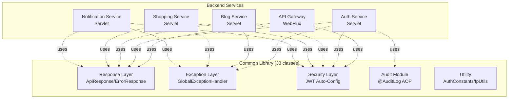

# Common Library 아키텍처

## 개요
Portal Universe의 모든 Java/Spring Boot 기반 백엔드 서비스에서 공유하는 공통 기능 라이브러리입니다. 통일된 API 응답 구조, 전역 예외 처리, JWT 기반 인증/인가, 입력값 보안 검증, 감사 로깅 등의 핵심 기능을 제공합니다.

| 항목 | 내용 |
|------|------|
| **범위** | System |
| **주요 기술** | Spring Boot 3.5.5, Spring Security 6, Bean Validation, AOP |
| **배포 환경** | JAR 라이브러리 (각 서비스 Maven 종속성) |
| **관련 서비스** | api-gateway, auth-service, blog-service, shopping-service, notification-service |

---

## 아키텍처 다이어그램



---

## 디렉토리 구조

```
com.portal.universe.commonlibrary/
├── response/
│   ├── ApiResponse.java         # 통일 응답 래퍼 (success/fail)
│   └── ErrorResponse.java       # 에러 응답 (code, message, timestamp, path, details)
│
├── exception/
│   ├── ErrorCode.java           # 에러 코드 인터페이스 (getStatus, getMessage)
│   ├── CommonErrorCode.java     # 공통 에러 코드 (C001~C008)
│   ├── CustomBusinessException.java
│   └── GlobalExceptionHandler.java
│
├── security/
│   ├── config/
│   │   ├── JwtSecurityAutoConfiguration.java  # Servlet/Reactive 자동 감지
│   │   └── GatewayUserWebConfig.java
│   ├── converter/
│   │   ├── JwtAuthenticationConverterAdapter.java     # Servlet용 JWT 변환
│   │   └── ReactiveJwtAuthenticationConverterAdapter.java  # WebFlux용 JWT 변환
│   ├── context/
│   │   ├── GatewayUser.java (record)        # userId, email, roles, memberships
│   │   ├── CurrentUser.java (annotation)    # Controller 파라미터 주입
│   │   ├── CurrentUserArgumentResolver.java
│   │   ├── SecurityUtils.java               # 권한 검사 유틸
│   │   └── MembershipContext.java           # 서비스별 멤버십 티어 조회
│   ├── filter/
│   │   ├── GatewayAuthenticationFilter.java # X-User-* 헤더 → SecurityContext
│   │   └── XssFilter.java (deprecated)      # @NoXss 어노테이션 방식 선호
│   ├── xss/
│   │   ├── NoXss.java, NoXssValidator.java
│   │   ├── SafeHtml.java, SafeHtmlValidator.java
│   │   └── XssUtils.java
│   ├── sql/
│   │   ├── NoSqlInjection.java, NoSqlInjectionValidator.java
│   │   └── SqlInjectionUtils.java
│   ├── audit/
│   │   ├── AuditLog.java (annotation)
│   │   ├── AuditLogAspect.java
│   │   ├── SecurityAuditEvent.java
│   │   ├── SecurityAuditEventType.java (12가지 이벤트 타입)
│   │   ├── SecurityAuditService.java
│   │   └── SecurityAuditServiceImpl.java
│   └── constants/
│       └── AuthConstants.java    # 헤더명, Redis 키, JWT Claims, Roles, 쿠키명
│
└── util/
    └── IpUtils.java               # X-Forwarded-For 우선 IP 추출
```

**⚠️ 이벤트 패키지 없음**: Kafka 이벤트 클래스는 각 서비스별 독립 모듈(`auth-events`, `shopping-events`, `blog-events`, `prism-events`)로 분리되어 있습니다.

---

## 핵심 컴포넌트

### 1. Response Layer

**역할**: 모든 REST API 응답을 통일된 구조로 래핑

**주요 클래스**:
- `ApiResponse<T>`: 성공/실패 상태를 포함한 통일 응답 래퍼
- `ErrorResponse`: 에러 코드, 메시지, 타임스탬프, 요청 경로, 상세 정보 포함

**사용 예시**:
```java
// Controller에서 성공 응답
return ResponseEntity.ok(ApiResponse.success(userDto));

// GlobalExceptionHandler에서 에러 응답
return ResponseEntity.status(HttpStatus.BAD_REQUEST)
    .body(ApiResponse.fail(ErrorResponse.of(CommonErrorCode.INVALID_INPUT_VALUE)));
```

**기술 스택**:
- Spring Web MVC / WebFlux 이중 지원

---

### 2. Exception Layer

**역할**: 전역 예외 처리 및 일관된 에러 응답 생성

**주요 책임**:
- `ErrorCode` 인터페이스: 모든 서비스별 에러 코드가 구현해야 할 계약 (getStatus, getMessage, getCode)
- `CommonErrorCode`: C001~C008 공통 에러 코드 정의
  - `C001`: INTERNAL_SERVER_ERROR
  - `C002`: INVALID_INPUT_VALUE
  - `C003`: NOT_FOUND
  - `C004`: FORBIDDEN
  - `C005`: UNAUTHORIZED
  - `C006`: XSS_DETECTED
  - `C007`: SQL_INJECTION_DETECTED
  - `C008`: INVALID_HTML_CONTENT
- `CustomBusinessException`: 비즈니스 로직 예외 (메시지 포맷팅 지원)
- `GlobalExceptionHandler`: @ControllerAdvice 기반 전역 예외 처리

**기술 스택**:
- Spring Web Exception Handling (@ControllerAdvice)
- Bean Validation API

---

### 3. Security Layer

**역할**: JWT 인증/인가, Gateway User 전파, 입력값 보안 검증

#### 3.1 JWT Auto-Configuration
**특징**: Servlet(일반 서비스)와 Reactive(API Gateway) 자동 감지 후 적절한 Converter Bean 등록

```java
// JwtSecurityAutoConfiguration
@ConditionalOnClass(name = "org.springframework.web.reactive.DispatcherHandler")
→ ReactiveJwtAuthenticationConverterAdapter 등록 (API Gateway용)

@ConditionalOnMissingClass("org.springframework.web.reactive.DispatcherHandler")
→ JwtAuthenticationConverterAdapter 등록 (일반 서비스용)
```

#### 3.2 Gateway User Propagation
**플로우**:
```
1. API Gateway: JWT 검증 → X-User-Id, X-User-Email, X-User-Roles 헤더 추가
2. Downstream Service: GatewayAuthenticationFilter가 헤더 읽음
3. SecurityContext에 GatewayUser 객체 저장
4. Controller에서 @CurrentUser 어노테이션으로 주입
```

**GatewayUser (record)**:
```java
public record GatewayUser(
    String userId,
    String email,
    List<String> roles,
    Map<String, String> memberships  // {service: tier}
) {}
```

#### 3.3 Input Validation (어노테이션 기반)
- `@NoXss`: XSS 공격 패턴 감지 (`<script>`, `javascript:`, `onerror=` 등)
- `@SafeHtml`: 허용된 HTML 태그만 통과 (화이트리스트 방식)
- `@NoSqlInjection`: SQL Injection 키워드 감지 (`DROP`, `UNION`, `--` 등)

**기술 스택**:
- Spring Security 6
- Bean Validation API

---

### 4. Audit Module

**역할**: 보안 감사 로깅 (AOP 기반)

**주요 책임**:
- `@AuditLog` 어노테이션을 메서드에 부착하면 자동으로 감사 로그 기록
- `SecurityAuditEventType` 12가지 이벤트 타입 지원:
  1. `LOGIN_SUCCESS`: 로그인 성공
  2. `LOGIN_FAILURE`: 로그인 실패
  3. `LOGOUT`: 로그아웃
  4. `TOKEN_REFRESH`: JWT 토큰 갱신
  5. `TOKEN_REVOKED`: JWT 토큰 폐기
  6. `PASSWORD_CHANGED`: 비밀번호 변경
  7. `ACCOUNT_LOCKED`: 계정 잠금
  8. `ACCOUNT_UNLOCKED`: 계정 잠금 해제
  9. `ACCESS_DENIED`: 접근 거부 (권한 부족)
  10. `PERMISSION_CHANGED`: 권한 변경
  11. `SENSITIVE_DATA_ACCESS`: 민감한 데이터 접근
  12. `ADMIN_ACTION`: 관리자 작업

**사용 예시**:
```java
@AuditLog(eventType = SecurityAuditEventType.LOGIN_SUCCESS)
public void login(String email) {
    // 로그인 로직
}
```

**기술 스택**:
- Spring AOP
- ApplicationEventPublisher (이벤트 발행)

---

### 5. Utility

**역할**: 공통 유틸리티 및 상수 관리

**주요 클래스**:
- `AuthConstants`:
  - 헤더명: `X-User-Id`, `X-User-Email`, `X-User-Roles`, `X-User-Memberships`
  - Redis 키 패턴: `auth:token:{userId}`, `auth:refresh:{userId}`
  - JWT Claims: `user_id`, `email`, `roles`, `memberships`
  - 역할 상수: `ROLE_USER`, `ROLE_ADMIN`, `ROLE_SUPER_ADMIN`
  - 쿠키명: `accessToken`, `refreshToken`
- `IpUtils`: X-Forwarded-For 헤더 우선 확인하여 클라이언트 실제 IP 추출
- `SecurityUtils`: 현재 사용자 권한 검사 (`hasRole`, `hasAnyRole`)
- `MembershipContext`: 서비스별 멤버십 티어 조회 (`getMembershipTier(serviceName)`)

---

## 데이터 플로우

### 인증된 요청 처리
```
1. Client → API Gateway (JWT 검증)
2. API Gateway → Downstream Service (X-User-* 헤더 추가)
3. GatewayAuthenticationFilter → SecurityContext에 GatewayUser 저장
4. Controller → @CurrentUser 파라미터로 사용자 정보 주입
5. Service → SecurityUtils로 권한 검사
6. Service → @AuditLog AOP로 감사 로그 자동 기록
```

### 예외 발생 시 에러 응답
```
1. Service에서 CustomBusinessException(ErrorCode) throw
2. GlobalExceptionHandler가 catch
3. ErrorResponse.of(ErrorCode) 생성
4. ApiResponse.fail(ErrorResponse) 래핑
5. HTTP 상태 코드와 함께 응답
```

### 입력값 보안 검증
```
1. Client → Request DTO (@NoXss, @SafeHtml, @NoSqlInjection 어노테이션)
2. Bean Validation Framework → Validator 실행
3. XssUtils/SqlInjectionUtils → 패턴 검사
4. 검증 실패 시 → MethodArgumentNotValidException
5. GlobalExceptionHandler → CommonErrorCode.XSS_DETECTED 응답
```

---

## 기술적 결정

### 선택한 패턴
- **Servlet/Reactive 이중 지원**: API Gateway(WebFlux)와 일반 서비스(Servlet) 모두 사용 가능하도록 Auto-Configuration 분기
- **어노테이션 기반 보안 검증**: Filter 방식(XssFilter deprecated) 대신 @NoXss 등 Bean Validation 어노테이션 선호 → 선택적 적용 가능
- **Gateway User Propagation**: JWT 재검증 없이 Gateway에서 전파된 헤더 신뢰 → 성능 향상
- **이벤트 패키지 분리**: 공통 라이브러리에 이벤트 클래스 미포함 → 서비스별 독립 모듈로 분리하여 결합도 감소

### 제약사항
- **Servlet/Reactive 동시 사용 불가**: 하나의 서비스에서 두 환경을 혼용하면 Auto-Configuration 충돌 가능
- **GatewayAuthenticationFilter 순서**: Spring Security Filter Chain에서 JWT 인증 필터보다 앞에 위치해야 함
- **@AuditLog AOP Proxy 제약**: private 메서드에는 AOP 미적용 (Spring AOP의 프록시 기반 한계)

---

## 배포 및 확장

### 배포 구성
- **환경**: JAR 라이브러리로 패키징 후 각 서비스 Maven 종속성으로 추가
- **버전 관리**: 부모 POM에서 `common-library.version` 프로퍼티로 통일
- **CI/CD**: common-library 변경 시 모든 종속 서비스 빌드 트리거 필요

### 확장 전략
- **서비스별 커스텀 ErrorCode**: `ErrorCode` 인터페이스를 구현한 서비스별 Enum 추가 (예: `AuthErrorCode`, `ShoppingErrorCode`)
- **추가 감사 이벤트**: `SecurityAuditEventType`에 새 이벤트 타입 추가 시 모든 서비스에 영향 (버전 업데이트 필요)
- **새 보안 검증**: `@NoXss`와 유사한 커스텀 어노테이션 추가 가능 (예: `@NoPathTraversal`)

---

## 관련 문서
- [Common Library 사용 가이드](../../guides/development/common-library-usage.md)
- [Security Architecture](./security-architecture.md)
- [Identity Model](./identity-model.md)
- [API Gateway Architecture](../api-gateway/README.md)

---

## 변경 이력

| 날짜 | 변경 내용 |
|------|-----------|
| 2026-02-06 | 코드 기반 완전 재작성 (ARCH-001 + security-audit-module 통합, 실제 구조 반영) |

---

📂 상세 구현 및 히스토리는 [아카이브](../../old-docs/architecture/system/) 참조
