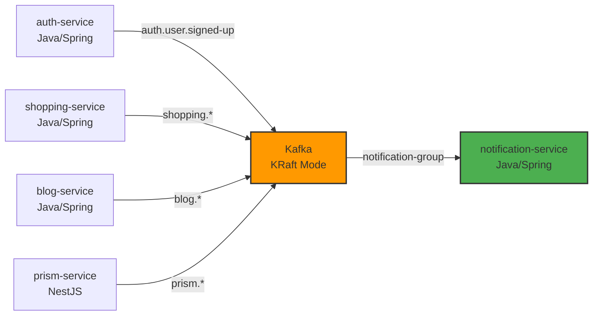

# Event-Driven Architecture: Kafka 기반 비동기 통신

## 개요
Portal Universe의 이벤트 기반 아키텍처는 Apache Kafka를 통해 4개 도메인(Auth, Shopping, Blog, Prism)의 비동기 통신을 처리합니다. 현재 notification-service가 유일한 Consumer로서 모든 도메인 이벤트를 구독하여 사용자 알림을 생성합니다.

| 항목 | 내용 |
|------|------|
| **범위** | System |
| **주요 기술** | Apache Kafka (KRaft Mode), Spring Kafka, NestJS Kafka |
| **배포 환경** | Docker Compose, Kubernetes |
| **관련 서비스** | auth-service, shopping-service, blog-service, prism-service, notification-service |

---

## 아키텍처 다이어그램



---

## Kafka 인프라 개요

### KRaft Mode
- ZooKeeper를 사용하지 않는 최신 Kafka 운영 모드
- Controller 역할을 Kafka 브로커가 직접 수행

### Consumer Configuration
- **Consumer Group**: `notification-group`
- **auto-offset-reset**: `earliest` (처음부터 소비)
- **enable-auto-commit**: `false` (수동 커밋으로 at-least-once 보장)

### Topic 기본 설정
- **파티션 수**: 3
- **Replication Factor**: 1 (dev 환경 기준)
- **Serialization**: StringSerializer (key), JsonSerializer (value)
- **acks**: `all` (모든 replica 동기화 후 응답)
- **retries**: 3회

---

## 전체 토픽 매핑 (16개)

### Topic 명명 규칙

모든 topic은 `{domain}.{entity}.{past-participle}` 패턴을 따른다. Topic 이름의 Single Source of Truth는 각 도메인의 events 모듈에 있는 `*Topics.java` 상수 클래스이다 (ADR-032).

| 토픽 | Publisher | Subscriber | Event Class | 용도 | 상태 |
|------|-----------|------------|-------------|------|------|
| `auth.user.signed-up` | auth-service | notification-service | UserSignedUpEvent | 회원가입 환영 알림 | ✅ Active |
| `shopping.order.created` | shopping-service | notification-service | OrderCreatedEvent | 주문 생성 알림 | ✅ Active |
| `shopping.order.confirmed` | shopping-service | - | OrderConfirmedEvent | (미사용) | ⚠️ Unused |
| `shopping.order.cancelled` | shopping-service | notification-service | OrderCancelledEvent | 주문 취소 알림 | ✅ Active |
| `shopping.payment.completed` | shopping-service | notification-service | PaymentCompletedEvent | 결제 완료 알림 | ✅ Active |
| `shopping.payment.failed` | shopping-service | notification-service | PaymentFailedEvent | 결제 실패 알림 | ✅ Active |
| `shopping.inventory.reserved` | shopping-service | - | InventoryReservedEvent | (미사용) | ⚠️ Unused |
| `shopping.delivery.shipped` | shopping-service | notification-service | DeliveryShippedEvent | 배송 시작 알림 | ✅ Active |
| `shopping.coupon.issued` | shopping-service | notification-service | CouponIssuedEvent | 쿠폰 발급 알림 | ✅ Active |
| `shopping.timedeal.started` | shopping-service | - | TimeDealStartedEvent | 브로드캐스트 (미구현) | ⚠️ Unused |
| `blog.post.liked` | blog-service | notification-service | PostLikedEvent | 좋아요 알림 | ✅ Active |
| `blog.post.commented` | blog-service | notification-service | CommentCreatedEvent | 댓글 알림 | ✅ Active |
| `blog.comment.replied` | blog-service | notification-service | CommentRepliedEvent | 답글 알림 | ✅ Active |
| `blog.user.followed` | blog-service | notification-service | UserFollowedEvent | 팔로우 알림 | ✅ Active |
| `prism.task.completed` | prism-service | notification-service | PrismTaskCompletedEvent | AI 작업 완료 알림 | ✅ Active |
| `prism.task.failed` | prism-service | notification-service | PrismTaskFailedEvent | AI 작업 실패 알림 | ✅ Active |

**주요 특징**:
- 현재 notification-service가 **유일한 Consumer**로 설계됨
- 미사용 토픽 3개는 향후 확장 계획(Saga 패턴, 브로드캐스트 알림 등)을 위해 예약됨
- 토픽 명명 규칙: `{domain}.{entity}.{past-participle}` (예: `shopping.order.created`) - ADR-032

---

## 핵심 컴포넌트

### 1. Event Publishers (4개 서비스)

#### auth-service (Java/Spring)
**역할**: 사용자 인증 도메인 이벤트 발행

**발행 패턴**:
```java
@Component
@RequiredArgsConstructor
public class UserSignupEventHandler {
    private final KafkaTemplate<String, Object> kafkaTemplate;

    @TransactionalEventListener(phase = TransactionPhase.AFTER_COMMIT)
    public void handleUserSignup(UserSignedUpEvent event) {
        kafkaTemplate.send(AuthTopics.USER_SIGNED_UP, event);
    }
}
```

**주요 특징**:
- `@TransactionalEventListener(AFTER_COMMIT)` 사용으로 트랜잭션 완료 후 발행
- DB 커밋 실패 시 이벤트 미발행으로 일관성 보장

#### shopping-service (Java/Spring)
**역할**: 쇼핑 도메인 이벤트 발행 (10개 토픽)

**발행 패턴**:
```java
CompletableFuture<SendResult<String, Object>> future =
    kafkaTemplate.send(topic, orderId, event);

future.whenComplete((result, ex) -> {
    if (ex != null) {
        log.error("Failed to publish event", ex);
    }
});
```

**주요 특징**:
- `enable-idempotence: true` (중복 발행 방지)
- CompletableFuture 비동기 처리
- 주문, 결제, 배송, 쿠폰, 타임딜 등 다양한 도메인 이벤트

#### blog-service (Java/Spring)
**역할**: 블로그 도메인 이벤트 발행 (4개 토픽)

**이벤트 종류**:
- 게시글 좋아요 (`blog.post.liked`)
- 댓글 작성 (`blog.post.commented`)
- 댓글 답글 (`blog.comment.replied`)
- 사용자 팔로우 (`blog.user.followed`)

#### prism-service (NestJS)
**역할**: AI 작업 결과 이벤트 발행

**발행 패턴** (NestJS Kafka):
```typescript
await this.producer.send({
  topic: 'prism.task.completed',
  messages: [
    {
      key: taskId,
      value: JSON.stringify(event)
    }
  ]
});
```

**주요 특징**:
- 유일한 비-Spring 서비스
- JSON 직렬화 후 발행

### 2. Event Subscriber (notification-service)

**역할**: 모든 도메인 이벤트를 소비하여 사용자 알림 생성

**구독 패턴**:
```java
@KafkaListener(
    topics = "shopping.order.created",
    groupId = "notification-group"
)
public void handleOrderCreated(OrderCreatedEvent event) {
    notificationService.sendNotification(
        event.getUserId(),
        "주문이 생성되었습니다: " + event.getOrderId(),
        NotificationType.ORDER
    );
}
```

**주요 책임**:
- 14개 @KafkaListener 메서드 운영
- 이벤트 타입별 알림 메시지 생성
- 알림 채널 라우팅 (Push, Email, SMS)
- 실패 시 DLQ 처리

**기술 스택**:
- Spring Kafka
- MongoDB (알림 이력 저장)
- FCM (Push 알림)

---

## 이벤트 스키마 거버넌스

### 도메인별 이벤트 모듈 분리

```
services/
├── auth-events/          (com.portal.universe.event.auth)
│   └── UserSignedUpEvent.java
├── shopping-events/      (com.portal.universe.event.shopping)
│   ├── OrderCreatedEvent.java
│   ├── PaymentCompletedEvent.java
│   └── ...
├── blog-events/          (com.portal.universe.event.blog)
│   ├── PostLikedEvent.java
│   └── ...
└── prism-events/         (com.portal.universe.event.prism)
    ├── PrismTaskCompletedEvent.java
    └── ...
```

**설계 원칙**:
- ✅ 각 도메인은 독립된 이벤트 모듈 관리
- ✅ Consumer는 필요한 도메인의 이벤트 모듈만 의존
- ❌ 공통 event 패키지 없음 (도메인 간 결합 방지)

**예시**:
```xml
<!-- notification-service/pom.xml -->
<dependencies>
    <dependency>
        <groupId>com.portal.universe</groupId>
        <artifactId>auth-events</artifactId>
    </dependency>
    <dependency>
        <groupId>com.portal.universe</groupId>
        <artifactId>shopping-events</artifactId>
    </dependency>
    <!-- blog-events, prism-events ... -->
</dependencies>
```

---

## 데이터 플로우

### 주문 생성 플로우 (Order Created)

```
1. Client → shopping-service (POST /api/v1/orders)
2. shopping-service → MySQL (주문 저장, @Transactional)
3. shopping-service → Kafka ("shopping.order.created", OrderCreatedEvent)
4. Kafka → notification-service (@KafkaListener)
5. notification-service → MongoDB (알림 저장)
6. notification-service → FCM (Push 발송)
```

### 결제 완료 플로우 (Payment Completed)

```
1. shopping-service → 결제 게이트웨이 (외부 API 호출)
2. 결제 게이트웨이 → shopping-service (Webhook)
3. shopping-service → MySQL (결제 상태 업데이트)
4. shopping-service → Kafka ("shopping.payment.completed", PaymentCompletedEvent)
5. Kafka → notification-service
6. notification-service → 사용자 ("결제가 완료되었습니다" 알림)
```

### AI 작업 완료 플로우 (Prism Task Completed)

```
1. Client → prism-service (POST /api/prism/tasks)
2. prism-service → Redis Queue (작업 큐잉)
3. Worker → AI Model (작업 처리)
4. prism-service → MongoDB (작업 결과 저장)
5. prism-service → Kafka ("prism.task.completed", PrismTaskCompletedEvent)
6. Kafka → notification-service
7. notification-service → 사용자 ("AI 작업이 완료되었습니다" 알림)
```

---

## 에러 처리 및 재시도

### 재시도 정책

```yaml
# notification-service application.yml
spring:
  kafka:
    consumer:
      enable-auto-commit: false  # 수동 커밋
    listener:
      ack-mode: manual
```

**재시도 설정**:
- **재시도 간격**: 1초
- **최대 재시도**: 3회
- **백오프 전략**: Fixed backoff (1000ms)

**재시도 제외 예외**:
- `IllegalArgumentException` (잘못된 이벤트 형식)
- `NullPointerException` (필수 필드 누락)
- → 즉시 DLQ 전송

### Dead Letter Queue (DLQ)

**DLQ 토픽 명명**: `{원본토픽}.DLT`

예시:
- `shopping.order.created` → `shopping.order.created.DLT`
- `blog.post.liked` → `blog.post.liked.DLT`

**DLQ 처리 프로세스**:
1. 3회 재시도 실패 시 자동 DLQ 전송
2. 운영팀에게 Slack 알림
3. 수동 검토 후 재처리 또는 폐기

---

## 기술적 결정

### 선택한 패턴
- **Event Sourcing (부분 적용)**: 주문, 결제 등 중요 이벤트는 이벤트 로그 보관
- **At-Least-Once Delivery**: `enable-auto-commit: false`로 최소 1회 전달 보장
- **Idempotent Consumer**: notification-service는 중복 알림 방지 로직 포함

### 제약사항
- **현재 구조의 제약**: notification-service가 유일한 Consumer
  - ✅ 장점: 단순한 구조, 운영 부담 최소화
  - ⚠️ 단점: 다른 서비스가 이벤트를 구독할 수 없음 (향후 확장 필요)
- **미사용 토픽**: `order.confirmed`, `inventory.reserved`, `timedeal.started`
  - Saga 패턴, 재고 관리, 브로드캐스트 알림 등 향후 구현 예정
- **성능**: 파티션 3개 기준 최대 3개 Consumer 인스턴스까지 확장 가능
- **보안**: Kafka는 내부 네트워크에서만 접근 가능 (TLS 미적용)

---

## 배포 및 확장

### 배포 구성

**Kafka (KRaft Mode)**:
- **환경**: Dev (Docker Compose), Prod (Kubernetes StatefulSet)
- **리소스**: CPU 1 Core, Memory 2GB
- **복제본**: 1 (dev), 3 (prod)
- **포트**: 9092 (Broker), 9093 (Controller)

**notification-service**:
- **환경**: Kubernetes Deployment
- **리소스**: CPU 500m, Memory 1GB
- **복제본**: 2 (고가용성)
- **Consumer 인스턴스**: 파티션 수만큼 자동 분산 (최대 3개)

### 확장 전략

#### 수평 확장
- **Kafka 확장**: 브로커 추가 + 파티션 리밸런싱
- **Consumer 확장**: notification-service Pod 증설 (최대 파티션 수까지)

#### 병목 지점 및 대응
| 병목 | 증상 | 대응 |
|------|------|------|
| Kafka 디스크 I/O | lag 증가 | SSD 사용, 파티션 증가 |
| notification-service 처리 속도 | Consumer lag 누적 | Pod 증설 (최대 3개) |
| FCM 호출 지연 | 알림 발송 지연 | Async 처리, 배치 발송 |

### 모니터링 지표
- **Producer**: `kafka_producer_record_send_total`, `kafka_producer_record_error_total`
- **Consumer**: `kafka_consumer_records_consumed_total`, `kafka_consumer_records_lag_max`
- **Topic**: 각 토픽별 메시지 수, 처리율

---

## 관련 문서
- [service-communication.md](./service-communication.md) - 서비스 간 통신 패턴 (동기 vs 비동기)
- [notification-service 아키텍처](../notification-service/architecture-overview.md)
- [ADR-001: Kafka 도입 결정](../../adr/ADR-001-kafka-adoption.md) (작성 예정)
- [ADR-032: Kafka Configuration Standardization](../../adr/ADR-032-kafka-configuration-standardization.md)
- [Kafka 운영 가이드](../../runbooks/kafka-operations.md) (작성 예정)

---

## 변경 이력

| 날짜 | 변경 내용 | 작성자 |
|------|-----------|--------|
| 2026-02-06 | 실제 코드 기반 신규 작성 (17개 토픽 분석 완료) | Laze |
| 2026-02-10 | ADR-032 반영: topic 명명 규칙 통일, user-signup → auth.user.signed-up, Topics SSOT 명시 | Laze |

---

📂 Kafka 설정 파일 및 Consumer 구현 상세는 각 서비스 디렉토리의 `application.yml`, `*Consumer.java` 참조
