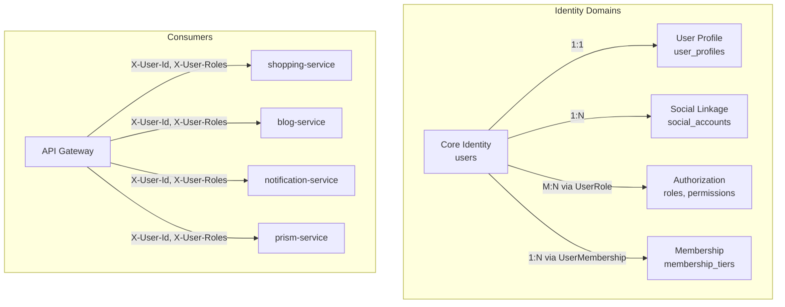

# Identity Model Architecture

## 개요

Portal Universe의 **사용자 식별 체계(Identity Model)** 아키텍처입니다. 대규모 포털 사이트(Google, Naver)를 벤치마킹하여 **식별(Identity), 속성(Attribute), 연동(Linkage), 자산(Assets)**의 책임을 분리하는 설계 철학을 정의합니다.

| 항목 | 내용 |
|------|------|
| **범위** | System |
| **주요 기술** | Spring Boot 3.x, JPA/Hibernate, MySQL 8.0 |
| **배포 환경** | K8s, Docker Compose, Local |
| **관련 서비스** | auth-service (소유), 전체 서비스 (소비) |

---

## 아키텍처 다이어그램



---

## 핵심 컴포넌트

### 1. 영역 분리 (Separation of Concerns)

| 영역 | 책임 서비스 | 테이블 | 데이터 성격 |
|:---:|:---:|:---:|:---|
| **Core Identity** | `auth-service` | `users` | 인증, 보안, 계정 상태 (변경 빈도 낮음) |
| **User Profile** | `auth-service` | `user_profiles` | 닉네임, 프로필 사진 등 노출 정보 (변경 빈도 중간) |
| **Social Linkage** | `auth-service` | `social_accounts` | 소셜 로그인 연동 정보 (N:1 확장) |
| **Authorization** | `auth-service` | `roles`, `permissions`, `user_roles` | RBAC 역할/권한 (변경 빈도 낮음) |
| **Membership** | `auth-service` | `membership_tiers`, `user_memberships` | 서비스별 구독 등급 (변경 빈도 중간) |
| **Audit Trail** | `auth-service` | `auth_audit_logs` | 인증 이벤트 기록 (Append-only) |

### 2. 식별자 전략

| 식별자 | 타입 | 용도 | 노출 |
|--------|------|------|------|
| **Internal ID** | `BIGINT AUTO_INCREMENT` | DB 내부 조인, 인덱싱 성능 최적화 | 외부 노출 금지 |
| **External ID** | `UUID` (`@UuidGenerator`) | API 응답, URL 파라미터 | 외부 공개 |

- Internal ID: 순차 증가로 B-Tree 인덱스 효율 극대화
- External ID: 사용자 수 추정 방지, URL 예측 불가

### 3. Core Identity (User)

**역할**: 시스템 내부 식별과 인증만을 담당하는 핵심 엔티티

**주요 필드**:

| 필드 | 타입 | 설명 |
|------|------|------|
| `id` | BIGINT PK | Internal ID (Auto Increment) |
| `uuid` | VARCHAR UK | External ID (Hibernate UuidGenerator) |
| `email` | VARCHAR UK | 로그인 이메일 |
| `password` | VARCHAR | BCrypt 해시 (소셜 회원은 NULL) |
| `status` | ENUM | `ACTIVE`, `DORMANT`, `BANNED`, `WITHDRAWAL_PENDING` |
| `lastLoginAt` | DATETIME | 마지막 로그인 일시 |
| `passwordChangedAt` | DATETIME | 비밀번호 변경 일시 (만료 정책 판단) |

**설계 결정**:
- `password` nullable: 소셜 로그인 전용 사용자는 비밀번호 없음
- `status`에 `WITHDRAWAL_PENDING` 추가: Soft Delete로 탈퇴 유예 기간 지원
- `passwordChangedAt`: 비밀번호 만료 정책(90일)과 PasswordHistory 연계

### 4. User Profile

**역할**: 사용자의 표시 정보를 Core Identity와 분리하여 관리

**주요 필드**:

| 필드 | 타입 | 설명 |
|------|------|------|
| `userId` | BIGINT PK,FK | User PK 공유 (`@MapsId`) |
| `nickname` | VARCHAR(50) | 표시용 닉네임 |
| `username` | VARCHAR(20) UK | 고유 사용자명 (@username) |
| `realName` | VARCHAR(50) | 실명 |
| `bio` | VARCHAR(200) | 자기소개 |
| `phoneNumber` | VARCHAR(20) | 전화번호 |
| `profileImageUrl` | VARCHAR(255) | 프로필 이미지 URL |
| `website` | VARCHAR(255) | 웹사이트 URL |
| `marketingAgree` | BOOLEAN | 마케팅 수신 동의 |

**설계 결정**:
- `@MapsId`로 User PK를 공유하여 1:1 관계 보장
- `username`은 Unique Index로 `@username` 형태의 고유 식별 지원
- Core Identity 분리로 인증 쿼리 시 Profile 조인 불필요 (성능 최적화)

### 5. Social Linkage

**역할**: 소셜 로그인 계정 연동 (1:N 확장 구조)

- 지원 Provider: `GOOGLE`, `NAVER`, `KAKAO`
- `(provider, providerId)` 복합 Unique로 중복 연동 방지
- 하나의 User에 여러 소셜 계정 연결 가능
- 이미 존재하는 이메일이면 SocialAccount만 추가

---

## 데이터 플로우

### 회원가입 (일반)
```
1. Client → API Gateway → auth-service: POST /api/v1/auth/signup
2. auth-service: User 생성 (ACTIVE) + UserProfile 생성 (nickname 필수)
3. auth-service: 기본 역할 할당 (ROLE_USER)
4. auth-service → Kafka: UserSignupEvent 발행
5. notification-service: 가입 환영 이메일 발송
```

### 회원가입 (소셜)
```
1. Client → OAuth Provider: Authorization Code 획득
2. Client → auth-service: POST /api/v1/auth/oauth2/{provider}/callback
3. auth-service → OAuth Provider: Access Token 교환
4. auth-service: 이메일로 기존 User 조회
   - 없으면: User(password=null) + UserProfile + SocialAccount 생성
   - 있으면: SocialAccount만 추가 (계정 연동)
5. auth-service: JWT 발급
```

### Identity 소비 (다른 서비스)
```
1. Client → API Gateway: Request with JWT
2. Gateway: JWT 검증 → X-User-Id, X-User-Roles, X-User-Memberships 헤더 주입
3. Backend Service: GatewayUser/CurrentUser로 사용자 식별
   - Internal ID가 아닌 uuid 기반 식별
```

---

## 기술적 결정

### 선택한 패턴
- **Identity-Profile 분리**: 인증 쿼리와 프로필 조회의 성능 격리
- **Internal/External ID 이중 식별**: 보안(외부)과 성능(내부)의 균형
- **Soft Delete**: `WITHDRAWAL_PENDING` 상태로 탈퇴 유예 기간 제공
- **RBAC + Membership**: 역할 기반 접근 제어와 서비스별 등급 제도 병행

### 제약사항
- auth-service만 Identity 데이터를 직접 수정 가능 (Single Source of Truth)
- 다른 서비스는 Gateway 헤더 또는 Feign Client로만 Identity 정보 소비
- External ID(UUID)는 생성 후 변경 불가 (`updatable = false`)

---

## 관련 문서

- [Auth Service Database Schema](../database/auth-service-schema.md) - 전체 ERD 및 테이블 상세
- [Security Architecture](security-architecture.md) - JWT, RBAC, BCrypt 보안 메커니즘
- [Service Communication](service-communication.md) - Gateway 헤더 전파
- [ADR-003: Authorization Strategy](../../adr/ADR-003-authorization-strategy.md)

---

## 변경 이력

| 날짜 | 변경 내용 | 작성자 |
|------|----------|--------|
| 2026-02-06 | `identity-model.md`로 이름 변경, architecture-template 형식 보완, 미완성 섹션 정리 | Laze |
| 2026-02-06 | 최초 작성 (`auth-system-design.md`) | Laze |
