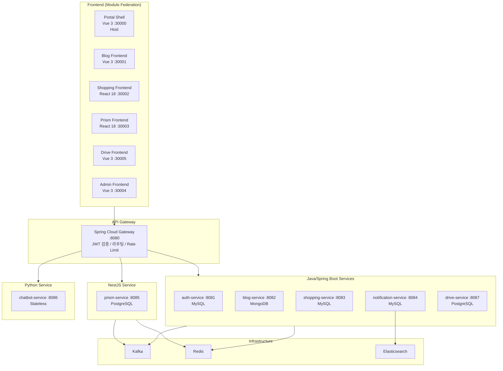

# Polyglot System Overview

> Portal Universe 전체 서비스의 기술 스택, cross-cutting concern 구현 현황, 공유 전략을 조감하는 문서.

**마지막 업데이트**: 2026-02-14

---

## 시스템 다이어그램

---

## 서비스별 기술 스택

| 서비스 | 언어/프레임워크 | DB | 선택 근거 | 관련 ADR |
|--------|----------------|-----|-----------|----------|
| api-gateway | Java / Spring Cloud Gateway | - | 통합 인증, 라우팅, Rate Limit | - |
| auth-service | Java / Spring Boot 3 | MySQL | 관계형 사용자/역할 모델 | [ADR-008](../../adr/ADR-008-jwt-stateless-redis.md) |
| blog-service | Java / Spring Boot 3 | MongoDB | 비정형 콘텐츠 | - |
| shopping-service | Java / Spring Boot 3 | MySQL | 트랜잭션, Saga 패턴 | [ADR-016](../../adr/ADR-016-shopping-feature-implementation.md) |
| notification-service | Java / Spring Boot 3 | MySQL + ES | 알림 저장 + 전문 검색 | - |
| drive-service | Java / Spring Boot 3 | PostgreSQL | 파일 메타데이터, JSONB | - |
| prism-service | TypeScript / NestJS | PostgreSQL | AI Agent 빠른 프로토타이핑 | [ADR-017](../../adr/ADR-017-prism-basic-implementation.md), [ADR-037](../../adr/ADR-037-nestjs-prism-long-term-strategy.md) |
| chatbot-service | Python / FastAPI | Stateless | AI/LLM 에코시스템 활용 | - |

---

## Cross-cutting Concern 매트릭스

### API & 에러 처리

| 항목 | Java/Spring | NestJS (Prism) | Python (Chatbot) | 계약 |
|------|-------------|----------------|------------------|------|
| ApiResponse wrapper | `common-lib` `ApiResponse` | `ApiResponseInterceptor` | `api_response` middleware | [api-response.schema.json](../../contracts/api-response.schema.json) |
| GlobalExceptionHandler | `GlobalExceptionHandler` | `AllExceptionsFilter` | `exception_handlers.py` | [error-response.schema.json](../../contracts/error-response.schema.json) |
| ErrorCode | `CommonErrorCode` + 서비스별 | `error-codes.enum.ts` (P prefix) | `error_codes.py` (CH prefix) | [error-codes.md](../../contracts/error-codes.md) |
| XSS 필터링 | `XssFilter` + `HtmlCharacterEscapes` | `helmet` + sanitizer | `bleach` sanitizer | [ADR-029](../../adr/ADR-029-cross-cutting-security-layer.md) |
| Validation | Bean Validation (`@Valid`) | `class-validator` + `ValidationPipe` | Pydantic model | - |

### 인증/인가

| 항목 | Java/Spring | NestJS (Prism) | Python (Chatbot) | 계약 |
|------|-------------|----------------|------------------|------|
| Gateway 헤더 파싱 | `SecurityContextFilter` | `AuthGuard` + `@CurrentUser` | `get_current_user()` | [gateway-headers.md](../../contracts/gateway-headers.md) |
| Membership 확인 | `MembershipUtil` | NestJS guard | Python dependency | [ADR-021](../../adr/ADR-021-role-based-membership-restructure.md) |
| Audit 로깅 | `@Audited` AOP | decorator 기반 | middleware 기반 | [ADR-035](../../adr/ADR-035-polyglot-authentication-standardization.md) |

### 관찰성 (Observability)

| 항목 | Java/Spring | NestJS (Prism) | Python (Chatbot) | 관련 ADR |
|------|-------------|----------------|------------------|----------|
| Structured Logging | Logback JSON | Winston JSON | Python `logging` JSON | [ADR-033](../../adr/ADR-033-polyglot-observability-strategy.md) |
| Metrics | Micrometer → Prometheus | `prom-client` → Prometheus | `prometheus_client` | [ADR-033](../../adr/ADR-033-polyglot-observability-strategy.md) |
| Distributed Tracing | Micrometer Tracing → Zipkin | OpenTelemetry → Zipkin | OpenTelemetry → Zipkin | [ADR-033](../../adr/ADR-033-polyglot-observability-strategy.md) |
| Health Check | Spring Actuator `/health` | `@nestjs/terminus` `/health` | FastAPI `/health` | - |

### 이벤트 & CI/CD

| 항목 | Java/Spring | NestJS (Prism) | Python (Chatbot) | 관련 ADR |
|------|-------------|----------------|------------------|----------|
| Kafka Producer/Consumer | Spring Kafka | `kafkajs` | `aiokafka` (해당시) | [ADR-032](../../adr/ADR-032-kafka-configuration-standardization.md) |
| Event Contract | Topic constants class | Topic constants enum | Topic constants module | [ADR-038](../../adr/ADR-038-polyglot-event-contract-management.md) |
| CI Workflow | Gradle → Docker → ECR | npm → Docker → ECR | pip → Docker → ECR | [ADR-034](../../adr/ADR-034-non-java-cicd-integration.md) |

---

## 공유 라이브러리 vs 독립 구현

| 전략 | 적용 대상 | 이유 |
|------|-----------|------|
| **공유 라이브러리** (`common-lib`) | Java 서비스 5개 | 동일 스택, Gradle 멀티모듈로 의존성 관리 |
| **계약 기반 독립 구현** | NestJS, Python | 스택이 다르므로 JSON Schema 계약 준수하에 독립 구현 |

공유 라이브러리(`common-lib`)에 포함된 모듈:
- `ApiResponse`, `PageResponse` wrapper
- `GlobalExceptionHandler`, `CommonErrorCode`
- `SecurityContextFilter`, `MembershipUtil`
- `XssFilter`, `HtmlCharacterEscapes`
- `AuditLog` AOP

NestJS/Python은 동일 계약을 각 스택 관용적 방식으로 구현한다. 자세한 내용은 [Common Library Architecture](common-library.md) 참조.

---

## 관련 ADR 목록

| ADR | 제목 | 카테고리 |
|-----|------|----------|
| [ADR-029](../../adr/ADR-029-cross-cutting-security-layer.md) | Cross-cutting 보안 처리 계층 설계 | 보안 |
| [ADR-031](../../adr/ADR-031-unified-api-response-strategy.md) | Unified API Response Strategy | API |
| [ADR-032](../../adr/ADR-032-kafka-configuration-standardization.md) | Kafka Configuration Standardization | 이벤트 |
| [ADR-033](../../adr/ADR-033-polyglot-observability-strategy.md) | Polyglot 서비스 관찰성 통일 전략 | 관찰성 |
| [ADR-034](../../adr/ADR-034-non-java-cicd-integration.md) | 비Java 서비스 CI/CD 파이프라인 통합 | CI/CD |
| [ADR-035](../../adr/ADR-035-polyglot-authentication-standardization.md) | Polyglot 서비스 인증 표준화 | 인증 |
| [ADR-038](../../adr/ADR-038-polyglot-event-contract-management.md) | Polyglot 이벤트 계약 관리 전략 | 이벤트 |
| [ADR-039](../../adr/ADR-039-jwt-dual-validation-strategy.md) | JWT 이중 검증 전략 | 인증 |
| [ADR-040](../../adr/ADR-040-frontend-error-handling-standardization.md) | Frontend Error Handling Standardization | 프론트엔드 |

---

## 변경 이력

| 날짜 | 변경 내용 |
|------|----------|
| 2026-02-14 | 초기 작성 - Polyglot 표준화 Phase 1~6 완료 시점 |

---

작성자: Laze
