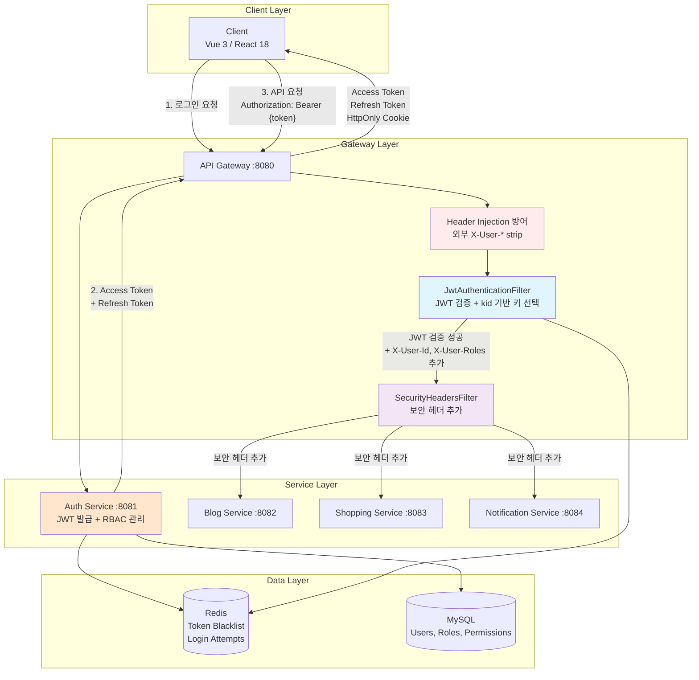
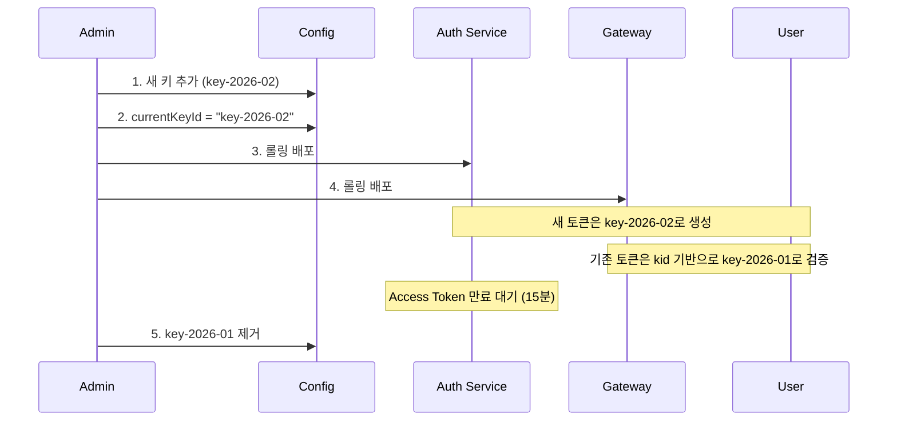
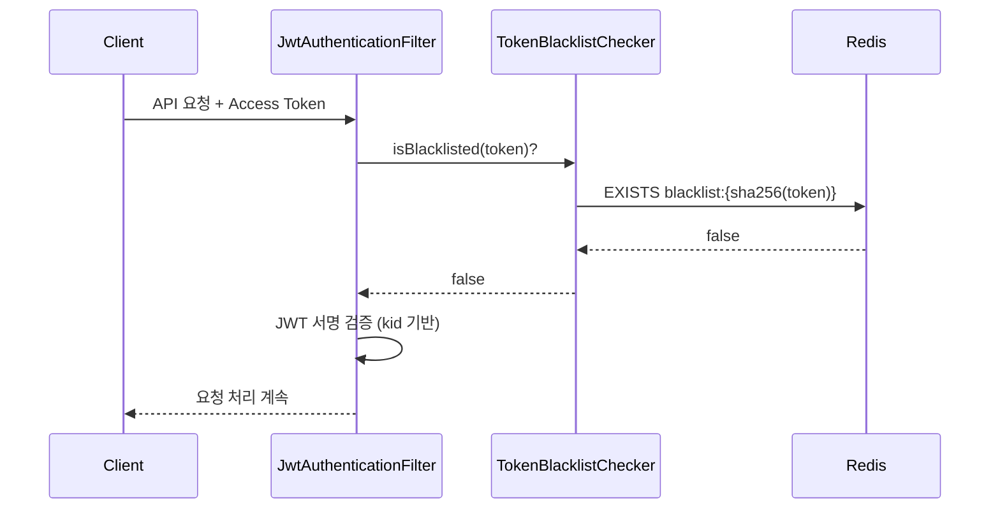
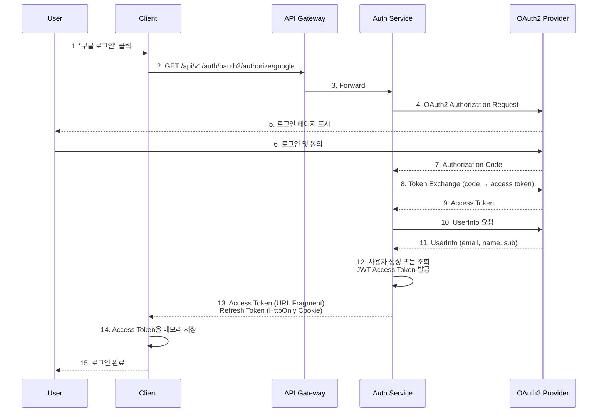
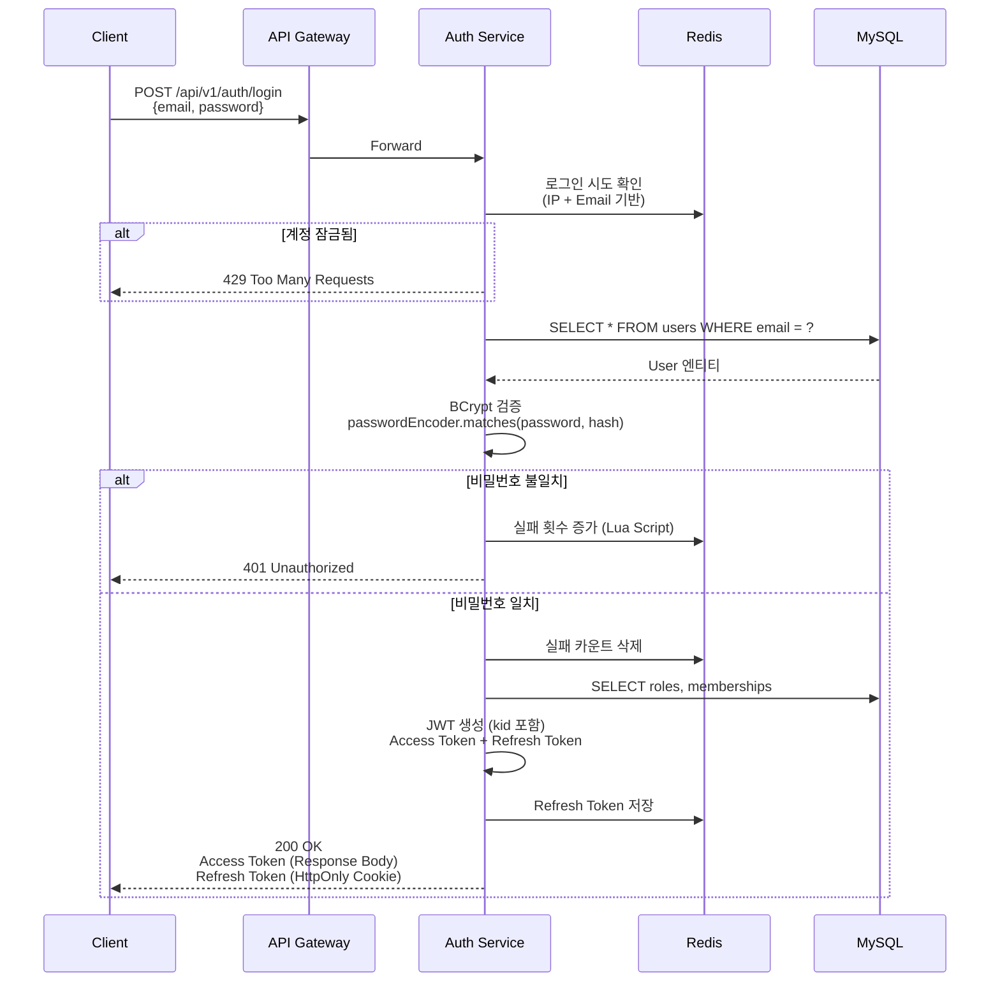
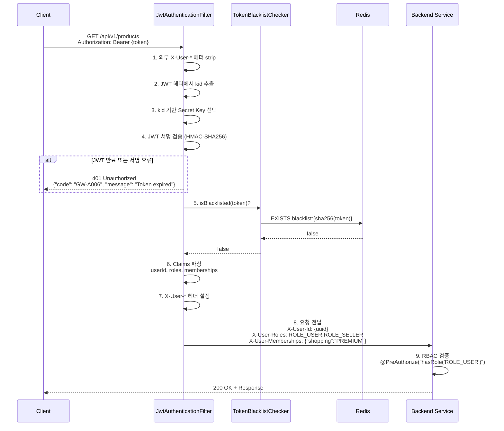
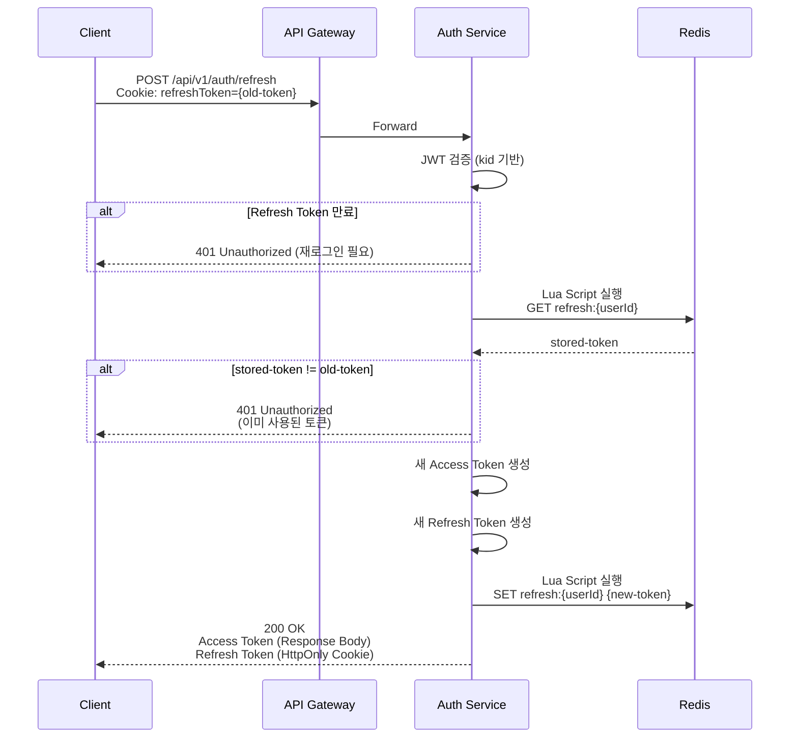
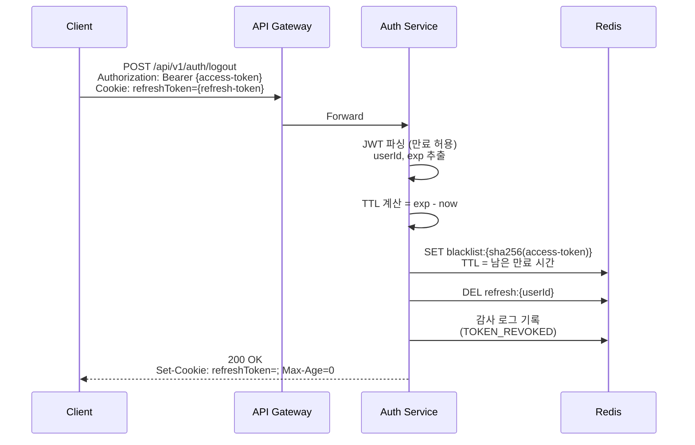

# Portal Universe - System Security Architecture

## 개요

Portal Universe의 **전체 시스템 보안 아키텍처**를 설명합니다. 이 문서는 시스템 레벨의 보안 전략과 인증/인가 흐름을 다루며, JWT 기반 인증, API Gateway 보안 계층, 역할 기반 접근 제어(RBAC), OAuth2 소셜 로그인 등을 포함합니다.

| 항목 | 내용 |
|------|------|
| **범위** | System (전체 마이크로서비스) |
| **주요 기술** | Spring Security, JWT (HMAC-SHA256), BCrypt, Redis, OAuth2 |
| **배포 환경** | Kubernetes, Docker Compose |
| **관련 서비스** | auth-service, api-gateway, common-library, 모든 백엔드 서비스 |

---

## 아키텍처 다이어그램



### 보안 계층

1. **Gateway Layer**: JWT 검증, 보안 헤더, Header Injection 방어
2. **Service Layer**: RBAC 검증, 비즈니스 로직 보안
3. **Data Layer**: Token Blacklist, 로그인 시도 추적

---

## 핵심 컴포넌트

### 1. JWT 인증 (HMAC-SHA256)

#### 1.1 알고리즘 및 키 관리

Portal Universe는 **HMAC-SHA256 (대칭키)** 알고리즘을 사용하여 JWT 토큰을 서명합니다.

| 항목 | 값 |
|------|-----|
| **알고리즘** | HMAC-SHA256 (HS256) |
| **키 타입** | 대칭 키 (Secret Key) |
| **키 길이** | 최소 256-bit (32 characters) |
| **키 관리** | `application.yml` 환경변수 (`JWT_SECRET_KEY`) |

**⚠️ 중요**: RS256(비대칭키)이 아닌 HS256(대칭키)을 사용합니다. Auth Service와 API Gateway가 동일한 Secret Key를 공유하여 서명 생성 및 검증을 수행합니다.

#### 1.2 토큰 수명 및 구조

| 토큰 종류 | TTL | 저장 위치 | 용도 |
|-----------|-----|----------|------|
| **Access Token** | 15분 (900000ms) | Client 메모리 | API 요청 인증 |
| **Refresh Token** | 7일 (604800000ms) | HttpOnly Cookie | Access Token 갱신 |

**Access Token Payload 예시**:
```json
{
  "sub": "550e8400-e29b-41d4-a716-446655440000",
  "email": "user@example.com",
  "nickname": "John",
  "username": "john_doe",
  "roles": ["ROLE_USER", "ROLE_SELLER"],
  "memberships": {
    "shopping": "PREMIUM",
    "blog": "FREE"
  },
  "iat": 1738800000,
  "exp": 1738800900
}
```

#### 1.3 Key Rotation (키 교체)

보안 강화를 위해 JWT 서명 키를 주기적으로 교체할 수 있습니다.

**JWT 헤더 구조**:
```json
{
  "alg": "HS256",
  "typ": "JWT",
  "kid": "key-2026-01"
}
```

**키 교체 흐름**:


**구현 위치**:
- Auth Service: `TokenService.java` (토큰 생성 시 kid 포함)
- API Gateway: `JwtAuthenticationFilter.java` (토큰 검증 시 kid 기반 키 선택)

**설정 예시**:
```yaml
# application.yml
jwt:
  current-key-id: key-2026-02  # 현재 키 ID
  keys:
    key-2026-01:
      secret-key: ${JWT_SECRET_KEY_OLD}
      activated-at: 2026-01-01T00:00:00
      expires-at: 2026-02-01T00:00:00  # 만료 예정
    key-2026-02:
      secret-key: ${JWT_SECRET_KEY}
      activated-at: 2026-02-01T00:00:00
      # expires-at: null (현재 활성)
  access-token-expiration: 900000
  refresh-token-expiration: 604800000
```

---

### 2. 비밀번호 보안 (BCrypt)

#### 2.1 BCrypt 해싱

사용자 비밀번호는 **BCrypt** 알고리즘을 통해 단방향 해싱되어 저장됩니다.

| 특징 | 설명 |
|------|------|
| **알고리즘** | BCrypt (Blowfish 기반) |
| **Cost Factor** | 10 (2^10 = 1024 rounds) |
| **Salt** | 자동 생성 (22자) |
| **해시 길이** | 60자 (포맷: `$2a$10$...`) |

**BCrypt 해시 포맷**:
```
$2a$10$N9qo8uLOickgx2ZMRZoMyeIjZAgcfl7p92ldGxad68LJZdL17lhWy
│  │  │                                                  │
│  │  └─ Salt (22자)                          └─ Hash (31자)
│  └─ Cost Factor (10 = 2^10 rounds)
└─ 알고리즘 버전 (2a = BCrypt)
```

**구현 위치**: `SecurityConfig.java`
```java
@Bean
public PasswordEncoder passwordEncoder() {
    return new BCryptPasswordEncoder();
}
```

#### 2.2 비밀번호 정책

| # | 정책 | 기본값 | 설정 키 |
|---|------|--------|---------|
| 1 | 최소 길이 | 8자 | `security.password.min-length` |
| 2 | 최대 길이 | 128자 | `security.password.max-length` |
| 3 | 대문자 필수 | ✅ | `security.password.require-uppercase` |
| 4 | 소문자 필수 | ✅ | `security.password.require-lowercase` |
| 5 | 숫자 필수 | ✅ | `security.password.require-digit` |
| 6 | 특수문자 필수 | ✅ | `security.password.require-special-char` |
| 7 | 최근 5개 재사용 금지 | ✅ | `security.password.history-count` |
| 8 | 만료 기간 | 90일 | `security.password.max-age` |
| 9 | 연속 문자 금지 | ✅ (abc, 123 등) | `security.password.prevent-sequential` |
| 10 | 사용자 정보 포함 금지 | ✅ (이메일, 이름) | `security.password.prevent-user-info` |

**구현 위치**: `PasswordValidatorImpl.java`

---

### 3. Token Blacklist (Redis)

#### 3.1 개요

로그아웃한 Access Token을 무효화하여 재사용을 방지합니다.

#### 3.2 Redis 키 구조

| 키 패턴 | 값 | TTL | 용도 |
|---------|-----|-----|------|
| `blacklist:{SHA-256(token)}` | "blacklisted" | Access Token 잔여 만료 시간 | 토큰 무효화 |

**SHA-256 해싱 이유**: JWT 원문(~500-1000 bytes)을 그대로 Redis 키로 사용하면 메모리 낭비. 해시(64 chars)로 고정.

#### 3.3 검증 흐름



**구현 위치**:
- Auth Service: `TokenBlacklistService.java` (블랙리스트 추가)
- API Gateway: `TokenBlacklistChecker.java` (블랙리스트 검증)

---

### 4. RBAC (역할 기반 접근 제어)

#### 4.1 기본 역할

| Role Key | 설명 | 자동 할당 |
|----------|------|----------|
| `ROLE_USER` | 일반 사용자 | ✅ 회원가입 시 |
| `ROLE_SELLER` | 판매자 | 승인 후 |
| `ROLE_BLOG_ADMIN` | 블로그 관리자 | 수동 |
| `ROLE_SHOPPING_ADMIN` | 쇼핑 관리자 | 수동 |
| `ROLE_SUPER_ADMIN` | 최고 관리자 | 수동 |

#### 4.2 Membership Tier

서비스별 멤버십 티어를 통해 세밀한 권한 제어를 지원합니다.

| 서비스 | Tier | 자동 할당 |
|--------|------|----------|
| `shopping` | FREE | ✅ 회원가입 시 |
| `shopping` | BASIC, PREMIUM | 결제 후 |
| `blog` | FREE | ✅ 회원가입 시 |
| `blog` | PREMIUM | 결제 후 |

#### 4.3 JWT Claims 기반 권한 전달

API Gateway에서 JWT Claims를 파싱하여 각 서비스에 HTTP 헤더로 전달합니다.

**Gateway → Service 헤더**:
```
X-User-Id: 550e8400-e29b-41d4-a716-446655440000
X-User-Roles: ROLE_USER,ROLE_SELLER
X-User-Memberships: {"shopping":"PREMIUM","blog":"FREE"}
X-User-Nickname: John (URL-encoded)
X-User-Name: john_doe (URL-encoded)
```

**구현 위치**: `JwtAuthenticationFilter.java` (Gateway)

---

### 5. OAuth2 소셜 로그인

#### 5.1 지원 Provider

| Provider | 인증 방식 |
|----------|----------|
| Google | Authorization Code |
| Naver | Authorization Code |
| Kakao | Authorization Code |

#### 5.2 로그인 플로우



**구현 위치**:
- `CustomOAuth2UserService.java`: OAuth2 사용자 정보 조회 및 처리
- `OAuth2AuthenticationSuccessHandler.java`: 로그인 성공 시 JWT 발급

**Token 전달 방식**:
- **Access Token**: URL Fragment (`#access_token={token}`)
- **Refresh Token**: HttpOnly Cookie (XSS 방어)

---

### 6. API Gateway 보안 헤더

#### 6.1 SecurityHeadersFilter

API Gateway에서 모든 응답에 보안 헤더를 추가합니다.

| 헤더 | 값 | 용도 |
|------|-----|------|
| `X-Frame-Options` | `DENY` | 클릭재킹 방어 |
| `X-Content-Type-Options` | `nosniff` | MIME 스니핑 방어 |
| `X-XSS-Protection` | `1; mode=block` | XSS 공격 방어 |
| `Content-Security-Policy` | `default-src 'self'; script-src 'self' 'unsafe-inline'; ...` | XSS, 인젝션 방어 |
| `Strict-Transport-Security` | `max-age=31536000; includeSubDomains` | HTTPS 강제 |
| `Referrer-Policy` | `strict-origin-when-cross-origin` | Referrer 정보 제한 |
| `Permissions-Policy` | `geolocation=(), microphone=(), camera=()` | 브라우저 API 제한 |
| `Cache-Control` | `no-store, no-cache, must-revalidate` (인증 경로만) | 인증 정보 캐싱 방지 |

**구현 위치**: `SecurityHeadersFilter.java` (Gateway)

**설정 예시**:
```yaml
# application.yml (api-gateway)
security:
  headers:
    enabled: true
    frame-options: DENY
    content-type-options: true
    xss-protection: true
    referrer-policy: strict-origin-when-cross-origin
    permissions-policy: "geolocation=(), microphone=(), camera=()"
    csp:
      enabled: true
      policy: "default-src 'self'; script-src 'self' 'unsafe-inline'; ..."
      report-only: false
    hsts:
      enabled: true
      max-age: 31536000
      include-sub-domains: true
      preload: true
      https-only: true
    cache-control:
      auth-paths: true
      no-cache-paths:
        - /api/v1/auth/**
        - /api/v1/users/**
```

#### 6.2 CSP (Content Security Policy)

**기본 정책**:
```
default-src 'self';
script-src 'self' 'unsafe-inline';
style-src 'self' 'unsafe-inline';
img-src 'self' data: https:;
font-src 'self' data:;
connect-src 'self' https://api.portal-universe;
```

**Report-Only 모드**: 개발 중에는 `report-only: true`로 설정하여 위반 사항을 로깅만 하고 차단하지 않습니다.

---

### 7. Header Injection 방어

#### 7.1 공격 시나리오

악의적인 클라이언트가 API 요청에 `X-User-Id`, `X-User-Roles` 등의 헤더를 직접 추가하여 권한을 위조할 수 있습니다.

**공격 예시**:
```http
GET /api/v1/admin/users HTTP/1.1
Host: portal-universe
Authorization: Bearer {valid-user-token}
X-User-Roles: ROLE_SUPER_ADMIN  ← 위조된 헤더
```

#### 7.2 방어 메커니즘

Gateway의 `JwtAuthenticationFilter`에서 외부에서 주입된 `X-User-*` 헤더를 **모두 제거**한 후, JWT 검증 후 **내부에서만** 설정합니다.

**구현 코드**:
```java
// JwtAuthenticationFilter.java
ServerHttpRequest sanitizedRequest = request.mutate()
    .headers(h -> {
        h.remove("X-User-Id");
        h.remove("X-User-Roles");
        h.remove("X-User-Memberships");
        h.remove("X-User-Nickname");
        h.remove("X-User-Name");
    }).build();

// ... JWT 검증 성공 후 ...

ServerHttpRequest mutatedRequest = sanitizedRequest.mutate()
    .header("X-User-Id", userId)
    .header("X-User-Roles", rolesHeader)
    .header("X-User-Memberships", membershipsHeader)
    .header("X-User-Nickname", URLEncoder.encode(nickname, UTF_8))
    .header("X-User-Name", URLEncoder.encode(username, UTF_8))
    .build();
```

**보안 효과**:
- 외부 헤더 주입 공격 차단
- 내부 서비스는 Gateway가 설정한 헤더만 신뢰

---

## 데이터 플로우

### 1. 로그인 플로우 (Form Login)



**주요 포인트**:
- 로그인 실패 시 Redis에 실패 횟수 증가 (IP + Email 복합 키)
- 3회 실패 시 1분 잠금, 5회 실패 시 5분 잠금
- BCrypt 검증은 약 100-200ms 소요 (Cost Factor 10)

---

### 2. JWT 검증 플로우 (API 요청)



**성능 최적화**:
- Gateway에서 JWT 검증 → 각 서비스는 헤더만 신뢰 (DB 조회 없음)
- Redis 블랙리스트 조회 → O(1) 시간 복잡도

---

### 3. Token 갱신 플로우 (Refresh Token Rotation)



**Refresh Token Rotation 이유**:
- Refresh Token 탈취 시 피해 최소화
- 한 번 사용된 Refresh Token은 재사용 불가
- 동시 갱신 요청 방어 (Lua Script 원자성)

---

### 4. 로그아웃 플로우



**주요 포인트**:
- Access Token 블랙리스트 추가 (남은 만료 시간만큼 TTL)
- Refresh Token 삭제
- 클라이언트는 Access Token을 메모리에서 삭제

---

## 기술적 결정

### 선택한 패턴

| 패턴 | 이유 |
|------|------|
| **JWT Stateless** | 분산 환경에서 서버 간 세션 공유 불필요, 확장성 우수 |
| **HMAC-SHA256** | Auth Service와 Gateway 간 키 공유 간편, 성능 우수 (RS256 대비) |
| **Refresh Token Rotation** | Refresh Token 탈취 시 피해 최소화 |
| **Token Blacklist (Redis)** | 로그아웃한 Access Token 무효화, TTL 자동 정리 |
| **Key Rotation (kid)** | JWT 서명 키 주기적 교체, 보안 강화 |
| **Header Injection 방어** | Gateway에서 외부 헤더 strip, 내부에서만 설정 |
| **HttpOnly Cookie** | Refresh Token을 XSS 공격으로부터 보호 |
| **BCrypt** | 단방향 해싱, Rainbow Table 공격 방어 |

### 제약사항

| 제약 | 설명 |
|------|------|
| **Access Token 만료** | 15분으로 짧게 설정 → 탈취 시 피해 최소화, Refresh 필요 |
| **Redis 의존성** | Token Blacklist, Login Attempts, Refresh Token 저장 → Redis 장애 시 로그아웃 불가 |
| **키 공유** | Auth Service와 Gateway가 동일한 Secret Key 공유 필요 |
| **시계 동기화** | JWT exp/iat 검증 시 서버 간 시계 동기화 필요 (NTP 권장) |

---

## 배포 및 확장

### 배포 구성

| 환경 | Auth Service | API Gateway | Redis |
|------|-------------|-------------|--------|
| **Local** | :8081 (단일 인스턴스) | :8080 (단일 인스턴스) | localhost:6379 |
| **Docker** | 1 replica | 1 replica | docker-compose |
| **K8s (Prod)** | 3 replicas (HPA) | 3 replicas (HPA) | Redis Cluster (3 master + 3 replica) |

### 확장 전략

| 병목 지점 | 대응 |
|-----------|------|
| **Auth Service** | Stateless → 수평 확장 가능 (HPA 기반 CPU 50% 기준) |
| **API Gateway** | JWT 검증만 수행 → 매우 가벼움, 수평 확장 가능 |
| **Redis** | Token Blacklist, Login Attempts 저장 → Redis Cluster로 확장 |
| **BCrypt 검증** | CPU 집약적 → Auth Service Pod 수 증가 (로그인 요청 증가 시) |

---

## 보안 체크리스트 (운영 환경)

### 필수 설정

- [ ] **HTTPS 강제 적용** (Ingress/LoadBalancer에서 HTTP → HTTPS 리다이렉트)
- [ ] **JWT Secret Key 환경변수 설정** (`JWT_SECRET_KEY`, 최소 32자)
- [ ] **JWT Secret Key 주기적 교체** (3-6개월마다 Key Rotation)
- [ ] **Redis AUTH 비밀번호 설정** (`requirepass`)
- [ ] **MySQL 비밀번호 강화** (최소 16자 + 특수문자)
- [ ] **CORS 정책 최소 권한 원칙** (허용 Origin 명시적으로 제한)
- [ ] **Rate Limiting 적용** (Gateway에서 IP 기반 요청 제한)
- [ ] **Access Token TTL 최소화** (현재 15분 유지)
- [ ] **Refresh Token Rotation 활성화** (현재 ✅)
- [ ] **보안 헤더 활성화** (현재 ✅)
- [ ] **Header Injection 방어 활성화** (현재 ✅)

### 모니터링 항목

| 항목 | 지표 | 알림 조건 |
|------|------|----------|
| **로그인 실패율** | `login_attempts_failed / login_attempts_total` | > 30% (5분 평균) |
| **계정 잠금 수** | `account_locked_count` | > 10건/분 |
| **JWT 검증 실패율** | `jwt_validation_failed / jwt_validation_total` | > 5% (1분 평균) |
| **블랙리스트 히트율** | `blacklist_hits / jwt_validations` | > 1% (비정상적) |
| **Redis 응답 시간** | `redis_response_time_p99` | > 100ms |
| **BCrypt 검증 시간** | `bcrypt_verification_time_p99` | > 500ms |

---

## 관련 문서

### Architecture Documents
- [Auth Service Security Mechanisms](../auth-service/security-mechanisms.md) - Auth Service 상세 구현
- [Auth Service System Overview](../auth-service/system-overview.md) - Auth Service 아키텍처
- [API Gateway System Overview](../api-gateway/system-overview.md) - API Gateway 아키텍처
- [Common Library](./common-library.md) - 입력 검증, 예외 처리

### API Documentation
- [Auth Service API](../../api/auth-service/README.md) - 인증/인가 API 명세

### Architecture Decision Records
- [ADR-003: Authorization Strategy](../../adr/ADR-003-authorization-strategy.md) - 권한 검증 전략
- [ADR-008: JWT Stateless + Redis](../../adr/ADR-008-jwt-stateless-redis.md) - JWT와 Redis 통합 결정
- [ADR-010: OAuth2 Social Login](../../adr/ADR-010-oauth2-social-login.md) - 소셜 로그인 전략

### Runbooks
- [JWT Key Rotation Procedure](../../runbooks/jwt-key-rotation.md) - JWT 키 교체 절차
- [Auth Service Operations](../../runbooks/auth-service-operations.md) - 운영 절차서

### Troubleshooting
- [TS-20260118-001: Redis Connection Timeout](../../troubleshooting/2026/01/TS-20260118-001-redis-connection-timeout.md)

---

## 변경 이력

| 날짜 | 변경 내용 | 작성자 |
|------|-----------|--------|
| 2026-02-06 | 코드 기반 완전 재작성 (security-cryptography.md 대체) | Laze |

---

📂 서비스별 상세 구현은 각 서비스 문서 참조
