# 서비스 간 통신 아키텍처

## 개요
Portal Universe의 7개 마이크로서비스 간 동기/비동기 통신 패턴과 메커니즘을 설명합니다. API Gateway를 중앙 진입점으로 사용하며, Feign Client를 통한 동기 통신과 Kafka를 통한 이벤트 기반 비동기 통신을 혼용합니다.

| 항목 | 내용 |
|------|------|
| **범위** | System |
| **주요 기술** | Spring Cloud Gateway, Feign Client, Kafka, Resilience4j, WebSocket |
| **배포 환경** | Local, Docker Compose, Kubernetes |
| **관련 서비스** | api-gateway, auth-service, blog-service, shopping-service, notification-service, prism-service, chatbot-service |

---

## 서비스 토폴로지 다이어그램

```mermaid
graph TB
    Client[외부 클라이언트] --> Gateway[API Gateway :8080]
    Redis[(Redis<br/>Rate Limiting)] --> Gateway

    Gateway -->|JWT 검증<br/>X-User-* 헤더 추가<br/>Circuit Breaker| Auth[auth-service :8081]
    Gateway --> Blog[blog-service :8082]
    Gateway --> Shopping[shopping-service :8083]
    Gateway --> Notification[notification-service :8084]
    Gateway --> Prism[prism-service :8085]
    Gateway --> Chatbot[chatbot-service :8086]

    Auth -->|user-signup| Kafka[Kafka Cluster]
    Blog -->|blog.*| Kafka
    Shopping -->|shopping.*| Kafka
    Prism -->|prism.*| Kafka

    Shopping -.->|Feign Client<br/>동기 호출| Blog

    Kafka --> Notification
    Notification -->|WebSocket<br/>SSE| Client

    style Gateway fill:#4A90E2
    style Kafka fill:#231F20
    style Redis fill:#DC382D
```



---

## 핵심 컴포넌트

### 1. API Gateway
**역할**: 모든 외부 요청의 단일 진입점 (Single Entry Point)

**주요 책임**:
- JWT 인증/인가 검증
- X-User-* 헤더 추가 (사용자 컨텍스트 전파)
- 서비스별 라우팅
- Rate Limiting (Redis 기반)
- Circuit Breaker 적용
- CORS 정책 관리
- 외부 Header Injection 방어 (X-User-* strip)

**기술 스택**:
- Spring Cloud Gateway (Reactive)
- Spring Data Redis (Rate Limiting)
- Resilience4j (Circuit Breaker)

### 2. Feign Client
**역할**: 서비스 간 동기 HTTP 통신

**주요 책임**:
- REST API 호출 추상화
- Authorization 헤더 자동 전파
- 에러 처리 및 재시도 로직

**기술 스택**:
- Spring Cloud OpenFeign
- FeignClientConfig (커스텀 설정)

### 3. Kafka Event Bus
**역할**: 서비스 간 비동기 이벤트 기반 통신

**주요 책임**:
- 도메인 이벤트 발행/구독
- 서비스 간 결합도 감소
- 장애 격리 (이벤트 유실 방지)

**기술 스택**:
- Apache Kafka
- Spring Kafka

### 4. WebSocket/SSE
**역할**: 실시간 양방향 통신 (notification-service)

**주요 책임**:
- 실시간 알림 푸시
- 클라이언트 세션 관리
- 이벤트 스트림 전송

**기술 스택**:
- Spring WebSocket
- SockJS, STOMP

---

## 동기 통신

### 라우팅 테이블 (API Gateway)

| 서비스 | 경로 패턴 | 포트 | 비고 |
|--------|-----------|------|------|
| auth-service | `/api/v1/auth/**`, `/api/v1/users/**`, `/auth-service/**` | 8081 | JWT 발급, 사용자 관리 |
| blog-service | `/api/v1/blog/**` | 8082 | 블로그 게시글 |
| shopping-service | `/api/v1/shopping/**` | 8083 | 쇼핑몰 |
| notification-service | `/notification/ws/**`, `/api/v1/notifications/**` | 8084 | WebSocket, 알림 API |
| prism-service | `/api/v1/prism/**` | 8085 | NestJS 서비스 |
| chatbot-service | `/api/v1/chat/**` | 8086 | Python 챗봇 |

### 헤더 전파 메커니즘

#### Gateway → Backend 헤더 생성
```java
// JwtAuthenticationFilter (api-gateway)
JWT 검증 성공 시 다음 헤더 추가:
- X-User-Id: UUID (사용자 고유 ID)
- X-User-Roles: ROLE_USER,ROLE_ADMIN (쉼표 구분)
- X-User-Memberships: {"blog":["OWNER"],"shopping":["MEMBER"]} (JSON)
- X-User-Nickname: %EC%9D%B4%EB%A6%84 (URL-encoded)
- X-User-Name: 홍길동
```

**보안 정책**:
- 외부에서 들어온 X-User-* 헤더는 Gateway에서 **모두 제거** (Header Injection 공격 방지)
- Gateway에서만 신뢰할 수 있는 X-User-* 헤더 생성

#### Backend 서비스 헤더 소비
```java
// GatewayAuthenticationFilter (각 백엔드 서비스)
X-User-* 헤더 → AuthUser 객체 변환 → @CurrentUser 주입

@GetMapping("/my-info")
public ResponseEntity<UserInfo> getMyInfo(@CurrentUser AuthUser user) {
    // user.getUserId(), user.getRoles(), user.getMemberships() 사용
}
```

### Feign Client 사용 사례

#### shopping-service → blog-service
```java
@FeignClient(
    name = "blog-service",
    url = "${feign.client.blog-service.url}",
    configuration = FeignClientConfig.class
)
public interface BlogServiceClient {
    @GetMapping("/api/v1/blog/reviews/{productId}")
    List<Review> getProductReviews(@PathVariable String productId);
}
```

**환경별 URL**:
- Local: `http://localhost:8082`
- Docker: `http://blog-service:8082`
- K8s: `http://blog-service:8082`

**FeignClientConfig**:
- Authorization 헤더 자동 전파 (RequestInterceptor)
- 타임아웃: connect 5s, read 10s
- 에러 핸들링: FeignException → CustomBusinessException 변환

---

## 비동기 통신

### Kafka 이벤트 플로우
상세 내용은 [Event-Driven Architecture](./event-driven-architecture.md) 참조

**주요 이벤트**:
- `user-signup` (auth-service → notification-service)
- `blog.created`, `blog.updated` (blog-service → notification-service)
- `shopping.order.created` (shopping-service → notification-service)
- `prism.card.created` (prism-service → notification-service)

**Consumer 그룹**:
- notification-service: 모든 도메인 이벤트 구독 (알림 생성)

---

## 서비스 디스커버리

### 환경별 엔드포인트 해석

| 환경 | HTTP 주소 규칙 | Kafka Broker |
|------|----------------|--------------|
| **Local** | `http://localhost:{port}` | `localhost:9092` |
| **Docker** | `http://{service-name}:{port}` (Docker DNS) | `kafka:29092` |
| **Kubernetes** | `http://{service-name}:{port}` (K8s DNS) | `kafka:29092` |

**예시 (shopping-service → blog-service)**:
```yaml
# Local
feign.client.blog-service.url=http://localhost:8082

# Docker
feign.client.blog-service.url=http://blog-service:8082

# K8s
feign.client.blog-service.url=http://blog-service:8082
```

---

## 장애 격리 (Resilience4j Circuit Breaker)

### 서비스별 Circuit Breaker 설정

| 서비스 | Circuit Breaker 이름 | Timeout | 비고 |
|--------|---------------------|---------|------|
| auth-service | `authCircuitBreaker` | 5s | 인증/사용자 조회 |
| blog-service | `blogCircuitBreaker` | 5s | 블로그 API |
| shopping-service | `shoppingCircuitBreaker` | 5s | 쇼핑 API |
| prism-service | `prismCircuitBreaker` | 60s | AI 처리 시간 고려 |
| chatbot-service | `chatbotCircuitBreaker` | 120s | LLM 응답 대기 |

### 공통 설정 (application.yml)
```yaml
resilience4j:
  circuitbreaker:
    configs:
      default:
        sliding-window-size: 20              # 슬라이딩 윈도우 크기
        failure-rate-threshold: 50           # 실패율 50% 이상 시 OPEN
        wait-duration-in-open-state: 10s     # OPEN 상태 유지 시간
        permitted-number-of-calls-in-half-open-state: 5  # HALF_OPEN 상태 테스트 요청 수
        automatic-transition-from-open-to-half-open-enabled: true
        register-health-indicator: true
```

### Circuit Breaker 동작 플로우
```
1. CLOSED (정상) → 실패율 50% 초과 → OPEN
2. OPEN (차단) → 10초 대기 → HALF_OPEN
3. HALF_OPEN → 5개 요청 테스트 → 성공 시 CLOSED, 실패 시 OPEN
```

**Fallback 전략**:
- 필수 서비스 (auth-service): 에러 즉시 반환 (503 Service Unavailable)
- 선택적 서비스 (blog-service): 캐시 데이터 또는 기본값 반환

---

## 데이터 플로우

### 유스케이스 1: 상품 주문
```
1. Client → Gateway (POST /api/v1/shopping/orders)
2. Gateway → JWT 검증 → X-User-Id 추가
3. Gateway → shopping-service (Circuit Breaker 통과)
4. shopping-service → MySQL (주문 저장)
5. shopping-service → Kafka (shopping.order.created 발행)
6. notification-service (Kafka Consumer) → 알림 생성 → WebSocket Push
```

### 유스케이스 2: 상품 리뷰 조회 (동기 통신)
```
1. Client → Gateway (GET /api/v1/shopping/products/{id}/reviews)
2. Gateway → shopping-service
3. shopping-service → Feign Client → blog-service (GET /api/v1/blog/reviews/{productId})
4. blog-service → MySQL 조회 → 응답
5. shopping-service → 응답 조합 → Client
```

### 유스케이스 3: 실시간 알림 수신
```
1. Client → WebSocket 연결 (ws://gateway/notification/ws)
2. Gateway → notification-service (WebSocket Proxy)
3. notification-service → 세션 등록
4. [다른 서비스] → Kafka 이벤트 발행
5. notification-service (Kafka Consumer) → 알림 생성
6. notification-service → WebSocket Push → Client
```

---

## 기술적 결정

### 선택한 패턴

**API Gateway 패턴**:
- **이유**: 인증/인가, CORS, Rate Limiting, Circuit Breaker를 중앙 집중화
- **장점**: 횡단 관심사 중복 제거, 클라이언트 단순화
- **단점**: SPOF 위험 (고가용성 배포로 완화)

**Feign Client 최소화**:
- **이유**: 동기 호출은 결합도를 높이고 장애 전파 위험 증가
- **현재 사용**: shopping-service → blog-service (상품 리뷰) 1건만
- **원칙**: 즉시 응답이 필요한 경우만 Feign 사용, 나머지는 Kafka

**AI 서비스 타임아웃 별도 관리**:
- **이유**: prism-service(60s), chatbot-service(120s)는 LLM 처리 시간이 길어 일반 서비스(5s)와 다른 정책 필요
- **Circuit Breaker**: AI 서비스는 높은 타임아웃 + 낮은 요청 빈도로 설정

### 제약사항

**notification-service SPOF 위험**:
- 모든 도메인 이벤트를 구독하므로 장애 시 알림 기능 전체 중단
- **완화**: Kafka Consumer Group으로 복제본 운영, Dead Letter Queue 구성

**Kafka 의존성**:
- Kafka 클러스터 장애 시 이벤트 발행 실패
- **완화**: Kafka Connect로 DB Outbox 패턴 적용 (향후 고려)

**헤더 기반 인증의 한계**:
- X-User-* 헤더는 Gateway 외부에서 검증 불가 (Gateway 신뢰 가정)
- **완화**: Gateway 이중화, mTLS 적용 (K8s Istio)

---

## 배포 및 확장

### 배포 구성

| 서비스 | CPU 요청/제한 | Memory 요청/제한 | 복제본 (K8s) |
|--------|---------------|------------------|--------------|
| api-gateway | 500m / 1000m | 512Mi / 1Gi | 2 (HPA) |
| auth-service | 250m / 500m | 256Mi / 512Mi | 2 |
| blog-service | 250m / 500m | 256Mi / 512Mi | 2 |
| shopping-service | 250m / 500m | 256Mi / 512Mi | 2 |
| notification-service | 250m / 500m | 512Mi / 1Gi | 2 |
| prism-service | 500m / 1000m | 512Mi / 1Gi | 1 |
| chatbot-service | 1000m / 2000m | 1Gi / 2Gi | 1 |

### 확장 전략

**수평 확장**:
- Stateless 서비스: Gateway, auth, blog, shopping → HPA (CPU 70%)
- Stateful 서비스: notification (WebSocket) → Sticky Session 필요
- AI 서비스: prism, chatbot → GPU 리소스 고려

**병목 지점**:
- Gateway: Rate Limiting (Redis) → Redis Cluster로 확장
- Kafka: Partition 수 조정 (현재 3 → 필요 시 6)
- notification-service: WebSocket 연결 수 → 샤딩 (향후)

---

## 관련 문서
- [Event-Driven Architecture](./event-driven-architecture.md) - Kafka 이벤트 상세
- [API Gateway Architecture](../api-gateway/api-gateway-architecture.md) - Gateway 내부 구조
- [Security Architecture](./security-architecture.md) - 인증/인가 플로우
- [ADR-XXX: Feign vs Kafka 선택 기준](../adr/) - 동기/비동기 통신 결정
- [Notification Service Runbook](../../runbooks/notification-service-operations.md) - WebSocket 운영

---

## 변경 이력

| 날짜 | 변경 내용 | 작성자 |
|------|-----------|--------|
| 2026-02-06 | 코드 기반 신규 작성 (7개 서비스 통신 패턴 문서화) | Laze |
| 2026-02-08 | GatewayUser → AuthUser 리네이밍 반영 (ADR-024) | Laze |

---

📂 레거시 문서 및 히스토리는 [아카이브](../../old-docs/) 참조
