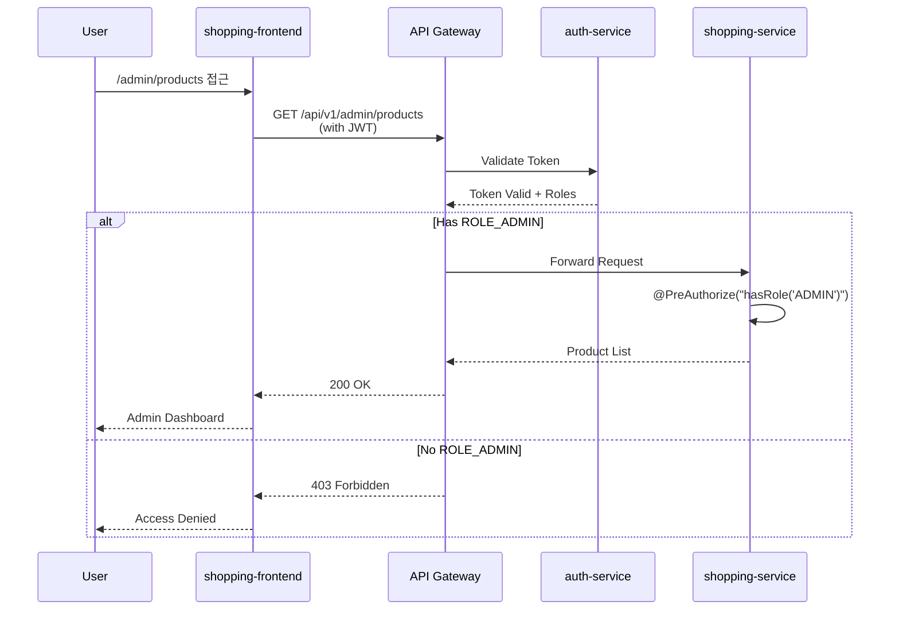
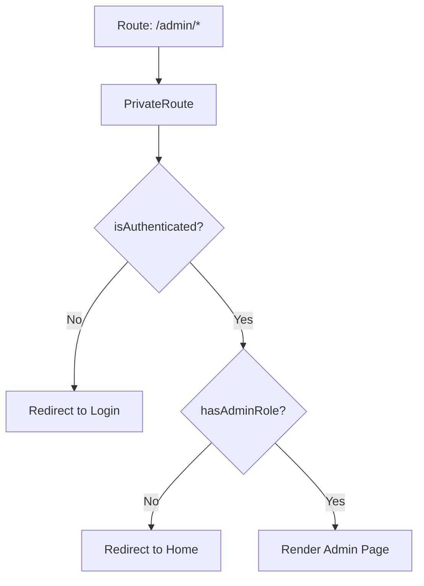
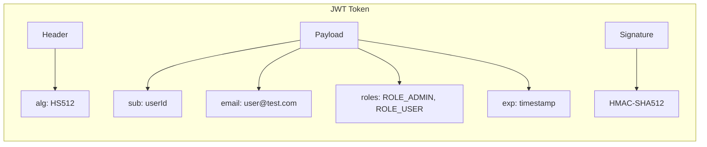

# Admin 인가 흐름 다이어그램

## 개요

Portal Universe Admin 기능의 인가(Authorization) 흐름을 설명합니다.

## Admin 접근 흐름



## Role 기반 인가 구조

```mermaid
graph TB
    subgraph "Frontend"
        A[AdminLayout] --> |roleGuard| B{Check Role}
        B -->|ADMIN| C[AdminDashboard]
        B -->|USER| D[Redirect to Home]
    end

    subgraph "Backend"
        E[Controller] --> |@PreAuthorize| F{Spring Security}
        F -->|hasRole ADMIN| G[Service Method]
        F -->|No Permission| H[403 Response]
    end

    C --> |API Call| E
```

## 컴포넌트별 인가 처리

### Frontend (React)



### Backend (Spring Security)

```mermaid
flowchart TD
    A[HTTP Request] --> B[JwtAuthenticationFilter]
    B --> C[Extract JWT from Header]
    C --> D{JWT Valid?}
    D -->|No| E[401 Unauthorized]
    D -->|Yes| F[Set SecurityContext]
    F --> G[@PreAuthorize Check]
    G --> H{Has Required Role?}
    H -->|No| I[403 Forbidden]
    H -->|Yes| J[Execute Controller]
```

## JWT 토큰 구조



## 역할 계층

| 역할 | 권한 | 접근 가능 영역 |
|------|------|---------------|
| ROLE_ADMIN | 전체 관리 | Admin Dashboard, 상품 관리, 주문 관리 |
| ROLE_USER | 일반 사용자 | 상품 조회, 장바구니, 주문 |
| ANONYMOUS | 비인증 | 상품 목록 조회 (일부) |

## 인가 어노테이션 사용

```java
// Admin 전용 API
@PreAuthorize("hasRole('ADMIN')")
@GetMapping("/api/v1/admin/products")
public ResponseEntity<List<ProductResponse>> getAdminProducts() {
    // ...
}

// 인증된 사용자
@PreAuthorize("isAuthenticated()")
@GetMapping("/api/v1/orders")
public ResponseEntity<List<OrderResponse>> getMyOrders() {
    // ...
}

// 공개 API
@GetMapping("/api/v1/products")
public ResponseEntity<List<ProductResponse>> getProducts() {
    // ...
}
```

## 관련 문서

- [Architecture - Admin Authorization Strategy](../../architecture/admin-authorization-strategy.md)
- [ADR-003 Authorization Strategy](../../adr/ADR-003-authorization-strategy.md)
- [Learning - Admin Implementation Patterns](../../learning/admin-implementation-patterns.md)
