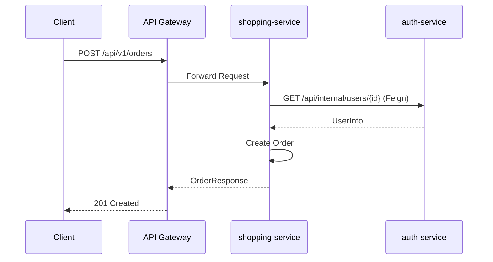
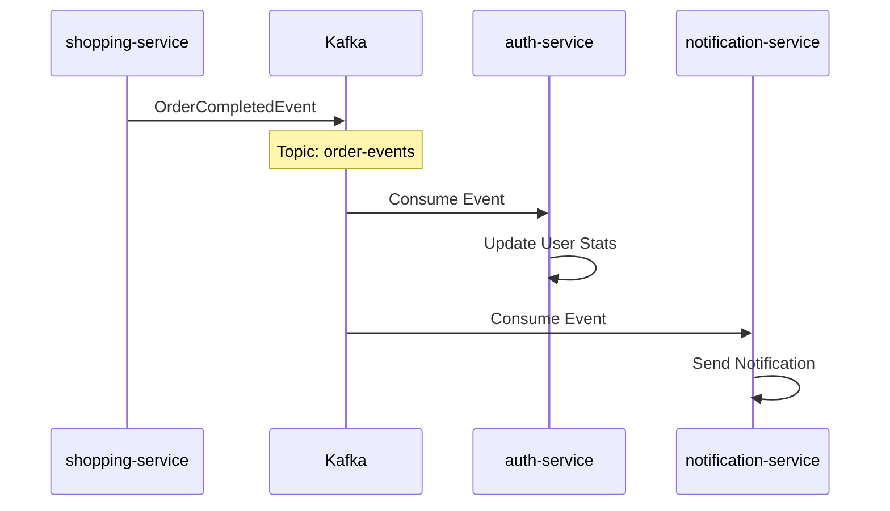
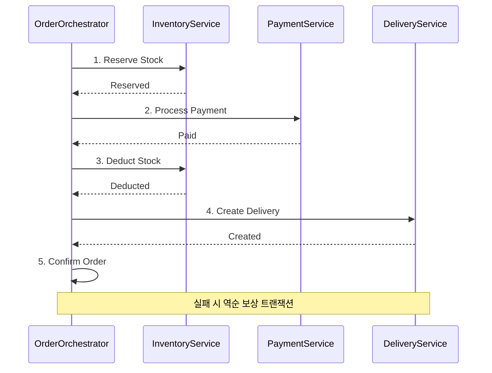
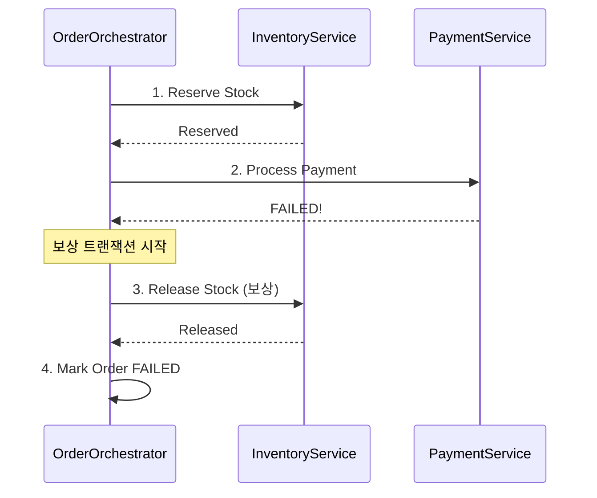
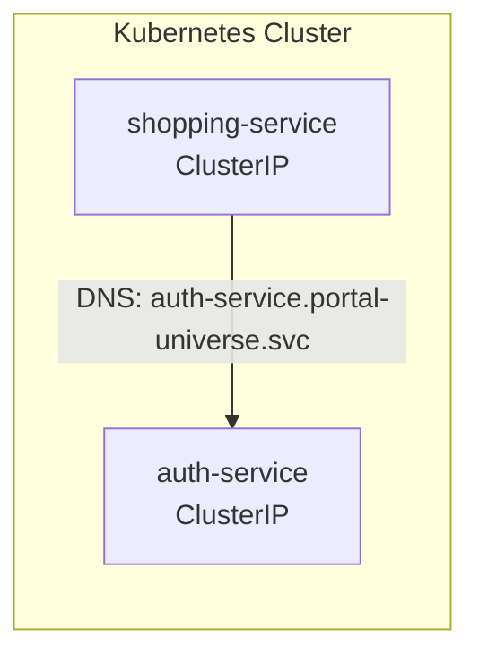

# 서비스 간 통신 다이어그램

## 개요

Portal Universe 마이크로서비스 간의 통신 방식을 설명합니다.

## 통신 방식 개요

| 방식 | 사용 목적 | 기술 |
|------|----------|------|
| Synchronous | 즉시 응답 필요 | Feign Client |
| Asynchronous | 느슨한 결합, 이벤트 기반 | Apache Kafka |

## Synchronous Communication (Feign Client)

### 주문 생성 흐름



### Feign Client 설정

```java
@FeignClient(name = "auth-service")
public interface AuthServiceClient {
    @GetMapping("/api/internal/users/{userId}")
    UserResponse getUserById(@PathVariable Long userId);
}
```

### 사용 케이스

| 호출자 | 피호출자 | 목적 |
|--------|----------|------|
| shopping-service | auth-service | 사용자 정보 조회 |
| blog-service | auth-service | 작성자 정보 조회 |
| api-gateway | auth-service | 토큰 검증 |

## Asynchronous Communication (Kafka)

### 주문 완료 이벤트 흐름



### Kafka Topic 구조

| Topic | Publisher | Consumers | 설명 |
|-------|-----------|-----------|------|
| order-events | shopping-service | auth-service, notification-service | 주문 이벤트 |
| user-events | auth-service | shopping-service, blog-service | 사용자 이벤트 |
| notification-events | * | notification-service | 알림 요청 |

### Event 구조 예시

```java
public class OrderCompletedEvent {
    private String eventId;
    private Long orderId;
    private Long userId;
    private BigDecimal totalAmount;
    private LocalDateTime occurredAt;
}
```

## Saga Pattern - 주문 프로세스



### Saga 실패 시 보상 흐름



## Service Discovery

> **Note**: discovery-service (Eureka)는 제거 예정입니다.
> Kubernetes 환경에서는 K8s Service Discovery를 사용합니다.



## 관련 문서

- [Architecture - Auth System Design](../../architecture/auth-system-design.md)
- [Learning - Saga Pattern](../../learning/notes/02-saga-pattern.md)
- [PRD-001 E-commerce Core](../../prd/PRD-001-ecommerce-core.md)
