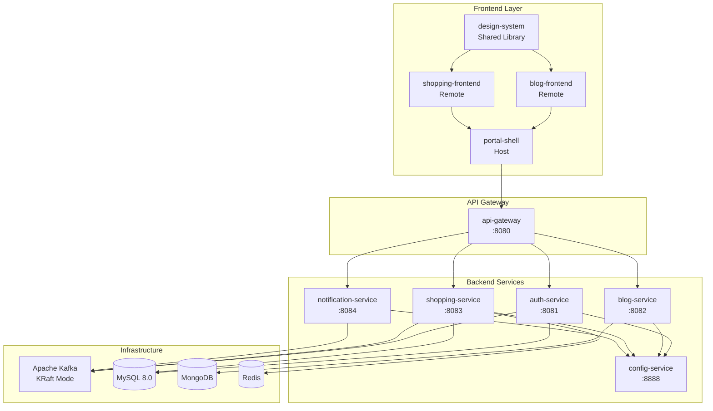
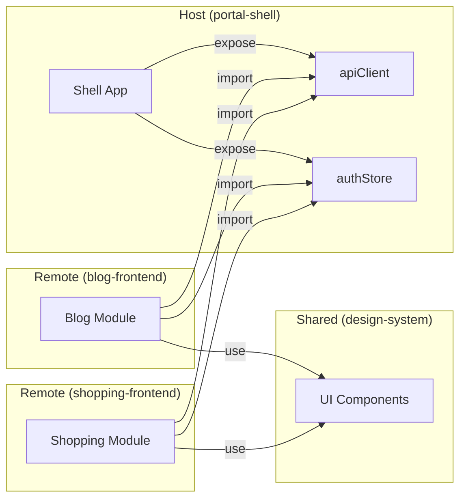
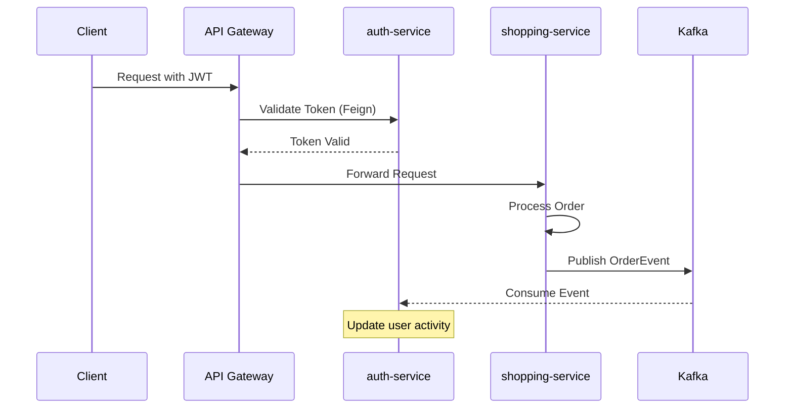

# Portal Universe 시스템 아키텍처 개요

## 전체 시스템 구조

## Frontend Module Federation

## Backend Service Communication

## 포트 매핑

| 서비스 | Local Port | K8s NodePort |
|--------|------------|--------------|
| portal-shell | 5173 | 30000 |
| blog-frontend | 5174 | 30001 |
| shopping-frontend | 5175 | 30002 |
| design-system | 5176 | 30003 |
| api-gateway | 8080 | 30080 |
| config-service | 8888 | 30888 |
| auth-service | 8081 | 30081 |
| blog-service | 8082 | 30082 |
| shopping-service | 8083 | 30083 |
| notification-service | 8084 | 30084 |

## 관련 문서

- [Architecture - Identity Model](../../architecture/system/identity-model.md)
- [Architecture - Signup Flow](../../old-docs/signup-flow.md)
- [PRD-001 E-commerce Core](../../prd/PRD-001-ecommerce-core.md)
