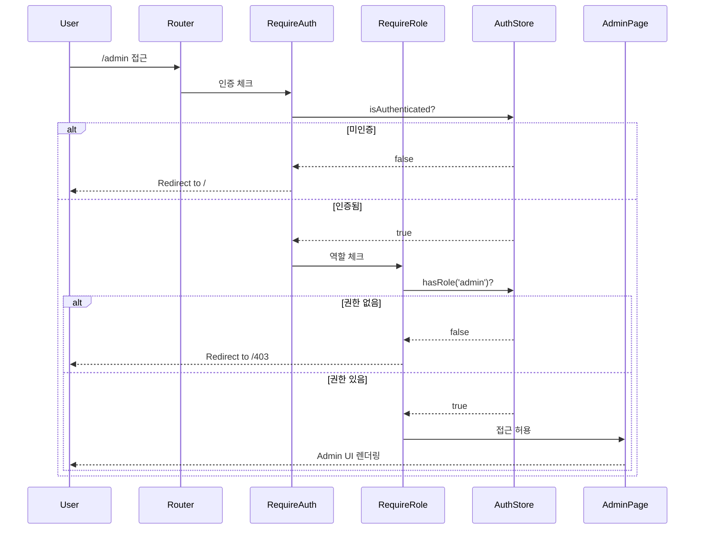
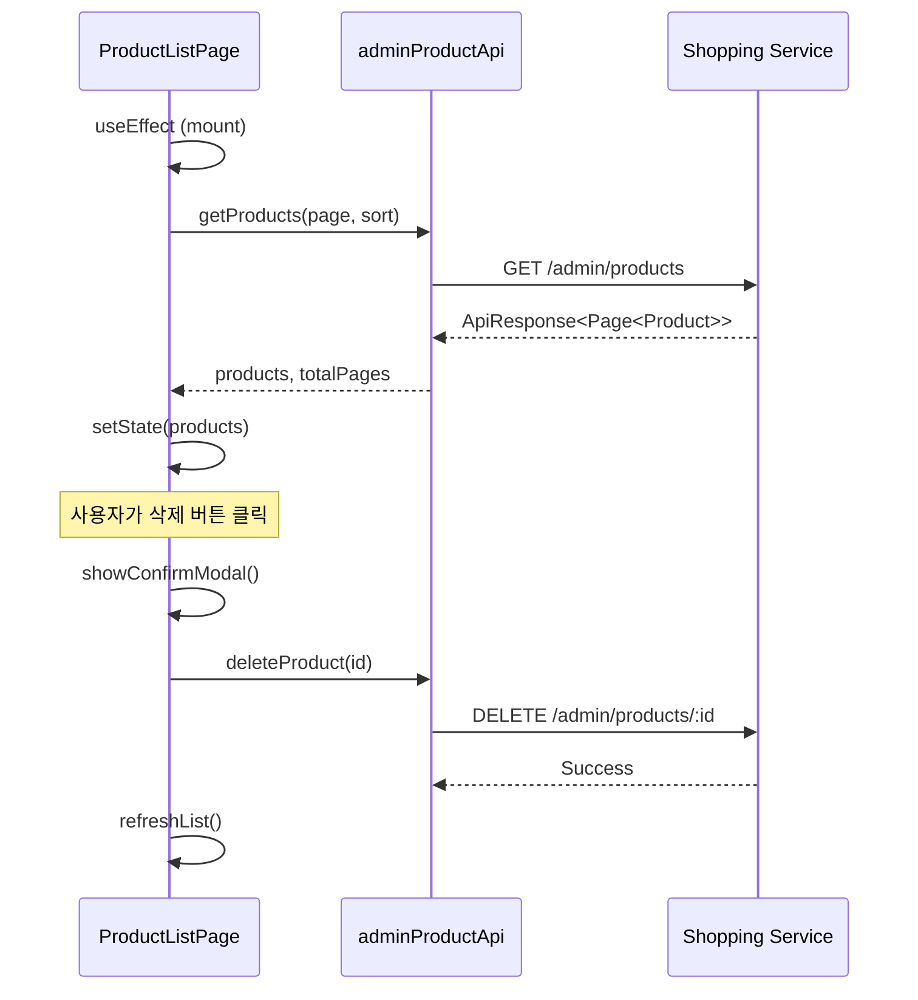
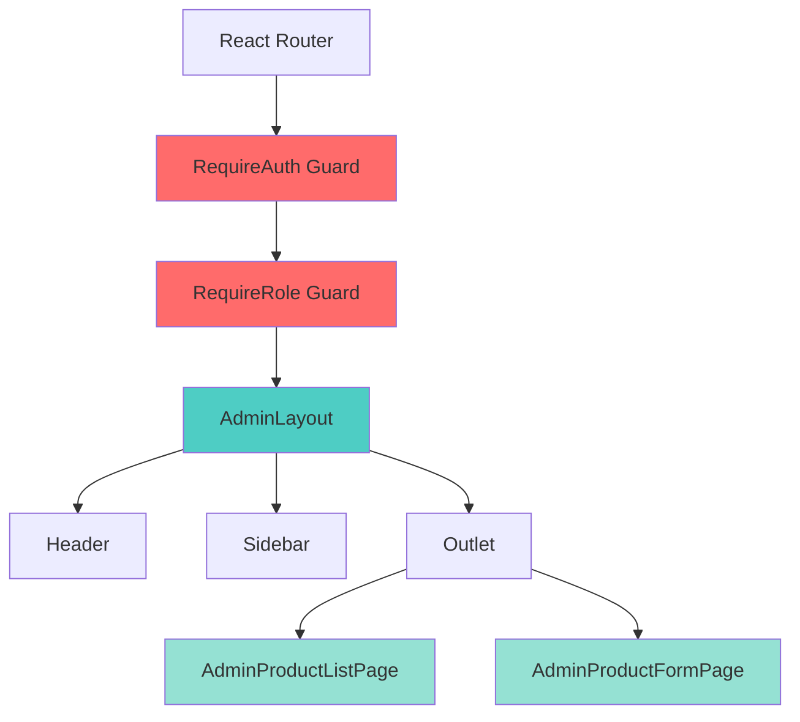

# Shopping Admin 가이드

**난이도**: ⭐⭐ | **예상 시간**: 30분 | **카테고리**: Development

Shopping Frontend의 Admin 기능을 사용하고 개발하는 방법을 설명합니다.

---

## Admin 접근 및 권한

### 접근 URL

| 환경 | URL |
|------|-----|
| 로컬 개발 (Standalone) | `http://localhost:5174/admin` |
| Portal Shell 통합 | `http://localhost:30000/shopping/admin` |

### 접근 요구사항

1. **인증 (Authentication)**: Portal Shell 로그인 필수 (JWT 토큰 기반)
2. **인가 (Authorization)**: `admin` 역할(role) 필요

```
Email: admin@portal-universe.com
Password: (관리자 암호)
```

### 접근 실패 시 동작

| 상황 | 리다이렉트 | 사유 |
|------|-----------|------|
| 미인증 | `/` | 로그인 필요 |
| 권한 없음 | `/403` | admin 역할 없음 |

### RBAC 권한 매트릭스

| 역할 | 상품 조회 | 상품 등록 | 상품 수정 | 상품 삭제 |
|------|----------|----------|----------|----------|
| GUEST | O | X | X | X |
| USER | O | X | X | X |
| ADMIN | O | O | O | O |

### 권한 체크 흐름



---

## 상품 관리

### 상품 목록 조회

**URL**: `http://localhost:30000/admin/products`

**기능**:
- 상품 목록 조회 (페이징, 페이지당 10~20개)
- 정렬 (생성일, 이름, 가격)
- 상품 삭제 (확인 모달)
- 상품 생성/수정 페이지 이동

**데이터 흐름**:


### 상품 등록

**URL**: `http://localhost:30000/admin/products/new`

#### 폼 필드

| 필드 | 타입 | 필수 | 검증 규칙 |
|------|------|------|----------|
| Product Name | string | O | 1~200자 |
| Description | string | O | 1~2000자 |
| Price | number | O | 0보다 큼 |
| Stock | number | O | 0 이상 정수 |
| Image URL | string | O | URL 형식 (https:// 권장) |
| Category | string | O | 자유 입력 |

#### 유효성 검사 스키마

```tsx
// src/schemas/productSchema.ts
import { z } from 'zod'

export const productSchema = z.object({
  name: z.string().min(2, '상품명은 최소 2자 이상이어야 합니다'),
  description: z.string().min(10, '설명은 최소 10자 이상이어야 합니다'),
  price: z.number().positive('가격은 0보다 커야 합니다'),
  stock: z.number().min(0, '재고는 0 이상이어야 합니다'),
  imageUrl: z.string().url('올바른 URL 형식이어야 합니다'),
  category: z.string().min(1, '카테고리를 선택해주세요')
})

export type ProductFormData = z.infer<typeof productSchema>
```

#### 결과

- **성공**: "Product created successfully!" 메시지 표시, 목록 페이지로 이동
- **실패**: 오류 메시지 표시, 폼 데이터 유지

### 상품 수정

**URL**: `http://localhost:30000/admin/products/{productId}`

- 기존 데이터가 폼에 미리 로드됨
- 폼 구조는 등록과 동일
- 가격 변경 시 기존 주문에는 영향 없음 (새 주문부터 적용)
- 중복 상품명 불가

### 상품 삭제

- 목록에서 휴지통 아이콘 클릭 → 확인 모달 표시
- 활성 주문이 있는 상품은 삭제 불가 ("Cannot delete product with active orders")
- 삭제 후 복구 불가능

### 재고 관리

#### 개별 수정

상품 수정 페이지에서 Stock 필드 변경 후 업데이트

#### PATCH API 직접 사용

```bash
curl -X PATCH http://localhost:8080/api/shopping/admin/products/1/stock \
  -H "Authorization: Bearer $TOKEN" \
  -H "Content-Type: application/json" \
  -d '{ "stock": 100 }'
```

#### 재고 상태 표시

| 색상 | 조건 | 의미 |
|------|------|------|
| 초록색 | 10개 이상 | 충분 |
| 노란색 | 1~10개 | 주의 |
| 빨간색 | 0개 | 품절 |

---

## 개발자 레퍼런스

### 컴포넌트 구조



### Auth Guard 구현

#### RequireAuth

```tsx
// src/components/auth/RequireAuth.tsx
import { Navigate, Outlet } from 'react-router-dom'
import { useAuthStore } from '@/stores/authStore'

export const RequireAuth: React.FC = () => {
  const { isAuthenticated } = useAuthStore()

  if (!isAuthenticated) {
    return <Navigate to="/" replace />
  }

  return <Outlet />
}
```

#### RequireRole

```tsx
// src/components/auth/RequireRole.tsx
import { Navigate, Outlet } from 'react-router-dom'
import { useAuthStore } from '@/stores/authStore'

interface RequireRoleProps {
  role: string
}

export const RequireRole: React.FC<RequireRoleProps> = ({ role }) => {
  const { user } = useAuthStore()

  if (!user?.roles?.includes(role)) {
    return <Navigate to="/403" replace />
  }

  return <Outlet />
}
```

### 라우팅 설정

```tsx
// src/App.tsx
<Route element={<RequireAuth />}>
  <Route element={<RequireRole role="admin" />}>
    <Route path="/admin" element={<AdminLayout />}>
      <Route index element={<Navigate to="/admin/products" replace />} />
      <Route path="products" element={<AdminProductListPage />} />
      <Route path="products/new" element={<AdminProductFormPage />} />
      <Route path="products/:id" element={<AdminProductFormPage />} />
    </Route>
  </Route>
</Route>
```

### API Client

```typescript
// src/api/admin/productApi.ts
import { apiClient } from '@/api/client'

export const adminProductApi = {
  getProducts: (page = 0, size = 20, sort = 'createdAt,desc') =>
    apiClient.get('/admin/products', { params: { page, size, sort } }),
  getProduct: (id: string) =>
    apiClient.get(`/admin/products/${id}`),
  createProduct: (data: ProductFormData) =>
    apiClient.post('/admin/products', data),
  updateProduct: (id: string, data: ProductFormData) =>
    apiClient.put(`/admin/products/${id}`, data),
  deleteProduct: (id: string) =>
    apiClient.delete(`/admin/products/${id}`)
}
```

### API 응답 형식

#### 성공
```json
{
  "success": true,
  "code": "S000",
  "message": "요청이 성공적으로 처리되었습니다",
  "data": {
    "id": "prod-001",
    "name": "상품명",
    "price": 10000,
    "stock": 100
  }
}
```

#### 에러
```json
{
  "success": false,
  "code": "S001",
  "message": "권한이 없습니다",
  "data": null
}
```

---

## 트러블슈팅

### 1. Admin 페이지에 접근할 수 없습니다 (403)

| 원인 | 확인 방법 | 해결 방법 |
|------|----------|----------|
| ADMIN 권한 부족 | JWT 토큰 디코딩 ([jwt.io](https://jwt.io/)) | Admin 권한 신청 |
| JWT 토큰 만료 | 브라우저 Console 확인 | 다시 로그인 |
| 서버 오류 | 브라우저 Network 탭 확인 | 서버 상태 확인 |

```javascript
// 브라우저 Console에서 토큰 확인
console.log(localStorage.getItem('token'));
```

### 2. 인증 토큰 만료 (401)

```typescript
// src/api/client.ts - interceptor에서 자동 처리
apiClient.interceptors.response.use(
  response => response,
  error => {
    if (error.response?.status === 401) {
      useAuthStore.getState().clearAuth()
      window.location.href = '/'
    }
    return Promise.reject(error)
  }
)
```

### 3. Portal Shell 통합 시 authStore 동기화 안됨

```typescript
// src/bootstrap.tsx
import { useAuthStore as useShellAuthStore } from 'portal-shell/authStore'

export function bootstrap() {
  useShellAuthStore.subscribe(state => {
    useAuthStore.getState().setAuth(state)
  })
}
```

### 4. "Product with this name already exists" (409)

상품 목록에서 같은 이름 검색 후 다른 이름으로 변경하거나, 기존 상품을 수정 페이지에서 수정

### 5. 상품 삭제 불가 ("Cannot delete product with active orders")

활성 주문이 완료되기를 기다린 후 삭제 시도

### 6. 가격 수정 후 반영이 안됨

전체 페이지 새로고침 (Ctrl+F5 또는 Cmd+Shift+R), 브라우저 캐시 삭제

### 디버깅 체크리스트

```
□ 로그인 상태 확인
□ JWT 토큰 확인 (LocalStorage: token)
□ Admin 권한 확인 (토큰에 ROLE_ADMIN)
□ 브라우저 콘솔 오류 확인 (F12)
□ Network 탭에서 API 응답 확인
□ Backend 서버 상태 확인
  □ http://localhost:8080/actuator/health
□ 캐시 삭제 후 재시도
```

---

## 테스트 시나리오

### 권한 체크 테스트
1. 로그아웃 상태에서 /admin 접근 → / 리다이렉트 확인
2. 일반 사용자로 로그인 → /admin 접근 → /403 리다이렉트 확인
3. admin 사용자로 로그인 → /admin 접근 → 정상 접근 확인

### 상품 CRUD 테스트
1. /admin/products → 목록 조회 확인
2. "새 상품" 버튼 → /admin/products/new 이동 확인
3. 폼 작성 → "등록" → 목록에 새 상품 표시 확인
4. 상품 클릭 → 기존 데이터 로드 확인
5. 데이터 수정 → "수정" → 변경사항 반영 확인
6. "삭제" 버튼 → 확인 모달 → 삭제 → 목록에서 제거 확인

### 폼 유효성 검사 테스트
1. 빈 폼 제출 → 모든 필드 에러 메시지 표시 확인
2. name 1자 입력 → "최소 2자" 에러 확인
3. price -100 입력 → "0보다 커야" 에러 확인
4. imageUrl "invalid" 입력 → "올바른 URL" 에러 확인

---

## 관련 문서

- [Getting Started](./getting-started.md) - 개발 환경 설정
- [Module Federation 통합](./module-federation-guide.md) - Portal Shell 통합
- [API Reference](../../api/shopping-service/README.md) - Shopping API 레퍼런스
- [Admin API Design](../../api/shopping-service/admin-product-api.md) - Admin API 설계
