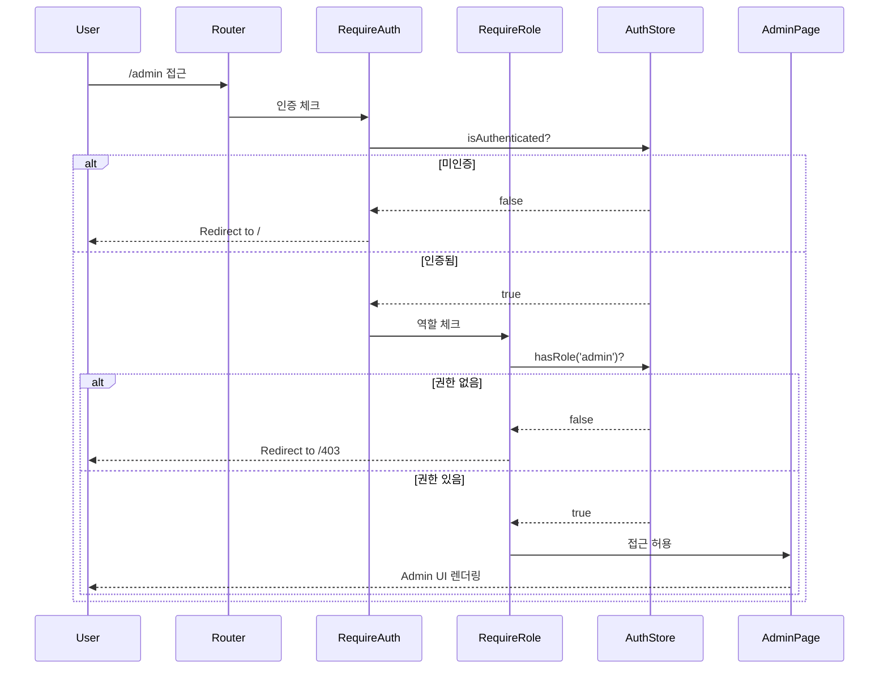
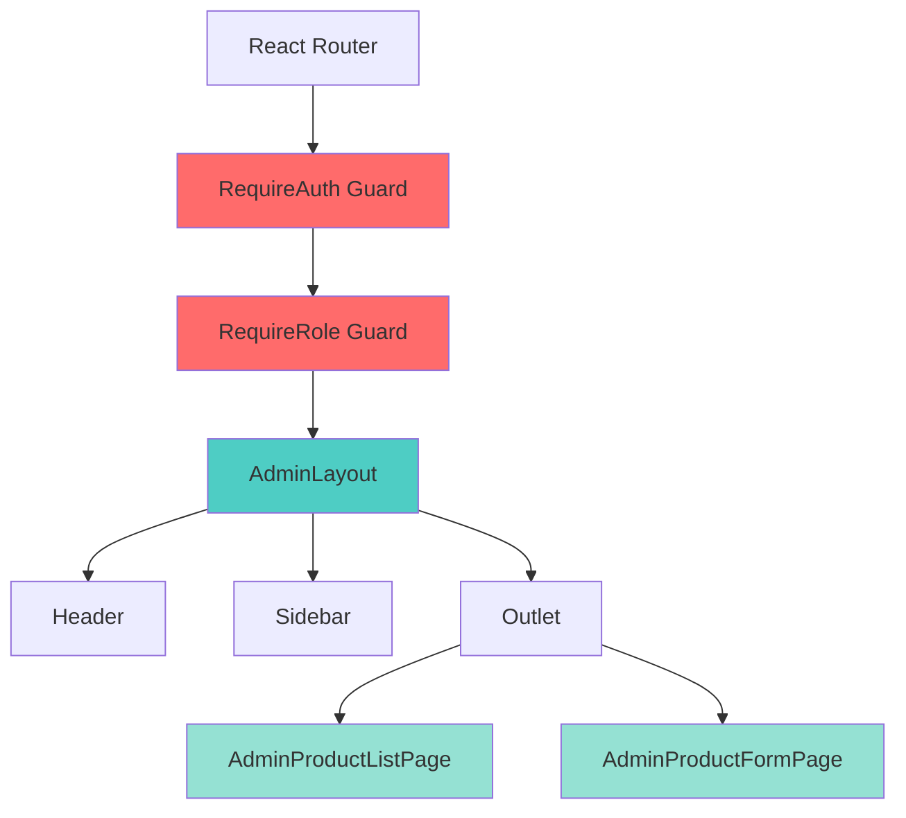
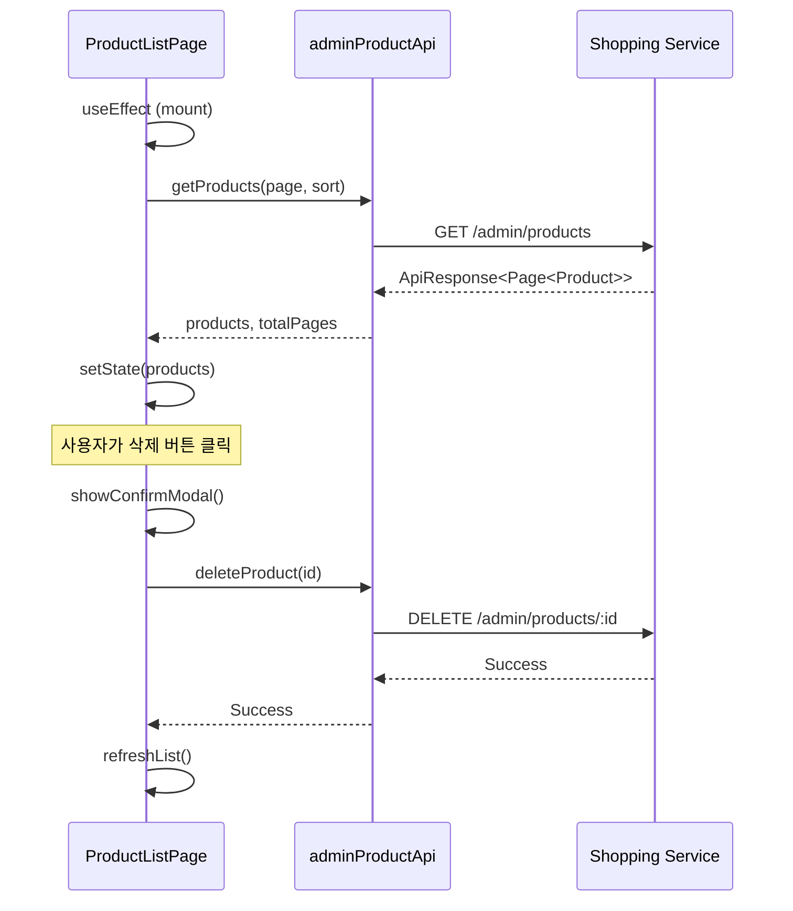

# Shopping Frontend - Admin UI 가이드

## 📋 개요

이 가이드는 Shopping Frontend의 Admin UI를 사용하고 개발하는 방법을 설명합니다.

### 대상 독자
- Shopping 서비스 관리자
- Frontend 개발자 (Admin 기능 개발/수정)
- QA 엔지니어 (Admin 기능 테스트)

### 사전 지식
- React 기본 지식
- React Router 사용 경험
- REST API 이해
- 인증/인가 개념

---

## 🚪 Admin 영역 접근

### 접근 URL
```
http://localhost:5174/admin          # 로컬 개발
http://localhost:3000/shopping/admin # Portal Shell 통합
```

### 접근 요구사항

#### 1. 인증 (Authentication)
- Portal Shell 로그인 필수
- JWT 토큰 기반 인증
- authStore에서 인증 상태 확인

#### 2. 인가 (Authorization)
- `admin` 역할(role) 필요
- 사용자의 역할 정보는 JWT 토큰에 포함

### 접근 실패 시 동작
| 상황 | 리다이렉트 | 사유 |
|------|-----------|------|
| 미인증 | `/` | 로그인 필요 |
| 권한 없음 | `/403` | admin 역할 없음 |

---

## 🔐 권한 체크 흐름

Admin 영역은 2단계 가드로 보호됩니다.



### 구현 코드

#### RequireAuth Guard
```tsx
// src/components/auth/RequireAuth.tsx
import { Navigate, Outlet } from 'react-router-dom'
import { useAuthStore } from '@/stores/authStore'

export const RequireAuth: React.FC = () => {
  const { isAuthenticated } = useAuthStore()

  if (!isAuthenticated) {
    return <Navigate to="/" replace />
  }

  return <Outlet />
}
```

#### RequireRole Guard
```tsx
// src/components/auth/RequireRole.tsx
import { Navigate, Outlet } from 'react-router-dom'
import { useAuthStore } from '@/stores/authStore'

interface RequireRoleProps {
  role: string
}

export const RequireRole: React.FC<RequireRoleProps> = ({ role }) => {
  const { user } = useAuthStore()

  if (!user?.roles?.includes(role)) {
    return <Navigate to="/403" replace />
  }

  return <Outlet />
}
```

#### 라우팅 설정
```tsx
// src/App.tsx
<Route element={<RequireAuth />}>
  <Route element={<RequireRole role="admin" />}>
    <Route path="/admin" element={<AdminLayout />}>
      <Route index element={<Navigate to="/admin/products" replace />} />
      <Route path="products" element={<AdminProductListPage />} />
      <Route path="products/new" element={<AdminProductFormPage />} />
      <Route path="products/:id" element={<AdminProductFormPage />} />
    </Route>
  </Route>
</Route>
```

---

## 🏗️ 컴포넌트 구조

### 레이아웃 계층



### AdminLayout
Admin 페이지의 공통 레이아웃을 제공합니다.

```tsx
// src/layouts/AdminLayout.tsx
import { Outlet } from 'react-router-dom'

export const AdminLayout: React.FC = () => {
  return (
    <div className="admin-layout">
      <Header />
      <div className="admin-content">
        <Sidebar />
        <main className="admin-main">
          <Outlet />
        </main>
      </div>
    </div>
  )
}
```

**구성 요소**:
- **Header**: 로고, 사용자 메뉴
- **Sidebar**: 네비게이션 메뉴 (상품 관리, 주문 관리 등)
- **Outlet**: 실제 페이지 컨텐츠 렌더링

---

## 📄 페이지 기능

### 1. AdminProductListPage

상품 목록을 조회하고 관리하는 페이지입니다.

#### 주요 기능
- ✅ 상품 목록 조회 (페이징)
- ✅ 정렬 (생성일, 이름, 가격)
- ✅ 상품 삭제 (확인 모달)
- ✅ 상품 생성/수정 페이지 이동

#### 데이터 흐름


#### 코드 예시
```tsx
// src/pages/admin/AdminProductListPage.tsx
import { useState, useEffect } from 'react'
import { useNavigate } from 'react-router-dom'
import { adminProductApi } from '@/api/admin/productApi'

export const AdminProductListPage: React.FC = () => {
  const [products, setProducts] = useState([])
  const [loading, setLoading] = useState(true)
  const [page, setPage] = useState(0)
  const [totalPages, setTotalPages] = useState(0)
  const navigate = useNavigate()

  useEffect(() => {
    loadProducts()
  }, [page])

  const loadProducts = async () => {
    try {
      setLoading(true)
      const response = await adminProductApi.getProducts(page, 20, 'createdAt,desc')
      setProducts(response.data.content)
      setTotalPages(response.data.totalPages)
    } catch (error) {
      console.error('Failed to load products:', error)
    } finally {
      setLoading(false)
    }
  }

  const handleDelete = async (id: string) => {
    if (!confirm('정말 삭제하시겠습니까?')) return

    try {
      await adminProductApi.deleteProduct(id)
      loadProducts() // 목록 새로고침
    } catch (error) {
      console.error('Failed to delete product:', error)
    }
  }

  return (
    <div className="admin-product-list">
      <div className="header">
        <h1>상품 관리</h1>
        <button onClick={() => navigate('/admin/products/new')}>
          + 새 상품
        </button>
      </div>

      {loading ? (
        <div>로딩 중...</div>
      ) : (
        <table>
          <thead>
            <tr>
              <th>이미지</th>
              <th>이름</th>
              <th>가격</th>
              <th>재고</th>
              <th>작업</th>
            </tr>
          </thead>
          <tbody>
            {products.map(product => (
              <tr key={product.id}>
                <td></td>
                <td>{product.name}</td>
                <td>{product.price.toLocaleString()}원</td>
                <td>{product.stock}</td>
                <td>
                  <button onClick={() => navigate(`/admin/products/${product.id}`)}>
                    수정
                  </button>
                  <button onClick={() => handleDelete(product.id)}>
                    삭제
                  </button>
                </td>
              </tr>
            ))}
          </tbody>
        </table>
      )}

      {/* 페이지네이션 */}
      <div className="pagination">
        <button
          disabled={page === 0}
          onClick={() => setPage(page - 1)}
        >
          이전
        </button>
        <span>{page + 1} / {totalPages}</span>
        <button
          disabled={page >= totalPages - 1}
          onClick={() => setPage(page + 1)}
        >
          다음
        </button>
      </div>
    </div>
  )
}
```

---

### 2. AdminProductFormPage

상품을 생성하거나 수정하는 폼 페이지입니다.

#### 주요 기능
- ✅ 상품 생성 (POST)
- ✅ 상품 수정 (PUT)
- ✅ 폼 유효성 검사 (Zod + React Hook Form)
- ✅ 이미지 URL 입력

#### 폼 필드
| 필드 | 타입 | 필수 | 검증 규칙 |
|------|------|------|----------|
| name | string | ✅ | 최소 2자 |
| description | string | ✅ | 최소 10자 |
| price | number | ✅ | 양수 |
| stock | number | ✅ | 0 이상 |
| imageUrl | string | ✅ | URL 형식 |
| category | string | ✅ | - |

#### 유효성 검사 스키마
```tsx
// src/schemas/productSchema.ts
import { z } from 'zod'

export const productSchema = z.object({
  name: z.string()
    .min(2, '상품명은 최소 2자 이상이어야 합니다'),
  description: z.string()
    .min(10, '설명은 최소 10자 이상이어야 합니다'),
  price: z.number()
    .positive('가격은 0보다 커야 합니다'),
  stock: z.number()
    .min(0, '재고는 0 이상이어야 합니다'),
  imageUrl: z.string()
    .url('올바른 URL 형식이어야 합니다'),
  category: z.string()
    .min(1, '카테고리를 선택해주세요')
})

export type ProductFormData = z.infer<typeof productSchema>
```

#### 코드 예시
```tsx
// src/pages/admin/AdminProductFormPage.tsx
import { useEffect } from 'react'
import { useNavigate, useParams } from 'react-router-dom'
import { useForm } from 'react-hook-form'
import { zodResolver } from '@hookform/resolvers/zod'
import { productSchema, ProductFormData } from '@/schemas/productSchema'
import { adminProductApi } from '@/api/admin/productApi'

export const AdminProductFormPage: React.FC = () => {
  const { id } = useParams<{ id: string }>()
  const navigate = useNavigate()
  const isEditMode = !!id

  const {
    register,
    handleSubmit,
    reset,
    formState: { errors, isSubmitting }
  } = useForm<ProductFormData>({
    resolver: zodResolver(productSchema)
  })

  useEffect(() => {
    if (isEditMode) {
      loadProduct()
    }
  }, [id])

  const loadProduct = async () => {
    try {
      const response = await adminProductApi.getProduct(id!)
      reset(response.data) // 폼에 기존 데이터 채우기
    } catch (error) {
      console.error('Failed to load product:', error)
    }
  }

  const onSubmit = async (data: ProductFormData) => {
    try {
      if (isEditMode) {
        await adminProductApi.updateProduct(id!, data)
      } else {
        await adminProductApi.createProduct(data)
      }
      navigate('/admin/products')
    } catch (error) {
      console.error('Failed to save product:', error)
    }
  }

  return (
    <div className="admin-product-form">
      <h1>{isEditMode ? '상품 수정' : '새 상품 등록'}</h1>

      <form onSubmit={handleSubmit(onSubmit)}>
        <div className="form-group">
          <label htmlFor="name">상품명 *</label>
          <input
            id="name"
            type="text"
            {...register('name')}
          />
          {errors.name && (
            <span className="error">{errors.name.message}</span>
          )}
        </div>

        <div className="form-group">
          <label htmlFor="description">설명 *</label>
          <textarea
            id="description"
            {...register('description')}
          />
          {errors.description && (
            <span className="error">{errors.description.message}</span>
          )}
        </div>

        <div className="form-row">
          <div className="form-group">
            <label htmlFor="price">가격 *</label>
            <input
              id="price"
              type="number"
              {...register('price', { valueAsNumber: true })}
            />
            {errors.price && (
              <span className="error">{errors.price.message}</span>
            )}
          </div>

          <div className="form-group">
            <label htmlFor="stock">재고 *</label>
            <input
              id="stock"
              type="number"
              {...register('stock', { valueAsNumber: true })}
            />
            {errors.stock && (
              <span className="error">{errors.stock.message}</span>
            )}
          </div>
        </div>

        <div className="form-group">
          <label htmlFor="category">카테고리 *</label>
          <select id="category" {...register('category')}>
            <option value="">선택하세요</option>
            <option value="electronics">전자제품</option>
            <option value="fashion">패션</option>
            <option value="home">홈/리빙</option>
            <option value="books">도서</option>
          </select>
          {errors.category && (
            <span className="error">{errors.category.message}</span>
          )}
        </div>

        <div className="form-group">
          <label htmlFor="imageUrl">이미지 URL *</label>
          <input
            id="imageUrl"
            type="url"
            {...register('imageUrl')}
            placeholder="https://example.com/image.jpg"
          />
          {errors.imageUrl && (
            <span className="error">{errors.imageUrl.message}</span>
          )}
        </div>

        <div className="form-actions">
          <button
            type="button"
            onClick={() => navigate('/admin/products')}
          >
            취소
          </button>
          <button
            type="submit"
            disabled={isSubmitting}
          >
            {isSubmitting ? '저장 중...' : (isEditMode ? '수정' : '등록')}
          </button>
        </div>
      </form>
    </div>
  )
}
```

---

## 🔌 API 연동

### API Client 구조

```typescript
// src/api/admin/productApi.ts
import { apiClient } from '@/api/client'

export const adminProductApi = {
  // 목록 조회
  getProducts: (page = 0, size = 20, sort = 'createdAt,desc') => {
    return apiClient.get('/admin/products', {
      params: { page, size, sort }
    })
  },

  // 단건 조회
  getProduct: (id: string) => {
    return apiClient.get(`/admin/products/${id}`)
  },

  // 생성
  createProduct: (data: ProductFormData) => {
    return apiClient.post('/admin/products', data)
  },

  // 수정
  updateProduct: (id: string, data: ProductFormData) => {
    return apiClient.put(`/admin/products/${id}`, data)
  },

  // 삭제
  deleteProduct: (id: string) => {
    return apiClient.delete(`/admin/products/${id}`)
  }
}
```

### API 응답 형식

#### 성공 응답
```json
{
  "success": true,
  "code": "S000",
  "message": "요청이 성공적으로 처리되었습니다",
  "data": {
    "id": "prod-001",
    "name": "상품명",
    "description": "설명",
    "price": 10000,
    "stock": 100,
    "imageUrl": "https://...",
    "category": "electronics"
  }
}
```

#### 에러 응답
```json
{
  "success": false,
  "code": "S001",
  "message": "권한이 없습니다",
  "data": null
}
```

---

## ⚠️ 주의사항 및 트러블슈팅

### 1. 인증 토큰 만료

**증상**: API 호출 시 401 Unauthorized

**원인**: JWT 토큰 만료

**해결**:
```typescript
// src/api/client.ts
apiClient.interceptors.response.use(
  response => response,
  error => {
    if (error.response?.status === 401) {
      // authStore 초기화
      useAuthStore.getState().clearAuth()
      // 로그인 페이지로 리다이렉트
      window.location.href = '/'
    }
    return Promise.reject(error)
  }
)
```

---

### 2. 권한 없음 (403)

**증상**: Admin 페이지 접근 시 `/403`으로 리다이렉트

**원인**: 사용자에게 `admin` 역할이 없음

**해결**:
1. Auth Service에서 사용자 역할 확인
2. 테스트 계정에 `admin` 역할 부여
3. JWT 토큰 재발급

---

### 3. Portal Shell 통합 시 authStore 동기화 안됨

**증상**: 로그인했는데도 인증되지 않은 것으로 나타남

**원인**: Portal Shell과 Remote의 authStore가 분리됨

**해결**:
```typescript
// src/bootstrap.tsx
import { useAuthStore as useShellAuthStore } from 'portal-shell/authStore'

export function bootstrap() {
  // Portal Shell의 authStore 구독
  useShellAuthStore.subscribe(state => {
    useAuthStore.getState().setAuth(state)
  })
}
```

---

### 4. 폼 유효성 검사 실패

**증상**: 폼 제출 시 에러 메시지 표시

**원인**: Zod 스키마 검증 실패

**디버깅**:
```typescript
const onSubmit = async (data: ProductFormData) => {
  console.log('Form data:', data) // 제출된 데이터 확인
  console.log('Errors:', errors)   // 검증 에러 확인
  // ...
}
```

**해결**: 각 필드의 검증 규칙 확인 및 데이터 수정

---

### 5. 이미지 URL 검증 실패

**증상**: 올바른 URL인데도 검증 실패

**원인**: Zod의 URL 검증이 프로토콜(`http://`, `https://`) 필수

**해결**:
```typescript
// 프로토콜 자동 추가 유틸
const normalizeImageUrl = (url: string) => {
  if (!url.startsWith('http://') && !url.startsWith('https://')) {
    return `https://${url}`
  }
  return url
}
```

---

## 🧪 테스트 가이드

### 수동 테스트 시나리오

#### 1. 권한 체크 테스트
```
1. 로그아웃 상태에서 /admin 접근 → / 리다이렉트 확인
2. 일반 사용자로 로그인 → /admin 접근 → /403 리다이렉트 확인
3. admin 사용자로 로그인 → /admin 접근 → 정상 접근 확인
```

#### 2. 상품 CRUD 테스트
```
1. /admin/products → 목록 조회 확인
2. "새 상품" 버튼 → /admin/products/new 이동 확인
3. 폼 작성 (필수 필드) → "등록" → 목록에 새 상품 표시 확인
4. 상품 클릭 → /admin/products/:id 이동 → 기존 데이터 로드 확인
5. 데이터 수정 → "수정" → 변경사항 반영 확인
6. "삭제" 버튼 → 확인 모달 → 삭제 → 목록에서 제거 확인
```

#### 3. 폼 유효성 검사 테스트
```
1. 빈 폼 제출 → 모든 필드 에러 메시지 표시 확인
2. name 1자 입력 → "최소 2자" 에러 확인
3. price -100 입력 → "0보다 커야" 에러 확인
4. imageUrl "invalid" 입력 → "올바른 URL" 에러 확인
```

---

## 📚 관련 문서

- [Getting Started](./getting-started.md) - 개발 환경 설정
- [Module Federation 통합](./federation-integration.md) - Portal Shell 통합
- [API Client](../api/api-client.md) - API 통신 가이드
- [Data Flow](../architecture/data-flow.md) - 데이터 흐름 이해

---

## 🔄 다음 단계

1. **주문 관리 기능 추가** - Admin에서 주문 조회/관리
2. **대시보드 개발** - 통계 및 차트 표시
3. **이미지 업로드 기능** - URL 입력 대신 파일 업로드
4. **일괄 작업** - 여러 상품 동시 수정/삭제
5. **검색 및 필터** - 상품명, 카테고리로 검색

---

**작성**: 2026-01-19
**최종 업데이트**: 2026-01-19
