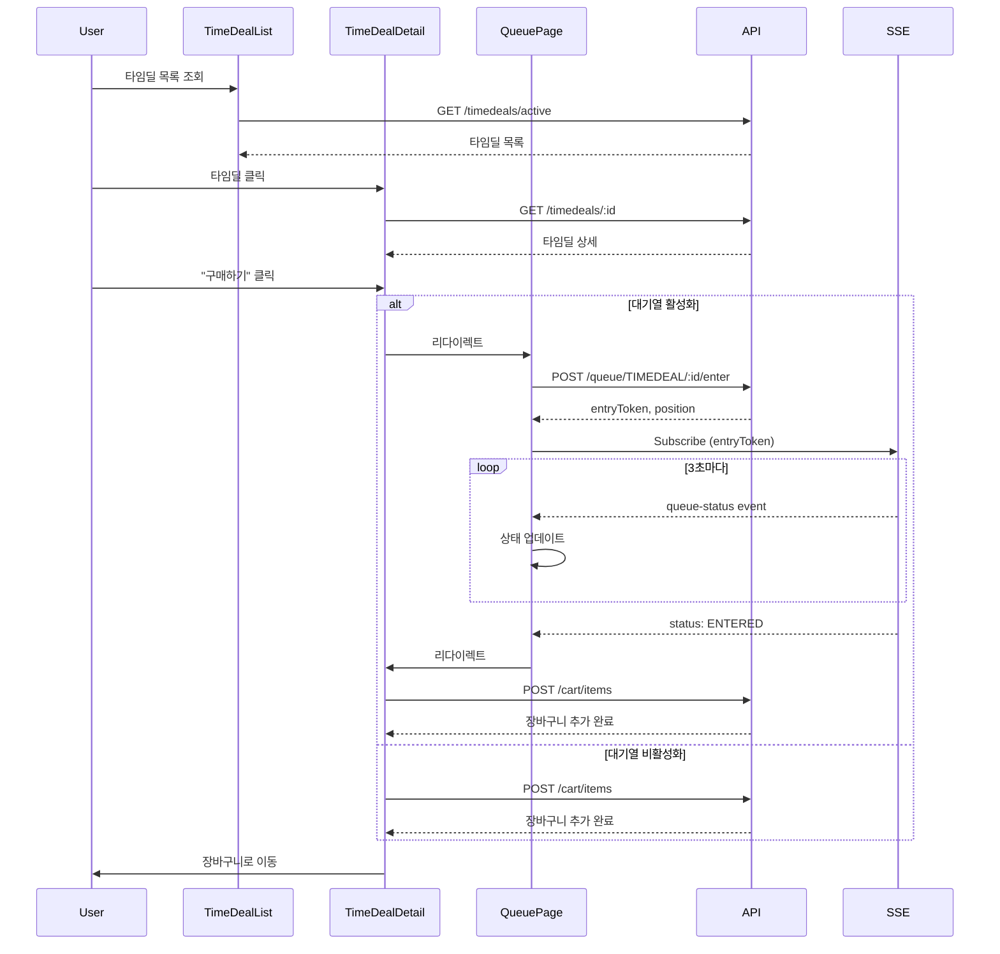

# Shopping Frontend - 쿠폰, 타임딜, 대기열 가이드

## 📋 개요

이 가이드는 Shopping Frontend의 쿠폰, 타임딜, 대기열 기능을 사용하고 개발하는 방법을 설명합니다.

### 대상 독자
- Shopping 서비스 사용자 (기능 이해)
- Frontend 개발자 (기능 개발/수정)
- QA 엔지니어 (기능 테스트)

### 사전 지식
- React 기본 지식
- React Hooks (useState, useEffect, custom hooks)
- SSE (Server-Sent Events) 개념
- REST API 이해

---

## 🎫 쿠폰 기능

### 1. 쿠폰 목록 조회

사용자는 발급 가능한 쿠폰 목록을 조회할 수 있습니다.

#### 페이지: `/coupons`

```tsx
// src/pages/coupon/CouponListPage.tsx
import { useState, useEffect } from 'react'
import { couponApi } from '@/api/couponApi'

export const CouponListPage: React.FC = () => {
  const [coupons, setCoupons] = useState([])
  const [loading, setLoading] = useState(true)

  useEffect(() => {
    loadCoupons()
  }, [])

  const loadCoupons = async () => {
    try {
      const response = await couponApi.getAvailableCoupons()
      setCoupons(response.data)
    } catch (error) {
      console.error('Failed to load coupons:', error)
    } finally {
      setLoading(false)
    }
  }

  return (
    <div className="coupon-list">
      <h1>쿠폰 목록</h1>
      {coupons.map(coupon => (
        <CouponCard key={coupon.id} coupon={coupon} />
      ))}
    </div>
  )
}
```

#### 쿠폰 카드 정보

| 필드 | 표시 내용 |
|------|----------|
| `name` | 쿠폰명 |
| `discountType` | 할인 유형 (퍼센트/고정금액) |
| `discountValue` | 할인 값 |
| `minimumOrderAmount` | 최소 주문 금액 |
| `expiresAt` | 유효기간 |
| `remainingQuantity` | 남은 수량 |

---

### 2. 쿠폰 발급

사용자가 "발급받기" 버튼을 클릭하면 쿠폰이 발급됩니다.

```tsx
// src/components/coupon/CouponCard.tsx
import { useState } from 'react'
import { couponApi } from '@/api/couponApi'

export const CouponCard: React.FC<{ coupon: Coupon }> = ({ coupon }) => {
  const [issuing, setIssuing] = useState(false)
  const [issued, setIssued] = useState(false)

  const handleIssue = async () => {
    try {
      setIssuing(true)
      await couponApi.issueCoupon(coupon.id)
      setIssued(true)
      alert('쿠폰이 발급되었습니다!')
    } catch (error) {
      if (error.response?.data?.code === 'S005') {
        alert('이미 발급받은 쿠폰입니다.')
      } else if (error.response?.data?.code === 'S006') {
        alert('쿠폰이 모두 소진되었습니다.')
      } else {
        alert('쿠폰 발급에 실패했습니다.')
      }
    } finally {
      setIssuing(false)
    }
  }

  return (
    <div className="coupon-card">
      <h3>{coupon.name}</h3>
      <p className="discount">
        {coupon.discountType === 'PERCENTAGE'
          ? `${coupon.discountValue}% 할인`
          : `${coupon.discountValue.toLocaleString()}원 할인`}
      </p>
      <p className="minimum">
        {coupon.minimumOrderAmount.toLocaleString()}원 이상 구매 시
      </p>
      <p className="remaining">
        남은 수량: {coupon.remainingQuantity}개
      </p>
      <button
        onClick={handleIssue}
        disabled={issuing || issued || coupon.remainingQuantity === 0}
      >
        {issued ? '발급 완료' : issuing ? '발급 중...' : '발급받기'}
      </button>
    </div>
  )
}
```

---

### 3. 내 쿠폰 조회

발급받은 쿠폰을 확인할 수 있습니다.

#### 페이지: `/my-coupons`

```tsx
// src/pages/coupon/MyCouponListPage.tsx
import { useState, useEffect } from 'react'
import { couponApi } from '@/api/couponApi'

export const MyCouponListPage: React.FC = () => {
  const [myCoupons, setMyCoupons] = useState([])

  useEffect(() => {
    loadMyCoupons()
  }, [])

  const loadMyCoupons = async () => {
    try {
      const response = await couponApi.getMyCoupons()
      setMyCoupons(response.data)
    } catch (error) {
      console.error('Failed to load my coupons:', error)
    }
  }

  return (
    <div className="my-coupon-list">
      <h1>내 쿠폰</h1>
      {myCoupons.length === 0 ? (
        <p>발급받은 쿠폰이 없습니다.</p>
      ) : (
        myCoupons.map(userCoupon => (
          <UserCouponCard key={userCoupon.id} userCoupon={userCoupon} />
        ))
      )}
    </div>
  )
}
```

#### 사용자 쿠폰 상태

| 상태 | 설명 | 표시 |
|------|------|------|
| `UNUSED` | 사용 가능 | "사용하기" 버튼 활성화 |
| `USED` | 사용 완료 | "사용 완료" 배지 |
| `EXPIRED` | 만료됨 | "만료됨" 배지, 회색 처리 |

---

### 4. 주문 시 쿠폰 적용

주문 페이지에서 보유한 쿠폰을 선택하여 할인받을 수 있습니다.

```tsx
// src/pages/order/OrderPage.tsx
import { useState, useEffect } from 'react'
import { couponApi } from '@/api/couponApi'
import { orderApi } from '@/api/orderApi'

export const OrderPage: React.FC = () => {
  const [myCoupons, setMyCoupons] = useState([])
  const [selectedCoupon, setSelectedCoupon] = useState(null)
  const [totalAmount, setTotalAmount] = useState(0)
  const [finalAmount, setFinalAmount] = useState(0)

  useEffect(() => {
    loadMyCoupons()
  }, [])

  useEffect(() => {
    calculateFinalAmount()
  }, [selectedCoupon, totalAmount])

  const calculateFinalAmount = () => {
    if (!selectedCoupon) {
      setFinalAmount(totalAmount)
      return
    }

    let discount = 0
    if (selectedCoupon.discountType === 'PERCENTAGE') {
      discount = totalAmount * (selectedCoupon.discountValue / 100)
      if (selectedCoupon.maximumDiscountAmount) {
        discount = Math.min(discount, selectedCoupon.maximumDiscountAmount)
      }
    } else {
      discount = selectedCoupon.discountValue
    }

    setFinalAmount(Math.max(0, totalAmount - discount))
  }

  const handleOrder = async () => {
    try {
      await orderApi.createOrder({
        items: cartItems,
        userCouponId: selectedCoupon?.id,
        // ...
      })
      alert('주문이 완료되었습니다!')
    } catch (error) {
      alert('주문에 실패했습니다.')
    }
  }

  return (
    <div className="order-page">
      <h2>쿠폰 선택</h2>
      <select
        value={selectedCoupon?.id || ''}
        onChange={(e) => {
          const coupon = myCoupons.find(c => c.id === Number(e.target.value))
          setSelectedCoupon(coupon)
        }}
      >
        <option value="">쿠폰 선택 안함</option>
        {myCoupons
          .filter(c => c.status === 'UNUSED' && totalAmount >= c.minimumOrderAmount)
          .map(coupon => (
            <option key={coupon.id} value={coupon.id}>
              {coupon.name} - {coupon.discountValue}
              {coupon.discountType === 'PERCENTAGE' ? '%' : '원'} 할인
            </option>
          ))
        }
      </select>

      <div className="price-summary">
        <p>주문 금액: {totalAmount.toLocaleString()}원</p>
        {selectedCoupon && (
          <p className="discount">
            쿠폰 할인: -{(totalAmount - finalAmount).toLocaleString()}원
          </p>
        )}
        <p className="final">최종 금액: {finalAmount.toLocaleString()}원</p>
      </div>

      <button onClick={handleOrder}>주문하기</button>
    </div>
  )
}
```

---

## ⏰ 타임딜 기능

### 1. 타임딜 목록 조회

진행 중이거나 예정된 타임딜 목록을 확인할 수 있습니다.

#### 페이지: `/timedeals`

```tsx
// src/pages/timedeal/TimeDealListPage.tsx
import { useState, useEffect } from 'react'
import { timeDealApi } from '@/api/timeDealApi'

export const TimeDealListPage: React.FC = () => {
  const [timeDeals, setTimeDeals] = useState([])

  useEffect(() => {
    loadTimeDeals()
  }, [])

  const loadTimeDeals = async () => {
    try {
      const response = await timeDealApi.getActiveTimeDeals()
      setTimeDeals(response.data)
    } catch (error) {
      console.error('Failed to load timedeals:', error)
    }
  }

  return (
    <div className="timedeal-list">
      <h1>타임딜</h1>
      <div className="timedeal-grid">
        {timeDeals.map(deal => (
          <TimeDealCard key={deal.id} deal={deal} />
        ))}
      </div>
    </div>
  )
}
```

#### 타임딜 카드 정보

| 필드 | 표시 내용 |
|------|----------|
| `productName` | 상품명 |
| `originalPrice` | 원가 |
| `discountedPrice` | 할인가 |
| `discountRate` | 할인율 |
| `dealStock` | 타임딜 재고 |
| `startsAt` | 시작 시간 |
| `endsAt` | 종료 시간 |

```tsx
// src/components/timedeal/TimeDealCard.tsx
export const TimeDealCard: React.FC<{ deal: TimeDeal }> = ({ deal }) => {
  const discountRate = Math.round(
    ((deal.originalPrice - deal.discountedPrice) / deal.originalPrice) * 100
  )

  return (
    <div className="timedeal-card">
      <div className="badge">{discountRate}% 할인</div>
      
      <h3>{deal.productName}</h3>
      <div className="price">
        <span className="original">{deal.originalPrice.toLocaleString()}원</span>
        <span className="discounted">{deal.discountedPrice.toLocaleString()}원</span>
      </div>
      <p className="stock">남은 수량: {deal.dealStock}개</p>
      <Countdown endsAt={deal.endsAt} />
      <Link to={`/timedeals/${deal.id}`}>
        <button>자세히 보기</button>
      </Link>
    </div>
  )
}
```

---

### 2. 타임딜 상세 페이지

타임딜 상품의 상세 정보를 확인하고 구매할 수 있습니다.

#### 페이지: `/timedeals/:id`

```tsx
// src/pages/timedeal/TimeDealDetailPage.tsx
import { useState, useEffect } from 'react'
import { useParams, useNavigate } from 'react-router-dom'
import { timeDealApi } from '@/api/timeDealApi'
import { queueApi } from '@/api/queueApi'

export const TimeDealDetailPage: React.FC = () => {
  const { id } = useParams<{ id: string }>()
  const navigate = useNavigate()
  const [deal, setDeal] = useState(null)
  const [hasQueue, setHasQueue] = useState(false)

  useEffect(() => {
    loadTimeDeal()
    checkQueue()
  }, [id])

  const loadTimeDeal = async () => {
    try {
      const response = await timeDealApi.getTimeDeal(Number(id))
      setDeal(response.data)
    } catch (error) {
      console.error('Failed to load timedeal:', error)
    }
  }

  const checkQueue = async () => {
    try {
      // 대기열 활성 여부 확인 (별도 API 필요)
      // 예시: const response = await queueApi.checkQueueActive('TIMEDEAL', Number(id))
      // setHasQueue(response.data.isActive)
    } catch (error) {
      setHasQueue(false)
    }
  }

  const handlePurchase = async () => {
    if (hasQueue) {
      // 대기열이 있으면 대기열 페이지로 이동
      navigate(`/queue/TIMEDEAL/${id}`)
    } else {
      // 대기열이 없으면 바로 장바구니 추가
      try {
        await cartApi.addItem({
          productId: deal.productId,
          quantity: 1,
          timeDealId: deal.id
        })
        alert('장바구니에 추가되었습니다!')
        navigate('/cart')
      } catch (error) {
        alert('장바구니 추가에 실패했습니다.')
      }
    }
  }

  if (!deal) return <div>로딩 중...</div>

  return (
    <div className="timedeal-detail">
      <div className="product-image">
        
      </div>
      <div className="product-info">
        <h1>{deal.productName}</h1>
        <div className="price">
          <span className="original">{deal.originalPrice.toLocaleString()}원</span>
          <span className="discounted">{deal.discountedPrice.toLocaleString()}원</span>
          <span className="discount-rate">
            {Math.round(((deal.originalPrice - deal.discountedPrice) / deal.originalPrice) * 100)}% 할인
          </span>
        </div>
        <p className="stock">남은 수량: {deal.dealStock}개</p>
        <Countdown endsAt={deal.endsAt} />
        <button
          onClick={handlePurchase}
          disabled={deal.dealStock === 0}
        >
          {hasQueue ? '대기열 입장' : '구매하기'}
        </button>
      </div>
    </div>
  )
}
```

---

## 🚦 대기열 기능

### 1. 대기열 진입

타임딜에 대기열이 활성화되어 있으면 자동으로 대기열에 진입합니다.

#### 페이지: `/queue/:eventType/:eventId`

```tsx
// src/pages/queue/QueueWaitingPage.tsx
import { useEffect } from 'react'
import { useParams, useNavigate } from 'react-router-dom'
import { useQueue } from '@/hooks/useQueue'

export const QueueWaitingPage: React.FC = () => {
  const { eventType, eventId } = useParams<{ eventType: string; eventId: string }>()
  const navigate = useNavigate()

  const {
    status,
    position,
    estimatedWaitSeconds,
    totalWaiting,
    message,
    error,
    enterQueue,
    leaveQueue
  } = useQueue(eventType!, Number(eventId))

  useEffect(() => {
    enterQueue()
  }, [])

  useEffect(() => {
    if (status === 'ENTERED') {
      // 입장 완료 시 타임딜 페이지로 이동
      navigate(`/timedeals/${eventId}`)
    }
  }, [status])

  const handleLeave = () => {
    if (confirm('대기열에서 나가시겠습니까?')) {
      leaveQueue()
      navigate('/timedeals')
    }
  }

  if (error) {
    return (
      <div className="queue-error">
        <h2>대기열 오류</h2>
        <p>{error}</p>
        <button onClick={() => navigate('/timedeals')}>타임딜 목록으로</button>
      </div>
    )
  }

  return (
    <div className="queue-waiting">
      <h1>대기 중입니다</h1>
      <QueueStatus
        position={position}
        estimatedWaitSeconds={estimatedWaitSeconds}
        totalWaiting={totalWaiting}
        message={message}
      />
      <button onClick={handleLeave} className="leave-button">
        대기 취소
      </button>
    </div>
  )
}
```

---

### 2. useQueue Hook (SSE 기반)

대기열 상태를 실시간으로 관리하는 커스텀 훅입니다.

```tsx
// src/hooks/useQueue.ts
import { useState, useEffect, useCallback } from 'react'
import { queueApi } from '@/api/queueApi'

interface QueueStatus {
  entryToken: string | null
  status: 'WAITING' | 'ENTERED' | 'EXPIRED' | 'LEFT' | null
  position: number
  estimatedWaitSeconds: number
  totalWaiting: number
  message: string
}

export const useQueue = (eventType: string, eventId: number) => {
  const [queueStatus, setQueueStatus] = useState<QueueStatus>({
    entryToken: null,
    status: null,
    position: 0,
    estimatedWaitSeconds: 0,
    totalWaiting: 0,
    message: ''
  })
  const [error, setError] = useState<string | null>(null)
  const [eventSource, setEventSource] = useState<EventSource | null>(null)

  // 대기열 진입
  const enterQueue = useCallback(async () => {
    try {
      const response = await queueApi.enterQueue(eventType, eventId)
      const { entryToken, ...rest } = response.data

      setQueueStatus({
        entryToken,
        ...rest
      })

      // SSE 구독 시작
      subscribeToQueueUpdates(entryToken)
    } catch (error: any) {
      if (error.response?.data?.code === 'S011') {
        setError('이미 대기열에 진입했습니다.')
      } else if (error.response?.data?.code === 'S009') {
        setError('대기열이 활성화되지 않았습니다.')
      } else {
        setError('대기열 진입에 실패했습니다.')
      }
    }
  }, [eventType, eventId])

  // SSE 구독
  const subscribeToQueueUpdates = (entryToken: string) => {
    const es = new EventSource(
      `/api/v1/shopping/queue/${eventType}/${eventId}/subscribe/${entryToken}`
    )

    es.addEventListener('queue-status', (event) => {
      const data = JSON.parse(event.data)
      setQueueStatus(prev => ({
        ...prev,
        ...data
      }))

      // 입장 완료, 만료, 이탈 시 연결 종료
      if (['ENTERED', 'EXPIRED', 'LEFT'].includes(data.status)) {
        es.close()
      }
    })

    es.onerror = (error) => {
      console.error('SSE connection error:', error)
      es.close()
      setError('실시간 업데이트 연결에 실패했습니다.')
    }

    setEventSource(es)
  }

  // 대기열 이탈
  const leaveQueue = useCallback(async () => {
    try {
      if (queueStatus.entryToken) {
        await queueApi.leaveQueueByToken(queueStatus.entryToken)
        setQueueStatus(prev => ({
          ...prev,
          status: 'LEFT'
        }))
      }
    } catch (error) {
      console.error('Failed to leave queue:', error)
    } finally {
      if (eventSource) {
        eventSource.close()
      }
    }
  }, [queueStatus.entryToken, eventSource])

  // 컴포넌트 언마운트 시 SSE 연결 정리
  useEffect(() => {
    return () => {
      if (eventSource) {
        eventSource.close()
      }
    }
  }, [eventSource])

  return {
    ...queueStatus,
    error,
    enterQueue,
    leaveQueue
  }
}
```

---

### 3. QueueStatus 컴포넌트

대기 상태를 시각적으로 표시하는 컴포넌트입니다.

```tsx
// src/components/queue/QueueStatus.tsx
import { formatDuration } from '@/utils/timeUtils'

interface QueueStatusProps {
  position: number
  estimatedWaitSeconds: number
  totalWaiting: number
  message: string
}

export const QueueStatus: React.FC<QueueStatusProps> = ({
  position,
  estimatedWaitSeconds,
  totalWaiting,
  message
}) => {
  const progress = totalWaiting > 0
    ? ((totalWaiting - position) / totalWaiting) * 100
    : 0

  return (
    <div className="queue-status">
      <div className="position">
        <h2>{position}번째</h2>
        <p>대기 중</p>
      </div>

      <div className="progress-bar">
        <div
          className="progress-fill"
          style={{ width: `${progress}%` }}
        />
      </div>

      <div className="info">
        <div className="wait-time">
          <span className="label">예상 대기 시간</span>
          <span className="value">{formatDuration(estimatedWaitSeconds)}</span>
        </div>
        <div className="total-waiting">
          <span className="label">전체 대기 인원</span>
          <span className="value">{totalWaiting}명</span>
        </div>
      </div>

      <p className="message">{message}</p>
    </div>
  )
}
```

```tsx
// src/utils/timeUtils.ts
export const formatDuration = (seconds: number): string => {
  if (seconds < 60) {
    return `${seconds}초`
  }

  const minutes = Math.floor(seconds / 60)
  const remainingSeconds = seconds % 60

  if (minutes < 60) {
    return remainingSeconds > 0
      ? `${minutes}분 ${remainingSeconds}초`
      : `${minutes}분`
  }

  const hours = Math.floor(minutes / 60)
  const remainingMinutes = minutes % 60

  return `${hours}시간 ${remainingMinutes}분`
}
```

---

## 🔄 전체 워크플로우

### 타임딜 구매 플로우 (대기열 포함)



---

## ⚠️ 주의사항 및 트러블슈팅

### 1. SSE 연결 끊김

**증상**: 대기 상태 업데이트가 멈춤

**원인**: 네트워크 불안정, 서버 재시작

**해결**:
```tsx
// 자동 재연결 로직 추가
es.onerror = (error) => {
  console.error('SSE error:', error)
  es.close()

  // 5초 후 재연결 시도
  setTimeout(() => {
    if (queueStatus.status === 'WAITING') {
      subscribeToQueueUpdates(queueStatus.entryToken)
    }
  }, 5000)
}
```

---

### 2. 대기열 진입 실패

**증상**: "대기열이 활성화되지 않았습니다" 에러

**원인**: 관리자가 대기열을 비활성화함

**해결**: 타임딜 상세 페이지로 돌아가서 대기열 없이 구매 진행

---

### 3. 쿠폰 적용 안됨

**증상**: 주문 시 쿠폰 할인이 적용되지 않음

**원인**: 최소 주문 금액 미달

**해결**:
```tsx
// 사용 가능한 쿠폰만 필터링
const availableCoupons = myCoupons.filter(coupon =>
  coupon.status === 'UNUSED' &&
  totalAmount >= coupon.minimumOrderAmount
)
```

---

### 4. 타임딜 재고 소진

**증상**: 대기열 입장 후 "재고가 부족합니다" 에러

**원인**: 대기 중 재고 소진

**해결**: 사용자에게 안내 메시지 표시

```tsx
try {
  await cartApi.addItem({ productId, quantity: 1, timeDealId })
} catch (error) {
  if (error.response?.data?.code === 'S003') {
    alert('죄송합니다. 타임딜 재고가 모두 소진되었습니다.')
    navigate('/timedeals')
  }
}
```

---

## 🧪 테스트 시나리오

### 1. 쿠폰 발급 및 사용

```
1. /coupons → 쿠폰 목록 확인
2. "발급받기" 클릭 → 발급 완료 확인
3. /my-coupons → 발급받은 쿠폰 확인
4. 상품 주문 → 쿠폰 선택 → 할인 적용 확인
5. 주문 완료 → 쿠폰 상태 "USED" 확인
```

### 2. 타임딜 구매 (대기열 없음)

```
1. /timedeals → 타임딜 목록 확인
2. 타임딜 클릭 → 상세 페이지 이동
3. "구매하기" 클릭 → 장바구니 추가
4. /cart → 장바구니 확인
5. 주문 완료
```

### 3. 타임딜 구매 (대기열 있음)

```
1. /timedeals → 타임딜 목록 확인
2. 타임딜 클릭 → 상세 페이지 이동
3. "대기열 입장" 클릭 → 대기열 페이지 이동
4. 대기 상태 확인 (순번, 예상 시간)
5. 3초마다 상태 업데이트 확인
6. 입장 완료 → 타임딜 페이지로 자동 이동
7. 장바구니 추가 → 주문 완료
```

---

## 📚 관련 문서

- [Queue API](../../api/shopping-frontend/) - 대기열 API <!-- TODO: verify queue API location -->
- [Coupon API](../../api/shopping-frontend/) - 쿠폰 API <!-- TODO: verify coupon API location -->
- [TimeDeal API](../../api/shopping-frontend/) - 타임딜 API <!-- TODO: verify timedeal API location -->
- [ADR-002](../../adr/) - 대기열 시스템 설계 <!-- TODO: verify ADR-002 location -->
- [Admin UI Guide](./admin-ui-guide.md) - 관리자 UI 가이드

---

**작성**: 2026-01-19
**최종 업데이트**: 2026-01-19
