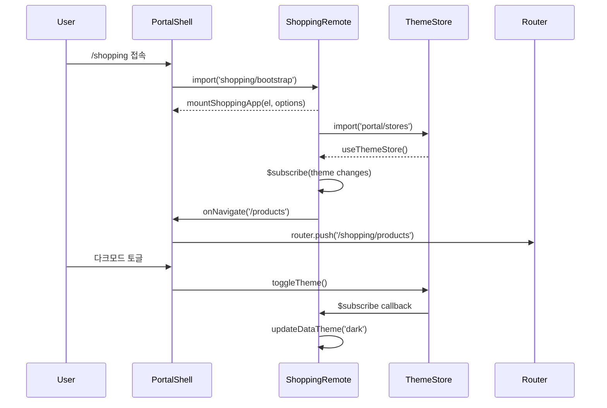

# Module Federation 통합 가이드

> Shopping Frontend를 Portal Shell에 통합하는 Module Federation 가이드

---

## 📋 개요

| 항목 | 내용 |
|------|------|
| **대상** | Shopping Frontend (React 18) ↔️ Portal Shell (Vue 3) |
| **목적** | 런타임 동적 통합, 테마/라우팅 동기화 |
| **핵심 기술** | Vite Module Federation, React Router, Pinia Store |

Shopping Frontend는 두 가지 모드로 실행됩니다:
- **Embedded 모드**: Portal Shell에 통합되어 실행 (MemoryRouter)
- **Standalone 모드**: 독립 실행 (BrowserRouter)

---

## 🏗️ Module Federation 설정

### 1. Shopping Frontend 설정 (Remote)

**파일**: `vite.config.ts`

```typescript
import { defineConfig, loadEnv } from 'vite'
import react from '@vitejs/plugin-react'
import federation from '@originjs/vite-plugin-federation'

export default defineConfig(({ mode }) => {
  const env = loadEnv(mode, process.cwd(), '')

  return {
    plugins: [
      react(),
      federation({
        name: 'shopping-frontend',
        filename: 'remoteEntry.js',
        remotes: {
          portal: env.VITE_PORTAL_SHELL_REMOTE_URL || 'http://localhost:30000/assets/shellEntry.js',
          blog: env.VITE_BLOG_REMOTE_URL || 'http://localhost:30001/assets/remoteEntry.js',
          shopping: env.VITE_SHOPPING_REMOTE_URL || 'http://localhost:30002/assets/remoteEntry.js',
        },
        exposes: {
          './bootstrap': './src/bootstrap.tsx'
        },
        shared: ['react', 'react-dom', 'react-dom/client', 'axios'],
      })
    ],
    build: {
      target: 'esnext',
      minify: false,
      cssCodeSplit: true,
    },
    server: {
      port: 30002,
      host: '0.0.0.0',
      cors: true,
    }
  }
})
```

**핵심 포인트**:
- `remotes`: Portal Shell(Host), Blog, Shopping 원격 모듈 등록
- `exposes`: `./bootstrap` 진입점 노출
- `shared`: React 싱글톤 보장 (`react-dom/client` 포함 필수, 누락 시 Error #321 발생)
- `filename`: Portal Shell이 로드할 파일명

---

### 2. Portal Shell 설정 (Host)

**파일**: `frontend/portal-shell/vite.config.ts`

```typescript
federation({
  name: 'portal-shell',
  remotes: {
    blog: 'http://localhost:30001/assets/remoteEntry.js',
    shopping: 'http://localhost:30002/assets/remoteEntry.js' // 추가
  },
  shared: ['vue', 'vue-router', 'pinia']
})
```

**라우팅 설정**:

```typescript
// router/index.ts
const routes = [
  {
    path: '/shopping',
    name: 'Shopping',
    component: () => import('../views/ShoppingView.vue')
  }
]
```

**ShoppingView.vue**:

```vue
<template>
  <div ref="shoppingContainer" class="shopping-container"></div>
</template>

<script setup lang="ts">
import { ref, onMounted, onBeforeUnmount, watch } from 'vue'
import { useRouter, useRoute } from 'vue-router'

const shoppingContainer = ref<HTMLDivElement | null>(null)
const router = useRouter()
const route = useRoute()
let shoppingApp: any = null

onMounted(async () => {
  if (shoppingContainer.value) {
    // @ts-ignore
    const { mountShoppingApp } = await import('shopping/bootstrap')

    shoppingApp = mountShoppingApp(shoppingContainer.value, {
      initialPath: route.path.replace('/shopping', '') || '/',
      onNavigate: (path: string) => {
        router.push(`/shopping${path}`)
      }
    })
  }
})

// Parent → Child 라우팅 동기화
watch(() => route.path, (newPath) => {
  if (shoppingApp && newPath.startsWith('/shopping')) {
    const childPath = newPath.replace('/shopping', '') || '/'
    shoppingApp.onParentNavigate(childPath)
  }
})

onBeforeUnmount(() => {
  if (shoppingApp) {
    shoppingApp.unmount()
  }
})
</script>
```

---

## 🔌 Bootstrap 인터페이스

### bootstrap.tsx

**파일**: `src/bootstrap.tsx`

```typescript
import React from 'react'
import ReactDOM from 'react-dom/client'
import { MemoryRouter } from 'react-router-dom'
import App from './App'
import './index.css'

export type MountOptions = {
  initialPath?: string
  onNavigate?: (path: string) => void
}

export type ShoppingAppInstance = {
  onParentNavigate: (path: string) => void
  unmount: () => void
}

/**
 * Shopping Frontend를 Portal Shell에 마운트
 * @param el - 마운트할 컨테이너 요소
 * @param options - 초기 경로 및 네비게이션 콜백
 * @returns 앱 인스턴스 (라우팅 동기화 및 unmount 지원)
 */
export function mountShoppingApp(
  el: HTMLElement,
  options: MountOptions = {}
): ShoppingAppInstance {
  const { initialPath = '/', onNavigate } = options

  let root: ReactDOM.Root | null = null
  let navigateTo: ((path: string) => void) | null = null

  // 테마 동기화 함수
  const syncTheme = async () => {
    try {
      // Portal Shell의 themeStore 동적 임포트
      const { useThemeStore } = await import('portal/stores')
      const themeStore = useThemeStore()

      const updateDataTheme = (isDark: boolean) => {
        document.documentElement.setAttribute(
          'data-theme',
          isDark ? 'dark' : 'light'
        )
        document.documentElement.setAttribute('data-service', 'shopping')
      }

      // 초기 테마 적용
      updateDataTheme(themeStore.isDark)

      // 테마 변경 감지
      themeStore.$subscribe(() => {
        updateDataTheme(themeStore.isDark)
      })
    } catch (error) {
      console.warn('Failed to sync theme from portal shell:', error)
    }
  }

  // 앱 렌더링
  const renderApp = () => {
    root = ReactDOM.createRoot(el)
    root.render(
      <React.StrictMode>
        <MemoryRouter initialEntries={[initialPath]}>
          {(routerProps) => {
            navigateTo = routerProps.navigate
            return (
              <App
                onNavigate={(path) => {
                  onNavigate?.(path)
                }}
              />
            )
          }}
        </MemoryRouter>
      </React.StrictMode>
    )
  }

  // 실행
  syncTheme()
  renderApp()

  return {
    // Portal Shell → Shopping 라우팅
    onParentNavigate: (path: string) => {
      if (navigateTo) {
        navigateTo(path)
      }
    },

    // Unmount 시 정리
    unmount: () => {
      if (root) {
        root.unmount()
        root = null
      }

      // CSS 정리
      const styleElements = document.querySelectorAll('style[data-vite-dev-id*="shopping"]')
      styleElements.forEach(el => el.remove())

      // data-service 속성 초기화
      if (!document.querySelector('[data-service]')) {
        document.documentElement.removeAttribute('data-service')
      }
    }
  }
}
```

---

## 🎨 테마 동기화

### Embedded 모드 (Portal Shell 테마 사용)

```typescript
// bootstrap.tsx에서 자동 처리
const { useThemeStore } = await import('portal/stores')
const themeStore = useThemeStore()

themeStore.$subscribe(() => {
  updateDataTheme(themeStore.isDark)
})
```

**동작 원리**:
1. Portal Shell의 Pinia `themeStore` 동적 임포트
2. `isDark` 상태 구독
3. `data-theme` 속성 실시간 업데이트

---

### Standalone 모드 (독립 테마)

**파일**: `src/main.tsx`

```typescript
import React from 'react'
import ReactDOM from 'react-dom/client'
import { BrowserRouter } from 'react-router-dom'
import App from './App'
import './index.css'

// 독립 실행 모드
if (import.meta.env.DEV) {
  const container = document.getElementById('root')

  if (container) {
    const root = ReactDOM.createRoot(container)

    // MutationObserver로 테마 감지
    const observer = new MutationObserver((mutations) => {
      mutations.forEach((mutation) => {
        if (mutation.attributeName === 'data-theme') {
          const theme = document.documentElement.getAttribute('data-theme')
          console.log('Theme changed to:', theme)
        }
      })
    })

    observer.observe(document.documentElement, {
      attributes: true,
      attributeFilter: ['data-theme']
    })

    // 초기 테마 설정
    document.documentElement.setAttribute('data-service', 'shopping')

    root.render(
      <React.StrictMode>
        <BrowserRouter>
          <App onNavigate={(path) => console.log('Navigate:', path)} />
        </BrowserRouter>
      </React.StrictMode>
    )
  }
}
```

---

## 🧭 라우팅 동기화

### Parent → Child (Portal Shell → Shopping)

```typescript
// ShoppingView.vue
watch(() => route.path, (newPath) => {
  if (shoppingApp && newPath.startsWith('/shopping')) {
    const childPath = newPath.replace('/shopping', '') || '/'
    shoppingApp.onParentNavigate(childPath)
  }
})
```

**흐름**:
1. Portal Shell의 URL 변경 감지 (`/shopping/products`)
2. `/shopping` prefix 제거 → `/products`
3. `onParentNavigate('/products')` 호출
4. MemoryRouter가 내부 경로 업데이트

---

### Child → Parent (Shopping → Portal Shell)

```typescript
// App.tsx
import { useNavigate, useLocation } from 'react-router-dom'

function App({ onNavigate }: { onNavigate?: (path: string) => void }) {
  const navigate = useNavigate()
  const location = useLocation()

  useEffect(() => {
    // Shopping 내부 라우팅 변경 시 Portal에 통지
    onNavigate?.(location.pathname)
  }, [location.pathname])

  return <Routes>...</Routes>
}
```

**흐름**:
1. Shopping 내부 링크 클릭 (`/products`)
2. MemoryRouter 업데이트
3. `onNavigate('/products')` 콜백 호출
4. Portal Shell이 URL을 `/shopping/products`로 업데이트

---

## 🔄 동작 모드 비교

| 항목 | Embedded 모드 | Standalone 모드 |
|------|--------------|----------------|
| **라우터** | MemoryRouter | BrowserRouter |
| **진입점** | `bootstrap.tsx` | `main.tsx` |
| **테마** | Portal Shell themeStore | MutationObserver |
| **인증** | Portal Shell authStore | 로컬 Mock |
| **API 클라이언트** | Portal Shell axios | 로컬 axios |
| **URL** | `/shopping/*` (Portal 내) | `http://localhost:30002` |

---

## ⚙️ 환경 변수 설정

### .env.development

```bash
VITE_API_BASE_URL=http://localhost:8080/api/v1
VITE_PORTAL_SHELL_URL=http://localhost:30000
VITE_MODE=standalone  # 또는 embedded
```

### vite.config.ts에서 사용

```typescript
export default defineConfig({
  define: {
    'import.meta.env.VITE_MODE': JSON.stringify(process.env.VITE_MODE || 'standalone')
  }
})
```

---

## 🚀 실행 방법

### Embedded 모드 (Portal Shell 통합)

```bash
# 1. Portal Shell 실행
cd frontend/portal-shell
npm run dev  # http://localhost:30000

# 2. Shopping Frontend 실행
cd frontend/shopping-frontend
npm run dev  # http://localhost:30002

# 3. 브라우저에서 접속
http://localhost:30000/shopping
```

---

### Standalone 모드 (독립 실행)

```bash
cd frontend/shopping-frontend
npm run dev

# 브라우저에서 접속
http://localhost:30002
```

---

## 🧹 Unmount 시 정리

```typescript
unmount: () => {
  // 1. React Root Unmount
  if (root) {
    root.unmount()
    root = null
  }

  // 2. Vite Dev 모드 CSS 정리
  const styleElements = document.querySelectorAll(
    'style[data-vite-dev-id*="shopping"]'
  )
  styleElements.forEach(el => el.remove())

  // 3. data-service 속성 초기화
  if (!document.querySelector('[data-service]')) {
    document.documentElement.removeAttribute('data-service')
  }
}
```

**정리 이유**:
- **CSS 누수 방지**: Vite Dev 모드에서 생성된 `<style>` 태그가 계속 쌓임
- **테마 충돌 방지**: 다른 서비스로 전환 시 `data-service` 속성 혼선
- **메모리 누수 방지**: React Root 명시적 정리

---

## ⚠️ 자주 발생하는 문제

### 1. React 버전 충돌

**증상**:
```
Error: Invalid hook call. Hooks can only be called inside of the body of a function component.
```

**해결 방법**:
```typescript
// vite.config.ts - shared 설정 확인 (react-dom/client 필수 포함)
shared: ['react', 'react-dom', 'react-dom/client']
```

---

### 2. remoteEntry.js 404 에러

**증상**:
```
Failed to load module script: Expected a JavaScript module script but the server responded with a MIME type of "text/html"
```

**해결 방법**:
1. Shopping Frontend가 실행 중인지 확인
   ```bash
   curl http://localhost:30002/assets/remoteEntry.js
   ```

2. `vite.config.ts`에서 `filename` 확인
   ```typescript
   federation({
     filename: 'remoteEntry.js',  // 철자 확인
   })
   ```

---

### 3. 테마가 동기화되지 않음

**증상**:
Portal Shell에서 다크모드 전환해도 Shopping이 반응하지 않음

**해결 방법**:
1. Portal Shell이 stores를 expose하는지 확인
   ```typescript
   // portal-shell/vite.config.ts
   federation({
     exposes: {
       './stores': './src/stores/index.ts'
     }
   })
   ```

2. Shopping의 external 설정 확인
   ```typescript
   // shopping-frontend/vite.config.ts (없으면 추가)
   build: {
     rollupOptions: {
       external: ['portal/stores']
     }
   }
   ```

---

### 4. 라우팅이 동기화되지 않음

**증상**:
Shopping 내부 링크 클릭 시 Portal Shell URL이 업데이트되지 않음

**해결 방법**:
`onNavigate` 콜백이 제대로 전달되는지 확인

```typescript
// ShoppingView.vue
const shoppingApp = mountShoppingApp(container, {
  onNavigate: (path: string) => {
    console.log('Shopping navigated to:', path)  // 디버깅
    router.push(`/shopping${path}`)
  }
})
```

---

### 5. CSS가 충돌함

**증상**:
Shopping 컴포넌트가 Portal Shell의 스타일을 덮어씀

**해결 방법**:
1. TailwindCSS prefix 사용
   ```javascript
   // tailwind.config.js
   module.exports = {
     prefix: 'shop-',  // 모든 클래스에 prefix
   }
   ```

2. CSS Scoping
   ```css
   /* index.css */
   [data-service="shopping"] {
     /* Shopping만의 스타일 */
   }
   ```

---

## 🔍 디버깅 팁

### 1. Module Federation 로딩 확인

```typescript
// Portal Shell에서
console.log('Available remotes:', Object.keys(__FEDERATION__))
```

---

### 2. 테마 상태 확인

```typescript
// Shopping bootstrap.tsx에서
const { useThemeStore } = await import('portal/stores')
const themeStore = useThemeStore()
console.log('Current theme:', themeStore.isDark ? 'dark' : 'light')
```

---

### 3. 라우팅 상태 확인

```typescript
// App.tsx에서
const location = useLocation()
useEffect(() => {
  console.log('Shopping current path:', location.pathname)
}, [location])
```

---

## 📊 아키텍처 다이어그램



---

## ✅ 통합 체크리스트

### Portal Shell
- [ ] `vite.config.ts`에 Shopping remote 등록
- [ ] `router/index.ts`에 `/shopping` 경로 추가
- [ ] `ShoppingView.vue` 컴포넌트 생성
- [ ] `stores` expose 확인

### Shopping Frontend
- [ ] `vite.config.ts` Federation 설정
- [ ] `bootstrap.tsx` 구현 완료
- [ ] `main.tsx` Standalone 모드 지원
- [ ] React Router 설정 (MemoryRouter)
- [ ] 테마 동기화 코드 추가
- [ ] Unmount 정리 코드 구현

### 테스트
- [ ] Embedded 모드 실행 확인
- [ ] Standalone 모드 실행 확인
- [ ] 테마 전환 동작 확인
- [ ] 라우팅 동기화 확인
- [ ] Unmount 시 CSS 정리 확인

---

## ➡️ 다음 단계

1. **API 통합**: Portal Shell의 axios 사용 ([API 클라이언트 가이드](./api-client-integration.md))
2. **인증 연동**: authStore와 연동하여 보호된 라우트 구현
3. **상태 관리**: Portal Shell과 데이터 공유 전략
4. **성능 최적화**: Code Splitting, Lazy Loading

---

## 🔗 관련 문서

- [Architecture - MFE 통합](../architecture/mfe-integration.md)
- [API - remoteEntry.js](../api/remote-entry.md)
- [Troubleshooting - Federation 오류](../troubleshooting/)

---

**최종 업데이트**: 2026-01-30
