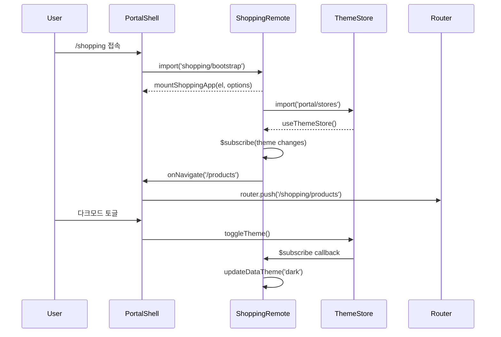

# Module Federation 통합 가이드

**난이도**: ⭐⭐⭐ | **예상 시간**: 1시간 | **카테고리**: Development

Portal Shell(Vue 3 Host)에 Remote 모듈을 통합하는 Module Federation 가이드입니다.

## 개요

### Host/Remote 구조

```
portal-shell (Host, :30000) - Vue 3
├── blog-frontend (Remote, :30001) - Vue 3
├── shopping-frontend (Remote, :30002) - React 18
└── prism-frontend (Remote, :30003) - React 18
```

### 동작 모드

| 항목 | Embedded 모드 | Standalone 모드 |
|------|--------------|----------------|
| **라우터** | MemoryRouter | BrowserRouter |
| **진입점** | `bootstrap.tsx` | `main.tsx` |
| **테마** | Portal Shell themeStore | MutationObserver |
| **인증** | Portal Shell authStore | 로컬 Mock |
| **API 클라이언트** | Portal Shell axios | 로컬 axios |
| **URL** | `/shopping/*` (Portal 내) | `http://localhost:30002` |

---

## Remote 추가 절차

새로운 Remote 모듈을 Portal Shell에 추가하는 일반화된 Step-by-step 가이드입니다.

### Step 1: Remote 애플리케이션 준비

Remote 애플리케이션이 갖춰야 할 조건:

**1. Bootstrap 함수 노출**

```typescript
// remote-app/src/bootstrap.ts
export function mountAppName(
  containerId: string,
  initialPath: string = '/',
  sharedModules?: {
    apiClient: any;
    authStore: any;
    themeStore: any;
  }
) {
  // 앱 마운트 로직
}
```

**2. Module Federation 설정**

```typescript
// remote-app/vite.config.ts
import federation from "@originjs/vite-plugin-federation";

export default defineConfig({
  plugins: [
    federation({
      name: 'remoteAppName',
      filename: 'remoteEntry.js',
      exposes: {
        './bootstrap': './src/bootstrap.ts',
      },
      shared: ['react', 'react-dom', 'react-dom/client', 'axios'],
    })
  ],
  build: {
    target: 'esnext',
    minify: false,
  }
})
```

> **React Remote 필수**: `shared`에 `react-dom/client` 포함 (누락 시 Error #321)

**3. 독립 실행 가능**

```bash
cd frontend/remote-app
npm run dev  # 독립 실행 (포트 충돌 없어야 함)
```

### Step 2: remoteRegistry.ts 업데이트

**파일**: `frontend/portal-shell/src/config/remoteRegistry.ts`

```typescript
const remoteConfigs: Record<EnvironmentMode, RemoteConfig[]> = {
  dev: [
    // 기존 Remote들...
    {
      name: 'NewApp',           // 표시 이름
      key: 'newapp',            // Federation key (고유 식별자)
      url: 'http://localhost:30004/assets/remoteEntry.js',
      module: 'newapp/bootstrap',
      mountFn: 'mountNewApp',
      basePath: '/newapp',
      icon: '🆕',
      description: '새 서비스'
    },
  ],
  docker: [ /* 동일 구조, URL만 변경 */ ],
  k8s: [ /* 동일 구조, URL만 변경 */ ]
};
```

**RemoteConfig 필드**:

| 필드 | 타입 | 필수 | 설명 |
|------|------|------|------|
| `name` | string | O | 사용자 표시 이름 |
| `key` | string | O | Federation key (고유) |
| `url` | string | O | remoteEntry.js URL |
| `module` | string | O | 로드할 모듈 경로 (key/bootstrap) |
| `mountFn` | string | O | mount 함수 이름 |
| `basePath` | string | O | 라우팅 base path |
| `icon` | string | - | 네비게이션 아이콘 (emoji) |
| `description` | string | - | 서비스 설명 |

### Step 3: vite.config.ts 업데이트

**파일**: `frontend/portal-shell/vite.config.ts`

```typescript
federation({
  name: 'portal',
  filename: 'shellEntry.js',
  remotes: {
    blog: env.VITE_BLOG_REMOTE_URL,
    shopping: env.VITE_SHOPPING_REMOTE_URL,
    newapp: env.VITE_NEWAPP_REMOTE_URL,  // 추가
  },
  exposes: {
    './apiClient': './src/api/apiClient.ts',
    './authStore': './src/store/auth.ts',
    './themeStore': './src/store/theme.ts',
  },
  shared: ['vue', 'pinia', 'axios'],
})
```

### Step 4: 환경 변수 추가

모든 `.env.*` 파일에 Remote URL 환경변수 추가:

```bash
# .env.dev
VITE_NEWAPP_REMOTE_URL=http://localhost:30004/assets/remoteEntry.js

# .env.docker
VITE_NEWAPP_REMOTE_URL=http://newapp-frontend:30004/assets/remoteEntry.js

# .env.k8s
VITE_NEWAPP_REMOTE_URL=http://newapp-frontend.default.svc.cluster.local:30004/assets/remoteEntry.js
```

### Step 5: TypeScript 타입 추가 (선택)

```typescript
// src/types/remotes.d.ts
declare module 'newapp/bootstrap' {
  export function mountNewApp(
    containerId: string,
    initialPath?: string,
    sharedModules?: any
  ): void;
}
```

### Step 6: 테스트 및 검증

```bash
# 1. Remote 실행 확인
curl http://localhost:30004/assets/remoteEntry.js

# 2. Portal Shell 캐시 삭제 + 재시작
cd frontend/portal-shell
rm -rf node_modules/.vite
npm run dev

# 3. 브라우저에서 확인
# http://localhost:30000/newapp
```

**콘솔 로그 확인**:
```
✅ [RemoteWrapper] Loading remote: newapp
✅ [RemoteWrapper] Remote module loaded successfully: newapp
✅ [RemoteWrapper] Mount function called: mountNewApp
```

---

## Shopping Remote 실전 예시

Shopping Frontend(React 18)를 Portal Shell에 통합하는 구체적 예시입니다.

### Shopping vite.config.ts

```typescript
// frontend/shopping-frontend/vite.config.ts
export default defineConfig(({ mode }) => {
  const env = loadEnv(mode, process.cwd(), '')

  return {
    plugins: [
      react(),
      federation({
        name: 'shopping-frontend',
        filename: 'remoteEntry.js',
        remotes: {
          portal: env.VITE_PORTAL_SHELL_REMOTE_URL || 'http://localhost:30000/assets/shellEntry.js',
        },
        exposes: {
          './bootstrap': './src/bootstrap.tsx'
        },
        shared: ['react', 'react-dom', 'react-dom/client', 'axios'],
      })
    ],
    server: { port: 30002, host: '0.0.0.0', cors: true }
  }
})
```

### bootstrap.tsx 인터페이스

```typescript
// src/bootstrap.tsx
export type MountOptions = {
  initialPath?: string
  onNavigate?: (path: string) => void
}

export type ShoppingAppInstance = {
  onParentNavigate: (path: string) => void
  unmount: () => void
}

export function mountShoppingApp(
  el: HTMLElement,
  options: MountOptions = {}
): ShoppingAppInstance {
  const { initialPath = '/', onNavigate } = options

  let root: ReactDOM.Root | null = null

  // 테마 동기화
  const syncTheme = async () => {
    try {
      const { useThemeStore } = await import('portal/stores')
      const themeStore = useThemeStore()
      const updateDataTheme = (isDark: boolean) => {
        document.documentElement.setAttribute('data-theme', isDark ? 'dark' : 'light')
        document.documentElement.setAttribute('data-service', 'shopping')
      }
      updateDataTheme(themeStore.isDark)
      themeStore.$subscribe(() => updateDataTheme(themeStore.isDark))
    } catch (error) {
      console.warn('Failed to sync theme from portal shell:', error)
    }
  }

  // 앱 렌더링 (MemoryRouter 사용)
  root = ReactDOM.createRoot(el)
  root.render(
    <React.StrictMode>
      <MemoryRouter initialEntries={[initialPath]}>
        <App onNavigate={(path) => onNavigate?.(path)} />
      </MemoryRouter>
    </React.StrictMode>
  )
  syncTheme()

  return {
    onParentNavigate: (path: string) => { /* navigate to path */ },
    unmount: () => {
      if (root) { root.unmount(); root = null }
      // CSS 정리
      document.querySelectorAll('style[data-vite-dev-id*="shopping"]')
        .forEach(el => el.remove())
      document.documentElement.removeAttribute('data-service')
    }
  }
}
```

### Portal Shell 측 ShoppingView.vue

```vue
<template>
  <div ref="shoppingContainer" class="shopping-container"></div>
</template>

<script setup lang="ts">
import { ref, onMounted, onBeforeUnmount, watch } from 'vue'
import { useRouter, useRoute } from 'vue-router'

const shoppingContainer = ref<HTMLDivElement | null>(null)
const router = useRouter()
const route = useRoute()
let shoppingApp: any = null

onMounted(async () => {
  if (shoppingContainer.value) {
    const { mountShoppingApp } = await import('shopping/bootstrap')
    shoppingApp = mountShoppingApp(shoppingContainer.value, {
      initialPath: route.path.replace('/shopping', '') || '/',
      onNavigate: (path: string) => {
        router.push(`/shopping${path}`)
      }
    })
  }
})

// Parent → Child 라우팅 동기화
watch(() => route.path, (newPath) => {
  if (shoppingApp && newPath.startsWith('/shopping')) {
    const childPath = newPath.replace('/shopping', '') || '/'
    shoppingApp.onParentNavigate(childPath)
  }
})

onBeforeUnmount(() => {
  if (shoppingApp) { shoppingApp.unmount() }
})
</script>
```

### 라우팅 동기화

#### Parent → Child (Portal Shell → Shopping)
1. Portal Shell의 URL 변경 감지 (`/shopping/products`)
2. `/shopping` prefix 제거 → `/products`
3. `onParentNavigate('/products')` 호출
4. MemoryRouter가 내부 경로 업데이트

#### Child → Parent (Shopping → Portal Shell)
1. Shopping 내부 링크 클릭 (`/products`)
2. MemoryRouter 업데이트
3. `onNavigate('/products')` 콜백 호출
4. Portal Shell이 URL을 `/shopping/products`로 업데이트

### 실행 방법

```bash
# Embedded 모드 (Portal Shell 통합)
cd frontend && npm run dev  # 전체 동시 실행
# 브라우저: http://localhost:30000/shopping

# Standalone 모드 (독립 실행)
cd frontend && npm run dev:shopping
# 브라우저: http://localhost:30002
```

---

## 트러블슈팅

### 1. React 버전 충돌 (Invalid hook call)

**증상**: `Error: Invalid hook call. Hooks can only be called inside of the body of a function component.`

**해결**: `shared` 배열에 `react-dom/client` 포함 확인

```typescript
shared: ['react', 'react-dom', 'react-dom/client']
```

### 2. remoteEntry.js 404 에러

**증상**: `Failed to load module script: Expected a JavaScript module script but the server responded with a MIME type of "text/html"`

**해결**:
1. Remote 애플리케이션 실행 확인: `curl http://localhost:30002/assets/remoteEntry.js`
2. `vite.config.ts`의 `filename` 철자 확인

### 3. Mount 함수를 찾을 수 없음

**증상**: `TypeError: module[mountFn] is not a function`

**해결**:
1. Remote의 `vite.config.ts` → `exposes` 경로 확인
2. `bootstrap.ts`에서 함수 `export` 확인
3. `remoteRegistry.ts`의 `mountFn` 이름 일치 확인

### 4. 테마가 동기화되지 않음

**증상**: Portal Shell에서 다크모드 전환해도 Remote가 반응하지 않음

**해결**:
1. Portal Shell이 `stores`를 expose하는지 확인
2. Remote의 bootstrap에서 `import('portal/stores')` 동작 확인

### 5. 라우팅이 동기화되지 않음

**증상**: Remote 내부 링크 클릭 시 Portal Shell URL이 업데이트되지 않음

**해결**: `onNavigate` 콜백이 제대로 전달되는지 디버그 로그로 확인

```typescript
onNavigate: (path: string) => {
  console.log('Remote navigated to:', path)
  router.push(`/shopping${path}`)
}
```

### 6. Shared 모듈 버전 충돌

**증상**: `Shared module version mismatch`

**해결**: Portal Shell과 Remote의 `package.json`에서 프레임워크 버전 일치시키기. React는 루트 `package.json`의 `overrides`로 18.3.1 통일.

### 7. CSS가 충돌함

**증상**: Remote 컴포넌트가 Portal Shell의 스타일을 덮어씀

**해결**:
- CSS Scoping: `[data-service="shopping"] { ... }`
- TailwindCSS prefix: `prefix: 'shop-'`

### 8. 환경 변수가 적용되지 않음

**해결**: Vite 캐시 삭제 후 재시작

```bash
rm -rf node_modules/.vite
npm run dev
```

---

## 아키텍처 다이어그램



---

## 통합 체크리스트

### Remote 애플리케이션
- [ ] Bootstrap 함수가 올바르게 expose되어 있음
- [ ] Module Federation 플러그인 설정 완료
- [ ] 독립 실행 가능 (포트 충돌 없음)
- [ ] remoteEntry.js 생성 확인

### Portal Shell
- [ ] `remoteRegistry.ts`에 모든 환경(dev/docker/k8s) 추가
- [ ] `vite.config.ts`의 remotes에 추가
- [ ] 모든 `.env.*` 파일에 환경 변수 추가
- [ ] 캐시 삭제 후 재시작

### 테스트
- [ ] Embedded 모드 실행 확인
- [ ] Standalone 모드 실행 확인
- [ ] 테마 전환 동작 확인
- [ ] 라우팅 동기화 확인 (양방향)
- [ ] Unmount 시 CSS 정리 확인

---

## 관련 문서

- [Module Federation Architecture](../../architecture/portal-shell/module-federation.md)
- [Vite Plugin Federation](https://github.com/originjs/vite-plugin-federation)
- [Portal Shell Architecture](../../architecture/portal-shell/system-overview.md)
