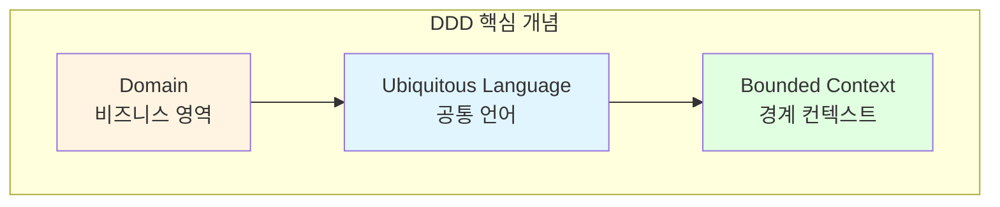
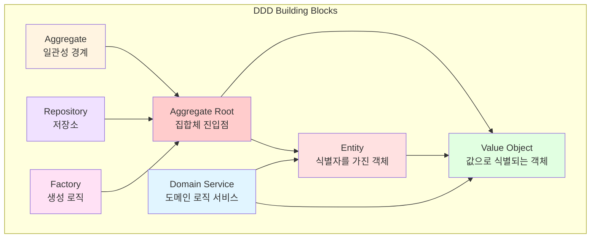
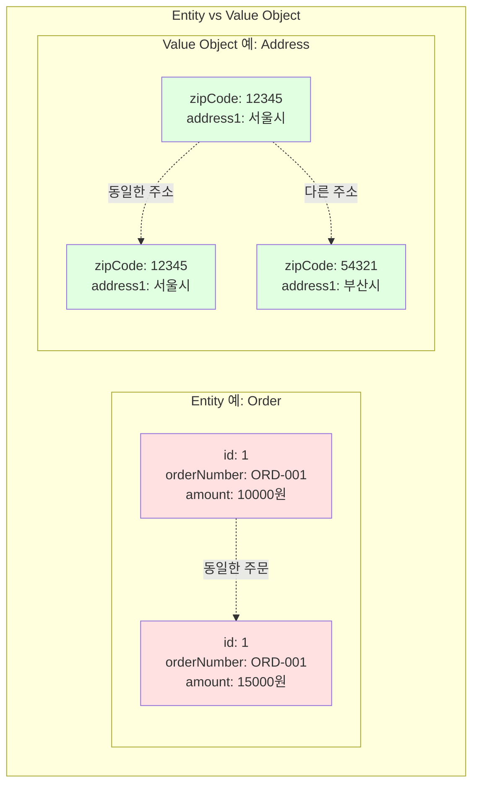
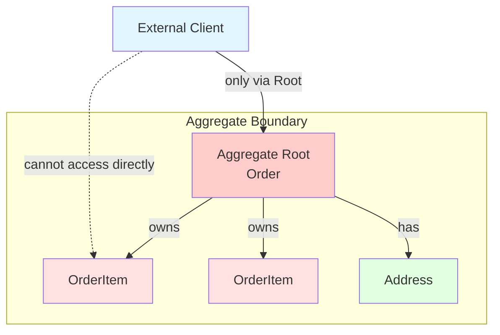
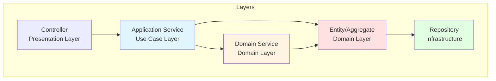
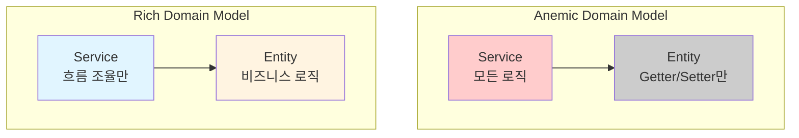
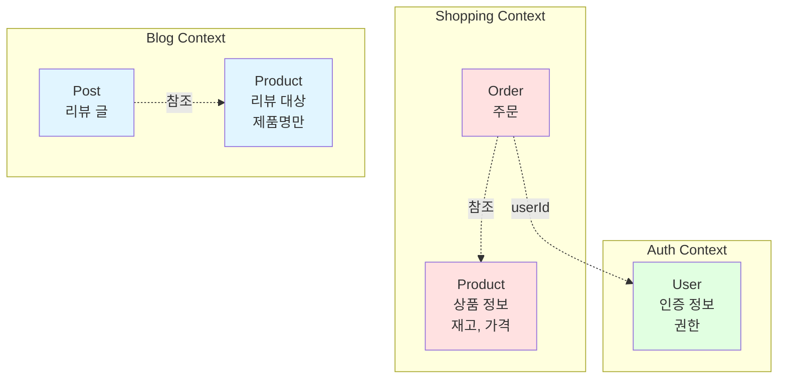

# Domain-Driven Design Basics (도메인 주도 설계 기초)

## 학습 목표

- DDD 핵심 빌딩 블록 이해 (Entity, Value Object, Aggregate, Domain Service)
- 도메인 모델과 데이터 모델의 차이점 파악
- Portal Universe 프로젝트에서 DDD 패턴 식별 및 적용
- Rich Domain Model vs Anemic Domain Model 비교
- Bounded Context와 전략적 설계 개념 학습

## DDD 개요

Domain-Driven Design(도메인 주도 설계)은 Eric Evans가 제안한 소프트웨어 설계 철학으로, **비즈니스 도메인을 중심**으로 소프트웨어를 설계하는 방법론입니다.

### 핵심 철학



1. **도메인 중심**: 기술보다 비즈니스 로직 우선
2. **공통 언어**: 개발자와 도메인 전문가가 같은 용어 사용
3. **경계 설정**: 컨텍스트별로 명확한 경계 정의

## DDD 전술적 패턴 (Tactical Patterns)

### 빌딩 블록 전체 구조



## 1. Entity (엔티티)

### 정의

**식별자(Identity)**를 통해 구별되는 객체입니다. 속성이 변경되어도 동일한 객체로 인식됩니다.

### 특징

- 고유한 식별자 보유 (ID)
- 생명주기 존재
- 연속성(Continuity) 보장
- 속성보다 **정체성**이 중요

### Portal Universe 예제: Product Entity

```java
@Entity
@Table(name = "products")
@Getter
@NoArgsConstructor(access = AccessLevel.PROTECTED)
public class Product {

    /**
     * 식별자: Product를 구별하는 유일한 값
     */
    @Id
    @GeneratedValue(strategy = GenerationType.IDENTITY)
    private Long id;

    private String name;
    private String description;
    private Double price;
    private Integer stock;

    @Builder
    public Product(String name, String description, Double price, Integer stock) {
        this.name = name;
        this.description = description;
        this.price = price;
        this.stock = stock;
    }

    /**
     * 도메인 로직: 상품 정보 수정
     */
    public void update(String name, String description, Double price, Integer stock) {
        this.name = name;
        this.description = description;
        this.price = price;
        this.stock = stock;
    }

    /**
     * 도메인 로직: 재고 차감
     */
    public void decreaseStock(int quantity) {
        if (this.stock < quantity) {
            throw new CustomBusinessException(ShoppingErrorCode.INSUFFICIENT_STOCK);
        }
        this.stock -= quantity;
    }

    /**
     * 도메인 로직: 재고 증가
     */
    public void increaseStock(int quantity) {
        this.stock += quantity;
    }

    @Override
    public boolean equals(Object o) {
        if (this == o) return true;
        if (!(o instanceof Product)) return false;
        Product product = (Product) o;
        return id != null && id.equals(product.id);  // ID로만 비교
    }

    @Override
    public int hashCode() {
        return Objects.hash(id);  // ID 기반 해시코드
    }
}
```

**분석:**
- ✅ `id` 필드로 식별
- ✅ 도메인 로직 캡슐화 (decreaseStock, increaseStock)
- ✅ equals/hashCode를 ID 기반으로 구현
- ✅ 불변 조건 검증 (재고 음수 방지)

### Portal Universe 예제: Order Entity

```java
@Entity
@Table(name = "orders")
@Getter
@NoArgsConstructor(access = AccessLevel.PROTECTED)
public class Order {

    @Id
    @GeneratedValue(strategy = GenerationType.IDENTITY)
    private Long id;

    /**
     * 비즈니스 식별자: 주문번호
     * 기술적 ID(Long)와 별도로 관리
     */
    @Column(nullable = false, unique = true)
    private String orderNumber;  // ORD-20260122-ABC123

    private String userId;

    @Enumerated(EnumType.STRING)
    private OrderStatus status;

    private BigDecimal totalAmount;

    @Embedded
    private Address shippingAddress;

    @OneToMany(mappedBy = "order", cascade = CascadeType.ALL, orphanRemoval = true)
    private List<OrderItem> items = new ArrayList<>();

    /**
     * 도메인 로직: 주문 확정
     */
    public void confirm() {
        validateStatusTransition(OrderStatus.PENDING, OrderStatus.CONFIRMED);
        this.status = OrderStatus.CONFIRMED;
    }

    /**
     * 도메인 로직: 주문 취소
     */
    public void cancel(String reason) {
        if (!this.status.isCancellable()) {
            throw new CustomBusinessException(ShoppingErrorCode.ORDER_CANNOT_BE_CANCELLED);
        }
        this.status = OrderStatus.CANCELLED;
        this.cancelReason = reason;
        this.cancelledAt = LocalDateTime.now();
    }

    /**
     * 불변 조건 검증
     */
    private void validateStatusTransition(OrderStatus from, OrderStatus to) {
        if (this.status != from) {
            throw new CustomBusinessException(ShoppingErrorCode.INVALID_ORDER_STATUS);
        }
    }
}
```

**Entity 식별자 전략:**

| 전략 | 사용 예 | 특징 |
|------|---------|------|
| 기술적 ID | `id: Long` | 데이터베이스 Auto Increment |
| 비즈니스 ID | `orderNumber: String` | 도메인 의미 포함 |
| UUID | `UUID.randomUUID()` | 분산 환경 적합 |
| 복합 키 | `(userId, productId)` | 자연 키 조합 |

## 2. Value Object (값 객체)

### 정의

**속성으로만 식별**되는 불변 객체입니다. 두 Value Object는 모든 속성이 같으면 동일한 것으로 간주됩니다.

### 특징

- 식별자 없음
- 불변성(Immutability)
- 교환 가능성(Replaceability)
- 속성으로 동등성 비교

### Portal Universe 예제: Address Value Object

```java
/**
 * 주소 값 객체
 * - 식별자 없음
 * - 불변 (setter 없음)
 * - 모든 속성이 같으면 동일한 주소
 */
@Embeddable
@Getter
@NoArgsConstructor(access = AccessLevel.PROTECTED)
public class Address {

    @Column(name = "receiver_name", length = 100)
    private String receiverName;

    @Column(name = "receiver_phone", length = 20)
    private String receiverPhone;

    @Column(name = "zip_code", length = 10)
    private String zipCode;

    @Column(name = "address1", length = 255)
    private String address1;

    @Column(name = "address2", length = 255)
    private String address2;

    @Builder
    public Address(String receiverName, String receiverPhone,
                   String zipCode, String address1, String address2) {
        this.receiverName = receiverName;
        this.receiverPhone = receiverPhone;
        this.zipCode = zipCode;
        this.address1 = address1;
        this.address2 = address2;
    }

    /**
     * 도메인 로직: 전체 주소 문자열 생성
     */
    public String getFullAddress() {
        StringBuilder sb = new StringBuilder();
        if (zipCode != null) {
            sb.append("[").append(zipCode).append("] ");
        }
        if (address1 != null) {
            sb.append(address1);
        }
        if (address2 != null) {
            sb.append(" ").append(address2);
        }
        return sb.toString().trim();
    }

    /**
     * 값 객체는 모든 속성으로 동등성 비교
     */
    @Override
    public boolean equals(Object o) {
        if (this == o) return true;
        if (!(o instanceof Address)) return false;
        Address address = (Address) o;
        return Objects.equals(receiverName, address.receiverName) &&
               Objects.equals(receiverPhone, address.receiverPhone) &&
               Objects.equals(zipCode, address.zipCode) &&
               Objects.equals(address1, address.address1) &&
               Objects.equals(address2, address.address2);
    }

    @Override
    public int hashCode() {
        return Objects.hash(receiverName, receiverPhone, zipCode, address1, address2);
    }
}
```

**분석:**
- ✅ 불변 객체 (setter 없음)
- ✅ JPA `@Embeddable`로 매핑
- ✅ equals/hashCode를 모든 속성으로 구현
- ✅ 도메인 로직 포함 (getFullAddress)

### Value Object 예제: Money (금액)

```java
/**
 * 금액 값 객체
 */
public class Money {
    private final BigDecimal amount;
    private final Currency currency;

    public static final Money ZERO = new Money(BigDecimal.ZERO, Currency.KRW);

    private Money(BigDecimal amount, Currency currency) {
        if (amount == null) {
            throw new IllegalArgumentException("금액은 null일 수 없습니다");
        }
        if (currency == null) {
            throw new IllegalArgumentException("통화는 null일 수 없습니다");
        }
        this.amount = amount;
        this.currency = currency;
    }

    public static Money of(BigDecimal amount, Currency currency) {
        return new Money(amount, currency);
    }

    public static Money krw(long amount) {
        return new Money(BigDecimal.valueOf(amount), Currency.KRW);
    }

    /**
     * 도메인 로직: 금액 더하기
     */
    public Money add(Money other) {
        if (!this.currency.equals(other.currency)) {
            throw new IllegalArgumentException("통화가 다른 금액은 더할 수 없습니다");
        }
        return new Money(this.amount.add(other.amount), this.currency);
    }

    /**
     * 도메인 로직: 금액 빼기
     */
    public Money subtract(Money other) {
        if (!this.currency.equals(other.currency)) {
            throw new IllegalArgumentException("통화가 다른 금액은 뺄 수 없습니다");
        }
        return new Money(this.amount.subtract(other.amount), this.currency);
    }

    /**
     * 도메인 로직: 금액 곱하기
     */
    public Money multiply(int multiplier) {
        return new Money(this.amount.multiply(BigDecimal.valueOf(multiplier)), this.currency);
    }

    /**
     * 도메인 로직: 금액 비교
     */
    public boolean isGreaterThan(Money other) {
        if (!this.currency.equals(other.currency)) {
            throw new IllegalArgumentException("통화가 다른 금액은 비교할 수 없습니다");
        }
        return this.amount.compareTo(other.amount) > 0;
    }

    public BigDecimal getAmount() {
        return amount;
    }

    @Override
    public boolean equals(Object o) {
        if (this == o) return true;
        if (!(o instanceof Money)) return false;
        Money money = (Money) o;
        return Objects.equals(amount, money.amount) &&
               currency == money.currency;
    }

    @Override
    public int hashCode() {
        return Objects.hash(amount, currency);
    }

    @Override
    public String toString() {
        return amount + " " + currency;
    }
}

enum Currency {
    KRW, USD, EUR, JPY
}
```

**분석:**
- ✅ 불변 객체 (final 필드)
- ✅ 생성자 private, 정적 팩토리 메서드 제공
- ✅ 비즈니스 규칙 캡슐화 (통화 일치 검증)
- ✅ 연산 메서드가 새 객체 반환 (불변성 유지)

### Entity vs Value Object 비교



| 측면 | Entity | Value Object |
|------|--------|--------------|
| 식별자 | 있음 (ID) | 없음 |
| 동등성 | ID로 비교 | 속성으로 비교 |
| 가변성 | 가변 (상태 변경 가능) | 불변 (상태 변경 불가) |
| 생명주기 | 있음 | 없음 |
| 예시 | Order, Product, User | Address, Money, DateRange |

## 3. Aggregate (집합체)

### 정의

**일관성 경계**를 정의하는 Entity와 Value Object의 클러스터입니다. 외부에서는 Aggregate Root를 통해서만 접근할 수 있습니다.

### 특징

- 트랜잭션 일관성 경계
- Aggregate Root가 진입점
- 내부 객체는 외부에 노출하지 않음
- 불변 조건(Invariant) 보호

### Aggregate 규칙



**핵심 규칙:**
1. 외부는 Aggregate Root만 참조
2. Root를 통해서만 내부 접근
3. Root가 불변 조건 보장
4. 한 트랜잭션에서 하나의 Aggregate만 수정

### Portal Universe 예제: Order Aggregate

```java
/**
 * Order Aggregate Root
 */
@Entity
@Table(name = "orders")
@Getter
@NoArgsConstructor(access = AccessLevel.PROTECTED)
public class Order {

    @Id
    @GeneratedValue(strategy = GenerationType.IDENTITY)
    private Long id;

    private String orderNumber;
    private String userId;

    @Enumerated(EnumType.STRING)
    private OrderStatus status;

    private BigDecimal totalAmount;
    private BigDecimal discountAmount;
    private BigDecimal finalAmount;

    @Embedded
    private Address shippingAddress;

    /**
     * Aggregate 내부 Entity
     * - OrderItem은 Order 없이 존재할 수 없음
     * - cascade = ALL: Order 저장/삭제 시 함께 처리
     * - orphanRemoval = true: 연관 끊어지면 자동 삭제
     */
    @OneToMany(mappedBy = "order", cascade = CascadeType.ALL, orphanRemoval = true)
    private List<OrderItem> items = new ArrayList<>();

    @Builder
    public Order(String userId, Address shippingAddress) {
        this.orderNumber = generateOrderNumber();
        this.userId = userId;
        this.status = OrderStatus.PENDING;
        this.totalAmount = BigDecimal.ZERO;
        this.shippingAddress = shippingAddress;
    }

    /**
     * 항목 추가 (Root를 통해서만 가능)
     * - OrderItem을 직접 생성하지 않고 Order가 생성
     * - 불변 조건 검증 (총액 계산)
     */
    public OrderItem addItem(Long productId, String productName,
                             BigDecimal price, int quantity) {
        OrderItem orderItem = OrderItem.builder()
                .order(this)  // 양방향 연관관계 설정
                .productId(productId)
                .productName(productName)
                .price(price)
                .quantity(quantity)
                .build();

        this.items.add(orderItem);
        recalculateTotalAmount();  // 불변 조건 유지
        return orderItem;
    }

    /**
     * 항목 제거 (Root를 통해서만 가능)
     */
    public void removeItem(OrderItem item) {
        this.items.remove(item);
        recalculateTotalAmount();
    }

    /**
     * 쿠폰 적용 (Root가 일관성 보장)
     */
    public void applyCoupon(Long userCouponId, BigDecimal discountAmount) {
        if (discountAmount.compareTo(this.totalAmount) > 0) {
            throw new CustomBusinessException(
                ShoppingErrorCode.INVALID_DISCOUNT_AMOUNT);
        }
        this.appliedUserCouponId = userCouponId;
        this.discountAmount = discountAmount;
        calculateFinalAmount();
    }

    /**
     * 주문 확정 (상태 전이 규칙 검증)
     */
    public void confirm() {
        if (this.items.isEmpty()) {
            throw new CustomBusinessException(ShoppingErrorCode.EMPTY_ORDER);
        }
        validateStatusTransition(OrderStatus.PENDING, OrderStatus.CONFIRMED);
        this.status = OrderStatus.CONFIRMED;
    }

    /**
     * 불변 조건: 총액 = 각 항목 소계의 합
     */
    private void recalculateTotalAmount() {
        this.totalAmount = items.stream()
                .map(OrderItem::getSubtotal)
                .reduce(BigDecimal.ZERO, BigDecimal::add);
        calculateFinalAmount();
    }

    /**
     * 불변 조건: 최종 금액 = 총액 - 할인
     */
    private void calculateFinalAmount() {
        BigDecimal discount = this.discountAmount != null
            ? this.discountAmount : BigDecimal.ZERO;
        this.finalAmount = this.totalAmount.subtract(discount);
        if (this.finalAmount.compareTo(BigDecimal.ZERO) < 0) {
            this.finalAmount = BigDecimal.ZERO;
        }
    }

    /**
     * 항목 목록 반환 (불변 컬렉션)
     * - 외부에서 직접 수정 불가
     */
    public List<OrderItem> getItems() {
        return Collections.unmodifiableList(items);
    }
}
```

**OrderItem (내부 Entity):**
```java
/**
 * OrderItem: Order Aggregate 내부 Entity
 * - Order 없이는 존재할 수 없음
 * - 외부에서 직접 생성 불가 (protected 생성자)
 */
@Entity
@Table(name = "order_items")
@Getter
@NoArgsConstructor(access = AccessLevel.PROTECTED)
public class OrderItem {

    @Id
    @GeneratedValue(strategy = GenerationType.IDENTITY)
    private Long id;

    /**
     * Aggregate Root 참조
     * - LAZY 로딩
     * - 외부에서 직접 설정 불가
     */
    @ManyToOne(fetch = FetchType.LAZY)
    @JoinColumn(name = "order_id", nullable = false)
    private Order order;

    private Long productId;
    private String productName;
    private BigDecimal price;
    private Integer quantity;
    private BigDecimal subtotal;

    /**
     * Package-private 생성자
     * - Order만 생성 가능
     */
    @Builder
    OrderItem(Order order, Long productId, String productName,
              BigDecimal price, Integer quantity) {
        this.order = order;
        this.productId = productId;
        this.productName = productName;
        this.price = price;
        this.quantity = quantity;
        this.subtotal = price.multiply(BigDecimal.valueOf(quantity));
    }

    /**
     * 수량 변경 (Order를 통해서만 호출)
     */
    void updateQuantity(int newQuantity) {
        this.quantity = newQuantity;
        this.subtotal = price.multiply(BigDecimal.valueOf(quantity));
        order.recalculateTotalAmount();  // Root에 변경 통보
    }
}
```

**사용 예:**
```java
// ✅ 올바른 사용 (Root를 통해 접근)
Order order = Order.builder()
        .userId("user123")
        .shippingAddress(address)
        .build();

order.addItem(1L, "상품A", BigDecimal.valueOf(10000), 2);
order.addItem(2L, "상품B", BigDecimal.valueOf(5000), 1);
order.confirm();

orderRepository.save(order);  // Root만 저장, Item은 cascade

// ❌ 잘못된 사용 (Root를 거치지 않음)
OrderItem item = new OrderItem(null, 1L, "상품A", ...);  // 컴파일 에러
orderItemRepository.save(item);  // OrderItem Repository 없음
```

**Aggregate 경계 설정 기준:**

| 기준 | 설명 | 예 |
|------|------|---|
| 트랜잭션 일관성 | 함께 변경되어야 하는가? | Order-OrderItem |
| 생명주기 | 독립적으로 존재할 수 있는가? | Order ❌ OrderItem |
| 접근 패턴 | 항상 함께 조회되는가? | Order ✅ OrderItem |
| 크기 | Aggregate가 너무 크지 않은가? | Order ✅ (< 10개 Entity) |

## 4. Domain Service (도메인 서비스)

### 정의

Entity나 Value Object에 속하지 않는 **도메인 로직**을 담는 객체입니다. 여러 Aggregate를 조율하거나 외부 시스템과 통합할 때 사용합니다.

### 특징

- 상태를 가지지 않음 (Stateless)
- 도메인 개념을 표현
- Application Service와는 다름
- 도메인 전문가가 이해할 수 있는 이름

### Domain Service vs Application Service



| 측면 | Application Service | Domain Service |
|------|---------------------|----------------|
| 위치 | Use Case Layer | Domain Layer |
| 책임 | 유스케이스 조율 | 도메인 로직 |
| 의존성 | Domain + Infrastructure | Domain만 |
| 트랜잭션 | 관리함 (@Transactional) | 관리하지 않음 |
| 예시 | OrderService, ProductService | PricingService, TaxService |

### Portal Universe 예제: 가격 계산 Domain Service

```java
/**
 * 가격 계산 도메인 서비스
 * - 여러 Aggregate를 조율
 * - 복잡한 계산 로직 캡슐화
 */
@Service
@RequiredArgsConstructor
public class PricingService {

    /**
     * 주문 최종 금액 계산
     * - Product, Coupon, TimeDeal 등 여러 Aggregate 조율
     * - 복잡한 비즈니스 규칙 적용
     */
    public OrderPricingResult calculateOrderPrice(
            List<OrderItem> items,
            Coupon coupon,
            TimeDeal timeDeal) {

        // 1. 기본 총액 계산
        BigDecimal subtotal = items.stream()
                .map(item -> item.getPrice().multiply(
                    BigDecimal.valueOf(item.getQuantity())))
                .reduce(BigDecimal.ZERO, BigDecimal::add);

        // 2. 타임딜 할인 적용
        BigDecimal timeDealDiscount = BigDecimal.ZERO;
        if (timeDeal != null && timeDeal.isActive()) {
            timeDealDiscount = calculateTimeDealDiscount(items, timeDeal);
        }

        // 3. 쿠폰 할인 적용 (타임딜 후 가격에 적용)
        BigDecimal afterTimeDeal = subtotal.subtract(timeDealDiscount);
        BigDecimal couponDiscount = BigDecimal.ZERO;
        if (coupon != null && coupon.isApplicable(afterTimeDeal)) {
            couponDiscount = coupon.calculateDiscount(afterTimeDeal);
        }

        // 4. 최종 금액 계산
        BigDecimal finalAmount = afterTimeDeal.subtract(couponDiscount);
        if (finalAmount.compareTo(BigDecimal.ZERO) < 0) {
            finalAmount = BigDecimal.ZERO;
        }

        return OrderPricingResult.builder()
                .subtotal(subtotal)
                .timeDealDiscount(timeDealDiscount)
                .couponDiscount(couponDiscount)
                .finalAmount(finalAmount)
                .build();
    }

    /**
     * 타임딜 할인 계산
     */
    private BigDecimal calculateTimeDealDiscount(
            List<OrderItem> items, TimeDeal timeDeal) {
        return items.stream()
                .filter(item -> timeDeal.isApplicableToProduct(item.getProductId()))
                .map(item -> {
                    BigDecimal itemTotal = item.getPrice()
                        .multiply(BigDecimal.valueOf(item.getQuantity()));
                    return itemTotal.multiply(timeDeal.getDiscountRate())
                        .divide(BigDecimal.valueOf(100));
                })
                .reduce(BigDecimal.ZERO, BigDecimal::add);
    }
}

/**
 * 가격 계산 결과 Value Object
 */
@Getter
@Builder
public class OrderPricingResult {
    private final BigDecimal subtotal;
    private final BigDecimal timeDealDiscount;
    private final BigDecimal couponDiscount;
    private final BigDecimal finalAmount;
}
```

**Application Service에서 사용:**
```java
@Service
@RequiredArgsConstructor
@Transactional
public class OrderServiceImpl implements OrderService {

    private final OrderRepository orderRepository;
    private final PricingService pricingService;  // Domain Service 주입
    private final CouponRepository couponRepository;
    private final TimeDealRepository timeDealRepository;

    @Override
    public OrderResponse createOrder(OrderCreateRequest request) {
        // 1. Aggregate 생성
        Order order = Order.builder()
                .userId(request.getUserId())
                .shippingAddress(request.getShippingAddress())
                .build();

        // 2. 주문 항목 추가
        request.getItems().forEach(itemRequest ->
            order.addItem(
                itemRequest.getProductId(),
                itemRequest.getProductName(),
                itemRequest.getPrice(),
                itemRequest.getQuantity()
            )
        );

        // 3. 쿠폰 조회
        Coupon coupon = null;
        if (request.getCouponId() != null) {
            coupon = couponRepository.findById(request.getCouponId())
                    .orElseThrow(() -> new CustomBusinessException(
                        ShoppingErrorCode.COUPON_NOT_FOUND));
        }

        // 4. 타임딜 조회
        TimeDeal timeDeal = timeDealRepository.findActiveTimeDeal()
                .orElse(null);

        // 5. Domain Service로 가격 계산
        OrderPricingResult pricingResult = pricingService.calculateOrderPrice(
                order.getItems(), coupon, timeDeal
        );

        // 6. 계산 결과 적용
        if (coupon != null) {
            order.applyCoupon(coupon.getId(), pricingResult.getCouponDiscount());
        }

        // 7. 주문 확정
        order.confirm();

        // 8. 저장
        Order savedOrder = orderRepository.save(order);

        return OrderResponse.from(savedOrder);
    }
}
```

**분석:**
- ✅ `PricingService`는 상태를 가지지 않음
- ✅ 여러 Aggregate(Order, Coupon, TimeDeal) 조율
- ✅ 복잡한 계산 로직 캡슐화
- ✅ 도메인 개념("가격 계산")을 명확히 표현
- ✅ Application Service는 흐름만 조율

### 또 다른 예제: 재고 관리 Domain Service

```java
/**
 * 재고 관리 도메인 서비스
 */
@Service
@RequiredArgsConstructor
public class InventoryService {

    private final ProductRepository productRepository;
    private final InventoryLockRepository lockRepository;

    /**
     * 재고 차감 (비관적 락)
     * - 동시성 제어 로직 포함
     * - 여러 상품의 재고를 원자적으로 차감
     */
    @Transactional
    public void decreaseStock(List<StockDecreaseRequest> requests) {
        for (StockDecreaseRequest request : requests) {
            // 1. 비관적 락으로 Product 조회
            Product product = productRepository
                    .findByIdWithLock(request.getProductId())
                    .orElseThrow(() -> new CustomBusinessException(
                        ShoppingErrorCode.PRODUCT_NOT_FOUND));

            // 2. 재고 차감 (도메인 로직)
            product.decreaseStock(request.getQuantity());

            // 3. 저장
            productRepository.save(product);
        }
    }

    /**
     * 재고 복구 (주문 취소 시)
     */
    @Transactional
    public void restoreStock(Order order) {
        for (OrderItem item : order.getItems()) {
            Product product = productRepository.findById(item.getProductId())
                    .orElseThrow(() -> new CustomBusinessException(
                        ShoppingErrorCode.PRODUCT_NOT_FOUND));

            product.increaseStock(item.getQuantity());
            productRepository.save(product);
        }
    }
}
```

## Rich Domain Model vs Anemic Domain Model

### Anemic Domain Model (빈약한 도메인 모델)

**특징:**
- Entity에 비즈니스 로직 없음
- Getter/Setter만 존재
- Service Layer에 모든 로직 집중
- Transaction Script 패턴

**예제:**
```java
// ❌ Anemic Domain Model
@Entity
public class Product {
    private Long id;
    private String name;
    private Double price;
    private Integer stock;

    // Getter/Setter만 존재
    public Long getId() { return id; }
    public void setId(Long id) { this.id = id; }
    public String getName() { return name; }
    public void setName(String name) { this.name = name; }
    public Integer getStock() { return stock; }
    public void setStock(Integer stock) { this.stock = stock; }
}

// Service에 모든 로직 집중
@Service
public class ProductService {
    public void decreaseStock(Long productId, int quantity) {
        Product product = repository.findById(productId);

        // 비즈니스 로직이 Service에 존재
        if (product.getStock() < quantity) {
            throw new InsufficientStockException();
        }
        product.setStock(product.getStock() - quantity);

        repository.save(product);
    }
}
```

### Rich Domain Model (풍부한 도메인 모델)

**특징:**
- Entity에 비즈니스 로직 캡슐화
- 상태 변경 메서드 제공
- 불변 조건 보호
- Service는 얇게 유지

**예제:**
```java
// ✅ Rich Domain Model
@Entity
public class Product {
    private Long id;
    private String name;
    private Double price;
    private Integer stock;

    /**
     * 비즈니스 로직: 재고 차감
     */
    public void decreaseStock(int quantity) {
        // 불변 조건 검증
        if (this.stock < quantity) {
            throw new CustomBusinessException(
                ShoppingErrorCode.INSUFFICIENT_STOCK);
        }
        this.stock -= quantity;
    }

    /**
     * 비즈니스 로직: 재고 증가
     */
    public void increaseStock(int quantity) {
        if (quantity <= 0) {
            throw new IllegalArgumentException("수량은 양수여야 합니다");
        }
        this.stock += quantity;
    }

    /**
     * 비즈니스 규칙: 재고 충분 여부
     */
    public boolean hasEnoughStock(int quantity) {
        return this.stock >= quantity;
    }

    // Getter만 제공 (Setter 없음)
    public Integer getStock() { return stock; }
}

// Service는 얇게 유지
@Service
public class ProductService {
    public void decreaseStock(Long productId, int quantity) {
        Product product = repository.findById(productId);

        // 도메인 로직은 Entity에 위임
        product.decreaseStock(quantity);

        repository.save(product);
    }
}
```

### 비교



| 측면 | Anemic | Rich |
|------|--------|------|
| 로직 위치 | Service | Entity |
| 캡슐화 | 약함 | 강함 |
| 테스트 | Service 테스트 필수 | Entity 단위 테스트 가능 |
| 유지보수 | 어려움 | 쉬움 |
| DDD 부합 | ❌ | ✅ |

**Portal Universe는 Rich Domain Model 지향:**
- ✅ Entity에 상태 변경 메서드 제공
- ✅ 불변 조건 검증 포함
- ✅ Service는 흐름 조율만 담당

## Bounded Context (경계 컨텍스트)

### 정의

동일한 도메인 개념이 컨텍스트마다 다른 의미를 가질 수 있는 **명확한 경계**입니다.

### Portal Universe의 Bounded Context



**분석:**
- `Product`가 Shopping과 Blog에서 다른 의미
- Shopping의 Product: 가격, 재고 중심
- Blog의 Product: 리뷰 대상, 제품명만 필요
- 서로 다른 모델로 관리 (복사본 유지 가능)

### Context Mapping 전략

| 전략 | 설명 | Portal Universe 예 |
|------|------|---------------------|
| Shared Kernel | 공통 모델 공유 | `common-library` |
| Customer-Supplier | 상류팀과 하류팀 | Auth → Shopping |
| Conformist | 상류팀 모델 따름 | Shopping → Blog (Feign) |
| Anti-Corruption Layer | 번역 레이어 | DTO 변환 |
| Separate Ways | 독립적 개발 | 각 서비스 독립 DB |

## 실습 예제: Coupon Aggregate 설계

### 요구사항

- 쿠폰 생성 (ADMIN)
- 사용자에게 쿠폰 발급
- 쿠폰 사용 (주문 시)
- 중복 발급 방지
- 수량 제한

### 1단계: Entity와 Value Object 식별

**Entity:**
- `Coupon` (쿠폰 템플릿) - ID로 식별
- `UserCoupon` (사용자별 쿠폰) - ID로 식별

**Value Object:**
- `DiscountPolicy` (할인 정책)
- `ValidityPeriod` (유효 기간)

### 2단계: Aggregate 경계 설정

```
Coupon Aggregate
├── Coupon (Root)
└── 없음 (Coupon은 단독 Aggregate)

UserCoupon Aggregate
├── UserCoupon (Root)
└── 없음 (UserCoupon은 단독 Aggregate)
```

**이유:**
- Coupon과 UserCoupon은 독립적 생명주기
- 함께 트랜잭션 처리할 필요 없음
- 분리하면 동시성 처리 유리

### 3단계: 구현

```java
/**
 * 할인 정책 Value Object
 */
@Embeddable
@Getter
@NoArgsConstructor(access = AccessLevel.PROTECTED)
public class DiscountPolicy {

    @Enumerated(EnumType.STRING)
    private DiscountType type;  // FIXED, RATE

    private BigDecimal value;  // 고정액 또는 비율

    private BigDecimal minOrderAmount;  // 최소 주문 금액

    @Builder
    public DiscountPolicy(DiscountType type, BigDecimal value,
                         BigDecimal minOrderAmount) {
        this.type = type;
        this.value = value;
        this.minOrderAmount = minOrderAmount;
    }

    /**
     * 할인 금액 계산
     */
    public BigDecimal calculateDiscount(BigDecimal orderAmount) {
        if (!isApplicable(orderAmount)) {
            throw new IllegalArgumentException("최소 주문 금액 미달");
        }

        if (type == DiscountType.FIXED) {
            return value;
        } else {
            return orderAmount.multiply(value)
                    .divide(BigDecimal.valueOf(100));
        }
    }

    /**
     * 적용 가능 여부
     */
    public boolean isApplicable(BigDecimal orderAmount) {
        return orderAmount.compareTo(minOrderAmount) >= 0;
    }
}

enum DiscountType {
    FIXED,  // 고정 금액
    RATE    // 비율
}
```

```java
/**
 * Coupon Aggregate Root
 */
@Entity
@Table(name = "coupons")
@Getter
@NoArgsConstructor(access = AccessLevel.PROTECTED)
public class Coupon {

    @Id
    @GeneratedValue(strategy = GenerationType.IDENTITY)
    private Long id;

    private String name;

    @Embedded
    private DiscountPolicy discountPolicy;

    private LocalDateTime validFrom;
    private LocalDateTime validUntil;

    private Integer totalQuantity;
    private Integer issuedQuantity = 0;

    @Builder
    public Coupon(String name, DiscountPolicy discountPolicy,
                  LocalDateTime validFrom, LocalDateTime validUntil,
                  Integer totalQuantity) {
        this.name = name;
        this.discountPolicy = discountPolicy;
        this.validFrom = validFrom;
        this.validUntil = validUntil;
        this.totalQuantity = totalQuantity;
    }

    /**
     * 발급 가능 여부
     */
    public boolean isIssuable() {
        LocalDateTime now = LocalDateTime.now();
        return now.isAfter(validFrom)
            && now.isBefore(validUntil)
            && issuedQuantity < totalQuantity;
    }

    /**
     * 쿠폰 발급 (수량 차감)
     */
    public void issue() {
        if (!isIssuable()) {
            throw new CustomBusinessException(
                ShoppingErrorCode.COUPON_NOT_ISSUABLE);
        }
        this.issuedQuantity++;
    }

    /**
     * 할인 금액 계산
     */
    public BigDecimal calculateDiscount(BigDecimal orderAmount) {
        return discountPolicy.calculateDiscount(orderAmount);
    }

    /**
     * 주문에 적용 가능 여부
     */
    public boolean isApplicable(BigDecimal orderAmount) {
        return discountPolicy.isApplicable(orderAmount);
    }
}
```

```java
/**
 * UserCoupon Aggregate Root
 */
@Entity
@Table(name = "user_coupons")
@Getter
@NoArgsConstructor(access = AccessLevel.PROTECTED)
public class UserCoupon {

    @Id
    @GeneratedValue(strategy = GenerationType.IDENTITY)
    private Long id;

    @ManyToOne(fetch = FetchType.LAZY)
    @JoinColumn(name = "coupon_id")
    private Coupon coupon;

    private String userId;

    @Enumerated(EnumType.STRING)
    private CouponStatus status;

    private LocalDateTime issuedAt;
    private LocalDateTime usedAt;

    @Builder
    public UserCoupon(Coupon coupon, String userId) {
        this.coupon = coupon;
        this.userId = userId;
        this.status = CouponStatus.AVAILABLE;
        this.issuedAt = LocalDateTime.now();
    }

    /**
     * 쿠폰 사용
     */
    public void use() {
        if (this.status != CouponStatus.AVAILABLE) {
            throw new CustomBusinessException(
                ShoppingErrorCode.COUPON_ALREADY_USED);
        }
        this.status = CouponStatus.USED;
        this.usedAt = LocalDateTime.now();
    }

    /**
     * 사용 가능 여부
     */
    public boolean isUsable() {
        return this.status == CouponStatus.AVAILABLE;
    }
}

enum CouponStatus {
    AVAILABLE, USED, EXPIRED
}
```

## 관련 문서 링크

- [Layered Architecture](./layered-architecture.md) - 계층형 아키텍처
- [Hexagonal Architecture](./hexagonal-architecture.md) - Port & Adapter 패턴
- [Trade-offs in Software Design](../trade-offs.md) - 아키텍처 선택 가이드
- [Spring Boot Patterns](./../../../.claude/rules/spring.md) - Spring Boot 개발 패턴

## 참고 자료

- Eric Evans - [Domain-Driven Design: Tackling Complexity in the Heart of Software](https://www.domainlanguage.com/ddd/)
- Vaughn Vernon - [Implementing Domain-Driven Design](https://vaughnvernon.co/?page_id=168)
- Martin Fowler - [Anemic Domain Model](https://martinfowler.com/bliki/AnemicDomainModel.html)
- Microsoft - [DDD Patterns](https://learn.microsoft.com/en-us/dotnet/architecture/microservices/microservice-ddd-cqrs-patterns/)
