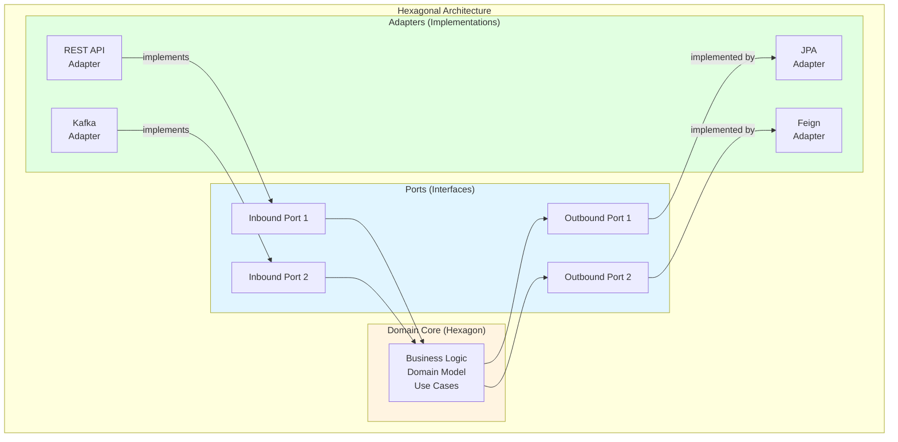
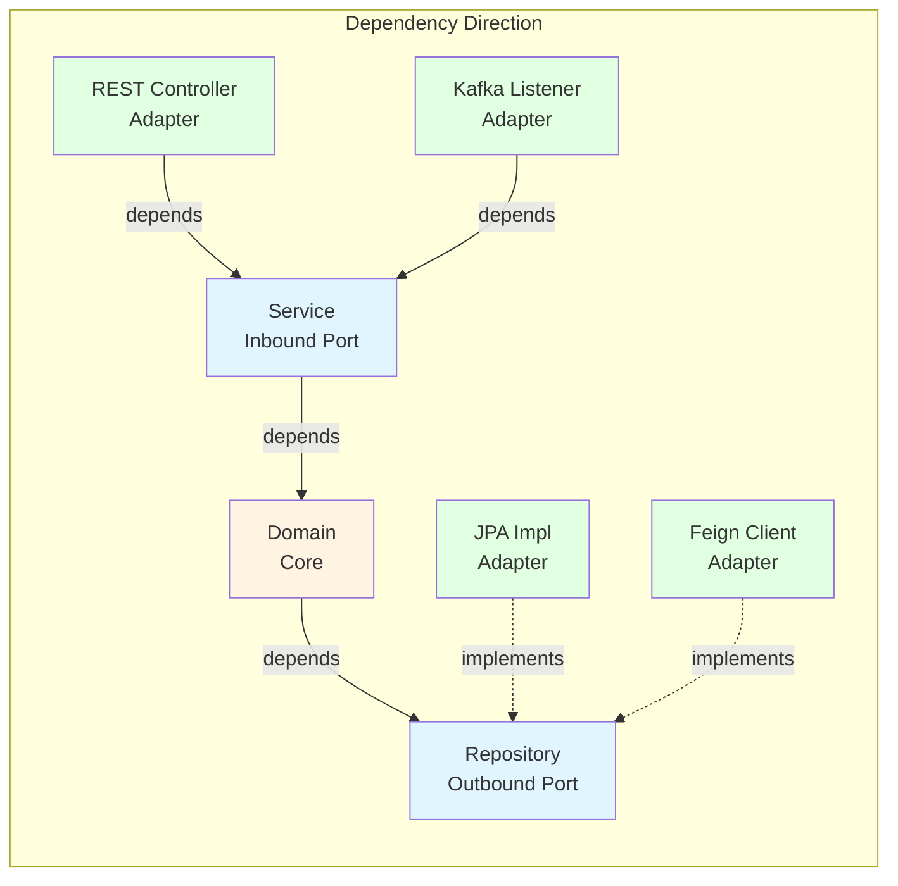
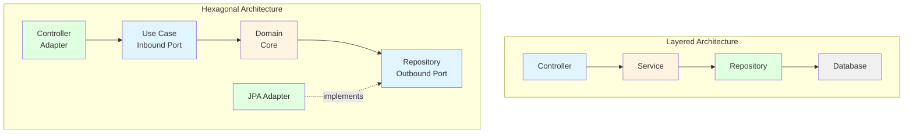
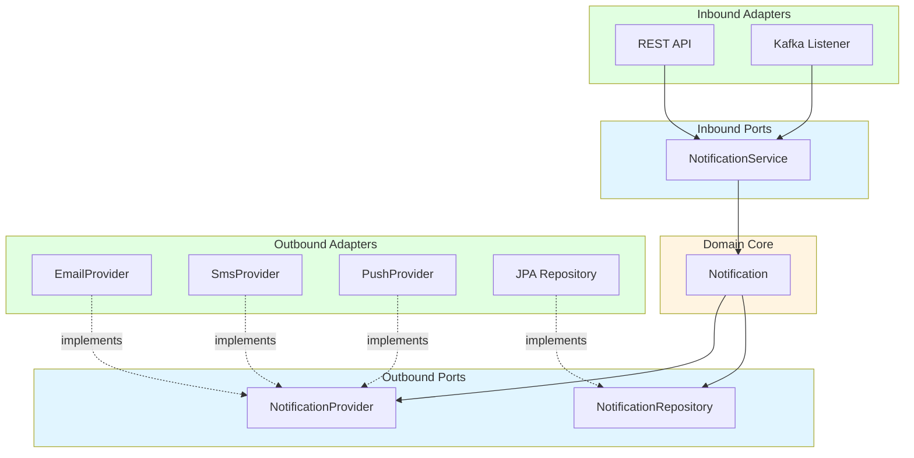

# Hexagonal Architecture (육각형 아키텍처)

## 학습 목표

- Port & Adapter 패턴의 핵심 개념과 구조 이해
- 비즈니스 로직과 외부 의존성 분리 방법 학습
- Portal Universe 프로젝트에서 Hexagonal Architecture 요소 식별
- Layered Architecture와의 차이점 및 적용 시나리오 파악

## 아키텍처 개요

Hexagonal Architecture(육각형 아키텍처)는 Alistair Cockburn이 제안한 패턴으로, 비즈니스 로직을 중심에 두고 외부 세계(UI, 데이터베이스, 메시징 등)와의 결합을 Port와 Adapter를 통해 분리하는 구조입니다.

**다른 이름:**
- Ports and Adapters Pattern
- Clean Architecture (Robert C. Martin의 변형)
- Onion Architecture (Jeffrey Palermo의 변형)



### 핵심 개념

1. **Domain Core (중심부)**
   - 순수한 비즈니스 로직
   - 외부 기술에 의존하지 않음
   - 도메인 모델과 유스케이스 포함

2. **Ports (포트)**
   - 인터페이스로 정의
   - 도메인과 외부 세계의 계약
   - **Inbound Port**: 외부 → 도메인 (Use Case Interface)
   - **Outbound Port**: 도메인 → 외부 (Repository Interface, 외부 서비스 Interface)

3. **Adapters (어댑터)**
   - Port 인터페이스의 구현체
   - 외부 기술과의 실제 통신
   - **Inbound Adapter**: Controller, Event Listener
   - **Outbound Adapter**: Repository 구현체, Feign Client

## 의존성 방향 규칙



**핵심 규칙:**
- ✅ 모든 의존성은 **중심(Domain)을 향함**
- ✅ 도메인은 외부 기술을 몰라야 함 (JPA, Spring, HTTP 등)
- ✅ 어댑터는 포트에 의존, 포트는 어댑터를 몰라야 함 (Dependency Inversion)

## Layered vs Hexagonal 비교

| 측면 | Layered Architecture | Hexagonal Architecture |
|------|----------------------|------------------------|
| 구조 | 수평적 레이어 | 중심과 외곽 |
| 의존성 | 단방향 (위→아래) | 내향적 (외부→중심) |
| 분리 기준 | 기술적 역할 | 비즈니스 vs 기술 |
| 비즈니스 로직 | Service Layer | Domain Core |
| 테스트 | 레이어별 Mock | 포트 기반 Mock |
| 교체 가능성 | 어려움 | 쉬움 (어댑터만 교체) |
| 학습 곡선 | 낮음 | 높음 |



## Portal Universe 적용 분석

Portal Universe는 **Layered Architecture를 기반**으로 하되, 일부 Hexagonal 원칙을 적용하고 있습니다.

### 현재 구조 분석

```
services/shopping-service/
├── controller/          ← Inbound Adapter
├── service/             ← Inbound Port + Domain Logic (혼합)
│   ├── ProductService.java      (Port Interface)
│   └── ProductServiceImpl.java  (구현체)
├── repository/          ← Outbound Port
│   └── ProductRepository.java   (Spring Data JPA Interface)
├── domain/              ← Domain Core
│   └── Product.java
└── client/              ← Outbound Adapter
    └── BlogServiceClient.java   (Feign Client)
```

### 1. Inbound Port & Adapter 예제

**Inbound Port (Service Interface):**
```java
/**
 * 주문 관리 유스케이스 (Inbound Port)
 */
public interface OrderService {
    OrderResponse createOrder(OrderCreateRequest request);
    OrderResponse getOrder(Long orderId);
    OrderResponse cancelOrder(Long orderId, String reason);
    List<OrderResponse> getUserOrders(String userId);
}
```

**Inbound Adapter (Controller):**
```java
/**
 * REST API Inbound Adapter
 */
@RestController
@RequestMapping("/orders")
@RequiredArgsConstructor
public class OrderController {

    private final OrderService orderService;  // Inbound Port 의존

    @PostMapping
    public ApiResponse<OrderResponse> createOrder(
            @Valid @RequestBody OrderCreateRequest request) {
        return ApiResponse.success(orderService.createOrder(request));
    }

    @GetMapping("/{orderId}")
    public ApiResponse<OrderResponse> getOrder(@PathVariable Long orderId) {
        return ApiResponse.success(orderService.getOrder(orderId));
    }

    @PostMapping("/{orderId}/cancel")
    public ApiResponse<OrderResponse> cancelOrder(
            @PathVariable Long orderId,
            @RequestBody OrderCancelRequest request) {
        return ApiResponse.success(
            orderService.cancelOrder(orderId, request.getReason())
        );
    }
}
```

**또 다른 Inbound Adapter (Kafka Listener):**
```java
/**
 * Kafka Event Inbound Adapter
 */
@Component
@RequiredArgsConstructor
@Slf4j
public class OrderEventListener {

    private final OrderService orderService;  // 동일한 Inbound Port 사용

    @KafkaListener(topics = "payment-completed", groupId = "shopping-service")
    public void handlePaymentCompleted(PaymentCompletedEvent event) {
        log.info("Payment completed for order: {}", event.getOrderId());
        // OrderService를 통해 주문 상태 업데이트
        orderService.markOrderAsPaid(event.getOrderId());
    }
}
```

**분석:**
- ✅ 두 Adapter(REST, Kafka)가 같은 Port(OrderService) 사용
- ✅ 비즈니스 로직은 Adapter에 무관하게 재사용
- ✅ 새로운 Adapter 추가 시 기존 코드 영향 없음

### 2. Outbound Port & Adapter 예제

**Outbound Port (Repository Interface):**
```java
/**
 * 상품 영속성 Outbound Port
 */
public interface ProductRepository extends JpaRepository<Product, Long> {
    boolean existsByName(String name);
    Optional<Product> findByName(String name);
}
```

**Outbound Adapter (JPA Implementation):**
- Spring Data JPA가 런타임에 자동 생성
- 실제 구현체는 프록시 객체
- 데이터베이스 기술 변경 시 어댑터만 교체 가능

**또 다른 Outbound Port (외부 서비스 Interface):**
```java
/**
 * Blog 서비스 통신 Outbound Port
 */
@FeignClient(name = "blog-service")
public interface BlogServiceClient {
    @GetMapping("/posts/product/{productId}")
    ApiResponse<List<PostSummary>> getProductReviews(@PathVariable Long productId);
}
```

**Outbound Adapter (Feign Client Implementation):**
- Spring Cloud OpenFeign이 자동 구현
- HTTP 통신을 담당하는 어댑터
- gRPC, GraphQL 등으로 교체 가능 (포트는 유지)

### 3. Domain Core 예제

```java
/**
 * 주문 도메인 모델 (Domain Core)
 */
@Entity
@Table(name = "orders")
@Getter
@NoArgsConstructor(access = AccessLevel.PROTECTED)
public class Order {

    @Id
    @GeneratedValue(strategy = GenerationType.IDENTITY)
    private Long id;

    private String orderNumber;
    private String userId;

    @Enumerated(EnumType.STRING)
    private OrderStatus status;

    private BigDecimal totalAmount;
    private BigDecimal discountAmount;
    private BigDecimal finalAmount;

    @Embedded
    private Address shippingAddress;

    @OneToMany(mappedBy = "order", cascade = CascadeType.ALL)
    private List<OrderItem> items = new ArrayList<>();

    /**
     * 비즈니스 규칙: 주문 확정
     */
    public void confirm() {
        validateStatusTransition(OrderStatus.PENDING, OrderStatus.CONFIRMED);
        this.status = OrderStatus.CONFIRMED;
    }

    /**
     * 비즈니스 규칙: 주문 취소
     */
    public void cancel(String reason) {
        if (!this.status.isCancellable()) {
            throw new CustomBusinessException(
                ShoppingErrorCode.ORDER_CANNOT_BE_CANCELLED);
        }
        this.status = OrderStatus.CANCELLED;
        this.cancelReason = reason;
        this.cancelledAt = LocalDateTime.now();
    }

    /**
     * 비즈니스 규칙: 쿠폰 적용
     */
    public void applyCoupon(Coupon coupon) {
        if (!coupon.isApplicable(this.totalAmount)) {
            throw new CustomBusinessException(
                ShoppingErrorCode.COUPON_NOT_APPLICABLE);
        }
        this.discountAmount = coupon.calculateDiscount(this.totalAmount);
        calculateFinalAmount();
    }

    /**
     * 도메인 로직: 최종 금액 계산
     */
    private void calculateFinalAmount() {
        BigDecimal discount = this.discountAmount != null
            ? this.discountAmount : BigDecimal.ZERO;
        this.finalAmount = this.totalAmount.subtract(discount);
        if (this.finalAmount.compareTo(BigDecimal.ZERO) < 0) {
            this.finalAmount = BigDecimal.ZERO;
        }
    }

    private void validateStatusTransition(OrderStatus from, OrderStatus to) {
        if (this.status != from) {
            throw new CustomBusinessException(ShoppingErrorCode.INVALID_ORDER_STATUS);
        }
    }
}
```

**분석:**
- ⚠️ `@Entity` 어노테이션으로 JPA에 의존 (순수 도메인 아님)
- ✅ 비즈니스 규칙이 도메인 객체에 캡슐화됨
- ✅ 상태 변경 메서드로 불변 조건 보장
- 🔄 개선 가능: JPA 의존성 제거하여 순수 도메인으로 전환

### 완전한 Hexagonal Architecture로 전환한다면?

**순수 Domain Core (JPA 의존성 제거):**
```java
/**
 * 순수 도메인 모델 (기술 의존성 없음)
 */
public class Order {
    private final OrderId id;
    private final UserId userId;
    private OrderStatus status;
    private Money totalAmount;
    private Money discountAmount;
    private Address shippingAddress;
    private List<OrderItem> items;

    public Order(OrderId id, UserId userId, Address shippingAddress) {
        this.id = id;
        this.userId = userId;
        this.status = OrderStatus.PENDING;
        this.shippingAddress = shippingAddress;
        this.items = new ArrayList<>();
        this.totalAmount = Money.ZERO;
    }

    public void confirm() {
        validateStatusTransition(OrderStatus.PENDING, OrderStatus.CONFIRMED);
        this.status = OrderStatus.CONFIRMED;
    }

    public void applyCoupon(Coupon coupon) {
        if (!coupon.isApplicable(this.totalAmount)) {
            throw new InvalidCouponException("쿠폰을 적용할 수 없습니다");
        }
        this.discountAmount = coupon.calculateDiscount(this.totalAmount);
        recalculateFinalAmount();
    }

    // JPA 어노테이션 없음
    // 순수 비즈니스 로직만 포함
}
```

**Outbound Adapter (JPA Entity Mapper):**
```java
/**
 * JPA Persistence Adapter
 */
@Entity
@Table(name = "orders")
class OrderJpaEntity {
    @Id
    @GeneratedValue
    private Long id;

    private String userId;
    private String status;
    private BigDecimal totalAmount;
    // ... 기타 필드

    public static OrderJpaEntity from(Order order) {
        OrderJpaEntity entity = new OrderJpaEntity();
        entity.id = order.getId().getValue();
        entity.userId = order.getUserId().getValue();
        entity.status = order.getStatus().name();
        entity.totalAmount = order.getTotalAmount().getAmount();
        return entity;
    }

    public Order toDomain() {
        Order order = new Order(
            new OrderId(this.id),
            new UserId(this.userId),
            Address.from(this.receiverName, this.address1)
        );
        // ... 상태 복원
        return order;
    }
}

@Component
@RequiredArgsConstructor
class OrderPersistenceAdapter implements OrderRepository {

    private final OrderJpaRepository jpaRepository;

    @Override
    public Order save(Order order) {
        OrderJpaEntity entity = OrderJpaEntity.from(order);
        OrderJpaEntity saved = jpaRepository.save(entity);
        return saved.toDomain();
    }

    @Override
    public Optional<Order> findById(OrderId orderId) {
        return jpaRepository.findById(orderId.getValue())
                .map(OrderJpaEntity::toDomain);
    }
}
```

**장점:**
- ✅ 도메인 모델이 완전히 독립적
- ✅ JPA 없이 도메인 로직 테스트 가능
- ✅ 데이터베이스 기술 교체 용이

**단점:**
- ❌ 매핑 코드 증가
- ❌ 복잡도 증가
- ❌ 개발 속도 저하

## 실습 예제: Notification Service

### 시나리오

**요구사항:**
- 알림 전송 (Email, SMS, Push 지원)
- 전송 방식은 런타임에 선택 가능
- 새로운 알림 채널 추가 용이

### Hexagonal Architecture 설계



### 1단계: Domain Core

```java
/**
 * 알림 도메인 모델
 */
public class Notification {
    private final String id;
    private final String userId;
    private final NotificationType type;
    private final String title;
    private final String message;
    private NotificationStatus status;
    private LocalDateTime sentAt;

    public Notification(String userId, NotificationType type,
                       String title, String message) {
        this.id = UUID.randomUUID().toString();
        this.userId = userId;
        this.type = type;
        this.title = title;
        this.message = message;
        this.status = NotificationStatus.PENDING;
    }

    public void markAsSent() {
        this.status = NotificationStatus.SENT;
        this.sentAt = LocalDateTime.now();
    }

    public void markAsFailed(String reason) {
        this.status = NotificationStatus.FAILED;
        this.failureReason = reason;
    }

    // Getters
}

public enum NotificationType {
    EMAIL, SMS, PUSH
}

public enum NotificationStatus {
    PENDING, SENT, FAILED
}
```

### 2단계: Outbound Ports

```java
/**
 * 알림 전송 Outbound Port
 */
public interface NotificationProvider {
    void send(Notification notification);
    NotificationType supportedType();
}

/**
 * 알림 영속성 Outbound Port
 */
public interface NotificationRepository {
    Notification save(Notification notification);
    Optional<Notification> findById(String id);
    List<Notification> findByUserId(String userId);
}
```

### 3단계: Outbound Adapters

```java
/**
 * Email 전송 Adapter
 */
@Component
@RequiredArgsConstructor
public class EmailNotificationProvider implements NotificationProvider {

    private final JavaMailSender mailSender;

    @Override
    public void send(Notification notification) {
        SimpleMailMessage message = new SimpleMailMessage();
        message.setTo(getUserEmail(notification.getUserId()));
        message.setSubject(notification.getTitle());
        message.setText(notification.getMessage());
        mailSender.send(message);
    }

    @Override
    public NotificationType supportedType() {
        return NotificationType.EMAIL;
    }

    private String getUserEmail(String userId) {
        // User 서비스에서 이메일 조회
        return "user@example.com";
    }
}

/**
 * SMS 전송 Adapter
 */
@Component
public class SmsNotificationProvider implements NotificationProvider {

    @Override
    public void send(Notification notification) {
        // SMS 전송 로직 (예: Twilio API)
        System.out.println("SMS 전송: " + notification.getMessage());
    }

    @Override
    public NotificationType supportedType() {
        return NotificationType.SMS;
    }
}

/**
 * Push 알림 Adapter
 */
@Component
public class PushNotificationProvider implements NotificationProvider {

    @Override
    public void send(Notification notification) {
        // FCM Push 전송
        System.out.println("Push 전송: " + notification.getMessage());
    }

    @Override
    public NotificationType supportedType() {
        return NotificationType.PUSH;
    }
}
```

### 4단계: Inbound Port

```java
/**
 * 알림 전송 Use Case (Inbound Port)
 */
public interface NotificationService {
    String sendNotification(String userId, NotificationType type,
                           String title, String message);
    List<NotificationResponse> getUserNotifications(String userId);
}
```

### 5단계: Use Case Implementation (Application Service)

```java
/**
 * Use Case 구현체
 */
@Service
@RequiredArgsConstructor
public class NotificationServiceImpl implements NotificationService {

    private final NotificationRepository notificationRepository;
    private final List<NotificationProvider> providers;

    @Override
    public String sendNotification(String userId, NotificationType type,
                                   String title, String message) {
        // 1. 도메인 객체 생성
        Notification notification = new Notification(userId, type, title, message);

        // 2. 적절한 Provider 선택
        NotificationProvider provider = providers.stream()
                .filter(p -> p.supportedType() == type)
                .findFirst()
                .orElseThrow(() -> new IllegalArgumentException(
                    "Unsupported notification type: " + type));

        try {
            // 3. 전송
            provider.send(notification);
            notification.markAsSent();
        } catch (Exception e) {
            notification.markAsFailed(e.getMessage());
        }

        // 4. 저장
        notificationRepository.save(notification);

        return notification.getId();
    }

    @Override
    public List<NotificationResponse> getUserNotifications(String userId) {
        return notificationRepository.findByUserId(userId).stream()
                .map(NotificationResponse::from)
                .toList();
    }
}
```

### 6단계: Inbound Adapters

**REST API Adapter:**
```java
@RestController
@RequestMapping("/notifications")
@RequiredArgsConstructor
public class NotificationController {

    private final NotificationService notificationService;

    @PostMapping
    public ApiResponse<String> sendNotification(
            @Valid @RequestBody NotificationRequest request) {
        String notificationId = notificationService.sendNotification(
                request.getUserId(),
                request.getType(),
                request.getTitle(),
                request.getMessage()
        );
        return ApiResponse.success(notificationId);
    }

    @GetMapping("/my")
    public ApiResponse<List<NotificationResponse>> getMyNotifications(
            @AuthenticationPrincipal String userId) {
        return ApiResponse.success(
            notificationService.getUserNotifications(userId)
        );
    }
}
```

**Kafka Event Adapter:**
```java
@Component
@RequiredArgsConstructor
@Slf4j
public class NotificationEventListener {

    private final NotificationService notificationService;

    @KafkaListener(topics = "order-created", groupId = "notification-service")
    public void handleOrderCreated(OrderCreatedEvent event) {
        notificationService.sendNotification(
                event.getUserId(),
                NotificationType.EMAIL,
                "주문 접수 완료",
                "주문번호 " + event.getOrderNumber() + "이 접수되었습니다."
        );
    }

    @KafkaListener(topics = "payment-completed", groupId = "notification-service")
    public void handlePaymentCompleted(PaymentCompletedEvent event) {
        notificationService.sendNotification(
                event.getUserId(),
                NotificationType.PUSH,
                "결제 완료",
                "결제가 완료되었습니다."
        );
    }
}
```

### 7단계: 새로운 Adapter 추가 (Slack)

기존 코드 수정 없이 새로운 알림 채널 추가 가능:

```java
/**
 * Slack 알림 Adapter (새로 추가)
 */
@Component
public class SlackNotificationProvider implements NotificationProvider {

    @Override
    public void send(Notification notification) {
        // Slack Webhook 호출
        System.out.println("Slack 전송: " + notification.getMessage());
    }

    @Override
    public NotificationType supportedType() {
        return NotificationType.SLACK;  // 새로운 타입
    }
}
```

**분석:**
- ✅ 기존 코드 수정 없음 (Open-Closed Principle)
- ✅ NotificationService는 변경 불필요
- ✅ Spring의 의존성 주입으로 자동 등록

## 테스트 전략

### Domain Core 테스트 (외부 의존성 없음)

```java
class NotificationTest {

    @Test
    void 알림_전송_성공() {
        // given
        Notification notification = new Notification(
            "user123", NotificationType.EMAIL, "제목", "내용"
        );

        // when
        notification.markAsSent();

        // then
        assertThat(notification.getStatus()).isEqualTo(NotificationStatus.SENT);
        assertThat(notification.getSentAt()).isNotNull();
    }

    @Test
    void 알림_전송_실패() {
        // given
        Notification notification = new Notification(
            "user123", NotificationType.EMAIL, "제목", "내용"
        );

        // when
        notification.markAsFailed("전송 실패");

        // then
        assertThat(notification.getStatus()).isEqualTo(NotificationStatus.FAILED);
        assertThat(notification.getFailureReason()).isEqualTo("전송 실패");
    }
}
```

### Use Case 테스트 (Port Mock)

```java
@ExtendWith(MockitoExtension.class)
class NotificationServiceImplTest {

    @Mock
    private NotificationRepository notificationRepository;

    @Mock
    private NotificationProvider emailProvider;

    @InjectMocks
    private NotificationServiceImpl notificationService;

    @BeforeEach
    void setUp() {
        when(emailProvider.supportedType()).thenReturn(NotificationType.EMAIL);
        notificationService = new NotificationServiceImpl(
            notificationRepository,
            List.of(emailProvider)
        );
    }

    @Test
    void 알림_전송_성공() {
        // given
        doNothing().when(emailProvider).send(any());
        when(notificationRepository.save(any())).thenAnswer(
            invocation -> invocation.getArgument(0)
        );

        // when
        String notificationId = notificationService.sendNotification(
            "user123", NotificationType.EMAIL, "제목", "내용"
        );

        // then
        assertThat(notificationId).isNotNull();
        verify(emailProvider).send(any(Notification.class));
        verify(notificationRepository).save(any(Notification.class));
    }
}
```

## 장단점과 트레이드오프

### 장점

1. **기술 독립성**
   - 도메인 로직이 외부 기술과 분리
   - 프레임워크 변경 용이
   - 데이터베이스 교체 가능

2. **테스트 용이성**
   - 도메인 로직을 순수하게 테스트
   - Mock 객체 생성 간단
   - 통합 테스트 범위 축소

3. **교체 가능성**
   - Adapter만 교체하면 됨
   - 기존 비즈니스 로직 영향 없음
   - 멀티 채널 지원 용이

4. **명확한 비즈니스 로직**
   - 도메인 중심 설계
   - 기술적 복잡도와 분리
   - 비즈니스 규칙이 명확

### 단점

1. **복잡도 증가**
   - 인터페이스와 구현체 분리
   - 매핑 코드 필요
   - 초기 설정 부담

2. **개발 속도 저하**
   - Boilerplate 코드 증가
   - 레이어가 더 많음
   - 간단한 CRUD도 복잡

3. **높은 학습 곡선**
   - 개념 이해 필요
   - 의존성 역전 원리 이해 필수
   - 팀 교육 비용

4. **오버 엔지니어링 위험**
   - 단순한 프로젝트에는 과함
   - 유지보수 비용 증가 가능
   - ROI 불명확

### Portal Universe에서의 선택

| 서비스 | 아키텍처 선택 | 이유 |
|--------|--------------|------|
| Shopping Service | Layered + 부분 Hexagonal | 빠른 개발, 적당한 유연성 |
| Auth Service | Layered | 단순한 인증 로직 |
| Notification Service | Hexagonal (권장) | 멀티 채널, 높은 교체 가능성 |
| Blog Service | Layered | CRUD 중심 |

**트레이드오프:**
- 복잡도 < 5: Layered Architecture
- 복잡도 5-7: Layered + Hexagonal 혼합
- 복잡도 > 7: Full Hexagonal Architecture

## 실전 팁

### 언제 Hexagonal을 선택할까?

**선택 기준:**
- ✅ 외부 시스템 통합이 많음
- ✅ 기술 스택 변경 가능성 높음
- ✅ 멀티 채널/프로토콜 지원
- ✅ 복잡한 비즈니스 로직
- ✅ 장기 유지보수 예정

**피해야 할 경우:**
- ❌ 단순 CRUD 애플리케이션
- ❌ 프로토타이핑/MVP 단계
- ❌ 팀의 이해도 낮음
- ❌ 빠른 출시 필요

### 점진적 전환 전략

1. **1단계**: 기존 Layered Architecture 유지
2. **2단계**: Service를 Interface로 추상화
3. **3단계**: Domain 로직을 Entity에 집중
4. **4단계**: Repository를 Port로 간주
5. **5단계**: 필요시 Domain-JPA 분리

## 관련 문서 링크

- [Layered Architecture](./layered-architecture.md) - 계층형 아키텍처
- [DDD Basics](./ddd-basics.md) - 도메인 주도 설계 기초
- [Trade-offs in Software Design](../trade-offs.md) - 아키텍처 선택 가이드
- [Spring Boot Patterns](./../../../.claude/rules/spring.md) - Spring Boot 개발 패턴

## 참고 자료

- Alistair Cockburn - [Hexagonal Architecture](https://alistair.cockburn.us/hexagonal-architecture/)
- Robert C. Martin - [Clean Architecture](https://blog.cleancoder.com/uncle-bob/2012/08/13/the-clean-architecture.html)
- Netflix Tech Blog - [Ready for changes with Hexagonal Architecture](https://netflixtechblog.com/ready-for-changes-with-hexagonal-architecture-b315ec967749)
- Tom Hombergs - [Get Your Hands Dirty on Clean Architecture](https://reflectoring.io/book/)
