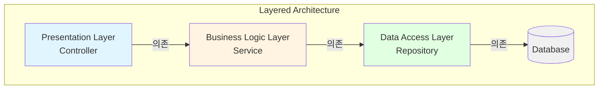
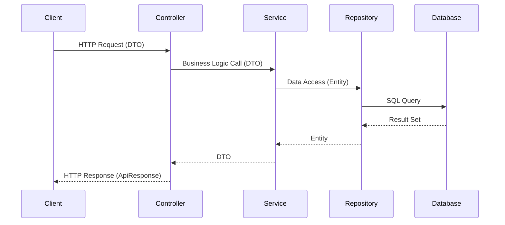
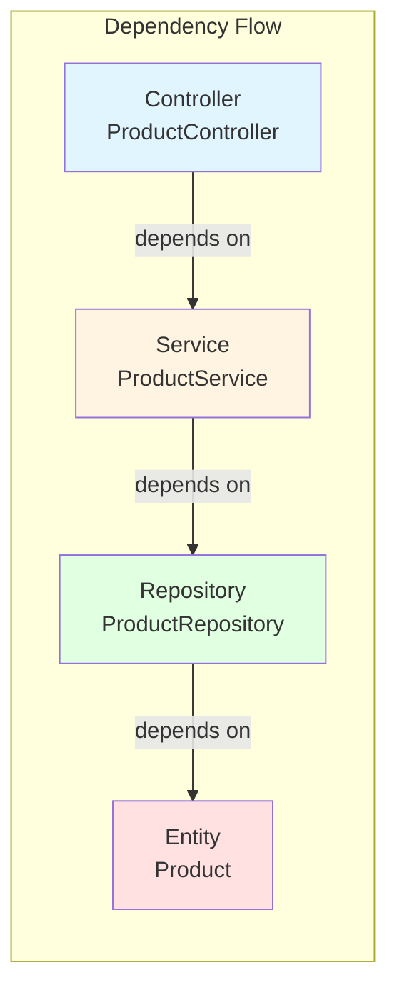

# Layered Architecture (계층형 아키텍처)

## 학습 목표

- Controller-Service-Repository 패턴의 구조와 각 레이어의 역할 이해
- 레이어 간 의존성 방향과 책임 분리 원칙 학습
- Portal Universe 프로젝트의 실제 계층형 구조 분석
- 계층형 아키텍처의 장단점과 적용 시나리오 파악

## 아키텍처 개요

계층형 아키텍처는 애플리케이션을 수평적 레이어로 분리하여 각 레이어가 명확한 책임을 갖도록 구조화하는 패턴입니다. 각 레이어는 바로 아래 레이어에만 의존하며, 역방향 의존성은 금지됩니다.



### 데이터 흐름



## 각 레이어의 역할

### 1. Presentation Layer (Controller)

**책임:**
- HTTP 요청/응답 처리
- 입력 검증 (Validation)
- DTO ↔ 비즈니스 로직 연결
- 권한 체크 (`@PreAuthorize`)
- ApiResponse 래핑

**특징:**
- `@RestController` 사용
- Service 레이어에만 의존
- 비즈니스 로직 포함 금지
- 얇게(Thin) 유지

### 2. Business Logic Layer (Service)

**책임:**
- 핵심 비즈니스 로직 구현
- 트랜잭션 관리 (`@Transactional`)
- 도메인 규칙 검증
- 외부 서비스 통합 (Feign, Kafka)
- DTO ↔ Entity 변환

**특징:**
- Interface + Implementation 구조
- Repository 레이어에 의존
- 도메인 객체 조작
- 비즈니스 예외 처리

### 3. Data Access Layer (Repository)

**책임:**
- 데이터베이스 CRUD 연산
- 쿼리 메서드 정의
- 영속성 관리

**특징:**
- Spring Data JPA 활용
- Entity와 직접 작업
- 비즈니스 로직 포함 금지
- 데이터 접근만 담당

## Portal Universe 적용 분석

### 실제 패키지 구조

```
services/shopping-service/src/main/java/
└── com.portal.universe.shoppingservice
    ├── product
    │   ├── controller
    │   │   ├── ProductController.java
    │   │   └── AdminProductController.java
    │   ├── service
    │   │   ├── ProductService.java (Interface)
    │   │   └── ProductServiceImpl.java
    │   ├── repository
    │   │   └── ProductRepository.java
    │   ├── domain
    │   │   └── Product.java
    │   └── dto
    │       ├── ProductCreateRequest.java
    │       ├── ProductUpdateRequest.java
    │       └── ProductResponse.java
    ├── order
    │   ├── controller/
    │   ├── service/
    │   ├── repository/
    │   └── domain/
    └── common
        ├── exception/
        └── domain/
```

### 1. Presentation Layer 예제

```java
@RestController
@RequestMapping("/products")
@RequiredArgsConstructor
public class ProductController {

    private final ProductService productService;

    /**
     * 상품 목록 조회 (공개)
     */
    @GetMapping
    public ApiResponse<Page<ProductResponse>> getAllProducts(
            @RequestParam(defaultValue = "0") int page,
            @RequestParam(defaultValue = "12") int size) {
        Pageable pageable = PageRequest.of(page, size);
        return ApiResponse.success(productService.getAllProducts(pageable));
    }

    /**
     * 상품 상세 조회 (공개)
     */
    @GetMapping("/{productId}")
    public ApiResponse<ProductResponse> getProductById(@PathVariable Long productId) {
        return ApiResponse.success(productService.getProductById(productId));
    }

    /**
     * 상품 생성 (ADMIN 전용)
     */
    @PostMapping
    @PreAuthorize("hasRole('ADMIN')")
    public ApiResponse<ProductResponse> createProduct(
            @RequestBody ProductCreateRequest request) {
        return ApiResponse.success(productService.createProduct(request));
    }
}
```

**분석:**
- ✅ Service 레이어만 의존
- ✅ 비즈니스 로직 없음
- ✅ ApiResponse로 일관된 응답 포맷
- ✅ 권한 체크는 Controller에서 처리

### 2. Business Logic Layer 예제

```java
public interface ProductService {
    Page<ProductResponse> getAllProducts(Pageable pageable);
    ProductResponse createProduct(ProductCreateRequest request);
    ProductResponse getProductById(Long id);
    ProductResponse updateProduct(Long productId, ProductUpdateRequest request);
    void deleteProduct(Long productId);
}

@Service
@RequiredArgsConstructor
@Transactional(readOnly = true)
public class ProductServiceImpl implements ProductService {

    private final ProductRepository productRepository;

    @Override
    public Page<ProductResponse> getAllProducts(Pageable pageable) {
        return productRepository.findAll(pageable)
                .map(ProductResponse::from);
    }

    @Override
    @Transactional
    public ProductResponse createProduct(ProductCreateRequest request) {
        // 비즈니스 규칙 검증
        if (productRepository.existsByName(request.getName())) {
            throw new CustomBusinessException(
                ShoppingErrorCode.DUPLICATE_PRODUCT_NAME);
        }

        // 도메인 객체 생성
        Product product = Product.builder()
                .name(request.getName())
                .description(request.getDescription())
                .price(request.getPrice())
                .stock(request.getStock())
                .build();

        // 영속화
        Product savedProduct = productRepository.save(product);

        // DTO 변환
        return ProductResponse.from(savedProduct);
    }

    @Override
    public ProductResponse getProductById(Long id) {
        Product product = productRepository.findById(id)
                .orElseThrow(() -> new CustomBusinessException(
                    ShoppingErrorCode.PRODUCT_NOT_FOUND));
        return ProductResponse.from(product);
    }
}
```

**분석:**
- ✅ Interface로 추상화
- ✅ 트랜잭션 경계 명확
- ✅ 비즈니스 규칙 검증 포함
- ✅ DTO ↔ Entity 변환 담당
- ✅ 비즈니스 예외 발생

### 3. Data Access Layer 예제

```java
/**
 * Product 엔티티 데이터 접근 리포지토리
 */
public interface ProductRepository extends JpaRepository<Product, Long> {

    /**
     * 상품명으로 중복 체크
     */
    boolean existsByName(String name);

    /**
     * 상품명으로 상품 조회
     */
    Optional<Product> findByName(String name);
}
```

**분석:**
- ✅ Spring Data JPA 활용
- ✅ 단순 데이터 접근만 담당
- ✅ 비즈니스 로직 없음
- ✅ 쿼리 메서드 명명 규칙 준수

### 4. Domain Layer 예제

```java
@Entity
@Table(name = "products")
@Getter
@NoArgsConstructor
public class Product {

    @Id
    @GeneratedValue(strategy = GenerationType.IDENTITY)
    private Long id;

    @Column(nullable = false)
    private String name;

    private String description;

    @Column(nullable = false)
    private Double price;

    @Column(nullable = false)
    private Integer stock;

    @Builder
    public Product(String name, String description, Double price, Integer stock) {
        this.name = name;
        this.description = description;
        this.price = price;
        this.stock = stock;
    }

    /**
     * 상품 정보 수정
     */
    public void update(String name, String description, Double price, Integer stock) {
        this.name = name;
        this.description = description;
        this.price = price;
        this.stock = stock;
    }
}
```

**분석:**
- ✅ JPA 엔티티로 영속성 관리
- ✅ 도메인 로직 메서드 포함 (update)
- ✅ 불변성 보장 (Getter만 제공)
- ✅ 빌더 패턴으로 생성

## 의존성 흐름 분석



**핵심 규칙:**
- Controller는 Service만 알고, Repository를 직접 호출하지 않음
- Service는 Repository를 통해서만 데이터 접근
- 역방향 의존성 금지 (Repository → Service ❌)

## 복잡한 비즈니스 로직 예제: Order Aggregate

```java
@Entity
@Table(name = "orders")
@Getter
@NoArgsConstructor(access = AccessLevel.PROTECTED)
public class Order {

    @Id
    @GeneratedValue(strategy = GenerationType.IDENTITY)
    private Long id;

    @Column(nullable = false, unique = true)
    private String orderNumber;

    @Column(nullable = false)
    private String userId;

    @Enumerated(EnumType.STRING)
    private OrderStatus status;

    private BigDecimal totalAmount;
    private BigDecimal discountAmount;
    private BigDecimal finalAmount;

    @Embedded
    private Address shippingAddress;

    @OneToMany(mappedBy = "order", cascade = CascadeType.ALL, orphanRemoval = true)
    private List<OrderItem> items = new ArrayList<>();

    /**
     * 주문에 항목 추가
     */
    public OrderItem addItem(Long productId, String productName,
                             BigDecimal price, int quantity) {
        OrderItem orderItem = OrderItem.builder()
                .order(this)
                .productId(productId)
                .productName(productName)
                .price(price)
                .quantity(quantity)
                .build();

        this.items.add(orderItem);
        recalculateTotalAmount();
        return orderItem;
    }

    /**
     * 주문 확정
     */
    public void confirm() {
        if (this.status != OrderStatus.PENDING) {
            throw new CustomBusinessException(ShoppingErrorCode.INVALID_ORDER_STATUS);
        }
        this.status = OrderStatus.CONFIRMED;
    }

    /**
     * 주문 취소
     */
    public void cancel(String reason) {
        if (!this.status.isCancellable()) {
            throw new CustomBusinessException(ShoppingErrorCode.ORDER_CANNOT_BE_CANCELLED);
        }
        this.status = OrderStatus.CANCELLED;
        this.cancelReason = reason;
        this.cancelledAt = LocalDateTime.now();
    }

    /**
     * 총 금액 재계산
     */
    public void recalculateTotalAmount() {
        this.totalAmount = items.stream()
                .map(OrderItem::getSubtotal)
                .reduce(BigDecimal.ZERO, BigDecimal::add);
        calculateFinalAmount();
    }

    /**
     * 쿠폰 할인 적용
     */
    public void applyCoupon(Long userCouponId, BigDecimal discountAmount) {
        this.appliedUserCouponId = userCouponId;
        this.discountAmount = discountAmount;
        calculateFinalAmount();
    }

    private void calculateFinalAmount() {
        BigDecimal discount = this.discountAmount != null
            ? this.discountAmount : BigDecimal.ZERO;
        this.finalAmount = this.totalAmount.subtract(discount);
        if (this.finalAmount.compareTo(BigDecimal.ZERO) < 0) {
            this.finalAmount = BigDecimal.ZERO;
        }
    }
}
```

**분석:**
- ✅ Rich Domain Model: 비즈니스 로직을 엔티티에 캡슐화
- ✅ 상태 변경 메서드로 일관성 보장
- ✅ 불변 조건(Invariant) 체크
- ✅ Aggregate Root로 동작 (OrderItem 생명주기 관리)

## 장단점과 트레이드오프

### 장점

1. **명확한 책임 분리**
   - 각 레이어의 역할이 명확함
   - 코드 위치 예측 가능
   - 신입 개발자도 빠르게 이해 가능

2. **낮은 학습 곡선**
   - 직관적인 구조
   - Spring Boot의 표준 패턴
   - 많은 레퍼런스와 문서

3. **테스트 용이성**
   - 레이어별 독립 테스트 가능
   - Mock 객체 생성 간편
   - 통합 테스트도 명확

4. **확장성**
   - 레이어별 수평 확장 가능
   - 새로운 기능 추가 시 기존 구조 활용

### 단점

1. **수평적 분리로 인한 중복**
   - DTO 변환 코드 반복
   - 레이어 간 데이터 전달 오버헤드
   - Boilerplate 코드 증가

2. **비즈니스 로직 분산 위험**
   - Service와 Entity에 로직 분산 가능
   - Anemic Domain Model 발생 가능
   - 트랜잭션 스크립트 패턴으로 퇴화 위험

3. **의존성 방향 제약**
   - 하위 레이어가 상위 레이어 호출 불가
   - 순환 참조 방지 필요
   - 공통 기능 처리 복잡

4. **도메인 중심 사고 저해**
   - 기술적 레이어가 먼저 보임
   - 비즈니스 개념이 분산됨
   - 도메인 모델링보다 CRUD 중심 사고

### Portal Universe에서의 트레이드오프

| 측면 | 선택 | 이유 |
|------|------|------|
| Service 추상화 | Interface + Impl | 테스트 용이성, 확장성 |
| 트랜잭션 경계 | Service Layer | 명확한 비즈니스 단위 |
| DTO 변환 | Service Layer | Controller는 얇게 유지 |
| 도메인 로직 | Entity 내부 | Rich Domain Model 지향 |
| 예외 처리 | Service에서 발생<br/>Controller에서 잡지 않음 | GlobalExceptionHandler 활용 |

## 실습 예제

### 시나리오: Coupon Service 구현

**요구사항:**
- 쿠폰 생성/조회/삭제
- 사용자에게 쿠폰 발급
- 쿠폰 사용 처리
- 중복 발급 방지

**1단계: Controller 작성**

```java
@RestController
@RequestMapping("/coupons")
@RequiredArgsConstructor
public class CouponController {

    private final CouponService couponService;

    @PostMapping
    @PreAuthorize("hasRole('ADMIN')")
    public ApiResponse<CouponResponse> createCoupon(
            @Valid @RequestBody CouponCreateRequest request) {
        return ApiResponse.success(couponService.createCoupon(request));
    }

    @PostMapping("/{couponId}/issue")
    public ApiResponse<UserCouponResponse> issueCoupon(
            @PathVariable Long couponId,
            @AuthenticationPrincipal String userId) {
        return ApiResponse.success(couponService.issueCoupon(couponId, userId));
    }

    @GetMapping("/my")
    public ApiResponse<List<UserCouponResponse>> getMyCoupons(
            @AuthenticationPrincipal String userId) {
        return ApiResponse.success(couponService.getUserCoupons(userId));
    }
}
```

**2단계: Service 작성**

```java
@Service
@RequiredArgsConstructor
@Transactional(readOnly = true)
public class CouponServiceImpl implements CouponService {

    private final CouponRepository couponRepository;
    private final UserCouponRepository userCouponRepository;

    @Override
    @Transactional
    public CouponResponse createCoupon(CouponCreateRequest request) {
        Coupon coupon = Coupon.builder()
                .name(request.getName())
                .discountAmount(request.getDiscountAmount())
                .validFrom(request.getValidFrom())
                .validUntil(request.getValidUntil())
                .totalQuantity(request.getTotalQuantity())
                .build();

        Coupon saved = couponRepository.save(coupon);
        return CouponResponse.from(saved);
    }

    @Override
    @Transactional
    public UserCouponResponse issueCoupon(Long couponId, String userId) {
        // 쿠폰 조회
        Coupon coupon = couponRepository.findById(couponId)
                .orElseThrow(() -> new CustomBusinessException(
                    ShoppingErrorCode.COUPON_NOT_FOUND));

        // 비즈니스 규칙 검증
        if (userCouponRepository.existsByCouponIdAndUserId(couponId, userId)) {
            throw new CustomBusinessException(
                ShoppingErrorCode.COUPON_ALREADY_ISSUED);
        }

        if (!coupon.isIssuable()) {
            throw new CustomBusinessException(
                ShoppingErrorCode.COUPON_NOT_ISSUABLE);
        }

        // 쿠폰 발급
        coupon.issue();

        UserCoupon userCoupon = UserCoupon.builder()
                .coupon(coupon)
                .userId(userId)
                .build();

        UserCoupon saved = userCouponRepository.save(userCoupon);
        return UserCouponResponse.from(saved);
    }

    @Override
    public List<UserCouponResponse> getUserCoupons(String userId) {
        return userCouponRepository.findByUserId(userId).stream()
                .map(UserCouponResponse::from)
                .toList();
    }
}
```

**3단계: Repository 작성**

```java
public interface CouponRepository extends JpaRepository<Coupon, Long> {
    // 기본 CRUD는 JpaRepository에서 제공
}

public interface UserCouponRepository extends JpaRepository<UserCoupon, Long> {
    boolean existsByCouponIdAndUserId(Long couponId, String userId);
    List<UserCoupon> findByUserId(String userId);
}
```

**4단계: Entity 작성**

```java
@Entity
@Table(name = "coupons")
@Getter
@NoArgsConstructor(access = AccessLevel.PROTECTED)
public class Coupon {

    @Id
    @GeneratedValue(strategy = GenerationType.IDENTITY)
    private Long id;

    private String name;
    private BigDecimal discountAmount;
    private LocalDateTime validFrom;
    private LocalDateTime validUntil;
    private Integer totalQuantity;
    private Integer issuedQuantity = 0;

    @Builder
    public Coupon(String name, BigDecimal discountAmount,
                  LocalDateTime validFrom, LocalDateTime validUntil,
                  Integer totalQuantity) {
        this.name = name;
        this.discountAmount = discountAmount;
        this.validFrom = validFrom;
        this.validUntil = validUntil;
        this.totalQuantity = totalQuantity;
    }

    /**
     * 발급 가능 여부 확인
     */
    public boolean isIssuable() {
        LocalDateTime now = LocalDateTime.now();
        return now.isAfter(validFrom)
            && now.isBefore(validUntil)
            && issuedQuantity < totalQuantity;
    }

    /**
     * 쿠폰 발급 (수량 차감)
     */
    public void issue() {
        if (!isIssuable()) {
            throw new CustomBusinessException(ShoppingErrorCode.COUPON_NOT_ISSUABLE);
        }
        this.issuedQuantity++;
    }
}
```

## 테스트 전략

### Controller 테스트 (MockMvc)

```java
@WebMvcTest(ProductController.class)
class ProductControllerTest {

    @Autowired
    private MockMvc mockMvc;

    @MockBean
    private ProductService productService;

    @Test
    void getAllProducts_성공() throws Exception {
        // given
        Page<ProductResponse> mockPage = new PageImpl<>(List.of(
            new ProductResponse(1L, "상품1", "설명1", 10000.0, 100)
        ));
        when(productService.getAllProducts(any())).thenReturn(mockPage);

        // when & then
        mockMvc.perform(get("/products")
                .param("page", "0")
                .param("size", "12"))
                .andExpect(status().isOk())
                .andExpect(jsonPath("$.success").value(true))
                .andExpect(jsonPath("$.data.content[0].name").value("상품1"));
    }
}
```

### Service 테스트 (단위 테스트)

```java
@ExtendWith(MockitoExtension.class)
class ProductServiceImplTest {

    @Mock
    private ProductRepository productRepository;

    @InjectMocks
    private ProductServiceImpl productService;

    @Test
    void createProduct_중복_상품명_예외() {
        // given
        ProductCreateRequest request = new ProductCreateRequest(
            "중복상품", "설명", 10000.0, 100
        );
        when(productRepository.existsByName("중복상품")).thenReturn(true);

        // when & then
        assertThatThrownBy(() -> productService.createProduct(request))
                .isInstanceOf(CustomBusinessException.class)
                .hasFieldOrPropertyWithValue("errorCode",
                    ShoppingErrorCode.DUPLICATE_PRODUCT_NAME);
    }

    @Test
    void createProduct_성공() {
        // given
        ProductCreateRequest request = new ProductCreateRequest(
            "새상품", "설명", 10000.0, 100
        );
        when(productRepository.existsByName("새상품")).thenReturn(false);
        when(productRepository.save(any())).thenAnswer(
            invocation -> invocation.getArgument(0)
        );

        // when
        ProductResponse response = productService.createProduct(request);

        // then
        assertThat(response.getName()).isEqualTo("새상품");
        verify(productRepository).save(any(Product.class));
    }
}
```

### Repository 테스트 (통합 테스트)

```java
@DataJpaTest
class ProductRepositoryTest {

    @Autowired
    private ProductRepository productRepository;

    @Test
    void existsByName_존재하면_true() {
        // given
        Product product = Product.builder()
                .name("테스트상품")
                .description("설명")
                .price(10000.0)
                .stock(100)
                .build();
        productRepository.save(product);

        // when
        boolean exists = productRepository.existsByName("테스트상품");

        // then
        assertThat(exists).isTrue();
    }
}
```

## 관련 문서 링크

- [Hexagonal Architecture](./hexagonal-architecture.md) - Port & Adapter 패턴
- [DDD Basics](./ddd-basics.md) - 도메인 주도 설계 기초
- [Trade-offs in Software Design](../trade-offs.md) - 아키텍처 선택 트레이드오프
- [Spring Boot Patterns](./../../../.claude/rules/spring.md) - Spring Boot 개발 패턴
- [Common Rules](./../../../.claude/rules/common.md) - 에러 처리 및 공통 규칙

## 참고 자료

- [Spring Framework Documentation](https://spring.io/projects/spring-framework)
- [Spring Data JPA Reference](https://spring.io/projects/spring-data-jpa)
- Martin Fowler - [Patterns of Enterprise Application Architecture](https://martinfowler.com/books/eaa.html)
- Eric Evans - [Domain-Driven Design](https://www.domainlanguage.com/ddd/)
