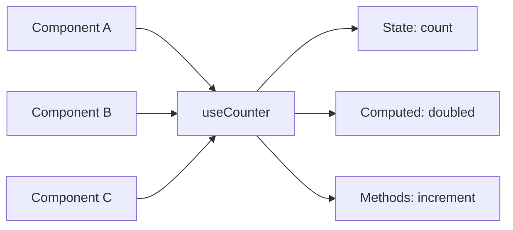
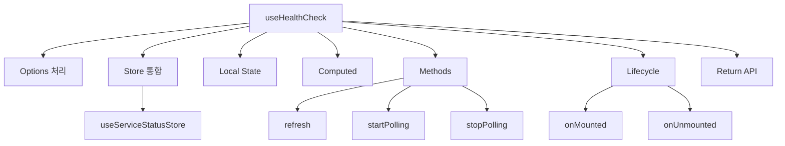

# Composables Pattern

## 학습 목표
- Composable 패턴의 개념과 장점 이해
- 재사용 가능한 로직 추출 방법 학습
- Portal Shell의 useHealthCheck 심층 분석

## 개념 설명

### Composable이란?
Vue 3의 Composition API를 활용한 **로직 재사용 패턴**입니다. 관련 있는 상태(state), 계산된 값(computed), 메서드(methods), 생명주기(lifecycle)를 하나의 함수로 캡슐화합니다.



### Options API vs Composable

#### Options API (Vue 2 스타일)
```vue
<script>
export default {
  data() {
    return {
      count: 0,
      loading: false
    }
  },
  computed: {
    doubled() {
      return this.count * 2
    }
  },
  methods: {
    increment() {
      this.count++
    }
  },
  mounted() {
    this.fetchData()
  }
}
</script>
```

**문제점:**
- 관련 로직이 `data`, `computed`, `methods`, `mounted`에 분산
- 로직 재사용 어려움 (mixins의 한계)
- TypeScript 지원 약함

#### Composable (Vue 3 스타일)
```typescript
// composables/useCounter.ts
export function useCounter(initialValue = 0) {
  const count = ref(initialValue)
  const loading = ref(false)

  const doubled = computed(() => count.value * 2)

  function increment() {
    count.value++
  }

  async function fetchData() {
    loading.value = true
    // ...
    loading.value = false
  }

  onMounted(() => {
    fetchData()
  })

  return {
    count,
    loading,
    doubled,
    increment,
    fetchData
  }
}
```

**장점:**
- 관련 로직이 한 곳에 집중
- 쉬운 재사용
- TypeScript 자동 타입 추론
- 테스트 용이

## Portal Universe 코드 분석

### useHealthCheck Composable

```typescript
// src/composables/useHealthCheck.ts
import { ref, onMounted, onUnmounted, computed } from 'vue';
import { useServiceStatusStore } from '../store/serviceStatus';

export interface UseHealthCheckOptions {
  autoStart?: boolean;
  pollInterval?: number;
}

export function useHealthCheck(options: UseHealthCheckOptions = {}) {
  // ==================== Options ====================
  const { autoStart = true, pollInterval = 10000 } = options;

  // ==================== Store Integration ====================
  const store = useServiceStatusStore();

  // ==================== Local State ====================
  const intervalId = ref<number | null>(null);
  const isLoading = ref(false);

  // ==================== Computed (Store 파생) ====================
  const services = computed(() => store.allServices);
  const healthyServices = computed(() => store.healthyServices);
  const unhealthyServices = computed(() => store.unhealthyServices);
  const overallStatus = computed(() => store.overallStatus);
  const lastChecked = computed(() => store.lastGlobalCheck);
  const isPolling = computed(() => store.isPolling);

  // ==================== Methods ====================

  /**
   * 수동 새로고침
   */
  async function refresh() {
    isLoading.value = true;
    try {
      await store.checkAllServices();
    } finally {
      isLoading.value = false;
    }
  }

  /**
   * 폴링 시작
   */
  function startPolling() {
    if (intervalId.value !== null) return;  // 중복 방지

    store.startPolling();
    refresh();  // 즉시 체크

    // 주기적 체크
    intervalId.value = window.setInterval(() => {
      if (store.isPolling) {
        refresh();
      }
    }, pollInterval);
  }

  /**
   * 폴링 중지
   */
  function stopPolling() {
    store.stopPolling();

    if (intervalId.value !== null) {
      clearInterval(intervalId.value);
      intervalId.value = null;
    }
  }

  /**
   * 폴링 간격 변경
   */
  function setPollInterval(interval: number) {
    store.setPollInterval(interval);

    // 폴링 중이면 재시작
    if (store.isPolling) {
      stopPolling();
      startPolling();
    }
  }

  // ==================== Lifecycle ====================
  onMounted(() => {
    if (autoStart) {
      startPolling();
    }
  });

  onUnmounted(() => {
    stopPolling();  // 메모리 누수 방지
  });

  // ==================== Return ====================
  return {
    // State
    services,
    healthyServices,
    unhealthyServices,
    overallStatus,
    lastChecked,
    isPolling,
    isLoading,

    // Actions
    refresh,
    startPolling,
    stopPolling,
    setPollInterval,
  };
}
```

### 구조 분석



### 사용 예제

```vue
<script setup lang="ts">
import { useHealthCheck } from '@/composables/useHealthCheck'

// ✅ 옵션 없이 사용 (기본값)
const health = useHealthCheck()

// ✅ 커스텀 옵션
const health2 = useHealthCheck({
  autoStart: false,      // 자동 시작 비활성화
  pollInterval: 30000    // 30초마다 체크
})

// ✅ 반응형 데이터 접근
console.log(health.services.value)
console.log(health.overallStatus.value)

// ✅ 메서드 호출
function handleRefresh() {
  health.refresh()
}

function handleTogglePolling() {
  if (health.isPolling.value) {
    health.stopPolling()
  } else {
    health.startPolling()
  }
}
</script>

<template>
  <div>
    <p>Overall: {{ health.overallStatus }}</p>
    <p>Healthy: {{ health.healthyServices.length }}</p>
    <p>Unhealthy: {{ health.unhealthyServices.length }}</p>

    <button @click="handleRefresh" :disabled="health.isLoading">
      Refresh
    </button>

    <button @click="handleTogglePolling">
      {{ health.isPolling ? 'Stop' : 'Start' }} Polling
    </button>
  </div>
</template>
```

## 실습 예제

### 예제 1: useLocalStorage

```typescript
// composables/useLocalStorage.ts
import { ref, watch } from 'vue'

export function useLocalStorage<T>(key: string, defaultValue: T) {
  // ✅ localStorage에서 초기값 로드
  const storedValue = localStorage.getItem(key)
  const data = ref<T>(
    storedValue ? JSON.parse(storedValue) : defaultValue
  )

  // ✅ 데이터 변경 시 자동 저장
  watch(
    data,
    (newValue) => {
      localStorage.setItem(key, JSON.stringify(newValue))
    },
    { deep: true }
  )

  return data
}
```

**사용:**
```vue
<script setup lang="ts">
const theme = useLocalStorage('theme', 'dark')
const settings = useLocalStorage('settings', { fontSize: 14 })

// theme.value 변경 시 자동으로 localStorage 저장됨
theme.value = 'light'
</script>
```

### 예제 2: useFetch

```typescript
// composables/useFetch.ts
import { ref } from 'vue'

export function useFetch<T>(url: string) {
  const data = ref<T | null>(null)
  const error = ref<Error | null>(null)
  const loading = ref(false)

  async function execute() {
    loading.value = true
    error.value = null

    try {
      const response = await fetch(url)
      if (!response.ok) {
        throw new Error(`HTTP error! status: ${response.status}`)
      }
      data.value = await response.json()
    } catch (e) {
      error.value = e as Error
    } finally {
      loading.value = false
    }
  }

  return {
    data,
    error,
    loading,
    execute
  }
}
```

**사용:**
```vue
<script setup lang="ts">
const { data, error, loading, execute } = useFetch('/api/users')

onMounted(() => {
  execute()
})
</script>

<template>
  <div v-if="loading">Loading...</div>
  <div v-else-if="error">Error: {{ error.message }}</div>
  <div v-else>
    <pre>{{ data }}</pre>
  </div>
</template>
```

### 예제 3: useEventListener

```typescript
// composables/useEventListener.ts
import { onMounted, onUnmounted } from 'vue'

export function useEventListener(
  target: EventTarget,
  event: string,
  handler: EventListener
) {
  onMounted(() => {
    target.addEventListener(event, handler)
  })

  onUnmounted(() => {
    target.removeEventListener(event, handler)
  })
}
```

**사용:**
```vue
<script setup lang="ts">
function handleKeydown(e: KeyboardEvent) {
  if (e.key === 'Escape') {
    closeModal()
  }
}

useEventListener(window, 'keydown', handleKeydown)
</script>
```

### 예제 4: useIntersectionObserver

```typescript
// composables/useIntersectionObserver.ts
import { ref, onMounted, onUnmounted } from 'vue'

export function useIntersectionObserver(
  elementRef: Ref<HTMLElement | null>,
  options?: IntersectionObserverInit
) {
  const isIntersecting = ref(false)
  let observer: IntersectionObserver | null = null

  onMounted(() => {
    if (!elementRef.value) return

    observer = new IntersectionObserver(([entry]) => {
      isIntersecting.value = entry.isIntersecting
    }, options)

    observer.observe(elementRef.value)
  })

  onUnmounted(() => {
    if (observer && elementRef.value) {
      observer.unobserve(elementRef.value)
      observer = null
    }
  })

  return { isIntersecting }
}
```

**사용 (Infinite Scroll):**
```vue
<script setup lang="ts">
const sentinel = ref<HTMLElement | null>(null)
const { isIntersecting } = useIntersectionObserver(sentinel)

watch(isIntersecting, (value) => {
  if (value) {
    loadMoreData()
  }
})
</script>

<template>
  <div>
    <div v-for="item in items" :key="item.id">{{ item }}</div>
    <div ref="sentinel" class="h-10"></div>
  </div>
</template>
```

## 핵심 요약

### Composable 패턴 구조
```typescript
export function useXxx(options?) {
  // 1. 옵션 처리
  const { ... } = options

  // 2. 상태 정의
  const state = ref()

  // 3. Computed
  const derived = computed(() => ...)

  // 4. 메서드
  function method() { ... }

  // 5. Lifecycle
  onMounted(() => { ... })
  onUnmounted(() => { ... })

  // 6. Return
  return {
    state,
    derived,
    method
  }
}
```

### 명명 규칙
1. **`use` 접두사**: `useCounter`, `useFetch`, `useAuth`
2. **명확한 이름**: 무엇을 하는지 직관적으로
3. **TypeScript 타입**: 옵션과 반환 타입 명시

### Best Practices

#### ✅ DO
```typescript
// 관련 로직을 하나로 그룹화
export function useAuth() {
  const user = ref(null)
  const login = () => { ... }
  const logout = () => { ... }
  return { user, login, logout }
}

// 옵션 제공
export function useFetch(url: string, options?: FetchOptions) {
  // ...
}

// Cleanup 처리
onUnmounted(() => {
  clearInterval(intervalId.value)
})
```

#### ❌ DON'T
```typescript
// ❌ 너무 많은 책임
export function useEverything() {
  // 인증, 테마, API, 라우팅...
}

// ❌ Cleanup 누락
function startPolling() {
  setInterval(() => { ... }, 1000)
  // ❌ onUnmounted에서 clearInterval 호출 안 함
}

// ❌ 타입 없음
export function useFetch(url) {  // any 타입
  // ...
}
```

### Portal Shell Composables
```
useHealthCheck.ts → 서비스 상태 모니터링
(향후 추가 가능)
useDebouncedRef.ts → 입력 디바운싱
useClipboard.ts → 클립보드 복사
useTitle.ts → 페이지 타이틀 관리
```

## 관련 문서
- [Composition API Deep Dive](./composition-api-deep-dive.md)
- [Pinia State Management](./pinia-state-management.md)
- [Reactivity Deep Dive](./reactivity-deep-dive.md)
