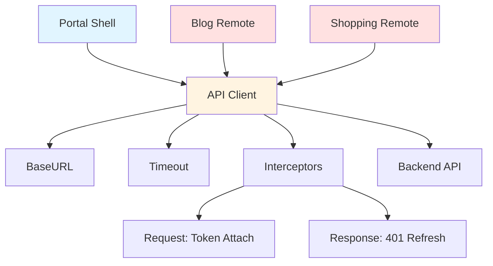

# API Client Sharing

## 학습 목표
- Module Federation에서 API Client 공유 방법 이해
- Axios Interceptor 패턴 학습
- Host-Remote 간 HTTP 통신 전략 파악

## 개념 설명

### API Client Sharing이란?
Host 앱에서 설정한 **Axios 인스턴스**를 Remote 앱이 공유하여, 중복 설정 없이 일관된 API 호출을 수행하는 패턴입니다.



### 공유 이점

| 이점 | 설명 |
|------|------|
| **일관성** | 모든 Remote가 동일한 설정 사용 |
| **중복 제거** | Interceptor 로직 한 곳에서 관리 |
| **토큰 관리** | 자동 토큰 첨부 및 갱신 |
| **에러 처리** | 통합 에러 핸들링 |

## Portal Universe 코드 분석

### 1. API Client 정의

```typescript
// src/api/apiClient.ts
import axios, { AxiosError } from 'axios';
import type { InternalAxiosRequestConfig } from 'axios';
import { authService } from '../services/authService';
import type { ApiErrorResponse } from './types';

// ✅ Axios 인스턴스 생성
const apiClient = axios.create({
  baseURL: import.meta.env.VITE_API_BASE_URL,  // http://localhost:8080
  timeout: 10000,
  headers: {
    'Content-Type': 'application/json',
  },
});

// ============================================
// Request Interceptor
// ============================================

/**
 * Request Interceptor
 * - Automatically attach access token to requests
 * - Auto-refresh token if expired
 */
apiClient.interceptors.request.use(
  async (config: InternalAxiosRequestConfig) => {
    try {
      // ✅ 토큰 만료 시 자동 갱신
      await authService.autoRefreshIfNeeded();
    } catch (error) {
      console.warn('[API Client] Auto-refresh failed:', error);
      // Continue with the request even if refresh fails
    }

    // ✅ Access Token 자동 첨부
    const token = authService.getAccessToken();
    if (token) {
      config.headers.Authorization = `Bearer ${token}`;
    }

    return config;
  },
  (error) => {
    console.error('[API Client] Request interceptor error:', error);
    return Promise.reject(error);
  }
);

// ============================================
// Response Interceptor
// ============================================

/**
 * Response Interceptor
 * - Handle 401 Unauthorized errors
 * - Attempt token refresh and retry request
 */
apiClient.interceptors.response.use(
  (response) => response,
  async (error: AxiosError) => {
    const originalRequest = error.config as InternalAxiosRequestConfig & { _retry?: boolean };

    // ✅ 401 Unauthorized 처리
    if (error.response?.status === 401 && !originalRequest._retry) {
      originalRequest._retry = true;

      try {
        console.log('[API Client] 401 detected, attempting token refresh...');

        // ✅ 토큰 갱신
        const newToken = await authService.refresh();

        // ✅ 요청 헤더 업데이트
        originalRequest.headers.Authorization = `Bearer ${newToken}`;

        // ✅ 원래 요청 재시도
        return apiClient.request(originalRequest);

      } catch (refreshError) {
        console.error('[API Client] Token refresh failed:', refreshError);

        // ✅ 토큰 정리 및 리다이렉트
        authService.clearTokens();

        if (typeof window !== 'undefined') {
          window.location.href = '/?login=required';
        }

        return Promise.reject(refreshError);
      }
    }

    // ✅ Backend 에러 메시지 파싱
    const backendError = (error.response?.data as ApiErrorResponse | undefined)?.error;
    if (backendError) {
      error.message = backendError.message;
      (error as any).code = backendError.code;
      (error as any).errorDetails = backendError;
    }

    console.error('[API Client] Response error:', {
      status: error.response?.status,
      code: backendError?.code,
      message: backendError?.message || error.message,
    });

    return Promise.reject(error);
  }
);

export default apiClient;
```

**핵심 포인트:**
- **Request Interceptor**: 토큰 자동 첨부 및 갱신
- **Response Interceptor**: 401 에러 시 토큰 갱신 후 재시도
- **에러 파싱**: Backend ApiResponse 형식 파싱

### 2. API Types

```typescript
// src/api/types.ts
export interface ApiErrorResponse {
  error: {
    code: string
    message: string
    details?: any
  }
}

export interface ApiSuccessResponse<T = any> {
  data: T
  message?: string
}
```

### 3. API Export

```typescript
// src/api/index.ts
export { default as apiClient } from './apiClient'
export * from './types'
export * from './utils'
```

### 4. Module Federation Expose

```typescript
// vite.config.ts
export default defineConfig({
  plugins: [
    federation({
      name: 'portal',
      exposes: {
        './api': './src/api/index.ts',      // ✅ API Client 노출
        './stores': './src/store/index.ts'
      },
      shared: ['vue', 'pinia', 'axios'],    // ✅ axios 싱글톤
    })
  ]
})
```

## Remote에서 사용하기

### 1. Vue Remote (Blog)

```vue
<script setup lang="ts">
import { ref, onMounted } from 'vue'
import { apiClient } from 'portal/api'

interface Post {
  id: number
  title: string
  content: string
}

const posts = ref<Post[]>([])
const loading = ref(false)
const error = ref<Error | null>(null)

async function fetchPosts() {
  loading.value = true
  error.value = null

  try {
    // ✅ Portal의 API Client 사용
    const response = await apiClient.get('/api/v1/posts')
    posts.value = response.data.data
  } catch (e) {
    error.value = e as Error
    console.error('Failed to fetch posts:', e)
  } finally {
    loading.value = false
  }
}

onMounted(() => {
  fetchPosts()
})
</script>

<template>
  <div>
    <div v-if="loading">Loading...</div>
    <div v-else-if="error">Error: {{ error.message }}</div>
    <div v-else>
      <article v-for="post in posts" :key="post.id">
        <h2>{{ post.title }}</h2>
        <p>{{ post.content }}</p>
      </article>
    </div>
  </div>
</template>
```

### 2. React Remote (Shopping)

```typescript
// hooks/useProducts.ts
import { useState, useEffect } from 'react'
import { apiClient } from 'portal/api'

interface Product {
  id: number
  name: string
  price: number
}

export function useProducts() {
  const [products, setProducts] = useState<Product[]>([])
  const [loading, setLoading] = useState(false)
  const [error, setError] = useState<Error | null>(null)

  useEffect(() => {
    async function fetchProducts() {
      setLoading(true)
      setError(null)

      try {
        // ✅ Portal의 API Client 사용
        const response = await apiClient.get('/api/v1/products')
        setProducts(response.data.data)
      } catch (e) {
        setError(e as Error)
        console.error('Failed to fetch products:', e)
      } finally {
        setLoading(false)
      }
    }

    fetchProducts()
  }, [])

  return { products, loading, error }
}
```

```tsx
// components/ProductList.tsx
import { useProducts } from '../hooks/useProducts'

export function ProductList() {
  const { products, loading, error } = useProducts()

  if (loading) return <div>Loading...</div>
  if (error) return <div>Error: {error.message}</div>

  return (
    <div className="grid grid-cols-3 gap-4">
      {products.map(product => (
        <div key={product.id} className="border p-4 rounded">
          <h3>{product.name}</h3>
          <p>${product.price}</p>
        </div>
      ))}
    </div>
  )
}
```

## 실습 예제

### 예제 1: API Service Layer (Vue)

```typescript
// services/postService.ts (Blog Remote)
import { apiClient } from 'portal/api'

interface Post {
  id: number
  title: string
  content: string
  authorId: string
  createdAt: string
}

interface CreatePostDto {
  title: string
  content: string
}

export const postService = {
  async list(): Promise<Post[]> {
    const response = await apiClient.get('/api/v1/posts')
    return response.data.data
  },

  async get(id: number): Promise<Post> {
    const response = await apiClient.get(`/api/v1/posts/${id}`)
    return response.data.data
  },

  async create(dto: CreatePostDto): Promise<Post> {
    const response = await apiClient.post('/api/v1/posts', dto)
    return response.data.data
  },

  async update(id: number, dto: Partial<CreatePostDto>): Promise<Post> {
    const response = await apiClient.put(`/api/v1/posts/${id}`, dto)
    return response.data.data
  },

  async delete(id: number): Promise<void> {
    await apiClient.delete(`/api/v1/posts/${id}`)
  }
}
```

### 예제 2: API Service Layer (React)

```typescript
// services/productService.ts (Shopping Remote)
import { apiClient } from 'portal/api'

interface Product {
  id: number
  name: string
  description: string
  price: number
  stock: number
}

export const productService = {
  async list(params?: { category?: string, page?: number }): Promise<Product[]> {
    const response = await apiClient.get('/api/v1/products', { params })
    return response.data.data
  },

  async get(id: number): Promise<Product> {
    const response = await apiClient.get(`/api/v1/products/${id}`)
    return response.data.data
  },

  async search(query: string): Promise<Product[]> {
    const response = await apiClient.get('/api/v1/products/search', {
      params: { q: query }
    })
    return response.data.data
  }
}
```

### 예제 3: Custom Hook with Error Handling (React)

```typescript
// hooks/useApi.ts
import { useState, useEffect } from 'react'
import { AxiosError } from 'axios'

export function useApi<T>(fetcher: () => Promise<T>) {
  const [data, setData] = useState<T | null>(null)
  const [loading, setLoading] = useState(true)
  const [error, setError] = useState<string | null>(null)

  useEffect(() => {
    async function fetch() {
      setLoading(true)
      setError(null)

      try {
        const result = await fetcher()
        setData(result)
      } catch (e) {
        const axiosError = e as AxiosError<{ error: { message: string } }>
        setError(axiosError.response?.data?.error?.message || 'Unknown error')
      } finally {
        setLoading(false)
      }
    }

    fetch()
  }, [])

  return { data, loading, error }
}
```

**사용:**
```tsx
function ProductDetail({ id }: { id: number }) {
  const { data: product, loading, error } = useApi(() =>
    productService.get(id)
  )

  if (loading) return <Spinner />
  if (error) return <ErrorMessage message={error} />
  if (!product) return <NotFound />

  return <ProductCard product={product} />
}
```

### 예제 4: Mutation Hook (React)

```typescript
// hooks/useMutation.ts
import { useState } from 'react'
import { AxiosError } from 'axios'

export function useMutation<TData, TVariables>(
  mutationFn: (variables: TVariables) => Promise<TData>
) {
  const [loading, setLoading] = useState(false)
  const [error, setError] = useState<string | null>(null)

  async function mutate(variables: TVariables): Promise<TData | null> {
    setLoading(true)
    setError(null)

    try {
      const result = await mutationFn(variables)
      return result
    } catch (e) {
      const axiosError = e as AxiosError<{ error: { message: string } }>
      setError(axiosError.response?.data?.error?.message || 'Mutation failed')
      return null
    } finally {
      setLoading(false)
    }
  }

  return { mutate, loading, error }
}
```

**사용:**
```tsx
function CreateProduct() {
  const { mutate, loading, error } = useMutation(productService.create)

  async function handleSubmit(formData: CreateProductDto) {
    const product = await mutate(formData)
    if (product) {
      alert('Product created!')
      // Navigate or refetch
    }
  }

  return (
    <form onSubmit={handleSubmit}>
      {/* Form fields */}
      {error && <div className="error">{error}</div>}
      <button type="submit" disabled={loading}>
        {loading ? 'Creating...' : 'Create'}
      </button>
    </form>
  )
}
```

## 핵심 요약

### API Client 구조
```
apiClient (Axios Instance)
├── BaseURL: /api
├── Timeout: 10000ms
├── Request Interceptor: Token Attach
└── Response Interceptor: 401 Handling
```

### Interceptor 흐름
```
Request → [Interceptor] → Add Token → Backend
Response ← [Interceptor] ← 401? Refresh Token
```

### 공유 전략
```
Host: apiClient 생성 및 Expose
Remote: import { apiClient } from 'portal/api'
```

### Best Practices

#### ✅ DO
```typescript
// Service Layer 분리
export const postService = {
  list: () => apiClient.get('/posts'),
  get: (id) => apiClient.get(`/posts/${id}`)
}

// Error Handling
try {
  await apiClient.get('/data')
} catch (error) {
  console.error(error)
}

// TypeScript 타입
interface ApiResponse<T> {
  data: T
}
```

#### ❌ DON'T
```typescript
// ❌ Remote에서 새 Axios 인스턴스 생성
const myAxios = axios.create({ baseURL: '/api' })

// ❌ 토큰 수동 첨부 (Interceptor가 자동 처리)
axios.get('/data', {
  headers: { Authorization: `Bearer ${token}` }
})

// ❌ 에러 무시
await apiClient.get('/data').catch(() => {})
```

### API Client 체크리스트
- [ ] Axios 인스턴스 싱글톤 (shared)
- [ ] Request Interceptor: 토큰 자동 첨부
- [ ] Response Interceptor: 401 자동 처리
- [ ] Backend ApiResponse 형식 파싱
- [ ] Service Layer 분리 (비즈니스 로직)
- [ ] TypeScript 타입 정의

## 관련 문서
- [Shell Architecture](./shell-architecture.md)
- [Shared State](./shared-state.md)
- [Auth Integration](./auth-integration.md)
- [Error Boundary MFE](./error-boundary-mfe.md)
