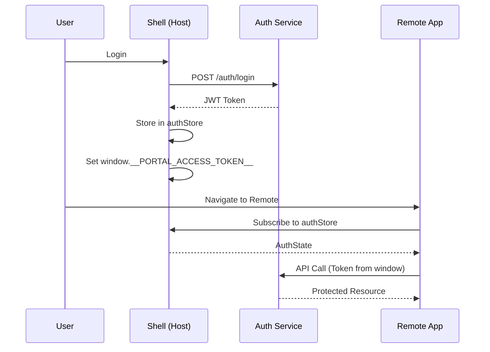

# Auth Integration

## 학습 목표
- Module Federation 환경에서의 인증 통합 이해
- JWT 기반 인증 흐름 파악
- OAuth2 소셜 로그인 패턴 학습

## 개념 설명

### Auth Integration이란?
Host 앱에서 인증을 중앙 관리하고, Remote 앱이 인증 상태를 공유하여 사용자 경험을 일관되게 유지하는 패턴입니다.



### 인증 전략

| 방식 | 장점 | 단점 | 사용 시점 |
|------|------|------|----------|
| **JWT** | Stateless, 확장성 | 갱신 복잡도 | API 인증 |
| **OAuth2** | 소셜 로그인 간편 | 설정 복잡 | 외부 인증 |
| **Session** | 간단, 보안 | 서버 상태 관리 | 전통적 웹 |

## Portal Universe 코드 분석

### 1. Auth Service

```typescript
// src/services/authService.ts
import apiClient from '../api/apiClient';
import { decodeJWT } from '../utils/jwt';

export interface UserInfo {
  uuid: string
  email: string
  username: string
  name: string
  nickname?: string
  picture?: string
  roles: string[]
  scopes: string[]
}

export interface LoginResponse {
  accessToken: string
  refreshToken: string
}

class AuthService {
  private readonly ACCESS_TOKEN_KEY = 'portal_access_token';
  private readonly REFRESH_TOKEN_KEY = 'portal_refresh_token';

  // ============================================
  // Login
  // ============================================

  /**
   * Login with email and password
   */
  async login(email: string, password: string): Promise<LoginResponse> {
    const response = await apiClient.post('/auth-service/api/v1/auth/login', {
      email,
      password
    });

    const { accessToken, refreshToken } = response.data.data;

    // ✅ 토큰 저장
    this.setAccessToken(accessToken);
    this.setRefreshToken(refreshToken);

    return { accessToken, refreshToken };
  }

  /**
   * Social login (redirect)
   */
  socialLogin(provider: 'google' | 'naver' | 'kakao'): void {
    const redirectUri = `${window.location.origin}/oauth2/callback`;
    const authUrl = `/auth-service/oauth2/authorize/${provider}?redirect_uri=${redirectUri}`;
    window.location.href = authUrl;
  }

  // ============================================
  // Logout
  // ============================================

  async logout(): Promise<void> {
    try {
      await apiClient.post('/auth-service/api/v1/auth/logout');
    } finally {
      this.clearTokens();
    }
  }

  // ============================================
  // Token Management
  // ============================================

  getAccessToken(): string | null {
    return localStorage.getItem(this.ACCESS_TOKEN_KEY);
  }

  setAccessToken(token: string): void {
    localStorage.setItem(this.ACCESS_TOKEN_KEY, token);
    window.__PORTAL_ACCESS_TOKEN__ = token;  // ✅ Global 설정
  }

  getRefreshToken(): string | null {
    return localStorage.getItem(this.REFRESH_TOKEN_KEY);
  }

  setRefreshToken(token: string): void {
    localStorage.setItem(this.REFRESH_TOKEN_KEY, token);
  }

  clearTokens(): void {
    localStorage.removeItem(this.ACCESS_TOKEN_KEY);
    localStorage.removeItem(this.REFRESH_TOKEN_KEY);
    delete window.__PORTAL_ACCESS_TOKEN__;
  }

  // ============================================
  // JWT Parsing
  // ============================================

  getUserInfo(): UserInfo | null {
    const token = this.getAccessToken();
    if (!token) return null;

    try {
      const payload = decodeJWT(token);
      return {
        uuid: payload.sub,
        email: payload.email,
        username: payload.username,
        name: payload.name,
        nickname: payload.nickname,
        picture: payload.picture,
        roles: payload.roles || [],
        scopes: payload.scopes || []
      };
    } catch (error) {
      console.error('Failed to decode JWT:', error);
      return null;
    }
  }

  isAuthenticated(): boolean {
    const token = this.getAccessToken();
    if (!token) return false;

    try {
      const payload = decodeJWT(token);
      const now = Math.floor(Date.now() / 1000);
      return payload.exp > now;  // 만료 확인
    } catch {
      return false;
    }
  }

  // ============================================
  // Token Refresh
  // ============================================

  async refresh(): Promise<string> {
    const refreshToken = this.getRefreshToken();
    if (!refreshToken) {
      throw new Error('No refresh token available');
    }

    const response = await apiClient.post('/auth-service/api/v1/auth/refresh', {
      refreshToken
    });

    const { accessToken } = response.data.data;

    this.setAccessToken(accessToken);

    return accessToken;
  }

  /**
   * 토큰 만료 시 자동 갱신
   */
  async autoRefreshIfNeeded(): Promise<void> {
    const token = this.getAccessToken();
    if (!token) return;

    try {
      const payload = decodeJWT(token);
      const now = Math.floor(Date.now() / 1000);
      const timeUntilExpiry = payload.exp - now;

      // ✅ 5분 이내 만료 시 갱신
      if (timeUntilExpiry < 300) {
        console.log('[Auth Service] Token expiring soon, refreshing...');
        await this.refresh();
      }
    } catch (error) {
      console.error('[Auth Service] Auto-refresh failed:', error);
    }
  }
}

export const authService = new AuthService();
```

**핵심 포인트:**
- **JWT Decode**: 토큰에서 사용자 정보 추출
- **Auto Refresh**: 만료 5분 전 자동 갱신
- **Global Token**: `window.__PORTAL_ACCESS_TOKEN__`
- **Social Login**: OAuth2 Provider 리다이렉트

### 2. Auth Store

```typescript
// src/store/auth.ts (핵심 부분만)
export const useAuthStore = defineStore('auth', () => {
  const user = ref<PortalUser | null>(null);
  const loading = ref(false);

  const isAuthenticated = computed(() => user.value !== null);
  const displayName = computed(() => {
    if (!user.value) return 'Guest';
    const p = user.value.profile;
    return p.nickname || p.username || p.name || p.email;
  });
  const isAdmin = computed(() => hasRole('ROLE_ADMIN'));

  // ✅ Login
  async function login(email: string, password: string): Promise<void> {
    loading.value = true;
    try {
      const response = await authService.login(email, password);
      const userInfo = authService.getUserInfo();
      if (userInfo) {
        setUserFromInfo(userInfo, response.accessToken);
      }
    } finally {
      loading.value = false;
    }
  }

  // ✅ Logout
  async function logout(): Promise<void> {
    loading.value = true;
    try {
      await authService.logout();
      user.value = null;
      delete window.__PORTAL_ACCESS_TOKEN__;
    } finally {
      loading.value = false;
    }
  }

  // ✅ Check Auth (on app init)
  async function checkAuth(): Promise<void> {
    try {
      await authService.autoRefreshIfNeeded();
      const userInfo = authService.getUserInfo();
      if (userInfo && authService.isAuthenticated()) {
        const accessToken = authService.getAccessToken();
        if (accessToken) {
          setUserFromInfo(userInfo, accessToken);
        }
      }
    } catch (error) {
      user.value = null;
      authService.clearTokens();
    }
  }

  return {
    user,
    loading,
    isAuthenticated,
    displayName,
    isAdmin,
    login,
    logout,
    checkAuth
  };
});
```

### 3. OAuth2 Callback 처리

```vue
<script setup lang="ts">
// src/views/OAuth2Callback.vue
import { onMounted, ref } from 'vue'
import { useRouter } from 'vue-router'
import { useAuthStore } from '@/store/auth'
import { authService } from '@/services/authService'

const router = useRouter()
const authStore = useAuthStore()
const error = ref<string | null>(null)

onMounted(async () => {
  try {
    // ✅ URL에서 토큰 추출
    const params = new URLSearchParams(window.location.search)
    const accessToken = params.get('accessToken')
    const refreshToken = params.get('refreshToken')

    if (!accessToken || !refreshToken) {
      throw new Error('Missing tokens in callback')
    }

    // ✅ 토큰 저장
    authService.setAccessToken(accessToken)
    authService.setRefreshToken(refreshToken)

    // ✅ 사용자 정보 추출 및 Store 업데이트
    const userInfo = authService.getUserInfo()
    if (userInfo) {
      authStore.setUser(userInfo)
    }

    // ✅ 홈으로 리다이렉트
    router.push('/')
  } catch (e) {
    error.value = (e as Error).message
  }
})
</script>

<template>
  <div class="callback-page">
    <div v-if="error" class="error">
      <h2>Authentication Failed</h2>
      <p>{{ error }}</p>
      <button @click="$router.push('/')">Go Home</button>
    </div>
    <div v-else class="loading">
      <div class="spinner"></div>
      <p>Completing authentication...</p>
    </div>
  </div>
</template>
```

### 4. JWT Utility

```typescript
// src/utils/jwt.ts
import { base64UrlDecode } from './base64';

export interface JWTPayload {
  sub: string       // User UUID
  email: string
  username: string
  name: string
  nickname?: string
  picture?: string
  roles: string[]
  scopes: string[]
  iat: number       // Issued At
  exp: number       // Expiration Time
}

/**
 * Decode JWT token (without verification)
 * ⚠️ Do NOT use for security validation (backend only)
 */
export function decodeJWT(token: string): JWTPayload {
  try {
    const parts = token.split('.');
    if (parts.length !== 3) {
      throw new Error('Invalid JWT format');
    }

    const payload = base64UrlDecode(parts[1]);
    return JSON.parse(payload);
  } catch (error) {
    throw new Error('Failed to decode JWT');
  }
}
```

## Remote에서 인증 사용하기

### 1. Vue Remote (Blog)

```vue
<script setup lang="ts">
import { useAuthStore } from 'portal/stores'
import { storeToRefs } from 'pinia'

const authStore = useAuthStore()
const { user, isAuthenticated, displayName } = storeToRefs(authStore)

function handleLogout() {
  authStore.logout()
}
</script>

<template>
  <div class="user-info">
    <div v-if="isAuthenticated">
      <span>Welcome, {{ displayName }}</span>
      <button @click="handleLogout">Logout</button>
    </div>
    <div v-else>
      <button @click="$router.push('/')">Login</button>
    </div>
  </div>
</template>
```

### 2. React Remote (Shopping)

```typescript
// hooks/useAuth.ts
import { useEffect, useState } from 'react'
import { authAdapter, type AuthState } from 'portal/stores'

export function useAuth() {
  const [state, setState] = useState<AuthState>(() =>
    authAdapter.getState()
  )

  useEffect(() => {
    const unsubscribe = authAdapter.subscribe(setState)
    return () => unsubscribe()
  }, [])

  return {
    ...state,
    logout: authAdapter.logout,
    hasRole: authAdapter.hasRole
  }
}
```

```tsx
// components/UserMenu.tsx
import { useAuth } from '../hooks/useAuth'

export function UserMenu() {
  const auth = useAuth()

  if (!auth.isAuthenticated) {
    return <button onClick={() => window.location.href = '/'}>Login</button>
  }

  return (
    <div className="user-menu">
      <span>Hello, {auth.displayName}</span>
      <button onClick={auth.logout}>Logout</button>
    </div>
  )
}
```

## 실습 예제

### 예제 1: Protected Route Guard (Vue)

```typescript
// router/index.ts
import { useAuthStore } from '@/store/auth'

router.beforeEach((to, from, next) => {
  const authStore = useAuthStore()

  // ✅ 인증 필요한 라우트
  if (to.meta.requiresAuth && !authStore.isAuthenticated) {
    next({
      path: '/',
      query: { redirect: to.fullPath }
    })
    return
  }

  // ✅ 관리자 권한 필요
  if (to.meta.requiresAdmin && !authStore.isAdmin) {
    next('/forbidden')
    return
  }

  next()
})
```

### 예제 2: Protected Route (React)

```tsx
// components/ProtectedRoute.tsx
import { ReactNode } from 'react'
import { Navigate } from 'react-router-dom'
import { useAuth } from '../hooks/useAuth'

interface Props {
  children: ReactNode
  requireAdmin?: boolean
}

export function ProtectedRoute({ children, requireAdmin }: Props) {
  const auth = useAuth()

  if (!auth.isAuthenticated) {
    return <Navigate to="/?login=required" />
  }

  if (requireAdmin && !auth.isAdmin) {
    return <Navigate to="/forbidden" />
  }

  return <>{children}</>
}
```

**사용:**
```tsx
<Routes>
  <Route path="/profile" element={
    <ProtectedRoute>
      <ProfilePage />
    </ProtectedRoute>
  } />

  <Route path="/admin" element={
    <ProtectedRoute requireAdmin>
      <AdminPage />
    </ProtectedRoute>
  } />
</Routes>
```

### 예제 3: Role-based Component

```vue
<script setup lang="ts">
import { useAuthStore } from 'portal/stores'

const authStore = useAuthStore()

const canEdit = computed(() => authStore.hasRole('ROLE_EDITOR'))
const canDelete = computed(() => authStore.hasRole('ROLE_ADMIN'))
</script>

<template>
  <div class="post-actions">
    <button v-if="canEdit">Edit</button>
    <button v-if="canDelete" class="danger">Delete</button>
  </div>
</template>
```

## 핵심 요약

### 인증 흐름
```
1. User Login → Auth Service
2. Store JWT in localStorage + window
3. API Client auto-attach token
4. Remote subscribes to authStore
5. Token refresh on 401 or expiry
```

### JWT 구조
```json
{
  "header": { "alg": "HS256", "typ": "JWT" },
  "payload": {
    "sub": "user-uuid",
    "email": "user@example.com",
    "roles": ["ROLE_USER"],
    "exp": 1234567890
  },
  "signature": "..."
}
```

### Token Storage

| 위치 | 사용처 | 특징 |
|------|--------|------|
| **localStorage** | authService | 영속성, XSS 취약 |
| **window.__PORTAL_ACCESS_TOKEN__** | Remote 앱 | 공유 간편, XSS 취약 |
| **HTTP-Only Cookie** | 안전하지만 CORS 복잡 | 권장 (향후) |

### Best Practices

#### ✅ DO
```typescript
// Auto-refresh before expiry
await authService.autoRefreshIfNeeded()

// Centralized auth in Host
const authStore = useAuthStore() // Host
const auth = useAuth() // Remote (via adapter)

// Protected routes
if (requiresAuth && !isAuthenticated) {
  redirect('/login')
}
```

#### ❌ DON'T
```typescript
// ❌ Remote에서 독립적인 인증 관리
const [user, setUser] = useState(null) // Remote
// → Host authStore 사용

// ❌ 토큰을 props로 전달
<RemoteApp token={token} />
// → Global variable 또는 Store 사용

// ❌ 만료된 토큰 사용
if (isExpired(token)) {
  // ❌ 수동 처리
}
// → Auto-refresh 사용
```

### 보안 체크리스트
- [ ] JWT 토큰 localStorage 저장 (XSS 주의)
- [ ] HTTPS 필수 (Token 노출 방지)
- [ ] Token 만료 시간 설정 (15분 권장)
- [ ] Refresh Token 사용 (7일 권장)
- [ ] CORS 설정 (Backend)
- [ ] XSS 방지 (Content Security Policy)

## 관련 문서
- [Shell Architecture](./shell-architecture.md)
- [Shared State](./shared-state.md)
- [API Client Sharing](./api-client-sharing.md)
- [Pinia State Management](../vue/pinia-state-management.md)
