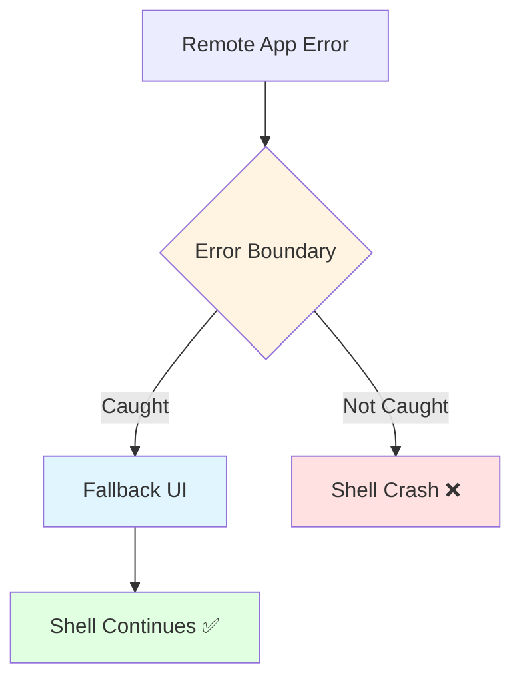

# Error Boundary for Module Federation

## 학습 목표
- Module Federation 환경의 에러 처리 전략 이해
- Remote 앱 로드 실패 처리 방법 학습
- Shell 보호 및 Graceful Degradation 구현

## 개념 설명

### Error Boundary란?
Remote 앱의 에러가 Host 앱(Shell)으로 전파되는 것을 방지하고, 사용자에게 Fallback UI를 제공하는 패턴입니다.



### MFE 에러 유형

| 에러 유형 | 발생 시점 | 예시 |
|----------|----------|------|
| **Load Failure** | Remote 로드 시 | Network error, 404 |
| **Runtime Error** | Remote 실행 중 | JS error, null reference |
| **Version Mismatch** | Shared 의존성 충돌 | Vue 버전 불일치 |
| **Timeout** | 로딩 시간 초과 | Slow network |

## Portal Universe 코드 분석

### 1. Global Error Handler

```typescript
// src/main.ts
import { type ComponentPublicInstance, createApp } from 'vue'

const app = createApp(AppVue);

// ✅ Global error handler (protect portal-shell)
app.config.errorHandler = (
  err: unknown,
  instance: ComponentPublicInstance | null,
  info: string
) => {
  console.error('❌ Global error caught:', err);
  console.error('   Error info:', info);

  if (instance) {
    console.error('   Component:', instance.$options.name);
    console.error('   Props:', instance.$props);
  }

  // ✅ 에러를 상위로 전파하지 않음
  // Remote 앱에서 에러가 발생해도 Shell은 계속 동작
};

// ✅ Promise rejection handler
window.addEventListener('unhandledrejection', (event) => {
  console.error('❌ Unhandled promise rejection:', event.reason);
  event.preventDefault();  // 기본 에러 표시 방지
});

app.mount('#app');
```

**핵심 포인트:**
- **Global errorHandler**: 모든 Vue 컴포넌트 에러 캐치
- **Shell 보호**: Remote 에러가 Shell 크래시 방지
- **Promise rejection**: 비동기 에러 처리

### 2. Router Error Handler

```typescript
// src/router/index.ts
const router = createRouter({
  history: createWebHistory(),
  routes,
});

// ✅ Router Error Handler
router.onError((error) => {
  console.error('❌ Router error:', error);

  // ✅ Module Federation 로드 실패 감지
  if (error.message.includes('Failed to fetch dynamically imported module')) {
    console.error('   Remote module load failed');
    // 사용자에게 알림 또는 fallback 페이지 표시
  }

  // Portal Shell은 계속 동작
});

export default router;
```

### 3. RemoteWrapper - defineAsyncComponent Error Handling

```vue
<script setup lang="ts">
import { defineAsyncComponent, ref } from 'vue'
import type { RemoteConfig } from '@/config/remoteRegistry'

const props = defineProps<{
  config: RemoteConfig
  initialPath: string
}>()

const error = ref<Error | null>(null)
const retryCount = ref(0)

// ✅ Async Component with Error Handling
const RemoteApp = defineAsyncComponent({
  loader: () => import(/* @vite-ignore */ `${props.config.key}/bootstrap`),

  // ✅ Error Handler
  onError(err, retry, fail, attempts) {
    console.error(`❌ Failed to load remote: ${props.config.key}`, err)

    // ✅ 최대 3번 재시도
    if (attempts <= 3) {
      console.log(`🔄 Retry attempt ${attempts}`)
      setTimeout(() => retry(), 1000 * attempts)  // 점진적 지연
    } else {
      console.error('❌ Max retry attempts reached')
      fail()
      error.value = err as Error
    }
  }
})

function handleRetry() {
  error.value = null
  retryCount.value++
}

function goHome() {
  window.location.href = '/'
}
</script>

<template>
  <div class="remote-wrapper">
    <!-- ✅ Error State -->
    <div v-if="error" class="error-state">
      <div class="error-icon">⚠️</div>
      <h2 class="error-title">Failed to load {{ config.displayName }}</h2>
      <p class="error-message">{{ error.message }}</p>

      <details class="error-details">
        <summary>Technical Details</summary>
        <pre>{{ error.stack }}</pre>
        <pre>Remote: {{ config.key }}</pre>
        <pre>URL: {{ config.remoteUrl }}</pre>
      </details>

      <div class="error-actions">
        <button @click="handleRetry" class="btn-primary">
          Retry ({{ retryCount }})
        </button>
        <button @click="goHome" class="btn-secondary">
          Go Home
        </button>
      </div>
    </div>

    <!-- ✅ Suspense with Loading -->
    <Suspense v-else>
      <template #default>
        <RemoteApp
          :initial-path="initialPath"
          :key="retryCount"
        />
      </template>

      <template #fallback>
        <div class="loading-state">
          <div class="spinner"></div>
          <p>Loading {{ config.displayName }}...</p>
        </div>
      </template>
    </Suspense>
  </div>
</template>

<style scoped>
.error-state {
  display: flex;
  flex-direction: column;
  align-items: center;
  justify-content: center;
  min-height: 400px;
  padding: 2rem;
  background: var(--bg-card);
  border: 1px solid var(--border-default);
  border-radius: 8px;
}

.error-icon {
  font-size: 4rem;
  margin-bottom: 1rem;
}

.error-title {
  font-size: 1.5rem;
  font-weight: bold;
  color: #DC2626;
  margin-bottom: 0.5rem;
}

.error-message {
  color: var(--text-meta);
  margin-bottom: 1rem;
  text-align: center;
}

.error-details {
  width: 100%;
  max-width: 600px;
  margin: 1rem 0;
  padding: 1rem;
  background: var(--bg-page);
  border-radius: 4px;
}

.error-details pre {
  overflow-x: auto;
  font-size: 0.875rem;
  color: var(--text-body);
  margin: 0.5rem 0;
}

.error-actions {
  display: flex;
  gap: 1rem;
  margin-top: 1rem;
}

.btn-primary {
  padding: 0.75rem 1.5rem;
  background: var(--brand-primary);
  color: white;
  border: none;
  border-radius: 6px;
  font-weight: 500;
  cursor: pointer;
}

.btn-primary:hover {
  opacity: 0.9;
}

.btn-secondary {
  padding: 0.75rem 1.5rem;
  background: var(--bg-page);
  color: var(--text-body);
  border: 1px solid var(--border-default);
  border-radius: 6px;
  font-weight: 500;
  cursor: pointer;
}

.btn-secondary:hover {
  background: var(--bg-card);
}

.loading-state {
  display: flex;
  flex-direction: column;
  align-items: center;
  justify-content: center;
  min-height: 400px;
  padding: 2rem;
}

.spinner {
  width: 40px;
  height: 40px;
  border: 4px solid var(--border-default);
  border-top-color: var(--brand-primary);
  border-radius: 50%;
  animation: spin 0.8s linear infinite;
}

@keyframes spin {
  to { transform: rotate(360deg); }
}
</style>
```

**핵심 포인트:**
- **defineAsyncComponent onError**: Load 실패 감지
- **Retry Logic**: 최대 3번 재시도 (점진적 지연)
- **Fallback UI**: 에러 발생 시 대체 UI
- **Technical Details**: 디버깅 정보 제공

## 실습 예제

### 예제 1: ErrorBoundary Component (Vue)

```vue
<script setup lang="ts">
import { ref, onErrorCaptured } from 'vue'

const props = withDefaults(
  defineProps<{
    fallback?: boolean
    onError?: (error: Error, info: string) => void
  }>(),
  {
    fallback: true
  }
)

const error = ref<Error | null>(null)
const errorInfo = ref<string>('')

// ✅ Capture child component errors
onErrorCaptured((err, instance, info) => {
  error.value = err as Error
  errorInfo.value = info

  console.error('[ErrorBoundary] Caught error:', err)
  console.error('[ErrorBoundary] Component:', instance?.$options.name)
  console.error('[ErrorBoundary] Info:', info)

  // 커스텀 에러 핸들러
  if (props.onError) {
    props.onError(err as Error, info)
  }

  // ✅ 에러 전파 중단
  return false
})

function reset() {
  error.value = null
  errorInfo.value = ''
}
</script>

<template>
  <div class="error-boundary">
    <!-- ✅ Error State -->
    <div v-if="error && fallback" class="error-display">
      <div class="error-icon">⚠️</div>
      <h2 class="error-title">Something went wrong</h2>
      <p class="error-message">{{ error.message }}</p>

      <details class="error-details">
        <summary>Error Details</summary>
        <pre>{{ error.stack }}</pre>
        <pre>Info: {{ errorInfo }}</pre>
      </details>

      <button @click="reset" class="error-retry">
        Try Again
      </button>
    </div>

    <!-- ✅ Normal State -->
    <slot v-else />
  </div>
</template>
```

**사용:**
```vue
<template>
  <ErrorBoundary :on-error="logError">
    <RemoteApp />
  </ErrorBoundary>
</template>

<script setup lang="ts">
function logError(error: Error, info: string) {
  // Send to error tracking service
  console.error('Remote app error:', error, info)
}
</script>
```

### 예제 2: Network Error Detection

```typescript
// utils/errorDetection.ts
export function isNetworkError(error: Error): boolean {
  return (
    error.message.includes('Failed to fetch') ||
    error.message.includes('Network request failed') ||
    error.message.includes('Failed to fetch dynamically imported module')
  )
}

export function isTimeoutError(error: Error): boolean {
  return error.message.includes('timeout')
}

export function isMFELoadError(error: Error): boolean {
  return (
    error.message.includes('Failed to fetch dynamically imported module') ||
    error.message.includes('Failed to load remote')
  )
}
```

```vue
<script setup lang="ts">
import { isNetworkError, isMFELoadError } from '@/utils/errorDetection'

const errorType = computed(() => {
  if (!error.value) return null

  if (isNetworkError(error.value)) {
    return 'network'
  }

  if (isMFELoadError(error.value)) {
    return 'mfe-load'
  }

  return 'unknown'
})

const errorMessage = computed(() => {
  switch (errorType.value) {
    case 'network':
      return 'Network connection issue. Please check your internet connection.'
    case 'mfe-load':
      return 'Failed to load the application module. Please try again.'
    default:
      return error.value?.message || 'An unexpected error occurred.'
  }
})
</script>

<template>
  <div v-if="error" class="error-display">
    <p>{{ errorMessage }}</p>
  </div>
</template>
```

### 예제 3: Retry with Backoff

```typescript
// composables/useRetry.ts
import { ref } from 'vue'

export function useRetry(maxAttempts = 3) {
  const attempts = ref(0)
  const isRetrying = ref(false)

  async function retry<T>(fn: () => Promise<T>): Promise<T> {
    while (attempts.value < maxAttempts) {
      try {
        isRetrying.value = true
        const result = await fn()
        attempts.value = 0  // 성공 시 리셋
        return result
      } catch (error) {
        attempts.value++

        if (attempts.value >= maxAttempts) {
          throw error
        }

        // ✅ Exponential backoff: 1s, 2s, 4s, ...
        const delay = Math.pow(2, attempts.value - 1) * 1000
        console.log(`Retry attempt ${attempts.value}/${maxAttempts} after ${delay}ms`)
        await new Promise(resolve => setTimeout(resolve, delay))
      } finally {
        isRetrying.value = false
      }
    }

    throw new Error('Max retry attempts reached')
  }

  function reset() {
    attempts.value = 0
    isRetrying.value = false
  }

  return {
    attempts,
    isRetrying,
    retry,
    reset
  }
}
```

### 예제 4: Error Reporting Service

```typescript
// services/errorReportingService.ts
export interface ErrorReport {
  message: string
  stack?: string
  componentName?: string
  remoteApp?: string
  userAgent: string
  timestamp: string
}

class ErrorReportingService {
  private endpoint = '/api/v1/errors'

  async report(error: Error, context?: {
    componentName?: string
    remoteApp?: string
  }): Promise<void> {
    try {
      const report: ErrorReport = {
        message: error.message,
        stack: error.stack,
        componentName: context?.componentName,
        remoteApp: context?.remoteApp,
        userAgent: navigator.userAgent,
        timestamp: new Date().toISOString()
      }

      await fetch(this.endpoint, {
        method: 'POST',
        headers: { 'Content-Type': 'application/json' },
        body: JSON.stringify(report)
      })

      console.log('Error reported:', report)
    } catch (reportError) {
      console.error('Failed to report error:', reportError)
    }
  }
}

export const errorReportingService = new ErrorReportingService()
```

**사용:**
```vue
<script setup lang="ts">
import { errorReportingService } from '@/services/errorReportingService'

const error = ref<Error | null>(null)

onErrorCaptured((err, instance, info) => {
  error.value = err as Error

  // ✅ 에러 리포팅
  errorReportingService.report(err as Error, {
    componentName: instance?.$options.name,
    remoteApp: 'blog'
  })

  return false
})
</script>
```

## 핵심 요약

### MFE Error Boundary 계층
```
1. defineAsyncComponent onError (Load Error)
2. onErrorCaptured (Runtime Error)
3. Global errorHandler (Fallback)
4. router.onError (Router Error)
5. window.onerror (최후의 방어선)
```

### 에러 처리 전략

| 에러 유형 | 처리 방법 | UI 표시 |
|----------|----------|---------|
| **Load Failure** | Retry + Fallback | "Failed to load" |
| **Runtime Error** | ErrorBoundary | "Something went wrong" |
| **Network Error** | Retry + Offline UI | "Check connection" |
| **Timeout** | Cancel + Retry | "Loading timeout" |

### Retry 전략
```typescript
// Exponential Backoff
Attempt 1: 1s delay
Attempt 2: 2s delay
Attempt 3: 4s delay
Max: 3 attempts
```

### Best Practices

#### ✅ DO
```typescript
// Global error handler
app.config.errorHandler = (err, instance, info) => {
  console.error(err)
  // Don't propagate to Shell
}

// defineAsyncComponent with retry
defineAsyncComponent({
  loader: () => import('remote/app'),
  onError: (err, retry, fail, attempts) => {
    if (attempts <= 3) retry()
    else fail()
  }
})

// ErrorBoundary for Remote
<ErrorBoundary>
  <RemoteApp />
</ErrorBoundary>
```

#### ❌ DON'T
```typescript
// ❌ Remote 에러를 Shell로 전파
onErrorCaptured(() => {
  return true  // 전파됨
})

// ❌ 에러 무시
try {
  await loadRemote()
} catch {}  // 빈 catch

// ❌ 무한 재시도
while (true) {
  try { await loadRemote() }
  catch { /* retry forever */ }
}
```

### Error Boundary 체크리스트
- [ ] Global error handler 설정
- [ ] defineAsyncComponent onError
- [ ] ErrorBoundary 컴포넌트
- [ ] Retry with exponential backoff
- [ ] Fallback UI (사용자 친화적)
- [ ] Error reporting service
- [ ] Network/MFE 에러 감지
- [ ] Shell 보호 (전파 방지)

### Graceful Degradation
```
Remote 로드 실패
    ↓
Retry 3회
    ↓
Fallback UI 표시
    ↓
Shell 정상 동작 유지 ✅
```

## 관련 문서
- [Shell Architecture](./shell-architecture.md)
- [Error Handling Vue](../vue/error-handling-vue.md)
- [Async Components](../vue/async-components.md)
- [Module Federation Host](./module-federation-host.md)
