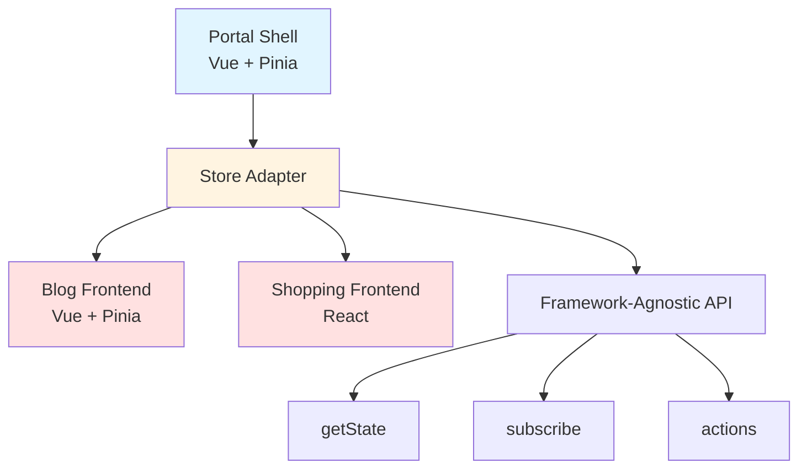

# Shared State

## 학습 목표
- Host-Remote 간 상태 공유 메커니즘 이해
- Store Adapter 패턴 학습
- Vue-React 간 상태 동기화 방법 파악

## 개념 설명

### Shared State란?
Module Federation 환경에서 Host와 Remote 앱이 **상태를 공유**하는 메커니즘입니다. 인증 정보, 테마, 설정 등을 중복 없이 관리합니다.



### 상태 공유 전략

| 방법 | 장점 | 단점 | 사용 시점 |
|------|------|------|----------|
| **Global Variable** | 간단 | 타입 안전 X, 반응성 X | 토큰 같은 단순 값 |
| **Shared Module** | 싱글톤, 타입 안전 | 프레임워크 종속적 | 같은 프레임워크 |
| **Adapter Pattern** | 프레임워크 독립적 | 구현 복잡도 | 다른 프레임워크 |
| **Custom Events** | 느슨한 결합 | 디버깅 어려움 | 일회성 이벤트 |

## Portal Universe 코드 분석

### 1. Store Adapter 구조

```typescript
// src/store/storeAdapter.ts
import { watch } from 'vue'
import { useThemeStore } from './theme'
import { useAuthStore } from './auth'

// ============================================
// Type Definitions (Framework-Agnostic)
// ============================================

export interface ThemeState {
  isDark: boolean
}

export interface AuthState {
  isAuthenticated: boolean
  displayName: string
  isAdmin: boolean
  user: {
    email?: string
    username?: string
    name?: string
    nickname?: string
    picture?: string
  } | null
}

export type UnsubscribeFn = () => void

// ============================================
// Theme Store Adapter
// ============================================

export const themeAdapter = {
  /**
   * 현재 테마 상태 반환 (스냅샷)
   */
  getState: (): ThemeState => {
    const store = useThemeStore()
    return { isDark: store.isDark }
  },

  /**
   * 테마 상태 변경 구독
   * @param callback 상태 변경 시 호출될 콜백
   * @returns 구독 해제 함수
   */
  subscribe: (callback: (state: ThemeState) => void): UnsubscribeFn => {
    const store = useThemeStore()

    // ✅ Vue watch를 사용하지만, 외부에서는 프레임워크 무관
    const unwatch = watch(
      () => store.isDark,
      (isDark) => callback({ isDark }),
      { immediate: true }  // 즉시 초기값 전달
    )

    return unwatch  // 구독 해제 함수
  },

  /**
   * 테마 토글
   */
  toggle: (): void => {
    const store = useThemeStore()
    store.toggle()
  },

  /**
   * 테마 초기화
   */
  initialize: (): void => {
    const store = useThemeStore()
    store.initialize()
  }
}

// ============================================
// Auth Store Adapter
// ============================================

export const authAdapter = {
  /**
   * 현재 인증 상태 반환 (스냅샷)
   */
  getState: (): AuthState => {
    const store = useAuthStore()

    return {
      isAuthenticated: store.isAuthenticated,
      displayName: store.displayName,
      isAdmin: store.isAdmin,
      user: store.user ? {
        email: store.user.profile.email,
        username: store.user.profile.username,
        name: store.user.profile.name,
        nickname: store.user.profile.nickname,
        picture: store.user.profile.picture
      } : null
    }
  },

  /**
   * 인증 상태 변경 구독
   */
  subscribe: (callback: (state: AuthState) => void): UnsubscribeFn => {
    const store = useAuthStore()

    // ✅ deep watch로 user 객체 내부 변경도 감지
    const unwatch = watch(
      () => store.user,
      () => callback(authAdapter.getState()),
      { immediate: true, deep: true }
    )

    return unwatch
  },

  /**
   * 역할 확인
   */
  hasRole: (role: string): boolean => {
    const store = useAuthStore()
    return store.hasRole(role)
  },

  /**
   * 로그아웃
   */
  logout: (): void => {
    const store = useAuthStore()
    store.logout()
  }
}

// ============================================
// Combined Export
// ============================================

export const portalStoreAdapter = {
  theme: themeAdapter,
  auth: authAdapter
}

export default portalStoreAdapter
```

**핵심 포인트:**
- **Framework-Agnostic**: Vue의 watch를 내부에서 사용하지만, 외부 API는 순수 JavaScript
- **Snapshot Pattern**: `getState()`로 현재 상태 스냅샷 제공
- **Observer Pattern**: `subscribe()`로 상태 변경 구독
- **Unsubscribe**: 메모리 누수 방지

### 2. Store Export

```typescript
// src/store/index.ts
export { useAuthStore } from './auth';
export { useThemeStore } from './theme';
export { useSettingsStore } from './settings';
export { useServiceStatusStore } from './serviceStatus';

// ✅ Framework-Agnostic Adapter Export
export {
  portalStoreAdapter,
  authAdapter,
  themeAdapter,
  type AuthState,
  type ThemeState,
  type UnsubscribeFn
} from './storeAdapter';
```

### 3. Remote (Vue) - Pinia Store 직접 사용

```vue
<script setup lang="ts">
// Blog Frontend (Vue Remote)
import { useAuthStore } from 'portal/stores'
import { storeToRefs } from 'pinia'

const authStore = useAuthStore()
const { user, isAuthenticated } = storeToRefs(authStore)

function handleLogout() {
  authStore.logout()
}
</script>

<template>
  <div>
    <p v-if="isAuthenticated">Welcome, {{ user?.profile.name }}</p>
    <button v-else>Login</button>
    <button @click="handleLogout">Logout</button>
  </div>
</template>
```

### 4. Remote (React) - Adapter 사용

```typescript
// Shopping Frontend (React Remote)
import { useEffect, useState } from 'react'
import { authAdapter, type AuthState } from 'portal/stores'

export function UserInfo() {
  const [authState, setAuthState] = useState<AuthState>(() =>
    authAdapter.getState()
  )

  useEffect(() => {
    // ✅ 상태 변경 구독
    const unsubscribe = authAdapter.subscribe((state) => {
      setAuthState(state)
    })

    // ✅ Cleanup: 언마운트 시 구독 해제
    return () => {
      unsubscribe()
    }
  }, [])

  const handleLogout = () => {
    authAdapter.logout()
  }

  return (
    <div>
      {authState.isAuthenticated ? (
        <>
          <p>Welcome, {authState.displayName}</p>
          <button onClick={handleLogout}>Logout</button>
        </>
      ) : (
        <button>Login</button>
      )}
    </div>
  )
}
```

## 실습 예제

### 예제 1: Custom Hook (React)

```typescript
// hooks/usePortalAuth.ts (React Remote)
import { useEffect, useState } from 'react'
import { authAdapter, type AuthState } from 'portal/stores'

export function usePortalAuth() {
  const [state, setState] = useState<AuthState>(() =>
    authAdapter.getState()
  )

  useEffect(() => {
    const unsubscribe = authAdapter.subscribe(setState)
    return () => unsubscribe()
  }, [])

  return {
    ...state,
    logout: authAdapter.logout,
    hasRole: authAdapter.hasRole
  }
}
```

**사용:**
```tsx
function MyComponent() {
  const auth = usePortalAuth()

  if (!auth.isAuthenticated) {
    return <div>Please login</div>
  }

  return (
    <div>
      <h1>Hello, {auth.displayName}</h1>
      {auth.isAdmin && <AdminPanel />}
      <button onClick={auth.logout}>Logout</button>
    </div>
  )
}
```

### 예제 2: Theme Hook (React)

```typescript
// hooks/usePortalTheme.ts (React Remote)
import { useEffect, useState } from 'react'
import { themeAdapter, type ThemeState } from 'portal/stores'

export function usePortalTheme() {
  const [state, setState] = useState<ThemeState>(() =>
    themeAdapter.getState()
  )

  useEffect(() => {
    const unsubscribe = themeAdapter.subscribe(setState)
    return () => unsubscribe()
  }, [])

  return {
    isDark: state.isDark,
    toggle: themeAdapter.toggle
  }
}
```

**사용:**
```tsx
function ThemeToggle() {
  const { isDark, toggle } = usePortalTheme()

  return (
    <button onClick={toggle}>
      {isDark ? '🌙 Dark' : '☀️ Light'}
    </button>
  )
}
```

### 예제 3: Composable (Vue Remote)

```typescript
// composables/usePortalStores.ts (Vue Remote)
import { useAuthStore, useThemeStore } from 'portal/stores'
import { computed } from 'vue'

export function usePortalAuth() {
  const authStore = useAuthStore()

  return {
    user: computed(() => authStore.user),
    isAuthenticated: computed(() => authStore.isAuthenticated),
    displayName: computed(() => authStore.displayName),
    isAdmin: computed(() => authStore.isAdmin),
    logout: () => authStore.logout(),
    hasRole: (role: string) => authStore.hasRole(role)
  }
}

export function usePortalTheme() {
  const themeStore = useThemeStore()

  return {
    isDark: computed(() => themeStore.isDark),
    toggle: () => themeStore.toggle()
  }
}
```

**사용:**
```vue
<script setup lang="ts">
import { usePortalAuth, usePortalTheme } from '@/composables/usePortalStores'

const auth = usePortalAuth()
const theme = usePortalTheme()
</script>

<template>
  <div>
    <p v-if="auth.isAuthenticated.value">
      Hello, {{ auth.displayName.value }}
    </p>
    <button @click="theme.toggle">Toggle Theme</button>
    <button @click="auth.logout">Logout</button>
  </div>
</template>
```

## Global Variable 패턴

### Access Token 공유

```typescript
// src/types/global.d.ts
declare global {
  interface Window {
    __PORTAL_ACCESS_TOKEN__?: string
  }
}

export {}
```

```typescript
// src/store/auth.ts
function setUserFromInfo(userInfo: UserInfo, accessToken: string): void {
  user.value = {
    // ...
  };

  // ✅ Global token 설정 (Remote 앱 접근)
  window.__PORTAL_ACCESS_TOKEN__ = accessToken;
}
```

```typescript
// Remote App (React)
export function getAccessToken(): string | undefined {
  return window.__PORTAL_ACCESS_TOKEN__
}

// API 호출 시 사용
axios.get('/api/data', {
  headers: {
    Authorization: `Bearer ${getAccessToken()}`
  }
})
```

## 상태 동기화 패턴

### 1. 단방향 흐름 (Host → Remote)
```
Host Store → Adapter → Remote State
```

**장점:**
- 명확한 데이터 소스
- 디버깅 용이

**단점:**
- Remote에서 직접 수정 불가

### 2. 양방향 흐름 (Host ↔ Remote)
```
Host Store ↔ Adapter ↔ Remote State
```

**장점:**
- Remote에서도 상태 변경 가능

**단점:**
- 동기화 복잡도 증가
- 상태 충돌 가능성

## 핵심 요약

### Store Adapter 패턴 구조
```typescript
export const adapter = {
  getState: () => { /* snapshot */ },
  subscribe: (callback) => { /* observer */ },
  actions: () => { /* mutations */ }
}
```

### 사용 전략

| Store | Vue Remote | React Remote | 방식 |
|-------|-----------|--------------|------|
| **Auth** | Pinia 직접 | Adapter | Shared Module + Adapter |
| **Theme** | Pinia 직접 | Adapter | Shared Module + Adapter |
| **Token** | Global Variable | Global Variable | Window API |

### Best Practices

#### ✅ DO
```typescript
// Snapshot + Subscribe 패턴
const getState = () => ({ ...state })
const subscribe = (callback) => watch(state, callback)

// Cleanup
useEffect(() => {
  const unsubscribe = adapter.subscribe(callback)
  return () => unsubscribe()
}, [])

// Type safety
export interface AdapterState {
  // ...
}
```

#### ❌ DON'T
```typescript
// ❌ 프레임워크 종속적 API 노출
export const adapter = {
  getStore: () => useAuthStore()  // Vue 전용
}

// ❌ Cleanup 누락
useEffect(() => {
  adapter.subscribe(callback)
  // ❌ unsubscribe 안 함
}, [])

// ❌ 직접 mutation (단방향 위반)
const state = adapter.getState()
state.user = null  // ❌
```

### 상태 공유 체크리스트
- [ ] Adapter 패턴으로 프레임워크 독립성 확보
- [ ] getState (snapshot) + subscribe (observer)
- [ ] TypeScript 타입 정의
- [ ] Cleanup (unsubscribe) 처리
- [ ] Global Variable은 최소화 (Token만)

## 관련 문서
- [Shell Architecture](./shell-architecture.md)
- [API Client Sharing](./api-client-sharing.md)
- [Auth Integration](./auth-integration.md)
- [Theme Synchronization](./theme-synchronization.md)
- [Pinia State Management](../vue/pinia-state-management.md)
