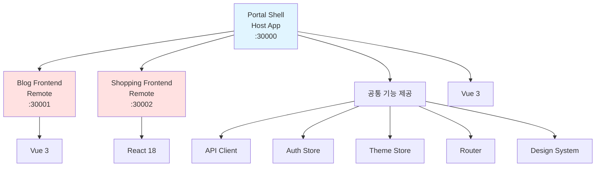
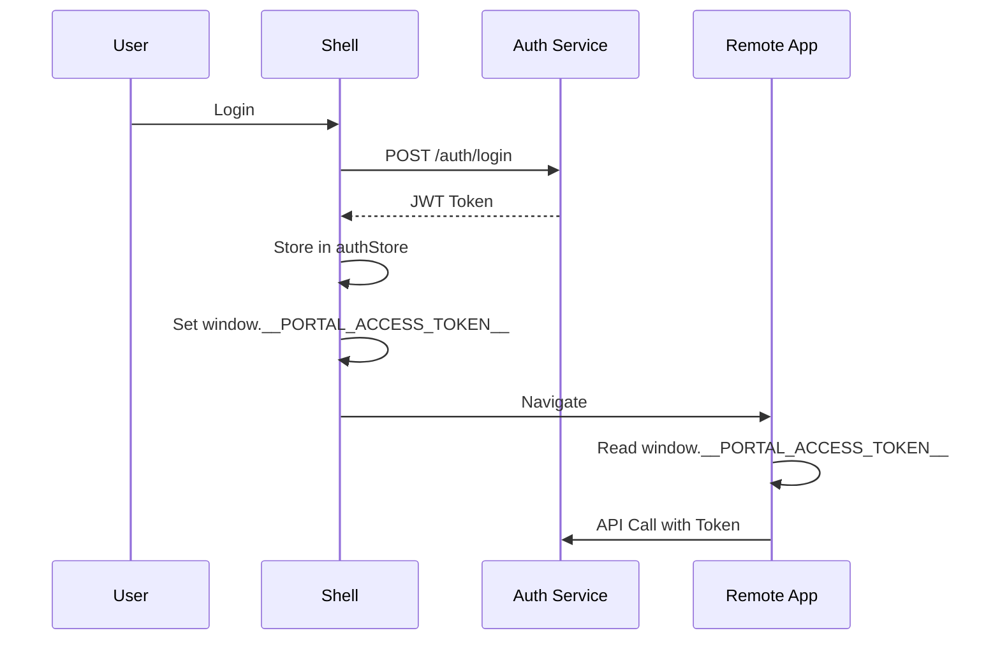
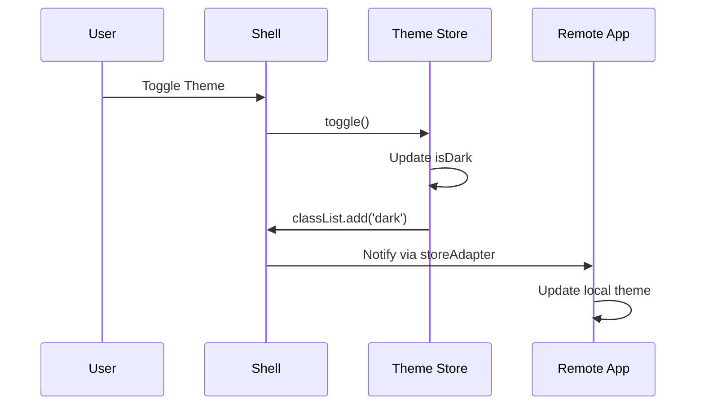

# Shell Architecture

## 학습 목표
- Portal Shell의 전체 아키텍처 이해
- Host 앱으로서의 역할과 책임 파악
- Remote 앱과의 통합 방식 학습

## 개념 설명

### Portal Shell이란?
Portal Shell은 Module Federation의 **Host 앱**으로, 여러 Remote 앱을 통합하고 공통 기능을 제공하는 컨테이너 역할을 합니다.



### Shell의 책임

| 영역 | 책임 | 구현 방식 |
|------|------|----------|
| **라우팅** | 전체 앱 네비게이션 | Vue Router |
| **인증** | 로그인/로그아웃, 토큰 관리 | Pinia Store + JWT |
| **테마** | 다크모드, 서비스별 테마 | Pinia Store + CSS Variables |
| **API** | HTTP 클라이언트 제공 | Axios Instance |
| **레이아웃** | 공통 Sidebar, Header | Vue Components |
| **에러 처리** | 전역 에러 핸들링 | Global Error Handler |

## Portal Shell 아키텍처

### 1. 디렉토리 구조

```
portal-shell/
├── src/
│   ├── main.ts                 # 앱 진입점
│   ├── App.vue                 # 루트 컴포넌트
│   │
│   ├── api/                    # ✅ Exposed
│   │   ├── apiClient.ts        # Axios 인스턴스
│   │   ├── types.ts            # API 타입
│   │   └── index.ts            # Export
│   │
│   ├── store/                  # ✅ Exposed
│   │   ├── auth.ts             # 인증 Store
│   │   ├── theme.ts            # 테마 Store
│   │   ├── settings.ts         # 설정 Store
│   │   ├── storeAdapter.ts     # React 호환 Adapter
│   │   └── index.ts            # Export
│   │
│   ├── router/                 # Shell 전용
│   │   └── index.ts            # Vue Router 설정
│   │
│   ├── components/             # Shell 전용
│   │   ├── Sidebar.vue         # 사이드바
│   │   ├── RemoteWrapper.vue   # Remote 래퍼
│   │   ├── ThemeToggle.vue     # 테마 토글
│   │   └── LoginModal.vue      # 로그인 모달
│   │
│   ├── views/                  # Shell 페이지
│   │   ├── HomePage.vue
│   │   ├── DashboardPage.vue
│   │   ├── OAuth2Callback.vue
│   │   └── NotFound.vue
│   │
│   ├── composables/            # Shell Composables
│   │   └── useHealthCheck.ts
│   │
│   ├── services/               # 비즈니스 로직
│   │   └── authService.ts
│   │
│   ├── config/                 # 설정
│   │   └── remoteRegistry.ts   # Remote 앱 목록
│   │
│   ├── types/                  # TypeScript 타입
│   │   ├── user.ts
│   │   ├── global.d.ts
│   │   └── federation.d.ts
│   │
│   └── utils/                  # 유틸리티
│       ├── jwt.ts
│       └── base64.ts
│
├── vite.config.ts              # ✅ Module Federation 설정
├── package.json
└── tsconfig.json
```

### 2. Module Federation 설정

```typescript
// vite.config.ts
import { defineConfig, loadEnv } from 'vite'
import vue from '@vitejs/plugin-vue'
import federation from "@originjs/vite-plugin-federation";

export default defineConfig(({ mode }) => {
  const env = loadEnv(mode, process.cwd(), '');

  return {
    plugins: [
      vue(),
      federation({
        name: 'portal',                    // Host 이름
        filename: 'shellEntry.js',         // Entry 파일명

        // ✅ Remote 앱 등록
        remotes: {
          blog: env.VITE_BLOG_REMOTE_URL,         // http://localhost:30001/assets/remoteEntry.js
          shopping: env.VITE_SHOPPING_REMOTE_URL  // http://localhost:30002/assets/remoteEntry.js
        },

        // ✅ Remote에 제공하는 모듈
        exposes: {
          './api': './src/api/index.ts',      // API Client
          './stores': './src/store/index.ts'  // Pinia Stores
        },

        // ✅ 공유 라이브러리 (싱글톤)
        shared: ['vue', 'pinia', 'axios'],
      })
    ],
    resolve: {
      alias: {
        '@': resolve(__dirname, 'src')
      }
    },
    server: {
      port: 30000,
      proxy: {
        '/auth-service': {
          target: env.VITE_API_BASE_URL || 'http://localhost:8080',
          changeOrigin: true,
        },
        '/api': {
          target: env.VITE_API_BASE_URL || 'http://localhost:8080',
          changeOrigin: true,
        },
      }
    }
  }
})
```

**핵심 포인트:**
- **Host 역할**: `name: 'portal'`, Remote 앱 로드
- **Exposes**: API Client, Stores를 Remote에 제공
- **Shared**: Vue, Pinia, Axios 싱글톤 공유
- **Proxy**: Backend API 프록시 설정

### 3. Remote 레지스트리

```typescript
// src/config/remoteRegistry.ts
export interface RemoteConfig {
  key: string              // 식별자 (라우트 이름)
  displayName: string      // 화면 표시명
  basePath: string         // 라우트 경로
  remoteUrl: string        // Remote Entry URL
  icon: string             // 아이콘
  color: string            // 브랜드 컬러
}

export function getRemoteConfigs(): RemoteConfig[] {
  return [
    {
      key: 'blog',
      displayName: 'Blog',
      basePath: '/blog',
      remoteUrl: import.meta.env.VITE_BLOG_REMOTE_URL,
      icon: '📝',
      color: '#3B82F6'
    },
    {
      key: 'shopping',
      displayName: 'Shopping',
      basePath: '/shopping',
      remoteUrl: import.meta.env.VITE_SHOPPING_REMOTE_URL,
      icon: '🛒',
      color: '#10B981'
    }
  ]
}

export function getRemoteConfig(key: string): RemoteConfig | undefined {
  return getRemoteConfigs().find(config => config.key === key)
}
```

### 4. 동적 라우트 생성

```typescript
// src/router/index.ts
import { createRouter, createWebHistory } from 'vue-router';
import RemoteWrapper from '../components/RemoteWrapper.vue';
import { getRemoteConfigs } from '../config/remoteRegistry';

// ✅ Remote 라우트 동적 생성
function createRemoteRoutes() {
  const configs = getRemoteConfigs();

  return configs.map(config => ({
    path: `${config.basePath}/:pathMatch(.*)*`,  // /blog/*, /shopping/*
    name: config.key,
    component: RemoteWrapper,
    props: (route: any) => ({
      config,  // RemoteConfig 전달
      initialPath: route.path.substring(config.basePath.length) || '/'
    }),
    meta: {
      remoteName: config.key,
      icon: config.icon,
      keepAlive: true  // Remote 캐싱
    }
  }));
}

const routes = [
  // Shell 자체 라우트
  { path: '/', name: 'Home', component: HomePage },
  { path: '/dashboard', name: 'Dashboard', component: DashboardPage },
  { path: '/settings', name: 'Settings', component: SettingsPage },

  // ✅ Remote 라우트 자동 등록
  ...createRemoteRoutes(),

  // 404
  { path: '/:pathMatch(.*)*', name: 'NotFound', component: NotFound }
];

const router = createRouter({
  history: createWebHistory(),
  routes,
});

export default router;
```

### 5. RemoteWrapper 컴포넌트

```vue
<script setup lang="ts">
import { defineAsyncComponent, ref, watch } from 'vue'
import type { RemoteConfig } from '@/config/remoteRegistry'

const props = defineProps<{
  config: RemoteConfig
  initialPath: string
}>()

const error = ref<Error | null>(null)

// ✅ Remote 앱 동적 로드
const RemoteApp = defineAsyncComponent({
  loader: () => import(/* @vite-ignore */ `${props.config.key}/bootstrap`),
  onError(err, retry, fail, attempts) {
    console.error(`❌ Failed to load remote: ${props.config.key}`, err)
    if (attempts <= 3) {
      retry()
    } else {
      fail()
      error.value = err as Error
    }
  }
})

// ✅ data-service 속성 설정 (테마)
watch(
  () => props.config.key,
  (key) => {
    document.documentElement.setAttribute('data-service', key)
  },
  { immediate: true }
)
</script>

<template>
  <div class="remote-wrapper">
    <div v-if="error" class="error-state">
      <h2>⚠️ Failed to load {{ config.displayName }}</h2>
      <p>{{ error.message }}</p>
      <button @click="$router.push('/')">Go Home</button>
    </div>

    <Suspense v-else>
      <template #default>
        <RemoteApp :initial-path="initialPath" />
      </template>
      <template #fallback>
        <div class="loading-state">
          <div class="spinner"></div>
          <p>Loading {{ config.displayName }}...</p>
        </div>
      </template>
    </Suspense>
  </div>
</template>

<style scoped>
.remote-wrapper {
  width: 100%;
  height: 100%;
  min-height: 400px;
}

.loading-state,
.error-state {
  display: flex;
  flex-direction: column;
  align-items: center;
  justify-content: center;
  min-height: 400px;
  padding: 2rem;
}

.spinner {
  width: 40px;
  height: 40px;
  border: 4px solid #e5e7eb;
  border-top-color: #3b82f6;
  border-radius: 50%;
  animation: spin 0.8s linear infinite;
}

@keyframes spin {
  to { transform: rotate(360deg); }
}
</style>
```

### 6. App.vue - 레이아웃

```vue
<script setup lang="ts">
import { useThemeStore } from "./store/theme.ts";
import { useSettingsStore } from "./store/settings.ts";
import { onMounted, watch, ref, computed } from "vue";
import { useRoute } from "vue-router";
import Sidebar from "./components/Sidebar.vue";

const themeStore = useThemeStore();
const settingsStore = useSettingsStore();
const route = useRoute();

const sidebarCollapsed = ref(localStorage.getItem('sidebar-collapsed') === 'true');

const mainClass = computed(() => ({
  'lg:ml-64': !sidebarCollapsed.value,
  'lg:ml-16': sidebarCollapsed.value,
  'pt-14 lg:pt-0': true,
}));

onMounted(() => {
  themeStore.initialize();
  settingsStore.initialize();
});

watch(() => themeStore.isDark, (newVal) => {
  if (newVal) {
    document.documentElement.classList.add('dark');
  } else {
    document.documentElement.classList.remove('dark');
  }
});
</script>

<template>
  <div class="min-h-screen bg-bg-page text-text-body">
    <!-- ✅ Sidebar: 전체 앱 공통 -->
    <Sidebar />

    <!-- ✅ Main Content -->
    <div :class="['min-h-screen flex flex-col transition-all duration-300', mainClass]">
      <main class="flex-1">
        <Suspense>
          <template #default>
            <router-view v-slot="{ Component, route }">
              <!-- ✅ KeepAlive: Remote 앱 캐싱 -->
              <KeepAlive v-if="route.meta.keepAlive" :max="3">
                <component
                  :is="Component"
                  :key="route.meta.remoteName || route.name"
                />
              </KeepAlive>
              <component
                v-else
                :is="Component"
                :key="route.name"
              />
            </router-view>
          </template>
          <template #fallback>
            <div class="loading">Loading...</div>
          </template>
        </Suspense>
      </main>

      <!-- ✅ Footer: 전체 앱 공통 -->
      <footer class="bg-bg-card border-t border-border-default py-4 mt-auto">
        <div class="max-w-7xl mx-auto px-4 text-center">
          <p class="text-sm text-text-meta">© 2025 Portal Universe</p>
        </div>
      </footer>
    </div>
  </div>
</template>
```

## 데이터 흐름

### 1. 인증 흐름


### 2. 테마 동기화 흐름


## 핵심 요약

### Portal Shell 역할
1. **Host**: Remote 앱을 로드하고 통합
2. **Provider**: API Client, Stores 제공
3. **Layout**: 공통 Sidebar, Footer
4. **Router**: 전체 앱 네비게이션
5. **Auth**: 인증/인가 관리

### Shell의 3대 책임
```
1. Remote 앱 통합 (Module Federation)
2. 공통 서비스 제공 (API, Auth, Theme)
3. 전역 레이아웃 관리 (Sidebar, Footer)
```

### Architecture Pattern
```
Shell (Host)
├── Exposes: API, Stores
├── Remotes: Blog, Shopping
├── Layout: Sidebar, Footer
└── Router: /, /blog/*, /shopping/*
```

### Best Practices
1. **단일 책임**: Shell은 통합에만 집중
2. **느슨한 결합**: Remote와 독립적
3. **에러 격리**: Remote 에러가 Shell 영향 X
4. **성능 최적화**: KeepAlive, Lazy Loading

## 관련 문서
- [Module Federation Host](./module-federation-host.md)
- [Shared State](./shared-state.md)
- [API Client Sharing](./api-client-sharing.md)
- [Auth Integration](./auth-integration.md)
- [Theme Synchronization](./theme-synchronization.md)
