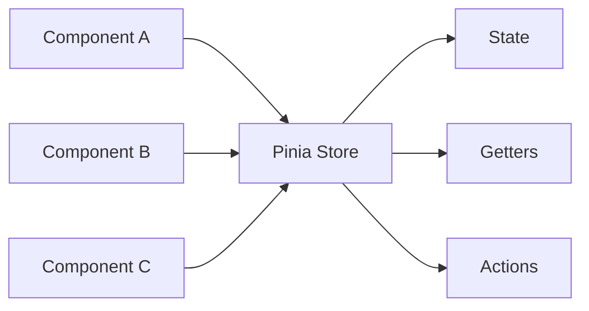

# Pinia State Management

## 학습 목표
- Pinia의 핵심 개념과 Vuex 대비 장점 이해
- Store 정의 패턴 (Setup Store vs Options Store) 학습
- Portal Shell의 실제 Store 구조 분석

## 개념 설명

### Pinia란?
Vue 3의 공식 상태 관리 라이브러리로, Vuex의 차세대 버전입니다.



### Vuex vs Pinia

| 특성 | Vuex | Pinia |
|------|------|-------|
| Mutations | 필수 | 없음 (Actions만 사용) |
| Namespaced | 수동 설정 | 자동 (파일별 Store) |
| TypeScript | 복잡한 타이핑 | 자동 타입 추론 |
| Devtools | 지원 | 향상된 지원 |
| Bundle Size | 큼 | 작음 (~1KB) |
| Composition API | 제한적 | 완벽 지원 |

### Store 정의 패턴

#### 1. Options Store (Vuex 스타일)
```typescript
export const useThemeStore = defineStore('theme', {
  state: () => ({
    isDark: true,
    mode: 'dark' as ThemeMode
  }),
  getters: {
    currentTheme: (state) => state.mode
  },
  actions: {
    toggle() {
      this.isDark = !this.isDark
    }
  }
})
```

#### 2. Setup Store (Composition API 스타일) ⭐ 권장
```typescript
export const useAuthStore = defineStore('auth', () => {
  // State
  const user = ref<PortalUser | null>(null)
  const loading = ref(false)

  // Getters (computed)
  const isAuthenticated = computed(() => user.value !== null)

  // Actions (functions)
  async function login(email: string, password: string) {
    loading.value = true
    // ...
  }

  return {
    user,
    loading,
    isAuthenticated,
    login
  }
})
```

## Portal Universe 코드 분석

### 1. Auth Store (Setup Store 패턴)

```typescript
// src/store/auth.ts
export const useAuthStore = defineStore('auth', () => {
  // ==================== State ====================
  const user = ref<PortalUser | null>(null);
  const loading = ref(false);

  // ==================== Getters ====================
  const isAuthenticated = computed(() => user.value !== null);

  const displayName = computed(() => {
    if (!user.value) return 'Guest';
    const p = user.value.profile;
    return p.nickname || p.username || p.name || p.email;
  });

  const hasRole = (role: string): boolean => {
    return user.value?.authority.roles.includes(role) || false;
  };

  const isAdmin = computed(() => hasRole('ROLE_ADMIN'));

  // ==================== Actions ====================
  async function login(email: string, password: string): Promise<void> {
    loading.value = true;
    try {
      console.log('[Auth Store] Logging in:', email);
      const response = await authService.login(email, password);
      const userInfo = authService.getUserInfo();
      if (userInfo) {
        setUserFromInfo(userInfo, response.accessToken);
      }
      console.log('✅ [Auth Store] Login successful');
    } catch (error) {
      console.error('❌ [Auth Store] Login failed:', error);
      throw error;
    } finally {
      loading.value = false;
    }
  }

  async function logout(): Promise<void> {
    loading.value = true;
    try {
      await authService.logout();
      user.value = null;
      delete window.__PORTAL_ACCESS_TOKEN__;
    } finally {
      loading.value = false;
    }
  }

  async function checkAuth(): Promise<void> {
    try {
      await authService.autoRefreshIfNeeded();
      const userInfo = authService.getUserInfo();
      if (userInfo && authService.isAuthenticated()) {
        const accessToken = authService.getAccessToken();
        if (accessToken) {
          setUserFromInfo(userInfo, accessToken);
        }
      } else {
        user.value = null;
      }
    } catch (error) {
      user.value = null;
      authService.clearTokens();
    }
  }

  function setUserFromInfo(userInfo: UserInfo, accessToken: string): void {
    // UserProfile 생성
    const profile: UserProfile = {
      sub: userInfo.uuid,
      email: userInfo.email,
      username: userInfo.username,
      // ...
    };

    // PortalUser 생성
    user.value = {
      profile,
      authority: {
        roles: userInfo.roles,
        scopes: userInfo.scopes,
      },
      preferences: {
        theme: 'light',
        language: 'ko',
        notifications: true,
      },
      _accessToken: accessToken,
    };

    // Global token 설정 (Remote 앱 접근)
    window.__PORTAL_ACCESS_TOKEN__ = accessToken;
  }

  return {
    user,
    loading,
    isAuthenticated,
    displayName,
    isAdmin,
    hasRole,
    login,
    logout,
    checkAuth,
  };
});
```

**핵심 포인트:**
- Setup Store 패턴 사용 (Composition API 스타일)
- State: `ref()`로 반응형 상태 정의
- Getters: `computed()`로 파생 상태 정의
- Actions: 일반 함수로 정의
- Service Layer 분리 (authService)
- Global Window API (`__PORTAL_ACCESS_TOKEN__`) 활용

### 2. Theme Store (Options Store 패턴)

```typescript
// src/store/theme.ts
export const useThemeStore = defineStore('theme', {
  state: () => ({
    isDark: true,
    mode: 'dark' as ThemeMode,
  }),

  actions: {
    toggle() {
      this.isDark = !this.isDark;
      this.mode = this.isDark ? 'dark' : 'light';
      this.applyTheme();
    },

    setMode(mode: ThemeMode) {
      this.mode = mode;
      if (mode === 'system') {
        this.isDark = window.matchMedia('(prefers-color-scheme: dark)').matches;
      } else {
        this.isDark = mode === 'dark';
      }
      this.applyTheme();
    },

    applyTheme() {
      if (this.isDark) {
        document.documentElement.classList.add('dark');
      } else {
        document.documentElement.classList.remove('dark');
      }
      localStorage.setItem('theme', this.mode);
    },

    initialize() {
      const saved = localStorage.getItem('theme') as ThemeMode | null;

      if (saved === 'system') {
        this.mode = 'system';
        this.isDark = window.matchMedia('(prefers-color-scheme: dark)').matches;
      } else if (saved === 'light') {
        this.mode = 'light';
        this.isDark = false;
      } else {
        this.mode = 'dark';
        this.isDark = true;
      }

      this.applyTheme();

      // System theme change listener
      window.matchMedia('(prefers-color-scheme: dark)')
        .addEventListener('change', (e) => {
          if (this.mode === 'system') {
            this.isDark = e.matches;
            this.applyTheme();
          }
        });
    }
  }
});
```

**핵심 포인트:**
- Options Store 패턴 (간단한 상태일 때 유용)
- `this`로 state/actions 접근
- DOM API 직접 조작 (classList)
- localStorage 영속화
- MediaQuery 이벤트 리스너

### 3. Store 통합 Export

```typescript
// src/store/index.ts
export { useAuthStore } from './auth';
export { useThemeStore } from './theme';
export { useSettingsStore } from './settings';
export { useServiceStatusStore } from './serviceStatus';
export { portalStoreAdapter, authAdapter, themeAdapter } from './storeAdapter';
```

### 4. Store Adapter (Framework-Agnostic)

```typescript
// src/store/storeAdapter.ts
export const authAdapter = {
  getState: (): AuthState => {
    const store = useAuthStore()
    return {
      isAuthenticated: store.isAuthenticated,
      displayName: store.displayName,
      isAdmin: store.isAdmin,
      user: store.user ? {
        email: store.user.profile.email,
        username: store.user.profile.username,
        // ...
      } : null
    }
  },

  subscribe: (callback: (state: AuthState) => void): UnsubscribeFn => {
    const store = useAuthStore()
    const unwatch = watch(
      () => store.user,
      () => callback(authAdapter.getState()),
      { immediate: true, deep: true }
    )
    return unwatch
  },

  logout: (): void => {
    const store = useAuthStore()
    store.logout()
  }
}
```

**핵심 포인트:**
- Pinia Store를 순수 JavaScript 함수로 래핑
- React Remote 앱에서 접근 가능
- `getState()`: 현재 상태 스냅샷
- `subscribe()`: 상태 변경 구독
- Vue의 `watch()` API 활용

## 실습 예제

### 예제 1: Todo Store (Setup Store)

```typescript
// stores/useTodoStore.ts
import { defineStore } from 'pinia'
import { ref, computed } from 'vue'

interface Todo {
  id: number
  text: string
  completed: boolean
}

export const useTodoStore = defineStore('todo', () => {
  // State
  const todos = ref<Todo[]>([])
  const filter = ref<'all' | 'active' | 'completed'>('all')

  // Getters
  const filteredTodos = computed(() => {
    if (filter.value === 'active') {
      return todos.value.filter(t => !t.completed)
    }
    if (filter.value === 'completed') {
      return todos.value.filter(t => t.completed)
    }
    return todos.value
  })

  const activeCount = computed(() => {
    return todos.value.filter(t => !t.completed).length
  })

  // Actions
  function addTodo(text: string) {
    todos.value.push({
      id: Date.now(),
      text,
      completed: false
    })
  }

  function toggleTodo(id: number) {
    const todo = todos.value.find(t => t.id === id)
    if (todo) {
      todo.completed = !todo.completed
    }
  }

  function removeTodo(id: number) {
    const index = todos.value.findIndex(t => t.id === id)
    if (index !== -1) {
      todos.value.splice(index, 1)
    }
  }

  return {
    todos,
    filter,
    filteredTodos,
    activeCount,
    addTodo,
    toggleTodo,
    removeTodo
  }
})
```

### 예제 2: Store 간 통신

```typescript
// stores/useCartStore.ts
import { defineStore } from 'pinia'
import { useAuthStore } from './auth'

export const useCartStore = defineStore('cart', () => {
  const authStore = useAuthStore() // ✅ 다른 Store 접근

  const items = ref([])

  async function addItem(product) {
    if (!authStore.isAuthenticated) {
      throw new Error('로그인이 필요합니다')
    }
    items.value.push(product)
  }

  return { items, addItem }
})
```

## 핵심 요약

### Pinia 핵심 개념
1. **Store**: 앱의 전역 상태 컨테이너
2. **State**: 반응형 데이터
3. **Getters**: 파생 상태 (computed)
4. **Actions**: 상태 변경 로직

### Portal Shell Store 아키텍처
```
auth.ts          → 인증/사용자 관리
theme.ts         → 다크모드/테마
settings.ts      → 사용자 설정
serviceStatus.ts → 마이크로서비스 상태
storeAdapter.ts  → React 호환 레이어
```

### Best Practices
1. **Setup Store 우선 사용** (TypeScript 타입 추론 우수)
2. **단일 책임 원칙** (Store별 명확한 역할)
3. **Service Layer 분리** (API 호출은 별도 service)
4. **Adapter 패턴** (다른 프레임워크와 통신)
5. **localStorage 영속화** (필요 시)

### Store 사용 패턴

```vue
<script setup lang="ts">
import { useAuthStore } from '@/store/auth'
import { storeToRefs } from 'pinia'

const authStore = useAuthStore()

// ✅ Reactivity 유지하려면 storeToRefs 사용
const { user, isAuthenticated } = storeToRefs(authStore)

// ✅ Actions는 구조 분해 가능
const { login, logout } = authStore

// ✅ Computed getter는 직접 접근
console.log(authStore.displayName)
</script>
```

## 관련 문서
- [Composition API Deep Dive](./composition-api-deep-dive.md)
- [Shared State](../mfe/shared-state.md)
- [Store Adapter Pattern](../mfe/api-client-sharing.md)
