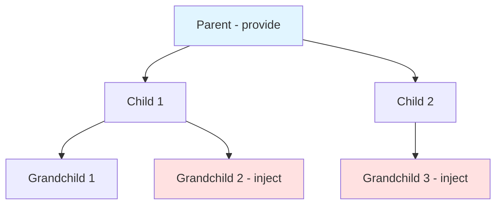

# Provide / Inject

## 학습 목표
- Provide/Inject API의 개념과 사용법 이해
- Props Drilling 문제 해결 방법 학습
- Portal Shell에서의 활용 가능성 탐색

## 개념 설명

### Provide/Inject란?
부모 컴포넌트에서 자식/손자/후손 컴포넌트로 데이터를 전달하는 의존성 주입(Dependency Injection) 패턴입니다.



### Props Drilling 문제

#### Props Drilling (문제)
```vue
<!-- App.vue -->
<template>
  <Parent :user="user" />
</template>

<!-- Parent.vue -->
<template>
  <Child :user="user" />
</template>

<!-- Child.vue -->
<template>
  <Grandchild :user="user" />
</template>

<!-- Grandchild.vue -->
<script setup lang="ts">
defineProps<{ user: User }>()
</script>
```

**문제점:**
- 중간 컴포넌트들이 필요 없는 props를 전달만 함
- 유지보수 어려움 (경로 추가/삭제 시)
- 코드 가독성 저하

#### Provide/Inject (해결)
```vue
<!-- App.vue -->
<script setup lang="ts">
import { provide } from 'vue'

const user = ref({ name: 'John' })
provide('user', user)  // ✅ 제공
</script>
<template>
  <Parent />
</template>

<!-- Parent.vue -->
<template>
  <Child />
</template>

<!-- Child.vue -->
<template>
  <Grandchild />
</template>

<!-- Grandchild.vue -->
<script setup lang="ts">
import { inject } from 'vue'

const user = inject('user')  // ✅ 주입
</script>
<template>
  <div>{{ user.name }}</div>
</template>
```

## 기본 사용법

### 1. Provide (제공)

```typescript
import { provide, ref } from 'vue'

// ✅ 원시값
provide('message', 'Hello')

// ✅ 반응형 데이터
const count = ref(0)
provide('count', count)

// ✅ 객체
const user = reactive({
  name: 'John',
  age: 30
})
provide('user', user)

// ✅ 메서드
function updateUser(name: string) {
  user.name = name
}
provide('updateUser', updateUser)
```

### 2. Inject (주입)

```typescript
import { inject } from 'vue'

// ✅ 기본 주입
const message = inject('message')  // 'Hello'

// ✅ 기본값 제공
const theme = inject('theme', 'dark')  // 'theme'이 없으면 'dark'

// ✅ 타입 안전성 (TypeScript)
const count = inject<Ref<number>>('count')
const user = inject<User>('user')

// ✅ 필수 값 (기본값 없음)
const apiClient = inject('apiClient')
if (!apiClient) {
  throw new Error('apiClient not provided')
}
```

## TypeScript 타입 안전성

### InjectionKey 패턴

```typescript
// keys.ts
import type { InjectionKey, Ref } from 'vue'

export interface User {
  name: string
  age: number
}

// ✅ InjectionKey로 타입 안전성 확보
export const userKey: InjectionKey<Ref<User>> = Symbol('user')
export const themeKey: InjectionKey<Ref<'dark' | 'light'>> = Symbol('theme')
```

```vue
<!-- Parent.vue -->
<script setup lang="ts">
import { provide, ref } from 'vue'
import { userKey } from './keys'

const user = ref({ name: 'John', age: 30 })
provide(userKey, user)  // ✅ 타입 안전
</script>

<!-- Child.vue -->
<script setup lang="ts">
import { inject } from 'vue'
import { userKey } from './keys'

const user = inject(userKey)  // ✅ Ref<User> 타입 자동 추론
if (user) {
  console.log(user.value.name)  // 타입 안전
}
</script>
```

## 실습 예제

### 예제 1: Theme Provider

```vue
<!-- ThemeProvider.vue -->
<script setup lang="ts">
import { provide, ref } from 'vue'

export interface Theme {
  isDark: boolean
  primaryColor: string
}

const theme = ref<Theme>({
  isDark: true,
  primaryColor: '#3B82F6'
})

function toggleTheme() {
  theme.value.isDark = !theme.value.isDark
}

// ✅ Provide
provide('theme', theme)
provide('toggleTheme', toggleTheme)
</script>

<template>
  <div :class="{ dark: theme.isDark }">
    <slot />
  </div>
</template>
```

```vue
<!-- ThemeToggle.vue -->
<script setup lang="ts">
import { inject } from 'vue'

const theme = inject<Ref<Theme>>('theme')
const toggleTheme = inject<() => void>('toggleTheme')
</script>

<template>
  <button @click="toggleTheme">
    {{ theme?.isDark ? '🌙' : '☀️' }}
  </button>
</template>
```

**사용:**
```vue
<template>
  <ThemeProvider>
    <Header />
    <Main>
      <ThemeToggle />  <!-- 깊은 곳에서도 접근 가능 -->
    </Main>
  </ThemeProvider>
</template>
```

### 예제 2: API Client Provider

```typescript
// providers/apiProvider.ts
import { InjectionKey } from 'vue'
import axios, { AxiosInstance } from 'axios'

export const apiKey: InjectionKey<AxiosInstance> = Symbol('api')

export function createApiProvider() {
  const apiClient = axios.create({
    baseURL: '/api',
    timeout: 10000
  })

  return {
    apiClient,
    provide: () => {
      provide(apiKey, apiClient)
    }
  }
}
```

```vue
<!-- App.vue -->
<script setup lang="ts">
import { provide } from 'vue'
import { apiKey, createApiProvider } from './providers/apiProvider'

const { apiClient } = createApiProvider()
provide(apiKey, apiClient)
</script>
```

```vue
<!-- UserList.vue -->
<script setup lang="ts">
import { inject, onMounted, ref } from 'vue'
import { apiKey } from './providers/apiProvider'

const api = inject(apiKey)
const users = ref([])

onMounted(async () => {
  if (api) {
    const response = await api.get('/users')
    users.value = response.data
  }
})
</script>
```

### 예제 3: Form Context

```vue
<!-- FormProvider.vue -->
<script setup lang="ts">
import { provide, reactive } from 'vue'

const formData = reactive({
  username: '',
  email: '',
  password: ''
})

const errors = reactive({})

function validate() {
  errors.value = {}

  if (!formData.username) {
    errors.value.username = 'Username is required'
  }

  if (!formData.email) {
    errors.value.email = 'Email is required'
  }

  return Object.keys(errors.value).length === 0
}

function submit() {
  if (validate()) {
    console.log('Submitting:', formData)
  }
}

provide('formData', formData)
provide('errors', errors)
provide('validate', validate)
provide('submit', submit)
</script>

<template>
  <form @submit.prevent="submit">
    <slot />
  </form>
</template>
```

```vue
<!-- InputField.vue -->
<script setup lang="ts">
import { inject, computed } from 'vue'

const props = defineProps<{
  name: string
  label: string
  type?: string
}>()

const formData = inject('formData')
const errors = inject('errors')

const value = computed({
  get: () => formData?.[props.name],
  set: (val) => {
    if (formData) {
      formData[props.name] = val
    }
  }
})

const error = computed(() => errors?.[props.name])
</script>

<template>
  <div>
    <label>{{ label }}</label>
    <input
      v-model="value"
      :type="type || 'text'"
      :class="{ error: error }"
    />
    <span v-if="error" class="error-message">{{ error }}</span>
  </div>
</template>
```

**사용:**
```vue
<template>
  <FormProvider>
    <InputField name="username" label="Username" />
    <InputField name="email" label="Email" type="email" />
    <InputField name="password" label="Password" type="password" />
    <button type="submit">Submit</button>
  </FormProvider>
</template>
```

## Portal Shell 활용 가능성

### 1. Global API Client (현재는 Module Federation으로 해결)

```typescript
// 대안: Provide/Inject 방식
provide('apiClient', apiClient)
provide('authStore', authAdapter)

// Remote에서
const apiClient = inject('apiClient')
const authStore = inject('authStore')
```

### 2. Theme Context

```vue
<!-- App.vue -->
<script setup lang="ts">
import { provide } from 'vue'
import { useThemeStore } from '@/store/theme'

const themeStore = useThemeStore()
provide('theme', {
  isDark: computed(() => themeStore.isDark),
  toggle: () => themeStore.toggle()
})
</script>
```

### 3. Remote Component Context

```vue
<!-- RemoteWrapper.vue -->
<script setup lang="ts">
import { provide } from 'vue'

const props = defineProps<{
  config: RemoteConfig
}>()

// Remote 앱에게 설정 제공
provide('remoteConfig', props.config)
provide('shellVersion', '1.0.0')
</script>
```

## Provide/Inject vs Pinia

| 특성 | Provide/Inject | Pinia |
|------|----------------|-------|
| 범위 | 컴포넌트 트리 | 전역 |
| Devtools | 제한적 | 완벽 지원 |
| 타입 안전성 | InjectionKey 필요 | 자동 |
| 사용 복잡도 | 간단 | 중간 |
| 적합한 경우 | 컴포넌트 라이브러리 | 앱 상태 관리 |

## 핵심 요약

### Provide/Inject 핵심 개념
1. **의존성 주입**: Props Drilling 해결
2. **컴포넌트 트리 범위**: 부모 → 후손
3. **반응형**: ref/reactive 제공 시 자동 업데이트
4. **타입 안전성**: InjectionKey로 TypeScript 지원

### 사용 패턴
```typescript
// ✅ 제공
provide(key, value)

// ✅ 주입
const value = inject(key, defaultValue)

// ✅ 타입 안전
const key: InjectionKey<Type> = Symbol()
provide(key, value)
const value = inject(key)  // 타입 자동 추론
```

### Best Practices

#### ✅ DO
```typescript
// InjectionKey 사용
export const userKey: InjectionKey<User> = Symbol('user')

// 기본값 제공
const theme = inject('theme', 'dark')

// 컴포넌트 라이브러리에 적합
<FormProvider>
  <InputField />
</FormProvider>
```

#### ❌ DON'T
```typescript
// ❌ 전역 상태 관리 (Pinia 사용)
provide('globalStore', store)

// ❌ 문자열 키 (타입 안전성 X)
provide('user', user)  // InjectionKey 사용 권장

// ❌ 과도한 Provide (복잡도 증가)
provide('a', ...)
provide('b', ...)
provide('c', ...)
// → Pinia Store 고려
```

### Portal Shell에서의 선택
- **Pinia**: 전역 상태 (auth, theme, settings)
- **Provide/Inject**: 컴포넌트 라이브러리 (Design System)
- **Module Federation**: Remote 앱 통신 (apiClient, stores)

## 관련 문서
- [Composition API Deep Dive](./composition-api-deep-dive.md)
- [Pinia State Management](./pinia-state-management.md)
- [Shared State](../mfe/shared-state.md)
